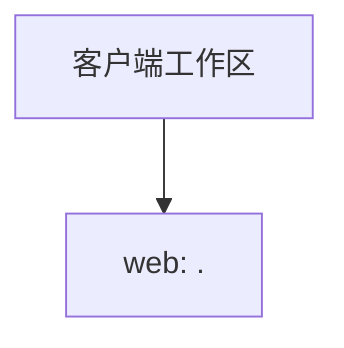

历史生成资料（未复核，不作为现行工程事实）

# 客户端工作区架构全景

## 工作区画像

| 项目 | 值 |
| --- | --- |
| 项目名称 | worktree |
| 项目类型 | frontend |
| 工作区类型 | web_only |
| 后端适用性 | NOT_APPLICABLE |

## 客户端平台

| 平台 | 类型 | 扫描根 | 技术变体 | 证据 |
| --- | --- | --- | --- | --- |
| web | web | `.` | vue | `package.json` `src/modules/aop_tradedesign/package.json` `src/modules/aop_tradecode/package.json` |

## 架构关系

## 扫描边界

- 本知识库只描述 Web/H5、Android、iOS 与 HarmonyOS 客户端工程。
- 每个平台仅以 `platforms.yaml` 中的 `scanRoot` 和证据为准。
- 后端工程不属于此前端工作区；命中后端证据时扫描会在生成知识库前阻断。

---

*此报告由 skill_init-frontend-project-scan 自动生成*

<!-- frontend-engineering:begin -->
# 客户端工程事实

| 模块根（webSourceRoot） | 入口 | 状态 | 证据 |
| --- | --- | --- | --- |
| . | - | candidate | package.json |
| src/modules/aop_assetcenter | src/modules/aop_assetcenter/main.js | verified | src/modules/aop_assetcenter/package.json |
| src/modules/aop_tradecode | src/modules/aop_tradecode/main.js | verified | src/modules/aop_tradecode/package.json |
| src/modules/aop_tradedesign | src/modules/aop_tradedesign/main.js | verified | src/modules/aop_tradedesign/package.json |

入口观察：-
<!-- frontend-engineering:end -->
