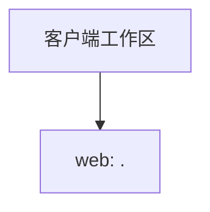

历史生成资料（未复核，不作为现行工程事实）

# 客户端工作区架构全景

## 工作区画像

| 项目 | 值 |
| --- | --- |
| 项目名称 |  |
| 项目类型 | frontend |
| 工作区类型 | web_only |
| 后端适用性 | NOT_APPLICABLE |

## 客户端平台

| 平台 | 类型 | 扫描根 | 技术变体 | 证据 |
| --- | --- | --- | --- | --- |
| web | web | `.` | vue | `package.json` `src/modules/aop_tradedesign/package.json` `src/modules/aop_tradecode/package.json` |

## 架构关系

## 扫描边界

- 本知识库只描述 Web/H5、Android、iOS 与 HarmonyOS 客户端工程。
- 每个平台仅以 `platforms.yaml` 中的 `scanRoot` 和证据为准。
- 后端工程不属于此前端工作区；命中后端证据时扫描会在生成知识库前阻断。

---

*此报告由 skill_init-frontend-project-scan 自动生成*

<!-- frontend-engineering:begin -->
# 客户端工程事实

| 模块根（webSourceRoot） | 入口 | 状态 | 证据 |
| --- | --- | --- | --- |
| . | - | candidate | package.json |
| src/modules/aop_assetcenter | src/modules/aop_assetcenter/main.js | verified | src/modules/aop_assetcenter/package.json |
| src/modules/aop_tradecode | src/modules/aop_tradecode/main.js | verified | src/modules/aop_tradecode/package.json |
| src/modules/aop_tradedesign | src/modules/aop_tradedesign/main.js | verified | src/modules/aop_tradedesign/package.json |

入口观察：-

公共机制分析：284 / 1651 个索引文件；1367 个文件留待 Design 按需求定向分析。not-found 仅适用于当前范围。

| 已分析文件 | 选择依据 | SHA256 |
| --- | --- | --- |
| package.json | module-configuration | sha256:c68836a9dea2dab403b6353f7c92a61d00120bfed01c580205945e2bfb973deb |
| src/modules/aop_assetcenter/core/mixin/index.js | multiple-consumers | sha256:75c9cfa987be2bff9d8ba86e4c45b68594dd69938933b096af51d75bf4cdcd87 |
| src/modules/aop_assetcenter/core/mixin/rpc/index.js | direct-dependency:src/modules/aop_assetcenter/core/mixin/index.js | sha256:4ae5fe210704e547a418ade75fdc8a881c27a5a3c3cad9c3ac8967bb0d70caaa |
| src/modules/aop_assetcenter/package.json | module-configuration | sha256:afe17f0cbbea5ccb845e7025b0c36d0894325fed24c17ef5734996ae3be08f2f |
| src/modules/aop_assetcenter/views/applicationPanorama/applicationArchitectureData.js | multiple-consumers | sha256:f11b96479db096c884cea349769c4108e0c4a864ea20929d2d87f40ae9b38184 |
| src/modules/aop_assetcenter/views/applicationPanorama/components/SystemApplicationDiagram.vue | multiple-consumers | sha256:ffba260c136d42838029a65e20b07460baf7d825b4dae9d2a6778d8eb7f84ce1 |
| src/modules/aop_assetcenter/views/applicationPanorama/diagramStorage.js | multiple-consumers | sha256:dbad71cd749ef543240eee0d2eadc2e852b312377ee64131a81c20c81dccc39b |
| src/modules/aop_assetcenter/views/applicationPanorama/modelDiagramStorage.js | multiple-consumers | sha256:2758e813c0d38b5de403a0447a1e5457c1e5c5bf455d2fc46bfec206d25e2432 |
| src/modules/aop_assetcenter/views/applicationPanorama/systemData.js | multiple-consumers | sha256:0549d0c68f9042dc7a293f0f1e5db6ba1e5d33e993275ca046ba9f0711780d20 |
| src/modules/aop_assetcenter/views/components/architectureModel/data.js | direct-dependency:src/modules/aop_assetcenter/views/components/architectureModel/index.vue | sha256:48627614bbb77a0c1491555b114b1950d02d1bb31daca8ed4b165ff509c02c9d |
| src/modules/aop_assetcenter/views/components/architectureModel/index.vue | multiple-consumers | sha256:4b4366d2ae1aca22d6718a54b3d470bdb0f3b15764d31430b5fa7a7c9648bd5d |
| src/modules/aop_assetcenter/views/entityModel/components/AddRelation.vue | multiple-consumers | sha256:610790bdde9e8fe3ab83332660e8c16c5198bb6395e559e2c75be60763a3b185 |
| src/modules/aop_assetcenter/views/entityModel/components/BaseItem.vue | multiple-consumers | sha256:c4a11a758a3f5a91d086f16f3bc5dd7e752d307f6618529a6ee38fcd9fea2391 |
| src/modules/aop_assetcenter/views/entityModel/components/nodeType.js | multiple-consumers | sha256:9b9bfadb4b7fb5a60d598f64db0f62fd0e34c17819ecd0c652a906a051bb5042 |
| src/modules/aop_assetcenter/views/entityModel/config.js | multiple-consumers | sha256:216c61f98c73db01231888cf647396dbb6f81ee53e9a4c4800cb543ce2764f3d |
| src/modules/aop_assetcenter/views/processModel/components/logicEngine/adapter/typeMap.js | direct-dependency:src/modules/aop_assetcenter/views/processModel/components/logicEngine/shape/model/CommentNodeModel.js, direct-dependency:src/modules/aop_assetcenter/views/processModel/components/logicEngine/shape/model/LaneNodeModel/utils.js, direct-dependency:src/modules/aop_assetcenter/views/processModel/components/logicEngine/shape/model/RectNode.js, multiple-consumers | sha256:507b9bc7b785ae4958f2c7373c91110ed81bf3aa9579ac7148db1ec1aa00c320 |
| src/modules/aop_assetcenter/views/processModel/components/logicEngine/core/basicManage.js | multiple-consumers | sha256:bac8d6c6823c7b1ed07d8b9cdd6c0c943e7a59cadb24a9fd12c7d652c7aa7268 |
| src/modules/aop_assetcenter/views/processModel/components/logicEngine/shape/model/CommentNodeModel.js | multiple-consumers | sha256:bd5805db1b1d0eaaca27b54c40cbc64dfafd3bf4e3bfbb81c4181afc4d909d37 |
| src/modules/aop_assetcenter/views/processModel/components/logicEngine/shape/model/LaneNodeModel/constant.js | direct-dependency:src/modules/aop_assetcenter/views/processModel/components/logicEngine/shape/model/LaneNodeModel/utils.js, multiple-consumers | sha256:a3da17aac6cae30d4c8063b7cf8a0b25cd7dc95abbb903c1f5ff1a8326425d99 |
| src/modules/aop_assetcenter/views/processModel/components/logicEngine/shape/model/LaneNodeModel/index.js | multiple-consumers | sha256:e9402426f1fc796f5210aece0ce2cf27d1cb9382b5a6e8ce3bd57a1d9c526180 |
| src/modules/aop_assetcenter/views/processModel/components/logicEngine/shape/model/LaneNodeModel/model.js | direct-dependency:src/modules/aop_assetcenter/views/processModel/components/logicEngine/shape/model/LaneNodeModel/index.js | sha256:26e4829aad6371edee686729e5a8dfcdf8d08165e56fa53e99d80988a727b2b2 |
| src/modules/aop_assetcenter/views/processModel/components/logicEngine/shape/model/LaneNodeModel/node.js | direct-dependency:src/modules/aop_assetcenter/views/processModel/components/logicEngine/shape/model/LaneNodeModel/index.js | sha256:ca345f833a3ad1f42e5030875d223cc2244bb6fa12476bca8d4712cbb152c3cc |
| src/modules/aop_assetcenter/views/processModel/components/logicEngine/shape/model/LaneNodeModel/utils.js | multiple-consumers | sha256:e8271b2810f0fe06f97e16350063272a448800a2eabcac07656d50d0f9d56503 |
| src/modules/aop_assetcenter/views/processModel/components/logicEngine/shape/model/RectNode.js | direct-dependency:src/modules/aop_assetcenter/views/processModel/components/logicEngine/shape/model/CommentNodeModel.js, multiple-consumers | sha256:69f74dac601d161311a67fda516a02d01176fbe5d667372c76e44bc294398c7a |
| src/modules/aop_assetcenter/views/processModel/components/logicEngine/shape/model/RectNodeModel.js | multiple-consumers | sha256:ac8170cf6e2c61ef8d24cc5b495ca0887df360fc52b7b5bf0191bb520f979a71 |
| src/modules/aop_assetcenter/views/processModel/components/logicEngine/shape/model/mouseEvent.js | direct-dependency:src/modules/aop_assetcenter/views/processModel/components/logicEngine/shape/model/CommentNodeModel.js, direct-dependency:src/modules/aop_assetcenter/views/processModel/components/logicEngine/shape/model/RectNodeModel.js, multiple-consumers | sha256:06dedf40826fedb5ee35640f56143b194d3e096f8f94923d8d7266830b47add2 |
| src/modules/aop_assetcenter/views/processModel/components/logicEngine/utils.js | direct-dependency:src/modules/aop_assetcenter/views/processModel/components/logicEngine/shape/model/LaneNodeModel/utils.js, multiple-consumers | sha256:6a54c04a41c70ac23dac40ecf124a146fbe0bbded8ee5e79e007678851f35945 |
| src/modules/aop_assetcenter/views/processModel/components/processLogicEngine/adapter/typeMap.js | direct-dependency:src/modules/aop_assetcenter/views/processModel/components/processLogicEngine/shape/model/CommentNodeModel.js, direct-dependency:src/modules/aop_assetcenter/views/processModel/components/processLogicEngine/shape/model/LaneNodeModel/utils.js, direct-dependency:src/modules/aop_assetcenter/views/processModel/components/processLogicEngine/shape/model/RectNode.js, multiple-consumers | sha256:507b9bc7b785ae4958f2c7373c91110ed81bf3aa9579ac7148db1ec1aa00c320 |
| src/modules/aop_assetcenter/views/processModel/components/processLogicEngine/core/basicManage.js | multiple-consumers | sha256:bac8d6c6823c7b1ed07d8b9cdd6c0c943e7a59cadb24a9fd12c7d652c7aa7268 |
| src/modules/aop_assetcenter/views/processModel/components/processLogicEngine/shape/model/CommentNodeModel.js | multiple-consumers | sha256:ac314938903beae84c253b0690e7680f37cefe632f4691ab54d35f7299a762b7 |
| src/modules/aop_assetcenter/views/processModel/components/processLogicEngine/shape/model/LaneNodeModel/constant.js | direct-dependency:src/modules/aop_assetcenter/views/processModel/components/processLogicEngine/shape/model/LaneNodeModel/utils.js, multiple-consumers | sha256:a3da17aac6cae30d4c8063b7cf8a0b25cd7dc95abbb903c1f5ff1a8326425d99 |
| src/modules/aop_assetcenter/views/processModel/components/processLogicEngine/shape/model/LaneNodeModel/index.js | multiple-consumers | sha256:e9402426f1fc796f5210aece0ce2cf27d1cb9382b5a6e8ce3bd57a1d9c526180 |
| src/modules/aop_assetcenter/views/processModel/components/processLogicEngine/shape/model/LaneNodeModel/model.js | direct-dependency:src/modules/aop_assetcenter/views/processModel/components/processLogicEngine/shape/model/LaneNodeModel/index.js | sha256:26e4829aad6371edee686729e5a8dfcdf8d08165e56fa53e99d80988a727b2b2 |
| src/modules/aop_assetcenter/views/processModel/components/processLogicEngine/shape/model/LaneNodeModel/node.js | direct-dependency:src/modules/aop_assetcenter/views/processModel/components/processLogicEngine/shape/model/LaneNodeModel/index.js | sha256:ea0b78d4a55b72387f0416a675140d624ebcf61ba1a56ca8b4481394cfb0f1f2 |
| src/modules/aop_assetcenter/views/processModel/components/processLogicEngine/shape/model/LaneNodeModel/utils.js | multiple-consumers | sha256:e8271b2810f0fe06f97e16350063272a448800a2eabcac07656d50d0f9d56503 |
| src/modules/aop_assetcenter/views/processModel/components/processLogicEngine/shape/model/RectNode.js | direct-dependency:src/modules/aop_assetcenter/views/processModel/components/processLogicEngine/shape/model/CommentNodeModel.js, multiple-consumers | sha256:4f69ace14e8c07c06b24eb22211bf20d6f8f240686a2514b96c9e3a4731c27c0 |
| src/modules/aop_assetcenter/views/processModel/components/processLogicEngine/shape/model/RectNodeModel.js | multiple-consumers | sha256:ac8170cf6e2c61ef8d24cc5b495ca0887df360fc52b7b5bf0191bb520f979a71 |
| src/modules/aop_assetcenter/views/processModel/components/processLogicEngine/shape/model/mouseEvent.js | direct-dependency:src/modules/aop_assetcenter/views/processModel/components/processLogicEngine/shape/model/CommentNodeModel.js, direct-dependency:src/modules/aop_assetcenter/views/processModel/components/processLogicEngine/shape/model/RectNodeModel.js, multiple-consumers | sha256:06dedf40826fedb5ee35640f56143b194d3e096f8f94923d8d7266830b47add2 |
| src/modules/aop_assetcenter/views/processModel/components/processLogicEngine/utils.js | direct-dependency:src/modules/aop_assetcenter/views/processModel/components/processLogicEngine/shape/model/LaneNodeModel/utils.js, multiple-consumers | sha256:6a54c04a41c70ac23dac40ecf124a146fbe0bbded8ee5e79e007678851f35945 |
| src/modules/aop_tradecode/core/components/decision_process/attr/components/components/data_deal/select.vue | multiple-consumers | sha256:41d76ac9206851dd80deaec68d78c47cea749a5b3e67b5a7c18a9181c3cef3d3 |
| src/modules/aop_tradecode/core/components/decision_process/attr/components/components/judge/select.vue | multiple-consumers | sha256:9755d86ce47f0e7401c2bcad0aadb975cdd1947f75d18f8a864492e6e1763885 |
| src/modules/aop_tradecode/core/components/decision_process/attr/components/service_setting/selectOutputField.vue | multiple-consumers | sha256:f9000d020a7f673b6ca2e97705341c6590da740d050d8bdbf3d7cfa000da5d26 |
| src/modules/aop_tradecode/core/components/decision_process/attr/components/service_setting/simulantSelect.vue | multiple-consumers | sha256:88d3fe6f2a9b8da3d7ba8a723f568caabfc6a71d447afe119399cca718ac34a1 |
| src/modules/aop_tradecode/core/components/decision_process/core/conf.js | multiple-consumers | sha256:1786c3471a16c9c4c0168710cd3f7b7b041152c21be6f3ffc751de93a6c6912d |
| src/modules/aop_tradecode/core/components/download_design/page_big_data/selectChildData.vue | multiple-consumers | sha256:31d5073eb05f34a1220f6bdd6caea6d9b56abc880f90f4366332b304b1311ba7 |
| src/modules/aop_tradecode/core/components/main_flow/core/conf.js | multiple-consumers | sha256:477598be63b1133a2e1ff1011b6b603b309d99c734ab1094ba1eb07ea5c5d866 |
| src/modules/aop_tradecode/core/components/process/attr/components/components/data_deal/select.vue | multiple-consumers | sha256:7efc485ded4dc68a289df6cdb4bd67a06d6a56dd1bc98fb12ceda41203c017d1 |
| src/modules/aop_tradecode/core/components/process/attr/components/components/judge/select.vue | multiple-consumers | sha256:98fed5a6bb0ed0f25cffa5505a81d944278121808d0a66019b888840f4ee0190 |
| src/modules/aop_tradecode/core/components/process/attr/components/service_setting/selectOutputField.vue | multiple-consumers | sha256:167fbe393601a4cbe07f4da7bf247d4b67915898fdfbbbf173e1390b23b962c6 |
| src/modules/aop_tradecode/core/components/process/attr/components/service_setting/selectenum.vue | multiple-consumers | sha256:ff820fa3e75a065cdc72b012981814bf280d8b57f7071b0ce599c6213ac53322 |
| src/modules/aop_tradecode/core/components/process/attr/components/service_setting/simulantSelect.vue | multiple-consumers | sha256:e72d2dcfbae07fa08f2411fffbd7f56faabff942fb8fedd6a4cf4561524b38cb |
| src/modules/aop_tradecode/core/components/process/attr/components/set_cache/components/selectParams.vue | multiple-consumers | sha256:6d0e8d45f50812ab982df51191aad4da607c1a0f4644831f45f904607a645874 |
| src/modules/aop_tradecode/core/components/process/core/conf.js | multiple-consumers | sha256:477598be63b1133a2e1ff1011b6b603b309d99c734ab1094ba1eb07ea5c5d866 |
| src/modules/aop_tradecode/core/components/service_design/components/d4design_process/components/add_demandInfo.vue | multiple-consumers | sha256:8a2fef90fc5e745e7207d3e2447ba22b5b61c6ec481dc2892bb0568e3ef119d5 |
| src/modules/aop_tradecode/core/components/service_design/components/dialog/decisionList.vue | multiple-consumers | sha256:7e83797ad8d2b37e22cbffc1658c971c9e777b33d82e1c7edd8e981c31cc953f |
| src/modules/aop_tradecode/core/mixin/rpc/proxy.js | multiple-consumers | sha256:4912a17336c0c0ab1267b7d24407f9883975cdc81c00a365864933e0ecfc25d4 |
| src/modules/aop_tradecode/package.json | module-configuration | sha256:f3e0466d0eba880058d44ea5d56dd644d699bda768fffd455285537fc4ed78ec |
| src/modules/aop_tradecode/views/assetList/components/CommonTableOperate.vue | multiple-consumers | sha256:dccab3d719be13abeba03d9d48c80cf8cddaeac1866033e4767e7aa7699bd2aa |
| src/modules/aop_tradecode/views/assetList/components/LebDataDictionDialog2.vue | multiple-consumers | sha256:8bd7c4bacf59363f4791260d64bdefc7cb578c4890097a1187f280c3a2e442c2 |
| src/modules/aop_tradecode/views/assetList/components/applyConfiguation.vue | multiple-consumers | sha256:2cafea04feaea57993c5747b6f1201fff5f9d1c96d7f9323a346cba2d08c2dec |
| src/modules/aop_tradecode/views/assetList/components/applyDeployment.vue | multiple-consumers | sha256:13bb4362bd9e7e7169352e6ac779a1b654df5937e6c35e848e9a1afd2b23fa8a |
| src/modules/aop_tradecode/views/assetList/components/components/add_service.vue | multiple-consumers | sha256:6c38716c651ac2db888cc477fee90c9d4d1ae39eb9ae49e1b00dea340d96cc6f |
| src/modules/aop_tradecode/views/assetList/components/configuationHistory.vue | multiple-consumers | sha256:adf3891d45a38c894cb87519f5fca655d9122dd431f30041a40ca9385e01c86b |
| src/modules/aop_tradecode/views/assetList/components/detail_tabs.vue | multiple-consumers | sha256:897d62128312dc8e794b84addb25c910e019fc2e57779b5a4d894744fb27a30d |
| src/modules/aop_tradecode/views/assetList/components/developCode.vue | multiple-consumers | sha256:e90738ea3f3ae8340b20358fce3ef4d6a60f9ad8642f8852776b5e955d6b241c |
| src/modules/aop_tradecode/views/assetList/components/formDialog.vue | multiple-consumers | sha256:df31aca4495b2e11fad9c8b7f6fce6f81a13a4de9e3aa72bf11c79e85ce94cf3 |
| src/modules/aop_tradecode/views/assetList/components/generateCode.vue | multiple-consumers | sha256:3cd8df6ebdfa5eff2dc14f4bb501c55837f195efd65cefa3bac5f4708017c7d9 |
| src/modules/aop_tradecode/views/assetList/components/list_tableA.vue | multiple-consumers | sha256:70fa871df51b509dd1b624bcecb593145be5f0dff607ce4b4e3b6fd3b4c437ab |
| src/modules/aop_tradecode/views/assetList/components/list_tableB.vue | multiple-consumers | sha256:8a7733ed851f52b5c6cf5adbfb51abea37bffd6b968ff1e39569fb9abc62a33c |
| src/modules/aop_tradecode/views/assetList/components/list_tableC.vue | multiple-consumers | sha256:2c2f22599188f543f5bcfe5e4561720e5c4465cf7d4aa2dff491089bbc339ca2 |
| src/modules/aop_tradecode/views/assetList/components/list_tableD.vue | multiple-consumers | sha256:0a5f010e1bf2e3d4777be4711896713088e3a8f502c4535ca68a8be3d29c27e3 |
| src/modules/aop_tradecode/views/assetList/components/projectList.vue | multiple-consumers | sha256:4b09678541ff4743fcc1ede322bc19f0d59091d96a72f5c0ab1962206ab1db7a |
| src/modules/aop_tradecode/views/s4workdesign/components/design_editor/BusinessFlow/index.vue | multiple-consumers | sha256:d50e815a32cd44edc6d57428e70926817204497ff5fe391df8a7a69782af4911 |
| src/modules/aop_tradecode/views/s4workdesign/components/design_editor/BusinessRules/Tag.vue | multiple-consumers | sha256:0c08b2f28deca0fac55f9fa08a3fc7fa4d4c33ffd4d57fcb7aa2cf22ab6b4fbc |
| src/modules/aop_tradecode/views/s4workdesign/components/design_editor/BusinessRules/addInterfaceDrawer.vue | multiple-consumers | sha256:460543fd9b530f3ee022e2943e5afbe0d7ebff4bb7acaa5d0ad68b28119dae1d |
| src/modules/aop_tradecode/views/s4workdesign/components/design_editor/BusinessRules/componentDetailDrawer.vue | multiple-consumers | sha256:dd4ff62428a238b547925b6aad6a0c5cc2ba8ecf70df3d24f463911082049eeb |
| src/modules/aop_tradecode/views/s4workdesign/components/design_editor/BusinessRules/elePreview.vue | multiple-consumers | sha256:1145c1e48a0c3c6cb2e2eeac1e2b3e8152bd465ad844503b82ec1c1b53e76bf7 |
| src/modules/aop_tradecode/views/s4workdesign/components/design_editor/BusinessRules/flowPreview.vue | multiple-consumers | sha256:b5b2f1414d54a9820e33c28aecbe5dd3ba0178d515d46f54860cc0bc7f8ef1ed |
| src/modules/aop_tradecode/views/s4workdesign/components/design_editor/BusinessRules/infoPreview.vue | multiple-consumers | sha256:3411e1ac6994fad4e35ed4f7a3e46a1746fbe0b8dd312fe1b0cd0471f4b42397 |
| src/modules/aop_tradecode/views/s4workdesign/components/design_editor/BusinessRules/interfaceTable.vue | multiple-consumers | sha256:0fe9d3f3dcd660a5fe739b7fcab945290cb1c08c8970b9b9052ea0799285ce6e |
| src/modules/aop_tradecode/views/s4workdesign/components/design_editor/BusinessRules/manager/FlowManager.js | direct-dependency:src/modules/aop_tradecode/views/s4workdesign/components/design_editor/BusinessRules/flowPreview.vue | sha256:f7ac5c8b341c5cbef729bfe754dd7b1bc4438c0f9b1495f5c3bb6eb806f16ddf |
| src/modules/aop_tradecode/views/s4workdesign/components/design_editor/BusinessRules/pagePreview.vue | multiple-consumers | sha256:eafb4a186a76103ab505e0af7eb64cea3377d62a584e1d5170e59aa642ba3c4b |
| src/modules/aop_tradecode/views/s4workdesign/components/design_editor/BusinessRules/serviceConfirm.vue | multiple-consumers | sha256:366e64569436550ba33ebe7b6420d3fd873095090c3d1986da6fbd1fb1f74e0f |
| src/modules/aop_tradecode/views/s4workdesign/components/design_editor/BusinessRules/serviceTable.vue | multiple-consumers | sha256:9219d72014bfe58ce24dde193256b29c5e95424397b0cc83d2348e830ba28d08 |
| src/modules/aop_tradecode/views/s4workdesign/components/design_editor/BusinessRules/submitDialog.vue | multiple-consumers | sha256:5269c3be71de834dbf854e519d8e39bc5d03ebaa3bdc35d169b4600a15da1774 |
| src/modules/aop_tradecode/views/s4workdesign/components/design_editor/BusinessRules/tableColumn.js | direct-dependency:src/modules/aop_tradecode/views/s4workdesign/components/design_editor/BusinessRules/serviceConfirm.vue | sha256:c80cbda38e2b5baa864fdaadaf7bef0bd7a88c4734a3d5881d22ace105fa4c09 |
| src/modules/aop_tradecode/views/s4workdesign/components/design_editor/check_systemDesign/index.vue | multiple-consumers | sha256:b2732b4721e660c8039d9985db40dafc4675b2bf492e356eda5268c0aeda9333 |
| src/modules/aop_tradecode/views/s4workdesign/components/design_editor/designDialog/index.vue | multiple-consumers | sha256:234ea032649d96387e5f0f2353cb519a61255d18283dc639a2610b9b0ae8b1d0 |
| src/modules/aop_tradecode/views/s4workdesign/components/design_editor/graphs/bizWorks/components/detail_tabs/pageFooter/index.vue | multiple-consumers | sha256:1354ec28fa5c10ce81f081f2d83bf4191a994f2f46eabd46649eee35a0d10b67 |
| src/modules/aop_tradecode/views/s4workdesign/components/design_editor/graphs/bizWorks/components/detail_tabs/page_dialog/index.vue | multiple-consumers | sha256:9a7fcd1286f80267f48e043508facc5567db28b6dfc1d8e1c669a54091b1b327 |
| src/modules/aop_tradecode/views/s4workdesign/components/design_editor/graphs/bizWorks/components/detail_tabs/page_search_top/index.vue | multiple-consumers | sha256:f179ac838f918c79f51063cf5766cfb0abf0d24bf7d571f08a228e45f30a6f25 |
| src/modules/aop_tradecode/views/s4workdesign/components/design_editor/graphs/bizWorks/components/detail_tabs/page_table/filters.js | direct-dependency:src/modules/aop_tradecode/views/s4workdesign/components/design_editor/graphs/bizWorks/components/detail_tabs/page_table/index.vue, multiple-consumers | sha256:9d71827eff52cb35d1d4e75d9873afd1586dac41055f91792deaaa7a2d3e5348 |
| src/modules/aop_tradecode/views/s4workdesign/components/design_editor/graphs/bizWorks/components/detail_tabs/page_table/index.vue | multiple-consumers | sha256:2af068ab6ac19917df4aae26903f93ac368167feffbbd075b7a3091e0279054d |
| src/modules/aop_tradecode/views/s4workdesign/components/design_editor/graphs/bizWorks/components/widget/mixins.js | multiple-consumers | sha256:ec2a1210955f89b17f405c210a7dbec1b3a80d9eaf1aeda5c00f9b69e0f271b9 |
| src/modules/aop_tradecode/views/s4workdesign/components/design_editor/graphs/bizWorks/lib/model/basic.js | multiple-consumers | sha256:2d0d4456024dd1e59a07b162faedcb9043260748dcf0245624e1edbfeb64c620 |
| src/modules/aop_tradecode/views/s4workdesign/components/design_editor/graphs/bizWorks/lib/shape/CollectionItem.vue | multiple-consumers | sha256:2979db6e2de9dbe64efae4759390d019f5e029f5ab434b49f2ccf54c086373b2 |
| src/modules/aop_tradecode/views/s4workdesign/components/design_editor/graphs/bizWorks/lib/shape/mixins.js | direct-dependency:src/modules/aop_tradecode/views/s4workdesign/components/design_editor/graphs/bizWorks/lib/shape/CollectionItem.vue | sha256:f426c52c8cba7d54417ff48a3aa65b214d91a3d805a7c42f6b47bf7297ed7f77 |
| src/modules/aop_tradecode/views/s4workdesign/components/design_editor/graphs/bizWorks/libex/config/index.js | multiple-consumers | sha256:d5d781da6429304ffc099fb04e5256d3bda44c76f5aa459e668005afff19ac94 |
| src/modules/aop_tradecode/views/s4workdesign/components/design_editor/graphs/bizWorks/libex/model/basic.js | multiple-consumers | sha256:8821450003225b5c8928b7cdb92a91e785b373e4a2f013596d89413df2cdb449 |
| src/modules/aop_tradecode/views/s4workdesign/components/design_editor/graphs/bizWorks/libex/shape/CollectionItem.vue | multiple-consumers | sha256:45d9c49c7a30e03f37ee193fad8b3de51898eecb7b9c80b411ac495b269599cb |
| src/modules/aop_tradecode/views/s4workdesign/components/design_editor/graphs/bizWorks/libex/shape/mixins.js | direct-dependency:src/modules/aop_tradecode/views/s4workdesign/components/design_editor/graphs/bizWorks/libex/shape/CollectionItem.vue | sha256:332d4ad3ed29a9e3fea3b58ac0aba0a63848e804c720a9074ae1c8034565d396 |
| src/modules/aop_tradecode/views/s4workdesign/components/design_editor/graphs/flowWorks/lib/config/index.js | multiple-consumers | sha256:dfad4ad5de265863575b8b36438dd5768453daef6ade9f4e911f8981ec421eeb |
| src/modules/aop_tradecode/views/s4workdesign/components/design_editor/graphs/flowWorks/lib/model/basic.js | multiple-consumers | sha256:6684a99faa5ead39d2dc8de596a3ca0a676c10631fa47b9c6c7afdc98077eeef |
| src/modules/aop_tradecode/views/s4workdesign/components/design_editor/graphs/relationWorks/components/widget/x6-widget-node-level1.vue | multiple-consumers | sha256:f9a5827da12345ee01d86e8d72343b0e74bd45968a4f6718e7ae886a3b0de716 |
| src/modules/aop_tradecode/views/s4workdesign/components/design_editor/graphs/relationWorks/components/widget/x6-widget-node-level2.vue | multiple-consumers | sha256:0f08118965ab5cd5f143d41314dfef1de166a073a4a299ed9f91c7129d5f25ef |
| src/modules/aop_tradecode/views/s4workdesign/components/design_editor/graphs/relationWorks/components/widget/x6-widget-node-level3.vue | multiple-consumers | sha256:9a1f873644aae0fc4ccc0993ad23c19b2142da29db06a882cb80e220a0052629 |
| src/modules/aop_tradecode/views/s4workdesign/components/design_editor/graphs/relationWorks/components/widget/x6-widget-node-level4.vue | multiple-consumers | sha256:d9222125ed88e2e7c758b0935dbbb04967aa3b1da9f9078b987137b250c89502 |
| src/modules/aop_tradecode/views/s4workdesign/components/design_editor/graphs/relationWorks/components/widget/x6-widget-node-level5.vue | multiple-consumers | sha256:f8800d12399cb6c48aa214e9eeb5e967225d351641e0b2fee60199bfe74fc071 |
| src/modules/aop_tradecode/views/s4workdesign/components/design_editor/graphs/relationWorks/components/widget/x6-widget-node.vue | multiple-consumers | sha256:4eff0354ed4d697c8b80e0604f3a9018aec6b143c76da73a7ccf94f06d7c4565 |
| src/modules/aop_tradecode/views/s4workdesign/components/design_editor/graphs/relationWorks/components/widget/x6-widget-region.vue | multiple-consumers | sha256:6d274b28b17f5690d14532e42e4c87445f2147011d695b3af213f9ba41149533 |
| src/modules/aop_tradecode/views/s4workdesign/components/design_editor/graphs/relationWorks/lib/model/basic.js | multiple-consumers | sha256:27409bb3a4c29067e5d7b08757ef06d2755ee566a4ab9a77eb8c7414b8dc1411 |
| src/modules/aop_tradecode/views/s4workdesign/components/design_editor/graphs/relationWorks/lib/shape/mixins.js | multiple-consumers | sha256:fcadee5508fbf56a7e5527c7517da88393fb8a9c211aa57af2f5198dcfbbb6c4 |
| src/modules/aop_tradecode/views/s4workdesign/components/design_editor/graphs/skeleton/components/header/index.vue | multiple-consumers | sha256:18150bde6b1da9aec2b78eb0154dbd320db964e78d9473e4f8653cc9d77134f8 |
| src/modules/aop_tradecode/views/s4workdesign/components/design_editor/graphs/skeleton/components/iconContainer/index.vue | multiple-consumers | sha256:5e8b86de7cd820b6267a8048d1b6c3e7c66e34b8d78609db8139ebf6874c60a8 |
| src/modules/aop_tradecode/views/s4workdesign/components/design_editor/graphs/skeleton/components/model/index.vue | multiple-consumers | sha256:d75a2036c877a422d0f7c1c8d67622dc1eed22a47645ad6f2f028a83781d3779 |
| src/modules/aop_tradecode/views/s4workdesign/components/design_editor/graphs/skeleton/components/scale/index.vue | multiple-consumers | sha256:5c600f95188660184c4ff9febe20a608f8faefb29d904b61f60fc27c58c51f41 |
| src/modules/aop_tradecode/views/s4workdesign/components/design_editor/graphs/skeleton/components/shortcut/index.vue | multiple-consumers | sha256:4f0fba920b1b58c379879c4a07f61a36fa6056968387dad62d08289fbea95a7f |
| src/modules/aop_tradecode/views/s4workdesign/components/design_editor/graphs/skeleton/components/sider/index.vue | multiple-consumers | sha256:da9475cea00523223ad1f430906abc3b88c3249ffd863c56e6f03d300fad9f7c |
| src/modules/aop_tradecode/views/s4workdesign/components/design_editor/graphs/skeleton/components/svgList/index.vue | multiple-consumers | sha256:8f4aff703f656f1ebdefe448e2252eebb296fbcaff78e2cdd6a2f1cd1529d701 |
| src/modules/aop_tradecode/views/s4workdesign/components/design_editor/graphs/skeleton/index.vue | multiple-consumers | sha256:ddd435ead759d96af1b20065745e643894e23ec02a5e0308b05cbfcc565c6521 |
| src/modules/aop_tradecode/views/s4workdesign/components/design_editor/graphs/valueWorks/components/shape/index.js | multiple-consumers | sha256:df0889346bf66f72f511cae8c155f91736b1945de42fb0e9cb65d75189d692e2 |
| src/modules/aop_tradecode/views/s4workdesign/components/design_editor/graphs/valueWorks/components/svgContainer/index.vue | multiple-consumers | sha256:5a6d12ce4163cfc1f955a428aaef394c0e343b21eec94bfff8c22d8eed1f55d9 |
| src/modules/aop_tradecode/views/s4workdesign/components/design_editor/graphs/valueWorks/lib/model/basic.js | multiple-consumers | sha256:a26a26845e78bcd4d7ca93b38eee03808e53e45c6ca727dedba7c9c02253dc62 |
| src/modules/aop_tradecode/views/s4workdesign/components/design_editor/graphs/valueWorks/lib/shape/index.js | multiple-consumers | sha256:b7861206b55dcf4225bfe68183f239d607146f0b8024b4c76e7f34a2573db164 |
| src/modules/aop_tradecode/views/s4workdesign/components/design_editor/public/page_tabs/index.vue | multiple-consumers | sha256:de4814b842da38246bbe504b930c2d6197c1fbbff9540c7d4694765170b9be9d |
| src/modules/aop_tradecode/views/s4workdesign/components/design_editor/service_define/components/business_realize/index.vue | multiple-consumers | sha256:45360e348f0e136b3e5394ff278e2468892b0090d7c31ded02794bcc1a707570 |
| src/modules/aop_tradecode/views/s4workdesign/components/design_editor/service_define/components/d4analyse_nav/index.vue | multiple-consumers | sha256:62b3e7616e37af5d035413c9195d7970a8010d4ee925bb62b5fad9472929fc5d |
| src/modules/aop_tradecode/views/s4workdesign/components/design_editor/service_define/components/d4analyse_process/aside.vue | multiple-consumers | sha256:916cf5cab83a38f772ff24af4267b7bddcbb0095d2fc15c779d4a845ceb3e3cb |
| src/modules/aop_tradecode/views/s4workdesign/components/design_editor/service_define/components/d4analyse_process/elem.vue | multiple-consumers | sha256:d1d06aed5d1ce6f87e2bedb4f02b391d3d333706dc15dabb1b1cde305ad6516f |
| src/modules/aop_tradecode/views/s4workdesign/components/design_editor/service_define/components/interface_detail/basic.vue | multiple-consumers | sha256:d27a2c2d8db4befb8886871cec108282ff4db9862aad1f654859fb8227ea9096 |
| src/modules/aop_tradecode/views/s4workdesign/components/design_editor/service_define/components/interface_edit/index.vue | multiple-consumers | sha256:cf7eeda9a2c6edea09fc43f5a684762cd1d62316e37ec27587608a5c0f9c1eb3 |
| src/modules/aop_tradecode/views/s4workdesign/components/design_editor/service_define/components/service_detail/components/add_service.vue | multiple-consumers | sha256:19b77bf9c00a000cc52fa12a9e108c0e9fb11f098ef2665dcc27e2a8ac2bd82e |
| src/modules/aop_tradecode/views/s4workdesign/components/design_editor/service_define/components/service_detail/index.vue | multiple-consumers | sha256:4e4152dd9fb241340538a06d4d3960a890e5839089c7ef809f52d8160ea59bd9 |
| src/modules/aop_tradecode/views/s4workdesign/interfaceDetail.vue | multiple-consumers | sha256:55ed5e0045eb70af961f8eaeba3c88e4e2ead74a9c5d25104061507afae48f82 |
| src/modules/aop_tradecode/views/s5workdesign/components/ruleDetail.vue | multiple-consumers | sha256:82502c3bea6eb969dcd7eccba24dd395cd12b8f00de315c6e77cd7551b7c9a96 |
| src/modules/aop_tradecode/views/workbench/components/design_editor/code/index.vue | multiple-consumers | sha256:e8d0a2cd8c47e3697d514ac298eb6b044611fe91612c28bb3f185df4ab335b66 |
| src/modules/aop_tradecode/views/workbench/components/design_editor/service_define/components/interface_detail/compStandard/index.vue | multiple-consumers | sha256:a67db76c45646255a50bf24c849748345da6a6b65d9eacff12a9c7f23f5109eb |
| src/modules/aop_tradecode/views/workbench/components/design_editor/service_define/components/interface_detail/components/page_dialog.vue | multiple-consumers | sha256:d1571d310b16d54a169b1496f91e5e84f885bd08f1ad037b551b50be2170b16a |
| src/modules/aop_tradecode/views/workbench/components/design_editor/service_design/components/dialog/servChangeList.vue | multiple-consumers | sha256:7d476899f24ab1abe13dc7a6d2801852416ebed5c7cc0fcb50059b6be03159f1 |
| src/modules/aop_tradedesign/core/components/dataset/page_big_data/selectChildData.vue | multiple-consumers | sha256:13b74ebcfd8a2d3957f1505d3a1251c665c767aa3082da65606cc443e2699b83 |
| src/modules/aop_tradedesign/core/components/download_design/page_big_data/selectChildData.vue | multiple-consumers | sha256:a7181362c1eaefc07c83afb9881c6b6fa21aad9e5665db8a9721f11a709febcc |
| src/modules/aop_tradedesign/core/components/process/attr/components/components/data_deal/select.vue | multiple-consumers | sha256:5c9668191d3fa627ce5c4214cec4ea89ab3000a53b98c246bbe6ae7d65a1dd53 |
| src/modules/aop_tradedesign/core/components/process/attr/components/components/judge/select.vue | multiple-consumers | sha256:b16ab7e323b3ad2da825f3b07e4d8dc4a59a58d1d86ffdb8cb0c4a21f526dee8 |
| src/modules/aop_tradedesign/core/components/process/attr/components/service_setting/selectOutputField.vue | multiple-consumers | sha256:672accf610ebc0cef87aa730f20fb8406e8089d92a68c654da286cbe39075c67 |
| src/modules/aop_tradedesign/core/components/process/attr/components/service_setting/simulantSelect.vue | multiple-consumers | sha256:da49328ee144a88b64039371c30c2893e482a320a92efc6dfd4189ea57da133c |
| src/modules/aop_tradedesign/core/components/process/core/conf.js | multiple-consumers | sha256:138d44f0e45018759ff3a7935267c0c8ba4a9efac9cf71add548fa665ca065d7 |
| src/modules/aop_tradedesign/core/mixin/rpc/proxy.js | multiple-consumers | sha256:75202b1a33965ee64888d5b18187ffa303d512fd5caceaed3158418df69575bb |
| src/modules/aop_tradedesign/package.json | module-configuration | sha256:e7dbf49c7f6c84f474b0ba5fb83731c2e2e825181e10242ac96d5e20eb4e388a |
| src/modules/aop_tradedesign/views/controlWorkbench/components/AddRelation.vue | multiple-consumers | sha256:46a751489b0304e8e663facde15ddd1d0fe1126a74bb4ea63a45f7bc3e234d60 |
| src/modules/aop_tradedesign/views/controlWorkbench/components/AddSysObj.vue | multiple-consumers | sha256:0f61490bc11fdc8c0680a154259d111c359467201cff04e721400d5103267081 |
| src/modules/aop_tradedesign/views/controlWorkbench/components/ObjectInfo.vue | multiple-consumers | sha256:cc1e9e4dcb01ea184ac09bb1c1506783addff2e856c19d58f4c2447c1db98552 |
| src/modules/aop_tradedesign/views/controlWorkbench/components/ObjectNameInput.vue | multiple-consumers | sha256:cf694ad8ea92c11063a23fb66e6abb18029296c49326dc10c5d1f4769b68180d |
| src/modules/aop_tradedesign/views/controlWorkbench/components/S6Details.vue | multiple-consumers | sha256:72e34f768471261a90de12d54b73cbec2b5ac611f78409c102627743465f516c |
| src/modules/aop_tradedesign/views/controlWorkbench/components/SelectS6.vue | multiple-consumers | sha256:6f1b18f14223ce216fe61d400fce004ff2f64ad972b18f5eace5d0bfa97c6a92 |
| src/modules/aop_tradedesign/views/controlWorkbench/components/addObject.vue | multiple-consumers | sha256:6bf6f629b85bf0c768ffa2c7e48f28d47b20d8d7ec57fb16ce99c32c52c3b8ea |
| src/modules/aop_tradedesign/views/controlWorkbench/components/addServiceType.vue | multiple-consumers | sha256:b3ec43b652f8d03569159fa90c0836a979223fefefeba0f818cb09410347de9a |
| src/modules/aop_tradedesign/views/controlWorkbench/components/arrowIcon.vue | multiple-consumers | sha256:089f0c38177a5cceb8f8db8d80455bd0a9e7933e35da29b2e78ffb6dca14184e |
| src/modules/aop_tradedesign/views/controlWorkbench/components/commonHeader.vue | multiple-consumers | sha256:811796bddb3a9545053833c2349b1c86ddfb368f4dd31acbfefdc853a81c8d66 |
| src/modules/aop_tradedesign/views/controlWorkbench/components/compStandard/addField.vue | multiple-consumers | sha256:c74c94ece5bcad7ef5d5ba5a5496c197c7acb4cab5d874bff5e0d6d795580125 |
| src/modules/aop_tradedesign/views/controlWorkbench/components/compStandard/dialog.vue | multiple-consumers | sha256:e405322361546ab7b508c7f927376bde3b893b3e82a43ea671a39419a6c6288d |
| src/modules/aop_tradedesign/views/controlWorkbench/components/compStandard/index.vue | multiple-consumers | sha256:456abc8979ef06cf6ea245bdb1fd2671bf38d994fa49c03b73699cdfda081a44 |
| src/modules/aop_tradedesign/views/controlWorkbench/components/manageControl/dataFormatTip.vue | multiple-consumers | sha256:d6546fcf92069451fa894f2919adbe7e95c4cb48409f75d2268231f6198c814e |
| src/modules/aop_tradedesign/views/controlWorkbench/components/manageControl/enumChose.vue | multiple-consumers | sha256:25954e8af13960643de4888e2f25f52d70c3ec90c94bed57cdf709ed2b24254a |
| src/modules/aop_tradedesign/views/controlWorkbench/components/manageControl/handleEnum.vue | multiple-consumers | sha256:25c437c111195a63f33201ffc59234c9e7590e1896978b550244f73546539985 |
| src/modules/aop_tradedesign/views/controlWorkbench/components/manageControl/handleWordRoots.vue | multiple-consumers | sha256:6b2f6b97a44e41630b742caa0299ab38afe4de879a50860d785baca00e15577f |
| src/modules/aop_tradedesign/views/controlWorkbench/components/noData.vue | multiple-consumers | sha256:ec36b4d0e52db62b8b2f38b4dedcbf4c47d0e50fa64f1eb2ef4df8fe403c7a46 |
| src/modules/aop_tradedesign/views/controlWorkbench/components/objectDetail.vue | multiple-consumers | sha256:44cfe4bd15feae79d6393dbbd35b0147c935837e81ccfb01c4b04370d49474a2 |
| src/modules/aop_tradedesign/views/controlWorkbench/components/objectPage.vue | multiple-consumers | sha256:c7da95cd896947e11137d879d90606dcf635af0c1592e57d6d81c3cc8c95ca78 |
| src/modules/aop_tradedesign/views/controlWorkbench/components/popObjSelect.vue | multiple-consumers | sha256:dcace7e0a256a9d54acfdea947e4b496688b8665a7b315eff863a190f2c051be |
| src/modules/aop_tradedesign/views/controlWorkbench/components/viewObject.vue | multiple-consumers | sha256:cf8cd78524dbde700549d9993e2789e04ca73ce4beb1e952874cfd73e771e7a1 |
| src/modules/aop_tradedesign/views/controlWorkbench/fieldDataList/components/analysisField.vue | multiple-consumers | sha256:5b68ed85fecde8a48b045da3e5252be1b775b8edf3089ed333393967454d4757 |
| src/modules/aop_tradedesign/views/controlWorkbench/fieldDataList/components/comparisonFieldDialog.vue | multiple-consumers | sha256:dde2f94a04d7fd4ef70150368e83260914161901984d084429a1621a66182559 |
| src/modules/aop_tradedesign/views/controlWorkbench/fieldDataList/components/dataFormatTip.vue | multiple-consumers | sha256:d6546fcf92069451fa894f2919adbe7e95c4cb48409f75d2268231f6198c814e |
| src/modules/aop_tradedesign/views/controlWorkbench/fieldDataList/components/enumChose.vue | multiple-consumers | sha256:25954e8af13960643de4888e2f25f52d70c3ec90c94bed57cdf709ed2b24254a |
| src/modules/aop_tradedesign/views/controlWorkbench/fieldDataList/components/handleEnum.vue | multiple-consumers | sha256:25c437c111195a63f33201ffc59234c9e7590e1896978b550244f73546539985 |
| src/modules/aop_tradedesign/views/controlWorkbench/fieldDataList/components/handleWordRoots.vue | multiple-consumers | sha256:b2e2cb9759f37ca64e812dc5a28632603bfcdc9b7744b1cf8044f9cf7b9178e1 |
| src/modules/aop_tradedesign/views/controlWorkbench/fieldDataList/components/mapData.vue | multiple-consumers | sha256:467201470f3c09fff340cea12e05d7c6816af6c46c7b66b9de5720a3c86b4261 |
| src/modules/aop_tradedesign/views/controlWorkbench/fieldDataList/components/usageScenarios.vue | multiple-consumers | sha256:078328a26148b2e33a6341ff8de0d8c781125eaec07ec72bffcbf57f2b185cf5 |
| src/modules/aop_tradedesign/views/controlWorkbench/objectAttributeList/components/editObject.vue | multiple-consumers | sha256:f022024dae5c66c06f465e05530e81674f3bbca5cef6d6d7755cdfb7d3f2319c |
| src/modules/aop_tradedesign/views/controlWorkbench/objectAttributeList/components/objectPage.vue | multiple-consumers | sha256:57ae756da84acd81bcc1da5ca8676213ea1b2cb3e51f2aebdd039d2431b4be31 |
| src/modules/aop_tradedesign/views/d4workbench/workbench/components/download_design/components/check_trans/index.vue | multiple-consumers | sha256:86f154dfc7c79d2a98a39067dd101b4ae11ccb18d838061b988eceddb2836983 |
| src/modules/aop_tradedesign/views/d4workbench/workbench/components/download_design/components/d4analyse_process/elem.vue | multiple-consumers | sha256:eb83d2d8ee26fb99824f722a1dc9fc85e82924273ad47995016080da4879cfc3 |
| src/modules/aop_tradedesign/views/d4workbench/workbench/components/download_design/components/one_confirm/components/commit/index.vue | multiple-consumers | sha256:97c62ff2b1aeeecf8b5751036e69780c21935d04b7f51d7fc11c3091ceba6e90 |
| src/modules/aop_tradedesign/views/d4workbench/workbench/components/download_design/components/one_confirm/components/problem_record/index.vue | multiple-consumers | sha256:88ee12e265fa3bfcf8eed2e299384ea213e796319a4ed508c5514bb0509fbf49 |
| src/modules/aop_tradedesign/views/d4workbench/workbench/components/download_design/components/one_confirm/index.vue | multiple-consumers | sha256:a781e3049f495b758739afbbe61e7ee3c15e8c8f067b562b0a51d680ff04fe78 |
| src/modules/aop_tradedesign/views/d4workbench/workbench/components/download_design/components/reviewDialog/index.vue | multiple-consumers | sha256:d0d5b866f4d31f87e46b0ba131aca6c296d34411ee18c3e4da69fc5089ba6c5b |
| src/modules/aop_tradedesign/views/d4workbench/workbench/components/download_design/components/trans_detail/index.vue | multiple-consumers | sha256:47f1b7e2f030fc36aa2bfef4e39e2a6f8a58cd40286458b73ce8322ed2fd28eb |
| src/modules/aop_tradedesign/views/d4workbench/workbench/components/download_design/components/transaction_edit/components/l5_service_list/index.vue | multiple-consumers | sha256:3a12f27ab4e305d011189a40c0c9b36df8ba64071e2ed149869527eef4420aae |
| src/modules/aop_tradedesign/views/d4workbench/workbench/components/download_design/components/transaction_edit/index.vue | multiple-consumers | sha256:7077e2d6653a41b6dceec3a5e7f4f025c0e32d535f02097dbd1c03bbdd55faa8 |
| src/modules/aop_tradedesign/views/d4workbench/workbench/components/workbench_design/add_servicePage/components/addDataset/components/dialog/enumerate.vue | multiple-consumers | sha256:e73de0ff9ed1b159252648958714be19762248d1aa5786c83e162b05d470e058 |
| src/modules/aop_tradedesign/views/d4workbench/workbench/components/workbench_design/add_servicePage/components/addDataset/components/form/dataSetInfo.vue | multiple-consumers | sha256:48eb3724ad698b943e156ba026fa06e080522e48299dad7ce20bcf03c5da7c24 |
| src/modules/aop_tradedesign/views/d4workbench/workbench/components/workbench_design/add_servicePage/components/addDataset/components/form/dataSetTable.vue | multiple-consumers | sha256:8bcff98a8d7272aa0c2f46c600e96b47cae70a67ebf42730c627d66e60ee1e49 |
| src/modules/aop_tradedesign/views/d4workbench/workbench/components/workbench_design/add_servicePage/components/addDataset/editIndex.vue | multiple-consumers | sha256:5da1d646f4c30c424817c377f78a1ae727bff57290e9412f566e5487992a94ee |
| src/modules/aop_tradedesign/views/d4workbench/workbench/components/workbench_design/add_servicePage/components/addDataset/index.vue | multiple-consumers | sha256:beb905715f189874ecf5e512ac90a6ae00f3a4d3fde9f42051cd0ece701a8dd4 |
| src/modules/aop_tradedesign/views/d4workbench/workbench/components/workbench_design/add_servicePage/components/addService/components/form/biz_rule/index.vue | multiple-consumers | sha256:292700477269bc39f1180cce79d9f8d949661049536de7fa0b3ede9044836272 |
| src/modules/aop_tradedesign/views/d4workbench/workbench/components/workbench_design/add_servicePage/components/addService/components/form/params.vue | multiple-consumers | sha256:e836d94a09898b7c1de39013d3a5a73915a51768381d4054cbb6cc8c6c272f4b |
| src/modules/aop_tradedesign/views/d4workbench/workbench/components/workbench_design/add_servicePage/components/addService/editService.vue | multiple-consumers | sha256:4b8ef95b20c4782e4d2e67d724b175d34d34fa3f91aac96cd019ba1e3d261c66 |
| src/modules/aop_tradedesign/views/d4workbench/workbench/components/workbench_design/add_servicePage/datasetList.vue | multiple-consumers | sha256:62f2391627a79ec4eabf259a1235db2e71c38244b3c88bfdbf4bbd8ec97d304c |
| src/modules/aop_tradedesign/views/d4workbench/workbench/components/workbench_design/add_servicePage/service.vue | multiple-consumers | sha256:0c5e5d3e0d981d0a02b208bfd35b2def3991f2fc5346c54bfa8924388790a2ae |
| src/modules/aop_tradedesign/views/d4workbench/workbench/components/workbench_design/confirmTwo_define/components/base_info/components/selcFromDataSet.vue | multiple-consumers | sha256:b1500e4399b47f532080af0272156016f73e00fc42f4fb1b6bf5290e798c8acc |
| src/modules/aop_tradedesign/views/d4workbench/workbench/components/workbench_design/confirmTwo_define/components/base_info/components/tabsContent.vue | multiple-consumers | sha256:373e24819786e5981f856d0cec66e6ef0e00cb828d7bf290da998019411852b7 |
| src/modules/aop_tradedesign/views/d4workbench/workbench/components/workbench_design/confirmTwo_define/components/base_info/index.vue | multiple-consumers | sha256:1ee88e41f5ba4242441f43b5a077cd9d306c9756b9434e2d13533cfea9003a69 |
| src/modules/aop_tradedesign/views/d4workbench/workbench/components/workbench_design/confirmTwo_define/components/base_info/input/components/dic_form/public.vue | multiple-consumers | sha256:a8d2e9438eca23c950520ee291029eebf8f116b7112c0a639e6ead14e3902c26 |
| src/modules/aop_tradedesign/views/d4workbench/workbench/components/workbench_design/confirmTwo_define/components/base_info/output/components/dic_form/public.vue | multiple-consumers | sha256:a8d2e9438eca23c950520ee291029eebf8f116b7112c0a639e6ead14e3902c26 |
| src/modules/aop_tradedesign/views/d4workbench/workbench/components/workbench_design/confirmTwo_define/components/dataSet_list/components/enumerate.vue | multiple-consumers | sha256:a267d7a607295033bd7992d6ac25e520ba39ba05f4945a36ef6dc8112524e200 |
| src/modules/aop_tradedesign/views/d4workbench/workbench/components/workbench_design/confirmTwo_define/components/dataSet_list/components/public.vue | multiple-consumers | sha256:2c9f7108d1059c2fe5f51f7ce845c7a0c90a62e7dbe27b8f547c534716966154 |
| src/modules/aop_tradedesign/views/d4workbench/workbench/components/workbench_design/confirmTwo_define/components/dataSet_list/components/rule.vue | multiple-consumers | sha256:f17ba76a3565bae3e9ef31c5a40e6fd49b82f5ebe26d61f8bbd7f48390bcefb1 |
| src/modules/aop_tradedesign/views/d4workbench/workbench/components/workbench_design/confirmTwo_define/components/dataSet_list/components/select.vue | multiple-consumers | sha256:bcc73864f1b80f201d3dae7839156ea0aa165a7daa5afc6d88b9fcef687efcf4 |
| src/modules/aop_tradedesign/views/d4workbench/workbench/components/workbench_design/confirmTwo_define/components/dataSet_list/components/tabsContent.vue | multiple-consumers | sha256:373e24819786e5981f856d0cec66e6ef0e00cb828d7bf290da998019411852b7 |
| src/modules/aop_tradedesign/views/d4workbench/workbench/components/workbench_design/confirmTwo_define/components/public_dialog/selcFromSubsectionPool.vue | multiple-consumers | sha256:364e4b4ad4626986a50a9591bda9b1dbb4b0c4645bfb37e915a2ef9635802e08 |
| src/modules/aop_tradedesign/views/d4workbench/workbench/components/workbench_design/confirmTwo_define/components/service_edit/create_system.vue | multiple-consumers | sha256:6ab2c33a4ba0d9d2e00bf029650f676043af32bf3f053e9ba16aa99e0cb3a706 |
| src/modules/aop_tradedesign/views/d4workbench/workbench/components/workbench_design/confirmTwo_define/components/service_list/basic.vue | multiple-consumers | sha256:44a5daf318a7047abdf758092fa63ce9bb5cb096ca3c4e3fb61097d966f5b395 |
| src/modules/aop_tradedesign/views/d4workbench/workbench/components/workbench_design/confirmTwo_define/components/service_list/input/components/dic_form/public.vue | multiple-consumers | sha256:a8d2e9438eca23c950520ee291029eebf8f116b7112c0a639e6ead14e3902c26 |
| src/modules/aop_tradedesign/views/d4workbench/workbench/components/workbench_design/confirmTwo_define/components/service_list/output/components/dic_form/public.vue | multiple-consumers | sha256:a8d2e9438eca23c950520ee291029eebf8f116b7112c0a639e6ead14e3902c26 |
| src/modules/aop_tradedesign/views/d4workbench/workbench/components/workbench_design/service_design/components/d4design_process/components/addServ/components/tabsContent.vue | multiple-consumers | sha256:b52229c4d20c0021dbc7fb01c038dc35bee72ece1ca26a756e1a18967efb6458 |
| src/modules/aop_tradedesign/views/d4workbench/workbench/components/workbench_design/service_design/components/d4design_process/components/add_dialog/L5serviceDetail.vue | multiple-consumers | sha256:d6da88797e37640ceff68c91a2ee2f8ec629e35cff9a76513a119f7fc7550a03 |
| src/modules/aop_tradedesign/views/d4workbench/workbench/components/workbench_design/service_design/components/d4design_process/components/add_dialog/addField.vue | multiple-consumers | sha256:fd2e4d6132509dc2085ff0e28a7c426099ae1d29edd979900d5d885a6e755a8a |
| src/modules/aop_tradedesign/views/d4workbench/workbench/components/workbench_design/service_design/components/d4design_process/components/add_dialog/addServ.vue | multiple-consumers | sha256:5aec274a708fdee1c55d55447482f28f1cc983a46b1687920535e727f83a5ad1 |
| src/modules/aop_tradedesign/views/d4workbench/workbench/components/workbench_design/service_design/components/d4design_process/components/add_dialog/addSub.vue | multiple-consumers | sha256:deecadec72ed89edcdfd577b3fd8c3aeb016a43bd6c5ca085df5573ff4449c09 |
| src/modules/aop_tradedesign/views/d4workbench/workbench/components/workbench_design/service_design/components/d4design_process/components/add_dialog/components/dicExampleList.vue | multiple-consumers | sha256:cb39cab8f16b9599796db3f67f99164e02e0ef7599de82a23fde7419851ae198 |
| src/modules/aop_tradedesign/views/d4workbench/workbench/components/workbench_design/service_design/components/d4design_process/components/add_dialog/components/enumerate.vue | multiple-consumers | sha256:a267d7a607295033bd7992d6ac25e520ba39ba05f4945a36ef6dc8112524e200 |
| src/modules/aop_tradedesign/views/d4workbench/workbench/components/workbench_design/service_design/components/d4design_process/components/add_dialog/components/params.vue | multiple-consumers | sha256:e647cb60b2abcb4a789b0f14a63492cee8dc2d0e62df57824333c5259e131fd0 |
| src/modules/aop_tradedesign/views/d4workbench/workbench/components/workbench_design/service_design/components/d4design_process/components/add_dialog/components/public.vue | multiple-consumers | sha256:2c9f7108d1059c2fe5f51f7ce845c7a0c90a62e7dbe27b8f547c534716966154 |
| src/modules/aop_tradedesign/views/d4workbench/workbench/components/workbench_design/service_design/components/d4design_process/components/add_dialog/components/rule.vue | multiple-consumers | sha256:f17ba76a3565bae3e9ef31c5a40e6fd49b82f5ebe26d61f8bbd7f48390bcefb1 |
| src/modules/aop_tradedesign/views/d4workbench/workbench/components/workbench_design/service_design/components/d4design_process/components/add_dialog/components/selcFromFiledPool.vue | multiple-consumers | sha256:629465a05767c068687d599adea1a24de4926d580418ade0ac67b86bfbb5a927 |
| src/modules/aop_tradedesign/views/d4workbench/workbench/components/workbench_design/service_design/components/d4design_process/components/add_dialog/components/selcFromSubsectionPool.vue | multiple-consumers | sha256:364e4b4ad4626986a50a9591bda9b1dbb4b0c4645bfb37e915a2ef9635802e08 |
| src/modules/aop_tradedesign/views/d4workbench/workbench/components/workbench_design/service_design/components/d4design_process/components/add_dialog/components/select.vue | multiple-consumers | sha256:bcc73864f1b80f201d3dae7839156ea0aa165a7daa5afc6d88b9fcef687efcf4 |
| src/modules/aop_tradedesign/views/d4workbench/workbench/components/workbench_design/service_design/components/d4design_process/components/add_dialog/components/servList.vue | multiple-consumers | sha256:d85caf07ab970f2c0b493e5981f4766ad18f0c68282d30f4b1974512e441fd86 |
| src/modules/aop_tradedesign/views/d4workbench/workbench/components/workbench_design/service_design/components/d4design_process/components/add_dialog/editField.vue | multiple-consumers | sha256:cddf685e8484a2a18bd653f9c11a07c67eeaa9efddddd77740c56962cf85a7e7 |
| src/modules/aop_tradedesign/views/d4workbench/workbench/components/workbench_design/service_design/components/d4design_process/components/add_dialog/editServ.vue | multiple-consumers | sha256:ce9e28fd69f7294cd88d79e3af90436c730c38c7e82c8fc43e80d538114ca594 |
| src/modules/aop_tradedesign/views/d4workbench/workbench/components/workbench_design/service_design/components/d4design_process/components/add_dialog/editSub.vue | multiple-consumers | sha256:39512e8a056f02a61c70b7fde50812cf2d90393b6f5152311d6f2109d93d5215 |
| src/modules/aop_tradedesign/views/d4workbench/workbench/components/workbench_design/service_design/components/d4design_process/components/add_dialog/fieldDetail.vue | multiple-consumers | sha256:f89a2744fb0ceabf7a29ec619def861928f6a5dfd077b981982efed40668e2d4 |
| src/modules/aop_tradedesign/views/d4workbench/workbench/components/workbench_design/service_design/components/d4design_process/components/add_dialog/subDetail.vue | multiple-consumers | sha256:8d1c5b97701ce11a6ce34ef28cba11fbbd5f5e1359a99e09bfb743a9c5885040 |
| src/modules/aop_tradedesign/views/d4workbench/workbench/components/workbench_public/components/dic_form/public.vue | multiple-consumers | sha256:6b8792602e14bc27cab5904fea88982bad456b0aefdd791dd514fdc439e78dc6 |
| src/modules/aop_tradedesign/views/datadict/approvalManagement/components/cardHeader.vue | multiple-consumers | sha256:d3bfe1f8ec53ff9e792df152753af6f2ce1e316e7a93336cb47b57666fbddced |
| src/modules/aop_tradedesign/views/datadict/benchmarkingManage/components/mapping.vue | multiple-consumers | sha256:465d4355873ba463b9dcef0a5ea81464a55fa55b96faef35805008be6b3e9d99 |
| src/modules/aop_tradedesign/views/datadict/components/manageControl/dataFormatTip.vue | multiple-consumers | sha256:d6546fcf92069451fa894f2919adbe7e95c4cb48409f75d2268231f6198c814e |
| src/modules/aop_tradedesign/views/datadict/components/manageControl/enumChose.vue | multiple-consumers | sha256:25954e8af13960643de4888e2f25f52d70c3ec90c94bed57cdf709ed2b24254a |
| src/modules/aop_tradedesign/views/datadict/components/manageControl/handleEnum.vue | multiple-consumers | sha256:25c437c111195a63f33201ffc59234c9e7590e1896978b550244f73546539985 |
| src/modules/aop_tradedesign/views/datadict/components/manageControl/handleField.vue | multiple-consumers | sha256:9886749088bcb55993f9bf3e560e8ad356ccc34ece11000de440af8e9b338ddb |
| src/modules/aop_tradedesign/views/datadict/components/manageControl/handleWordRoots.vue | multiple-consumers | sha256:d506924db8c84cb0b417be5c99879d2e9b49bcf9b72f3466bae02b4bd4e1b387 |
| src/modules/aop_tradedesign/views/datadict/components/manageControl/viewField.vue | multiple-consumers | sha256:dac09c9b8fecfaa76fe5e502265db30d3dcbc7c38c3e54a7a678c7b78045949d |
| src/modules/aop_tradedesign/views/dicmgmt/addDictionary.vue | multiple-consumers | sha256:f81392f99d81f27e6b9ea2e77ee6a938692ba66557b178625a6f6c6903544f9e |
| src/modules/aop_tradedesign/views/dicmgmt/components/CommonTableOperate.vue | multiple-consumers | sha256:a25be1975c3daa30e31a79123bc02bf25d031f5a21ae9fd8474293de2f565e04 |
| src/modules/aop_tradedesign/views/dicmgmt/components/dataTabsContent.vue | multiple-consumers | sha256:687ec2f01a4e20efbc982da2a0e29178be3327550d4ad7c0682e399fff493682 |
| src/modules/aop_tradedesign/views/dicmgmt/components/datasetList.vue | multiple-consumers | sha256:39159f8baee41fd09e0e209e8203966abaeca2357a005a09b512c073d3b9e843 |
| src/modules/aop_tradedesign/views/dicmgmt/components/dialog/addMateData.vue | multiple-consumers | sha256:125d2d62fe765804b1ca49ddd618055bfde520ed459ccfeb68c8e2b5081c6e12 |
| src/modules/aop_tradedesign/views/dicmgmt/components/dialog/review.vue | multiple-consumers | sha256:8ac239f0e1166c8a57e37f7ad890a1ef64e16dc64f224a8b78798ce19635d04b |
| src/modules/aop_tradedesign/views/dicmgmt/components/dialog/selcFromData.vue | multiple-consumers | sha256:fa5ce6c4f31ef47d3bbb79b1faab5bc487da7357aed6b924ed44ca81c6c12a89 |
| src/modules/aop_tradedesign/views/dicmgmt/components/dialog/selcFromMateData.vue | multiple-consumers | sha256:9aca3d39672bab80a3649d8e15b5c013d33cfc28fae73be67d2fbd0551d0482a |
| src/modules/aop_tradedesign/views/dicmgmt/components/dic_sidebar/index.vue | multiple-consumers | sha256:ee5ca7682dc8524a7dad9cdc9754f88533baef4b572f89fbdda110613fa67612 |
| src/modules/aop_tradedesign/views/dicmgmt/components/dic_view/index.vue | multiple-consumers | sha256:069534fc9243bef90195754ca6d22669eb629209a7a268c83857284977afd2c7 |
| src/modules/aop_tradedesign/views/dicmgmt/components/form/biz_rule/index.vue | multiple-consumers | sha256:3c88a5d90fd6c591cd289e1985bb3d6b976e9b595c0f9c35be7f1806dba33f6d |
| src/modules/aop_tradedesign/views/dicmgmt/components/form/components/enumerate.vue | multiple-consumers | sha256:f0f6895bdcd40320557d648c0c3ad15f48fc716a967cdd57cad2f2743c16ed7a |
| src/modules/aop_tradedesign/views/dicmgmt/components/form/components/public.vue | multiple-consumers | sha256:fd634cd3370189770e27c0fb5f6de39cb414e7a8c801e566ca7e6223ce0c2bd7 |
| src/modules/aop_tradedesign/views/dicmgmt/components/form/components/select.vue | multiple-consumers | sha256:7a3f9ae3ba522f05a9ca14ada87736c5a3dfb6289245fb321c609eeaf186ad48 |
| src/modules/aop_tradedesign/views/dicmgmt/components/form/dataSetInfo.vue | multiple-consumers | sha256:cdea82560ce390e9745c51fdba0c20d58459e442e5499265e8ec90052102ed12 |
| src/modules/aop_tradedesign/views/dicmgmt/components/form/fieldInfo.vue | multiple-consumers | sha256:1877b4b22d5f9bc76fad0eba99a0edc1a31cfc17dff9172ef920b2f3eab79766 |
| src/modules/aop_tradedesign/views/dicmgmt/components/form/params.vue | multiple-consumers | sha256:1eeee831e4f5e73ff5b6d0b72a5f0026bc8be4b5926d3c3bd5b9a997e9cdcc7e |
| src/modules/aop_tradedesign/views/dicmgmt/components/form/servInfo.vue | multiple-consumers | sha256:b7583fa530953c9ee947738652f5d888577d3ad6d347f96c0c497fae79ff8943 |
| src/modules/aop_tradedesign/views/dicmgmt/components/form/subStnInfo.vue | multiple-consumers | sha256:0db0d0ea4248f6095daaa20c31012d788e715b0de7d87bbc68b18aa72a1b1c60 |
| src/modules/aop_tradedesign/views/dicmgmt/components/my_dic_list/index.vue | multiple-consumers | sha256:357cc237c5b45c8b238e1eed56ae60071e613d5309760febecafca12dbbe04da |
| src/modules/aop_tradedesign/views/dicmgmt/components/pub_dic/components/dic_form/components/dic_form/public.vue | multiple-consumers | sha256:a8a2a6991438cec570c955167e6c81c75aa8078c413f7a384ae70fdc3b104164 |
| src/modules/aop_tradedesign/views/dicmgmt/components/pub_dic/components/dic_form/components/dic_form/select.vue | multiple-consumers | sha256:053d52506a70d032be0d9e634b8dd29235a97826ab064a3a51f91f3b714cc9fe |
| src/modules/aop_tradedesign/views/dicmgmt/components/sideBar.vue | multiple-consumers | sha256:0539ed013501460dc2ab4715e6c836a76c6033d3795a8cb40a6530fe9689bd22 |
| src/modules/aop_tradedesign/views/dicmgmt/components/sys_dic/components/dic_form/components/dic_form/public.vue | multiple-consumers | sha256:a8a2a6991438cec570c955167e6c81c75aa8078c413f7a384ae70fdc3b104164 |
| src/modules/aop_tradedesign/views/dicmgmt/components/sys_dic/components/dic_form/components/dic_form/select.vue | multiple-consumers | sha256:053d52506a70d032be0d9e634b8dd29235a97826ab064a3a51f91f3b714cc9fe |
| src/modules/aop_tradedesign/views/dicmgmt/components/sys_dic/components/dic_form/index.vue | multiple-consumers | sha256:eb02ce6e6167e80cebf1b993dff7829cc426294873ae6e9d518e1ac999a43a8a |
| src/modules/aop_tradedesign/views/dicmgmt/components/sys_dic/components/dic_list/transfer.vue | multiple-consumers | sha256:24fd4c2affe78ff91c1b960facad28a89764085f88dc8b669f4619eeec2822f5 |
| src/modules/aop_tradedesign/views/dicmgmt/components/sys_dic/index.vue | multiple-consumers | sha256:398951dbed4e00e706995f15ee77152b88bc5954f6f4569df63867c742678d6d |
| src/modules/aop_tradedesign/views/dicmgmt/components/sys_object/components/bussinessobj_form/index.vue | multiple-consumers | sha256:85e0d2ca4a8f8e8997b482bf15e6074d0d7ca6b84a7f562452c6b5dbcccc2681 |
| src/modules/aop_tradedesign/views/dicmgmt/components/sys_r5List/components/api_public/objDetail.vue | multiple-consumers | sha256:757e32903c87b89573280b4afcb5ed4ee715254ba8754f0108b8263de1823613 |
| src/modules/aop_tradedesign/views/dicmgmt/components/sys_r5List/components/case_form/index.vue | multiple-consumers | sha256:012e7d424ae1ded9a55136e442b358e3b56ebb52193ced2bd2813ba836009e29 |
| src/modules/aop_tradedesign/views/dicmgmt/components/sys_r5List/components/case_test/index.vue | multiple-consumers | sha256:e442fa51585c60eb6b86ccd975884da44e10a7898468b2d5ebcedd594bf76eee |
| src/modules/aop_tradedesign/views/dicmgmt/components/tabsContent.vue | multiple-consumers | sha256:373e24819786e5981f856d0cec66e6ef0e00cb828d7bf290da998019411852b7 |
| src/modules/aop_tradedesign/views/dicmgmt/design/components/dataSet_new.vue | multiple-consumers | sha256:150d434d6306e23287af412c31511b10acff2b1abd2b0e64c41be3690805462a |
| src/modules/aop_tradedesign/views/dicmgmt/design/components/serviceSet_new.vue | multiple-consumers | sha256:7aaba2f3222ff91c007d980327bbc1a8ddd02e5d7bcf59fb8528ac258c4430d4 |
| src/modules/aop_tradedesign/views/dicmgmt/design/dialog/CreateDataConfigDrawer.vue | multiple-consumers | sha256:459892fa4d4c2bf114e4175d60ed74c6ea4cc42a1c4ecd20620354f95ccf982d |
| src/modules/aop_tradedesign/views/dicmgmt/design/dialog/DatasetInfoDialog.vue | multiple-consumers | sha256:f9b72255406c1543b646324931adb72a8b4cf02bc6175941bf46a813a43a7b93 |
| src/modules/aop_tradedesign/views/dicmgmt/design/dialog/ServiceInfoDialog.vue | multiple-consumers | sha256:3d3db473edeef5be66e9348d0d876a947966f2183e1f2be4258455570505afab |
| src/modules/aop_tradedesign/views/dicmgmt/dicExampleList.vue | multiple-consumers | sha256:52aa6deadeb92a453aa91e39139726abe26d128cedf040b91d268542b3292222 |
| src/modules/aop_tradedesign/views/dicmgmt/dictionaryDetail.vue | multiple-consumers | sha256:12b1439bfeb08763eb78181e6216848acc947fea98790cd2bf901df69896417d |
| src/modules/aop_tradedesign/views/dicmgmt/modDictionary.vue | multiple-consumers | sha256:80f001456a3448b580f5e3c450928f6b163de95b434fafa41f10471759638ddb |
| src/modules/aop_tradedesign/views/dicmgmt/rule.vue | multiple-consumers | sha256:4e509fd4a799202a3f95b83d26f0cca1bbe0270d3b7dfc751368d54385537b31 |

待定向分析文件：app.config.js, config/dev.env.js, config/develop.env.js, config/develop2.env.js, config/prod.env.js, config/prod2.env.js, config/sit.env.js, config/sit2.env.js, config/uat.env.js, config/uat2.env.js, fm-workspace/workspace-config.json, fm-workspace/设计产物/FM-000001/run-20260916-3d8e72b4/00_REQUIREMENT/requirement-package-manifest-v1.0.0.json, fm-workspace/设计产物/FM-000001/run-20260916-3d8e72b4/00_REQUIREMENT/sow-management-acceptance-model-v1.0.0.json, fm-workspace/设计产物/FM-000001/run-20260916-3d8e72b4/00_REQUIREMENT/sow-management-requirement-model-v1.0.0.json, src/modules/aop_assetcenter/Entry.vue, src/modules/aop_assetcenter/conf.js, src/modules/aop_assetcenter/core/mixin/rpc/map/assetcenter.js, src/modules/aop_assetcenter/core/mixin/rpc/proxy.js, src/modules/aop_assetcenter/core/router/index.js, src/modules/aop_assetcenter/core/router/map/architectureManagement.js, src/modules/aop_assetcenter/core/store/index.js, src/modules/aop_assetcenter/desc.js, src/modules/aop_assetcenter/main.js, src/modules/aop_assetcenter/views/applicationArchitecture/index.vue, src/modules/aop_assetcenter/views/applicationPanorama/components/ApplicationInfo.vue, src/modules/aop_assetcenter/views/applicationPanorama/components/ArchitectureContent.vue, src/modules/aop_assetcenter/views/applicationPanorama/components/DetailDesign.vue, src/modules/aop_assetcenter/views/applicationPanorama/components/SystemDiagram.vue, src/modules/aop_assetcenter/views/applicationPanorama/components/SystemInfo.vue, src/modules/aop_assetcenter/views/applicationPanorama/components/SystemReport.vue, src/modules/aop_assetcenter/views/applicationPanorama/components/SystemTechDiagram.vue, src/modules/aop_assetcenter/views/applicationPanorama/data.js, src/modules/aop_assetcenter/views/applicationPanorama/editor/index.vue, src/modules/aop_assetcenter/views/applicationPanorama/index.vue, src/modules/aop_assetcenter/views/applicationPanorama/modelEditor/index.vue, src/modules/aop_assetcenter/views/architecturePanorama/data.js, src/modules/aop_assetcenter/views/architecturePanorama/index.vue, src/modules/aop_assetcenter/views/capabilityModel/data.js, src/modules/aop_assetcenter/views/capabilityModel/index.vue, src/modules/aop_assetcenter/views/dataManagement/dataDistribution/index.vue, src/modules/aop_assetcenter/views/dataManagement/dataEntity/index.vue, src/modules/aop_assetcenter/views/dataManagement/dataFlow/index.vue, src/modules/aop_assetcenter/views/dataManagement/index.vue, src/modules/aop_assetcenter/views/deploymentArchitecture/index.vue, src/modules/aop_assetcenter/views/entityModel/components/AddAttr.vue, src/modules/aop_assetcenter/views/entityModel/components/AddObject.vue, src/modules/aop_assetcenter/views/entityModel/components/AddSysObj.vue, src/modules/aop_assetcenter/views/entityModel/components/AttrGroup/FromBusiness.vue, src/modules/aop_assetcenter/views/entityModel/components/AttrGroup/FromDict.vue, src/modules/aop_assetcenter/views/entityModel/components/AttrGroup/FromSysObject.vue, src/modules/aop_assetcenter/views/entityModel/components/EditAgg.vue, src/modules/aop_assetcenter/views/entityModel/components/Header.vue, src/modules/aop_assetcenter/views/entityModel/components/ImportObject.vue, src/modules/aop_assetcenter/views/entityModel/components/SelectS6.vue, src/modules/aop_assetcenter/views/entityModel/components/Sider.vue, src/modules/aop_assetcenter/views/entityModel/components/ViewControlPointDialog.vue, src/modules/aop_assetcenter/views/entityModel/components/ViewFnDialog.vue, src/modules/aop_assetcenter/views/entityModel/components/ViewObject.vue, src/modules/aop_assetcenter/views/entityModel/components/ViewSysObject.vue, src/modules/aop_assetcenter/views/entityModel/graph.vue, src/modules/aop_assetcenter/views/entityModel/index.vue, src/modules/aop_assetcenter/views/entityModel/listeners.js, src/modules/aop_assetcenter/views/entityModel/models/Basic.js, src/modules/aop_assetcenter/views/entityModel/models/ObjectGraph.js, src/modules/aop_assetcenter/views/entityModel/models/Store.js, src/modules/aop_assetcenter/views/entityModel/shapes/AggRootContainer.vue, src/modules/aop_assetcenter/views/entityModel/shapes/AggRootObject.vue, src/modules/aop_assetcenter/views/entityModel/shapes/EntityObject.vue, src/modules/aop_assetcenter/views/entityModel/shapes/ValueObject.vue, src/modules/aop_assetcenter/views/entityModel/shapes/nodeType.js, src/modules/aop_assetcenter/views/entityModel/styles/mixin.scss, src/modules/aop_assetcenter/views/entityModel/utils/intersectionCalculator.js, src/modules/aop_assetcenter/views/entityModel/utils/positionCalculator.js, src/modules/aop_assetcenter/views/entityModel/utils/testHelper.js, src/modules/aop_assetcenter/views/entityModel/widgets/iconContainer/index.vue, src/modules/aop_assetcenter/views/entityModel/widgets/scale.vue, src/modules/aop_assetcenter/views/entityModel/widgets/shortcut/index.vue, src/modules/aop_assetcenter/views/entityModel/widgets/svgs.vue, src/modules/aop_assetcenter/views/processModel/components/ProcessFlowCanvas.vue, src/modules/aop_assetcenter/views/processModel/components/logicEngine/adapter/index.js, src/modules/aop_assetcenter/views/processModel/components/logicEngine/adapter/utils.js, src/modules/aop_assetcenter/views/processModel/components/logicEngine/config/index.js, src/modules/aop_assetcenter/views/processModel/components/logicEngine/core/contextmenuManage.js, src/modules/aop_assetcenter/views/processModel/components/logicEngine/core/edgeManage.js, src/modules/aop_assetcenter/views/processModel/components/logicEngine/core/eventManage.js, src/modules/aop_assetcenter/views/processModel/components/logicEngine/core/index.js, src/modules/aop_assetcenter/views/processModel/components/logicEngine/core/keyboardManage.js, src/modules/aop_assetcenter/views/processModel/components/logicEngine/core/laneManage.js, src/modules/aop_assetcenter/views/processModel/components/logicEngine/core/nodeManage.js, src/modules/aop_assetcenter/views/processModel/components/logicEngine/core/registerManage.js, src/modules/aop_assetcenter/views/processModel/components/logicEngine/core/shortcutManage.js, src/modules/aop_assetcenter/views/processModel/components/logicEngine/core/textManage.js, src/modules/aop_assetcenter/views/processModel/components/logicEngine/index.js, src/modules/aop_assetcenter/views/processModel/components/logicEngine/shape/commentLeft.js, src/modules/aop_assetcenter/views/processModel/components/logicEngine/shape/commentRight.js, src/modules/aop_assetcenter/views/processModel/components/logicEngine/shape/connectCondition.js, src/modules/aop_assetcenter/views/processModel/components/logicEngine/shape/connectData.js, src/modules/aop_assetcenter/views/processModel/components/logicEngine/shape/connectDocument.js, src/modules/aop_assetcenter/views/processModel/components/logicEngine/shape/connectEnd.js, src/modules/aop_assetcenter/views/processModel/components/logicEngine/shape/connectFlow.js, src/modules/aop_assetcenter/views/processModel/components/logicEngine/shape/connectLine.js, src/modules/aop_assetcenter/views/processModel/components/logicEngine/shape/connectParallel.js, src/modules/aop_assetcenter/views/processModel/components/logicEngine/shape/connectProcess.js, src/modules/aop_assetcenter/views/processModel/components/logicEngine/shape/connectStart.js, src/modules/aop_assetcenter/views/processModel/components/logicEngine/shape/connectStore.js, src/modules/aop_assetcenter/views/processModel/components/logicEngine/shape/laneHorizontal.js, src/modules/aop_assetcenter/views/processModel/components/logicEngine/shape/laneVertical.js, src/modules/aop_assetcenter/views/processModel/components/logicEngine/shape/model/PolygonNodeModel.js, src/modules/aop_assetcenter/views/processModel/components/logicEngine/shape/solidHorizontal.js, src/modules/aop_assetcenter/views/processModel/components/logicEngine/shape/solidVertical.js, src/modules/aop_assetcenter/views/processModel/components/processLogicEngine/adapter/index.js, src/modules/aop_assetcenter/views/processModel/components/processLogicEngine/adapter/utils.js, src/modules/aop_assetcenter/views/processModel/components/processLogicEngine/config/index.js, src/modules/aop_assetcenter/views/processModel/components/processLogicEngine/core/contextmenuManage.js, src/modules/aop_assetcenter/views/processModel/components/processLogicEngine/core/edgeManage.js, src/modules/aop_assetcenter/views/processModel/components/processLogicEngine/core/eventManage.js, src/modules/aop_assetcenter/views/processModel/components/processLogicEngine/core/index.js, src/modules/aop_assetcenter/views/processModel/components/processLogicEngine/core/keyboardManage.js, src/modules/aop_assetcenter/views/processModel/components/processLogicEngine/core/laneManage.js, src/modules/aop_assetcenter/views/processModel/components/processLogicEngine/core/nodeManage.js, src/modules/aop_assetcenter/views/processModel/components/processLogicEngine/core/registerManage.js, src/modules/aop_assetcenter/views/processModel/components/processLogicEngine/core/shortcutManage.js, src/modules/aop_assetcenter/views/processModel/components/processLogicEngine/core/textManage.js, src/modules/aop_assetcenter/views/processModel/components/processLogicEngine/index.js, src/modules/aop_assetcenter/views/processModel/components/processLogicEngine/shape/commentLeft.js, src/modules/aop_assetcenter/views/processModel/components/processLogicEngine/shape/commentRight.js, src/modules/aop_assetcenter/views/processModel/components/processLogicEngine/shape/connectCondition.js, src/modules/aop_assetcenter/views/processModel/components/processLogicEngine/shape/connectData.js, src/modules/aop_assetcenter/views/processModel/components/processLogicEngine/shape/connectDocument.js, src/modules/aop_assetcenter/views/processModel/components/processLogicEngine/shape/connectEnd.js, src/modules/aop_assetcenter/views/processModel/components/processLogicEngine/shape/connectFlow.js, src/modules/aop_assetcenter/views/processModel/components/processLogicEngine/shape/connectLine.js, src/modules/aop_assetcenter/views/processModel/components/processLogicEngine/shape/connectParallel.js, src/modules/aop_assetcenter/views/processModel/components/processLogicEngine/shape/connectProcess.js, src/modules/aop_assetcenter/views/processModel/components/processLogicEngine/shape/connectStart.js, src/modules/aop_assetcenter/views/processModel/components/processLogicEngine/shape/connectStore.js, src/modules/aop_assetcenter/views/processModel/components/processLogicEngine/shape/laneHorizontal.js, src/modules/aop_assetcenter/views/processModel/components/processLogicEngine/shape/laneVertical.js, src/modules/aop_assetcenter/views/processModel/components/processLogicEngine/shape/model/PolygonNodeModel.js, src/modules/aop_assetcenter/views/processModel/components/processLogicEngine/shape/solidHorizontal.js, src/modules/aop_assetcenter/views/processModel/components/processLogicEngine/shape/solidVertical.js, src/modules/aop_assetcenter/views/processModel/data.js, src/modules/aop_assetcenter/views/processModel/index.vue, src/modules/aop_assetcenter/views/productModel/data.js, src/modules/aop_assetcenter/views/productModel/index.vue, src/modules/aop_assetcenter/views/technologyArchitecture/index.vue, src/modules/aop_tradecode/Entry.vue, src/modules/aop_tradecode/assets/css/common.scss, src/modules/aop_tradecode/assets/css/editorCommon.scss, src/modules/aop_tradecode/assets/css/editorMixin.scss, src/modules/aop_tradecode/assets/css/mixin.scss, src/modules/aop_tradecode/assets/css/public.scss, src/modules/aop_tradecode/assets/css/ttf/iconfont.scss, src/modules/aop_tradecode/conf.js, src/modules/aop_tradecode/core/components/dataset/page_big_data/index.vue, src/modules/aop_tradecode/core/components/decision_process/attr/components/add.vue, src/modules/aop_tradecode/core/components/decision_process/attr/components/assign/components/selectAssignedSource.vue, src/modules/aop_tradecode/core/components/decision_process/attr/components/assign/components/setResult.vue, src/modules/aop_tradecode/core/components/decision_process/attr/components/assign/index.vue, src/modules/aop_tradecode/core/components/decision_process/attr/components/async.vue, src/modules/aop_tradecode/core/components/decision_process/attr/components/auto/components/selectAssignedSource.vue, src/modules/aop_tradecode/core/components/decision_process/attr/components/auto/components/setResult.vue, src/modules/aop_tradecode/core/components/decision_process/attr/components/auto/index.vue, src/modules/aop_tradecode/core/components/decision_process/attr/components/break.vue, src/modules/aop_tradecode/core/components/decision_process/attr/components/cache_session.vue, src/modules/aop_tradecode/core/components/decision_process/attr/components/components/data_deal/big_data.vue, src/modules/aop_tradecode/core/components/decision_process/attr/components/components/data_deal/fourRSelect.vue, src/modules/aop_tradecode/core/components/decision_process/attr/components/components/data_list/judge_select.vue, src/modules/aop_tradecode/core/components/decision_process/attr/components/components/data_list/select_data.vue, src/modules/aop_tradecode/core/components/decision_process/attr/components/components/judge/select_type.vue, src/modules/aop_tradecode/core/components/decision_process/attr/components/components/loop/line/index.vue, src/modules/aop_tradecode/core/components/decision_process/attr/components/concurrent.vue, src/modules/aop_tradecode/core/components/decision_process/attr/components/container.vue, src/modules/aop_tradecode/core/components/decision_process/attr/components/continue.vue, src/modules/aop_tradecode/core/components/decision_process/attr/components/create_graph_validate_code/components/selectSource.vue, src/modules/aop_tradecode/core/components/decision_process/attr/components/create_graph_validate_code/index.vue, src/modules/aop_tradecode/core/components/decision_process/attr/components/data_deal.vue, src/modules/aop_tradecode/core/components/decision_process/attr/components/data_list.vue, src/modules/aop_tradecode/core/components/decision_process/attr/components/decision/index.vue, src/modules/aop_tradecode/core/components/decision_process/attr/components/decision/selectOutputField.vue, src/modules/aop_tradecode/core/components/decision_process/attr/components/decision/selectOutputPostSeq.vue, src/modules/aop_tradecode/core/components/decision_process/attr/components/decision/selectSourceValue.vue, src/modules/aop_tradecode/core/components/decision_process/attr/components/decision/simulantSelect.vue, src/modules/aop_tradecode/core/components/decision_process/attr/components/delete.vue, src/modules/aop_tradecode/core/components/decision_process/attr/components/exception.vue, src/modules/aop_tradecode/core/components/decision_process/attr/components/fourR.vue, src/modules/aop_tradecode/core/components/decision_process/attr/components/get_cache/index.vue, src/modules/aop_tradecode/core/components/decision_process/attr/components/get_session/components/selectSource.vue, src/modules/aop_tradecode/core/components/decision_process/attr/components/get_session/index.vue, src/modules/aop_tradecode/core/components/decision_process/attr/components/input.vue, src/modules/aop_tradecode/core/components/decision_process/attr/components/judge.vue, src/modules/aop_tradecode/core/components/decision_process/attr/components/line.vue, src/modules/aop_tradecode/core/components/decision_process/attr/components/listAction/components/selectParams.vue, src/modules/aop_tradecode/core/components/decision_process/attr/components/listAction/index.vue, src/modules/aop_tradecode/core/components/decision_process/attr/components/loop/components/selectParams.vue, src/modules/aop_tradecode/core/components/decision_process/attr/components/loop/index.vue, src/modules/aop_tradecode/core/components/decision_process/attr/components/modify.vue, src/modules/aop_tradecode/core/components/decision_process/attr/components/output/components/simulantSelect.vue, src/modules/aop_tradecode/core/components/decision_process/attr/components/output/index.vue, src/modules/aop_tradecode/core/components/decision_process/attr/components/query.vue, src/modules/aop_tradecode/core/components/decision_process/attr/components/rule.vue, src/modules/aop_tradecode/core/components/decision_process/attr/components/select_temp_params.vue, src/modules/aop_tradecode/core/components/decision_process/attr/components/service.vue, src/modules/aop_tradecode/core/components/decision_process/attr/components/service_setting/selectOutputPostSeq.vue, src/modules/aop_tradecode/core/components/decision_process/attr/components/service_setting/selectSourceValue.vue, src/modules/aop_tradecode/core/components/decision_process/attr/components/set_cache/components/selectParams.vue, src/modules/aop_tradecode/core/components/decision_process/attr/components/set_cache/index.vue, src/modules/aop_tradecode/core/components/decision_process/attr/components/splice/components/selectAssignedSource.vue, src/modules/aop_tradecode/core/components/decision_process/attr/components/splice/components/selectParams.vue, src/modules/aop_tradecode/core/components/decision_process/attr/components/splice/index.vue, src/modules/aop_tradecode/core/components/decision_process/attr/components/sql.vue, src/modules/aop_tradecode/core/components/decision_process/attr/components/throw_exception.vue, src/modules/aop_tradecode/core/components/decision_process/attr/components/transaction.vue, src/modules/aop_tradecode/core/components/decision_process/attr/components/update_cache/components/selectParams.vue, src/modules/aop_tradecode/core/components/decision_process/attr/components/update_cache/index.vue, src/modules/aop_tradecode/core/components/decision_process/attr/components/update_session.vue, src/modules/aop_tradecode/core/components/decision_process/attr/components/upload/index.vue, src/modules/aop_tradecode/core/components/decision_process/attr/components/verify_graph_validate_code/components/selectSource.vue, src/modules/aop_tradecode/core/components/decision_process/attr/components/verify_graph_validate_code/index.vue, src/modules/aop_tradecode/core/components/decision_process/attr/index.vue, src/modules/aop_tradecode/core/components/decision_process/comps/components/attr_list.vue, src/modules/aop_tradecode/core/components/decision_process/comps/index.vue, src/modules/aop_tradecode/core/components/decision_process/comps/mixin/index.js, src/modules/aop_tradecode/core/components/decision_process/core/index.js, src/modules/aop_tradecode/core/components/download_design/page_big_data/addUserDefined.vue, src/modules/aop_tradecode/core/components/download_design/page_big_data/createData.vue, src/modules/aop_tradecode/core/components/download_design/page_big_data/enumerate.vue, src/modules/aop_tradecode/core/components/download_design/page_big_data/index.vue, src/modules/aop_tradecode/core/components/download_design/page_big_data/index_copy.vue, src/modules/aop_tradecode/core/components/download_design/page_big_data/selectEnumerate.vue, src/modules/aop_tradecode/core/components/download_design/page_big_data/transIndex.vue, src/modules/aop_tradecode/core/components/exportFnctHistory/index.vue, src/modules/aop_tradecode/core/components/main_flow/comps/components/attr_list.vue, src/modules/aop_tradecode/core/components/main_flow/comps/index.vue, src/modules/aop_tradecode/core/components/main_flow/comps/mixin/index.js, src/modules/aop_tradecode/core/components/main_flow/core/index.js, src/modules/aop_tradecode/core/components/message_box/index.vue, src/modules/aop_tradecode/core/components/page_business_trade/index.vue, src/modules/aop_tradecode/core/components/page_dialog/index.vue, src/modules/aop_tradecode/core/components/page_editor_table/index.vue, src/modules/aop_tradecode/core/components/page_footer/index.vue, src/modules/aop_tradecode/core/components/page_header/index.vue, src/modules/aop_tradecode/core/components/page_pagination/index.vue, src/modules/aop_tradecode/core/components/page_params/index.vue, src/modules/aop_tradecode/core/components/page_quill_editor/index.vue, src/modules/aop_tradecode/core/components/page_quill_editor/quill_editor.css, src/modules/aop_tradecode/core/components/page_right_nav/index.vue, src/modules/aop_tradecode/core/components/page_search_top/index.vue, src/modules/aop_tradecode/core/components/page_select_table/index.vue, src/modules/aop_tradecode/core/components/page_table/index.vue, src/modules/aop_tradecode/core/components/page_table_header/index.vue, src/modules/aop_tradecode/core/components/page_table_header_filter/index.vue, src/modules/aop_tradecode/core/components/page_table_workgate/index.vue, src/modules/aop_tradecode/core/components/page_tabs/index.vue, src/modules/aop_tradecode/core/components/page_tabs_workgate/index.vue, src/modules/aop_tradecode/core/components/process/attr/components/ConditionLine.vue, src/modules/aop_tradecode/core/components/process/attr/components/assign/components/selectAssignedSource.vue, src/modules/aop_tradecode/core/components/process/attr/components/assign/components/setResult.vue, src/modules/aop_tradecode/core/components/process/attr/components/assign/index.vue, src/modules/aop_tradecode/core/components/process/attr/components/async.vue, src/modules/aop_tradecode/core/components/process/attr/components/auto/components/selectAssignedSource.vue, src/modules/aop_tradecode/core/components/process/attr/components/auto/components/setResult.vue, src/modules/aop_tradecode/core/components/process/attr/components/auto/index.vue, src/modules/aop_tradecode/core/components/process/attr/components/break.vue, src/modules/aop_tradecode/core/components/process/attr/components/cache_session.vue, src/modules/aop_tradecode/core/components/process/attr/components/captchaAction.vue, src/modules/aop_tradecode/core/components/process/attr/components/components/data_deal/big_data.vue, src/modules/aop_tradecode/core/components/process/attr/components/components/data_deal/fourRSelect.vue, src/modules/aop_tradecode/core/components/process/attr/components/components/data_list/judge_select.vue, src/modules/aop_tradecode/core/components/process/attr/components/components/data_list/select_data.vue, src/modules/aop_tradecode/core/components/process/attr/components/components/judge/select_type.vue, src/modules/aop_tradecode/core/components/process/attr/components/components/loop/line/index.vue, src/modules/aop_tradecode/core/components/process/attr/components/concurrent.vue, src/modules/aop_tradecode/core/components/process/attr/components/conditionalBranchDrawer.vue, src/modules/aop_tradecode/core/components/process/attr/components/container.vue, src/modules/aop_tradecode/core/components/process/attr/components/continue.vue, src/modules/aop_tradecode/core/components/process/attr/components/create_graph_validate_code/components/selectSource.vue, src/modules/aop_tradecode/core/components/process/attr/components/create_graph_validate_code/index.vue, src/modules/aop_tradecode/core/components/process/attr/components/data_deal.vue, src/modules/aop_tradecode/core/components/process/attr/components/data_list.vue, src/modules/aop_tradecode/core/components/process/attr/components/decision/index.vue, src/modules/aop_tradecode/core/components/process/attr/components/decision/selectOutputField.vue, src/modules/aop_tradecode/core/components/process/attr/components/decision/selectOutputPostSeq.vue, src/modules/aop_tradecode/core/components/process/attr/components/decision/selectSourceValue.vue, src/modules/aop_tradecode/core/components/process/attr/components/decision/simulantSelect.vue, src/modules/aop_tradecode/core/components/process/attr/components/desensitizationAction/components/selectListParams.vue, src/modules/aop_tradecode/core/components/process/attr/components/desensitizationAction/components/selectParams.vue, src/modules/aop_tradecode/core/components/process/attr/components/desensitizationAction/components/selectParams2.vue, src/modules/aop_tradecode/core/components/process/attr/components/desensitizationAction/index.vue, src/modules/aop_tradecode/core/components/process/attr/components/fourR.vue, src/modules/aop_tradecode/core/components/process/attr/components/getDesensitizationAction/components/selectListParams.vue, src/modules/aop_tradecode/core/components/process/attr/components/getDesensitizationAction/components/selectParams.vue, src/modules/aop_tradecode/core/components/process/attr/components/getDesensitizationAction/components/selectParams2.vue, src/modules/aop_tradecode/core/components/process/attr/components/getDesensitizationAction/index.vue, src/modules/aop_tradecode/core/components/process/attr/components/getFlowNumAction/index.vue, src/modules/aop_tradecode/core/components/process/attr/components/get_cache/index.vue, src/modules/aop_tradecode/core/components/process/attr/components/get_session/components/selectSource.vue, src/modules/aop_tradecode/core/components/process/attr/components/get_session/index.vue, src/modules/aop_tradecode/core/components/process/attr/components/input.vue, src/modules/aop_tradecode/core/components/process/attr/components/judge.vue, src/modules/aop_tradecode/core/components/process/attr/components/keyMap/components/selectAssignedSource.vue, src/modules/aop_tradecode/core/components/process/attr/components/keyMap/components/selectParams.vue, src/modules/aop_tradecode/core/components/process/attr/components/keyMap/components/setResult.vue, src/modules/aop_tradecode/core/components/process/attr/components/keyMap/index.vue, src/modules/aop_tradecode/core/components/process/attr/components/line.vue, src/modules/aop_tradecode/core/components/process/attr/components/listAction/components/selectListParams.vue, src/modules/aop_tradecode/core/components/process/attr/components/listAction/components/selectParams.vue, src/modules/aop_tradecode/core/components/process/attr/components/listAction/components/selectParams2.vue, src/modules/aop_tradecode/core/components/process/attr/components/listAction/index.vue, src/modules/aop_tradecode/core/components/process/attr/components/listSetValAction/components/selectListParams.vue, src/modules/aop_tradecode/core/components/process/attr/components/listSetValAction/components/selectParams.vue, src/modules/aop_tradecode/core/components/process/attr/components/listSetValAction/components/selectParams2.vue, src/modules/aop_tradecode/core/components/process/attr/components/listSetValAction/index.vue, src/modules/aop_tradecode/core/components/process/attr/components/loop/components/selectParams.vue, src/modules/aop_tradecode/core/components/process/attr/components/loop/index.vue, src/modules/aop_tradecode/core/components/process/attr/components/operation/components/selectAssignedSource.vue, src/modules/aop_tradecode/core/components/process/attr/components/operation/index.vue, src/modules/aop_tradecode/core/components/process/attr/components/output/components/simulantSelect.vue, src/modules/aop_tradecode/core/components/process/attr/components/output/index.vue, src/modules/aop_tradecode/core/components/process/attr/components/rule.vue, src/modules/aop_tradecode/core/components/process/attr/components/selectListParams.vue, src/modules/aop_tradecode/core/components/process/attr/components/select_temp_params.vue, src/modules/aop_tradecode/core/components/process/attr/components/service.vue, src/modules/aop_tradecode/core/components/process/attr/components/serviceHeader.vue, src/modules/aop_tradecode/core/components/process/attr/components/service_setting/selectOutputPostSeq.vue, src/modules/aop_tradecode/core/components/process/attr/components/service_setting/selectSourceValue.vue, src/modules/aop_tradecode/core/components/process/attr/components/setMenu/components/selectAssignedSource.vue, src/modules/aop_tradecode/core/components/process/attr/components/setMenu/components/setResult.vue, src/modules/aop_tradecode/core/components/process/attr/components/setMenu/index.vue, src/modules/aop_tradecode/core/components/process/attr/components/set_cache/index.vue, src/modules/aop_tradecode/core/components/process/attr/components/splice/components/selectAssignedSource.vue, src/modules/aop_tradecode/core/components/process/attr/components/splice/components/selectListParams.vue, src/modules/aop_tradecode/core/components/process/attr/components/splice/components/selectParams.vue, src/modules/aop_tradecode/core/components/process/attr/components/splice/index.vue, src/modules/aop_tradecode/core/components/process/attr/components/sql.vue, src/modules/aop_tradecode/core/components/process/attr/components/throw_exception.vue, src/modules/aop_tradecode/core/components/process/attr/components/timeAction/index.vue, src/modules/aop_tradecode/core/components/process/attr/components/transaction.vue, src/modules/aop_tradecode/core/components/process/attr/components/transferStateAction/components/selectAssignedSource.vue, src/modules/aop_tradecode/core/components/process/attr/components/transferStateAction/components/setResult.vue, src/modules/aop_tradecode/core/components/process/attr/components/transferStateAction/index.vue, src/modules/aop_tradecode/core/components/process/attr/components/update_cache/components/selectParams.vue, src/modules/aop_tradecode/core/components/process/attr/components/update_cache/index.vue, src/modules/aop_tradecode/core/components/process/attr/components/update_session.vue, src/modules/aop_tradecode/core/components/process/attr/components/upload/index.vue, src/modules/aop_tradecode/core/components/process/attr/components/verify_graph_validate_code/components/selectSource.vue, src/modules/aop_tradecode/core/components/process/attr/components/verify_graph_validate_code/index.vue, src/modules/aop_tradecode/core/components/process/attr/index.vue, src/modules/aop_tradecode/core/components/process/comps/components/attr_list.vue, src/modules/aop_tradecode/core/components/process/comps/index.vue, src/modules/aop_tradecode/core/components/process/comps/mixin/index.js, src/modules/aop_tradecode/core/components/process/core/index.js, src/modules/aop_tradecode/core/components/rule_table/index.vue, src/modules/aop_tradecode/core/components/rule_table/right_click_menu.vue, src/modules/aop_tradecode/core/components/rule_table/right_click_menu_item.vue, src/modules/aop_tradecode/core/components/rule_table/selectOutputField.vue, src/modules/aop_tradecode/core/components/service_design/components/ConditionalBranch.vue, src/modules/aop_tradecode/core/components/service_design/components/ThrowError.vue, src/modules/aop_tradecode/core/components/service_design/components/check_trans/index.vue, src/modules/aop_tradecode/core/components/service_design/components/d4design_nav/index.vue, src/modules/aop_tradecode/core/components/service_design/components/d4design_process/aside.vue, src/modules/aop_tradecode/core/components/service_design/components/d4design_process/components/add_dialog/addParams.vue, src/modules/aop_tradecode/core/components/service_design/components/d4design_process/components/elem/d5_self_pick_list.vue, src/modules/aop_tradecode/core/components/service_design/components/d4design_process/components/elem/home.scss, src/modules/aop_tradecode/core/components/service_design/components/d4design_process/components/elem/home.vue, src/modules/aop_tradecode/core/components/service_design/components/d4design_process/components/elem/mixin.scss, src/modules/aop_tradecode/core/components/service_design/components/d4design_process/components/elem/tag.vue, src/modules/aop_tradecode/core/components/service_design/components/d4design_process/elem.vue, src/modules/aop_tradecode/core/components/service_design/components/d4design_process/interfaceElem.vue, src/modules/aop_tradecode/core/components/service_design/components/d4design_process/params.vue, src/modules/aop_tradecode/core/components/service_design/components/d4design_process/tools.vue, src/modules/aop_tradecode/core/components/service_design/components/dialog/components/param_contrast_left_g6.vue, src/modules/aop_tradecode/core/components/service_design/components/dialog/demandServList.vue, src/modules/aop_tradecode/core/components/service_design/components/dialog/flowDialog.vue, src/modules/aop_tradecode/core/components/service_design/components/dialog/servChangeList.vue, src/modules/aop_tradecode/core/components/service_design/components/dialog/servList.vue, src/modules/aop_tradecode/core/components/service_design/index.vue, src/modules/aop_tradecode/core/mixin/index.js, src/modules/aop_tradecode/core/mixin/rpc/index.js, src/modules/aop_tradecode/core/mixin/rpc/map/apimgmt.js, src/modules/aop_tradecode/core/mixin/rpc/map/application.js, src/modules/aop_tradecode/core/mixin/rpc/map/assetList.js, src/modules/aop_tradecode/core/mixin/rpc/map/businessRules.js, src/modules/aop_tradecode/core/mixin/rpc/map/changeList.js, src/modules/aop_tradecode/core/mixin/rpc/map/configSev.js, src/modules/aop_tradecode/core/mixin/rpc/map/d4.js, src/modules/aop_tradecode/core/mixin/rpc/map/dicmgmt.js, src/modules/aop_tradecode/core/mixin/rpc/map/dicmgmtDefine.js, src/modules/aop_tradecode/core/mixin/rpc/map/dictionary.js, src/modules/aop_tradecode/core/mixin/rpc/map/downloadDesign.js, src/modules/aop_tradecode/core/mixin/rpc/map/newEditor.js, src/modules/aop_tradecode/core/mixin/rpc/map/public.js, src/modules/aop_tradecode/core/mixin/rpc/map/s4design.js, src/modules/aop_tradecode/core/mixin/rpc/map/systemmgmt.js, src/modules/aop_tradecode/core/mixin/rpc/map/transactionDesign.js, src/modules/aop_tradecode/core/router/index.js, src/modules/aop_tradecode/core/router/map/assetlist.js, src/modules/aop_tradecode/core/router/map/editor.js, src/modules/aop_tradecode/core/router/map/s4design.js, src/modules/aop_tradecode/core/router/map/s5design.js, src/modules/aop_tradecode/core/store/index.js, src/modules/aop_tradecode/core/utils/debounce.js, src/modules/aop_tradecode/core/utils/download.js, src/modules/aop_tradecode/core/utils/mixins.js, src/modules/aop_tradecode/core/utils/new.js, src/modules/aop_tradecode/desc.js, src/modules/aop_tradecode/main.js, src/modules/aop_tradecode/utils/array.js, src/modules/aop_tradecode/utils/commonData.js, src/modules/aop_tradecode/utils/debounce.js, src/modules/aop_tradecode/utils/dicParamTree.js, src/modules/aop_tradecode/utils/dict2Para.js, src/modules/aop_tradecode/utils/download.js, src/modules/aop_tradecode/utils/enumCondition.js, src/modules/aop_tradecode/utils/filePreview.js, src/modules/aop_tradecode/utils/filters.js, src/modules/aop_tradecode/utils/flowData.json, src/modules/aop_tradecode/utils/html2e.js, src/modules/aop_tradecode/utils/localStorage.js, src/modules/aop_tradecode/utils/looseJson.js, src/modules/aop_tradecode/utils/normalData.js, src/modules/aop_tradecode/utils/paramTree.js, src/modules/aop_tradecode/utils/throttle.js, src/modules/aop_tradecode/utils/validate.js, src/modules/aop_tradecode/views/assetList/components/components/basisList.vue, src/modules/aop_tradecode/views/assetList/components/components/basis_content.vue, src/modules/aop_tradecode/views/assetList/components/components/dialog_eachOther.vue, src/modules/aop_tradecode/views/assetList/components/components/edit_eachOther.vue, src/modules/aop_tradecode/views/assetList/components/components/new_service4B.vue, src/modules/aop_tradecode/views/assetList/components/components/plotList.vue, src/modules/aop_tradecode/views/assetList/components/components/plot_content.vue, src/modules/aop_tradecode/views/assetList/components/fitter_table.vue, src/modules/aop_tradecode/views/assetList/components/fitter_table2.vue, src/modules/aop_tradecode/views/assetList/components/fitter_tableC.vue, src/modules/aop_tradecode/views/assetList/components/generateCode_copy.vue, src/modules/aop_tradecode/views/assetList/connectFitter.vue, src/modules/aop_tradecode/views/assetList/headerTemplateDetail.vue, src/modules/aop_tradecode/views/assetList/headerTemplateManager.vue, src/modules/aop_tradecode/views/assetList/index.vue, src/modules/aop_tradecode/views/assetList/lowerDevelop.vue, src/modules/aop_tradecode/views/assetList/lowerDevelop_copy.vue, src/modules/aop_tradecode/views/assetList/viewConfigtion.vue, src/modules/aop_tradecode/views/s4workdesign/checkFunction.vue, src/modules/aop_tradecode/views/s4workdesign/components/design_editor/BusinessRules/ReviewContent/allConfirmDialog.vue, src/modules/aop_tradecode/views/s4workdesign/components/design_editor/BusinessRules/ReviewContent/checkDetail.vue, src/modules/aop_tradecode/views/s4workdesign/components/design_editor/BusinessRules/ReviewContent/eventC3.vue, src/modules/aop_tradecode/views/s4workdesign/components/design_editor/BusinessRules/ReviewContent/eventD2.vue, src/modules/aop_tradecode/views/s4workdesign/components/design_editor/BusinessRules/ReviewContent/index.scss, src/modules/aop_tradecode/views/s4workdesign/components/design_editor/BusinessRules/ReviewContent/index.vue, src/modules/aop_tradecode/views/s4workdesign/components/design_editor/BusinessRules/ReviewContent/interfaceDetail.vue, src/modules/aop_tradecode/views/s4workdesign/components/design_editor/BusinessRules/checkFunction.vue, src/modules/aop_tradecode/views/s4workdesign/components/design_editor/BusinessRules/chooseUser.vue, src/modules/aop_tradecode/views/s4workdesign/components/design_editor/BusinessRules/eventInfo.vue, src/modules/aop_tradecode/views/s4workdesign/components/design_editor/BusinessRules/eventInfoDetail.vue, src/modules/aop_tradecode/views/s4workdesign/components/design_editor/BusinessRules/index.vue, src/modules/aop_tradecode/views/s4workdesign/components/design_editor/BusinessRules/infoPreviewDetail.vue, src/modules/aop_tradecode/views/s4workdesign/components/design_editor/BusinessRules/mixin.scss, src/modules/aop_tradecode/views/s4workdesign/components/design_editor/check_trans/index.vue, src/modules/aop_tradecode/views/s4workdesign/components/design_editor/code/components/LebDataDictionDialog2.vue, src/modules/aop_tradecode/views/s4workdesign/components/design_editor/code/components/LoginGitLab.vue, src/modules/aop_tradecode/views/s4workdesign/components/design_editor/code/components/d4design_nav/index.vue, src/modules/aop_tradecode/views/s4workdesign/components/design_editor/code/components/d4design_process/aside.vue, src/modules/aop_tradecode/views/s4workdesign/components/design_editor/code/components/dialogText.vue, src/modules/aop_tradecode/views/s4workdesign/components/design_editor/code/components/diffEdit.vue, src/modules/aop_tradecode/views/s4workdesign/components/design_editor/code/components/diguidemo.vue, src/modules/aop_tradecode/views/s4workdesign/components/design_editor/code/components/edit.vue, src/modules/aop_tradecode/views/s4workdesign/components/design_editor/code/components/generateCode.vue, src/modules/aop_tradecode/views/s4workdesign/components/design_editor/code/components/mergeBranch.vue, src/modules/aop_tradecode/views/s4workdesign/components/design_editor/code/components/mergeError.vue, src/modules/aop_tradecode/views/s4workdesign/components/design_editor/code/index.vue, src/modules/aop_tradecode/views/s4workdesign/components/design_editor/graphs/bizWorks/components/contextMenu/index.vue, src/modules/aop_tradecode/views/s4workdesign/components/design_editor/graphs/bizWorks/components/detail_tabs/array.js, src/modules/aop_tradecode/views/s4workdesign/components/design_editor/graphs/bizWorks/components/detail_tabs/graphsDialog.vue, src/modules/aop_tradecode/views/s4workdesign/components/design_editor/graphs/bizWorks/components/detail_tabs/objectRelation.vue, src/modules/aop_tradecode/views/s4workdesign/components/design_editor/graphs/bizWorks/components/view/index.vue, src/modules/aop_tradecode/views/s4workdesign/components/design_editor/graphs/bizWorks/components/view/props.js, src/modules/aop_tradecode/views/s4workdesign/components/design_editor/graphs/bizWorks/components/view/style.scss, src/modules/aop_tradecode/views/s4workdesign/components/design_editor/graphs/bizWorks/components/widget/collection.vue, src/modules/aop_tradecode/views/s4workdesign/components/design_editor/graphs/bizWorks/components/widget/connectionObject.vue, src/modules/aop_tradecode/views/s4workdesign/components/design_editor/graphs/bizWorks/components/widget/connectionRoot.vue, src/modules/aop_tradecode/views/s4workdesign/components/design_editor/graphs/bizWorks/components/widget/connectionValue.vue, src/modules/aop_tradecode/views/s4workdesign/components/design_editor/graphs/bizWorks/components/widget/index.js, src/modules/aop_tradecode/views/s4workdesign/components/design_editor/graphs/bizWorks/index.vue, src/modules/aop_tradecode/views/s4workdesign/components/design_editor/graphs/bizWorks/lib/config/index.js, src/modules/aop_tradecode/views/s4workdesign/components/design_editor/graphs/bizWorks/lib/index.js, src/modules/aop_tradecode/views/s4workdesign/components/design_editor/graphs/bizWorks/lib/model/edge.js, src/modules/aop_tradecode/views/s4workdesign/components/design_editor/graphs/bizWorks/lib/model/graph.js, src/modules/aop_tradecode/views/s4workdesign/components/design_editor/graphs/bizWorks/lib/model/node.js, src/modules/aop_tradecode/views/s4workdesign/components/design_editor/graphs/bizWorks/lib/model/render.js, src/modules/aop_tradecode/views/s4workdesign/components/design_editor/graphs/bizWorks/lib/model/store.js, src/modules/aop_tradecode/views/s4workdesign/components/design_editor/graphs/bizWorks/lib/regsiter/index.js, src/modules/aop_tradecode/views/s4workdesign/components/design_editor/graphs/bizWorks/lib/regsiter/ports.js, src/modules/aop_tradecode/views/s4workdesign/components/design_editor/graphs/bizWorks/lib/shape/ConnectionObject.vue, src/modules/aop_tradecode/views/s4workdesign/components/design_editor/graphs/bizWorks/lib/shape/ConnectionValue.vue, src/modules/aop_tradecode/views/s4workdesign/components/design_editor/graphs/bizWorks/lib/shape/index.js, src/modules/aop_tradecode/views/s4workdesign/components/design_editor/graphs/bizWorks/lib/style/edgeTool.scss, src/modules/aop_tradecode/views/s4workdesign/components/design_editor/graphs/bizWorks/lib/style/index.scss, src/modules/aop_tradecode/views/s4workdesign/components/design_editor/graphs/bizWorks/lib/style/resize.scss, src/modules/aop_tradecode/views/s4workdesign/components/design_editor/graphs/bizWorks/lib/style/shape.scss, src/modules/aop_tradecode/views/s4workdesign/components/design_editor/graphs/bizWorks/lib/tools/edge.js, src/modules/aop_tradecode/views/s4workdesign/components/design_editor/graphs/bizWorks/libex/config/mock.js, src/modules/aop_tradecode/views/s4workdesign/components/design_editor/graphs/bizWorks/libex/index.js, src/modules/aop_tradecode/views/s4workdesign/components/design_editor/graphs/bizWorks/libex/model/blank.js, src/modules/aop_tradecode/views/s4workdesign/components/design_editor/graphs/bizWorks/libex/model/edge.js, src/modules/aop_tradecode/views/s4workdesign/components/design_editor/graphs/bizWorks/libex/model/graph.js, src/modules/aop_tradecode/views/s4workdesign/components/design_editor/graphs/bizWorks/libex/model/node.js, src/modules/aop_tradecode/views/s4workdesign/components/design_editor/graphs/bizWorks/libex/model/store.js, src/modules/aop_tradecode/views/s4workdesign/components/design_editor/graphs/bizWorks/libex/model/tool.js, src/modules/aop_tradecode/views/s4workdesign/components/design_editor/graphs/bizWorks/libex/registry/index.js, src/modules/aop_tradecode/views/s4workdesign/components/design_editor/graphs/bizWorks/libex/render/index.js, src/modules/aop_tradecode/views/s4workdesign/components/design_editor/graphs/bizWorks/libex/shape/Collection.vue, src/modules/aop_tradecode/views/s4workdesign/components/design_editor/graphs/bizWorks/libex/shape/ConnectionObject.vue, src/modules/aop_tradecode/views/s4workdesign/components/design_editor/graphs/bizWorks/libex/shape/ConnectionRoot.vue, src/modules/aop_tradecode/views/s4workdesign/components/design_editor/graphs/bizWorks/libex/shape/ConnectionValue.vue, src/modules/aop_tradecode/views/s4workdesign/components/design_editor/graphs/bizWorks/libex/shape/index.js, src/modules/aop_tradecode/views/s4workdesign/components/design_editor/graphs/bizWorks/libex/shape/mixins copy.js, src/modules/aop_tradecode/views/s4workdesign/components/design_editor/graphs/bizWorks/libex/style/resize.scss, src/modules/aop_tradecode/views/s4workdesign/components/design_editor/graphs/bizWorks/libex/style/shape.scss, src/modules/aop_tradecode/views/s4workdesign/components/design_editor/graphs/bizWorks/libex/style/widget.scss, src/modules/aop_tradecode/views/s4workdesign/components/design_editor/graphs/bizWorks/libex/tools/edge.js, src/modules/aop_tradecode/views/s4workdesign/components/design_editor/graphs/bizWorks/mixins.js, src/modules/aop_tradecode/views/s4workdesign/components/design_editor/graphs/bizWorks/style.scss, src/modules/aop_tradecode/views/s4workdesign/components/design_editor/graphs/flowWorks/components/add_service.vue, src/modules/aop_tradecode/views/s4workdesign/components/design_editor/graphs/flowWorks/components/flowDialog.vue, src/modules/aop_tradecode/views/s4workdesign/components/design_editor/graphs/flowWorks/components/view/index.vue, src/modules/aop_tradecode/views/s4workdesign/components/design_editor/graphs/flowWorks/components/view/props.js, src/modules/aop_tradecode/views/s4workdesign/components/design_editor/graphs/flowWorks/components/view/style.scss, src/modules/aop_tradecode/views/s4workdesign/components/design_editor/graphs/flowWorks/components/widget/conditionConnection.vue, src/modules/aop_tradecode/views/s4workdesign/components/design_editor/graphs/flowWorks/components/widget/endConnection.vue, src/modules/aop_tradecode/views/s4workdesign/components/design_editor/graphs/flowWorks/components/widget/flowConnection.vue, src/modules/aop_tradecode/views/s4workdesign/components/design_editor/graphs/flowWorks/components/widget/index.js, src/modules/aop_tradecode/views/s4workdesign/components/design_editor/graphs/flowWorks/components/widget/index.vue, src/modules/aop_tradecode/views/s4workdesign/components/design_editor/graphs/flowWorks/components/widget/serviceConnection.vue, src/modules/aop_tradecode/views/s4workdesign/components/design_editor/graphs/flowWorks/components/widget/startConnection.vue, src/modules/aop_tradecode/views/s4workdesign/components/design_editor/graphs/flowWorks/index.vue, src/modules/aop_tradecode/views/s4workdesign/components/design_editor/graphs/flowWorks/lib/index.js, src/modules/aop_tradecode/views/s4workdesign/components/design_editor/graphs/flowWorks/lib/model/edge.js, src/modules/aop_tradecode/views/s4workdesign/components/design_editor/graphs/flowWorks/lib/model/graph.js, src/modules/aop_tradecode/views/s4workdesign/components/design_editor/graphs/flowWorks/lib/model/keyboard.js, src/modules/aop_tradecode/views/s4workdesign/components/design_editor/graphs/flowWorks/lib/model/node.js, src/modules/aop_tradecode/views/s4workdesign/components/design_editor/graphs/flowWorks/lib/model/region.js, src/modules/aop_tradecode/views/s4workdesign/components/design_editor/graphs/flowWorks/lib/model/render.js, src/modules/aop_tradecode/views/s4workdesign/components/design_editor/graphs/flowWorks/lib/model/store.js, src/modules/aop_tradecode/views/s4workdesign/components/design_editor/graphs/flowWorks/lib/registry/index.js, src/modules/aop_tradecode/views/s4workdesign/components/design_editor/graphs/flowWorks/lib/shape/ConditionConnection.js, src/modules/aop_tradecode/views/s4workdesign/components/design_editor/graphs/flowWorks/lib/shape/Connection.vue, src/modules/aop_tradecode/views/s4workdesign/components/design_editor/graphs/flowWorks/lib/shape/EndConnection.js, src/modules/aop_tradecode/views/s4workdesign/components/design_editor/graphs/flowWorks/lib/shape/FlowConnection.js, src/modules/aop_tradecode/views/s4workdesign/components/design_editor/graphs/flowWorks/lib/shape/ServiceConnection.js, src/modules/aop_tradecode/views/s4workdesign/components/design_editor/graphs/flowWorks/lib/shape/StartConnection.js, src/modules/aop_tradecode/views/s4workdesign/components/design_editor/graphs/flowWorks/lib/shape/index.js, src/modules/aop_tradecode/views/s4workdesign/components/design_editor/graphs/flowWorks/lib/style/index.scss, src/modules/aop_tradecode/views/s4workdesign/components/design_editor/graphs/flowWorks/lib/style/resize.scss, src/modules/aop_tradecode/views/s4workdesign/components/design_editor/graphs/flowWorks/lib/style/shape.scss, src/modules/aop_tradecode/views/s4workdesign/components/design_editor/graphs/flowWorks/style.scss, src/modules/aop_tradecode/views/s4workdesign/components/design_editor/graphs/relationWorks/components/multistageDialog/editVoucherDialog.vue, src/modules/aop_tradecode/views/s4workdesign/components/design_editor/graphs/relationWorks/components/multistageDialog/index.vue, src/modules/aop_tradecode/views/s4workdesign/components/design_editor/graphs/relationWorks/components/multistageDialog/selectDialog.vue, src/modules/aop_tradecode/views/s4workdesign/components/design_editor/graphs/relationWorks/components/view/index.vue, src/modules/aop_tradecode/views/s4workdesign/components/design_editor/graphs/relationWorks/components/view/props.js, src/modules/aop_tradecode/views/s4workdesign/components/design_editor/graphs/relationWorks/components/view/style.scss, src/modules/aop_tradecode/views/s4workdesign/components/design_editor/graphs/relationWorks/components/widget/index.js, src/modules/aop_tradecode/views/s4workdesign/components/design_editor/graphs/relationWorks/components/widget/index.vue, src/modules/aop_tradecode/views/s4workdesign/components/design_editor/graphs/relationWorks/index.vue, src/modules/aop_tradecode/views/s4workdesign/components/design_editor/graphs/relationWorks/lib/config/index.js, src/modules/aop_tradecode/views/s4workdesign/components/design_editor/graphs/relationWorks/lib/index.js, src/modules/aop_tradecode/views/s4workdesign/components/design_editor/graphs/relationWorks/lib/model/edge.js, src/modules/aop_tradecode/views/s4workdesign/components/design_editor/graphs/relationWorks/lib/model/graph.js, src/modules/aop_tradecode/views/s4workdesign/components/design_editor/graphs/relationWorks/lib/model/history.js, src/modules/aop_tradecode/views/s4workdesign/components/design_editor/graphs/relationWorks/lib/model/keyboard.js, src/modules/aop_tradecode/views/s4workdesign/components/design_editor/graphs/relationWorks/lib/model/node.js, src/modules/aop_tradecode/views/s4workdesign/components/design_editor/graphs/relationWorks/lib/model/region.js, src/modules/aop_tradecode/views/s4workdesign/components/design_editor/graphs/relationWorks/lib/model/render.js, src/modules/aop_tradecode/views/s4workdesign/components/design_editor/graphs/relationWorks/lib/model/tool.js, src/modules/aop_tradecode/views/s4workdesign/components/design_editor/graphs/relationWorks/lib/registry/index.js, src/modules/aop_tradecode/views/s4workdesign/components/design_editor/graphs/relationWorks/lib/shape/index.js, src/modules/aop_tradecode/views/s4workdesign/components/design_editor/graphs/relationWorks/lib/shape/style.scss, src/modules/aop_tradecode/views/s4workdesign/components/design_editor/graphs/relationWorks/lib/shape/x6-shape-bar.vue, src/modules/aop_tradecode/views/s4workdesign/components/design_editor/graphs/relationWorks/lib/shape/x6-shape-level1.vue, src/modules/aop_tradecode/views/s4workdesign/components/design_editor/graphs/relationWorks/lib/shape/x6-shape-level2.vue, src/modules/aop_tradecode/views/s4workdesign/components/design_editor/graphs/relationWorks/lib/shape/x6-shape-level3.vue, src/modules/aop_tradecode/views/s4workdesign/components/design_editor/graphs/relationWorks/lib/shape/x6-shape-level4.vue, src/modules/aop_tradecode/views/s4workdesign/components/design_editor/graphs/relationWorks/lib/shape/x6-shape-level5.vue, src/modules/aop_tradecode/views/s4workdesign/components/design_editor/graphs/relationWorks/lib/shape/x6-shape-region.vue, src/modules/aop_tradecode/views/s4workdesign/components/design_editor/graphs/relationWorks/lib/style/index.scss, src/modules/aop_tradecode/views/s4workdesign/components/design_editor/graphs/relationWorks/style.scss, src/modules/aop_tradecode/views/s4workdesign/components/design_editor/graphs/relationWorks/var.scss, src/modules/aop_tradecode/views/s4workdesign/components/design_editor/graphs/skeleton/components/header/style.scss, src/modules/aop_tradecode/views/s4workdesign/components/design_editor/graphs/skeleton/components/iconContainer/style.scss, src/modules/aop_tradecode/views/s4workdesign/components/design_editor/graphs/skeleton/components/legend/index.vue, src/modules/aop_tradecode/views/s4workdesign/components/design_editor/graphs/skeleton/components/legend/style.scss, src/modules/aop_tradecode/views/s4workdesign/components/design_editor/graphs/skeleton/components/model/style.scss, src/modules/aop_tradecode/views/s4workdesign/components/design_editor/graphs/skeleton/components/scale/style.scss, src/modules/aop_tradecode/views/s4workdesign/components/design_editor/graphs/skeleton/components/shortcut/style.scss, src/modules/aop_tradecode/views/s4workdesign/components/design_editor/graphs/skeleton/components/sider/style.scss, src/modules/aop_tradecode/views/s4workdesign/components/design_editor/graphs/skeleton/style.scss, src/modules/aop_tradecode/views/s4workdesign/components/design_editor/graphs/valueWorks/components/editValueFlow.vue, src/modules/aop_tradecode/views/s4workdesign/components/design_editor/graphs/valueWorks/components/header/index.vue, src/modules/aop_tradecode/views/s4workdesign/components/design_editor/graphs/valueWorks/components/shape/ConnectionValue.vue, src/modules/aop_tradecode/views/s4workdesign/components/design_editor/graphs/valueWorks/components/slide/index.vue, src/modules/aop_tradecode/views/s4workdesign/components/design_editor/graphs/valueWorks/components/tool/index.vue, src/modules/aop_tradecode/views/s4workdesign/components/design_editor/graphs/valueWorks/components/zoom/index.vue, src/modules/aop_tradecode/views/s4workdesign/components/design_editor/graphs/valueWorks/index.vue, src/modules/aop_tradecode/views/s4workdesign/components/design_editor/graphs/valueWorks/lib/index.js, src/modules/aop_tradecode/views/s4workdesign/components/design_editor/graphs/valueWorks/lib/model/graph.js, src/modules/aop_tradecode/views/s4workdesign/components/design_editor/graphs/valueWorks/lib/model/node.js, src/modules/aop_tradecode/views/s4workdesign/components/design_editor/graphs/valueWorks/lib/model/tool.js, src/modules/aop_tradecode/views/s4workdesign/components/design_editor/graphs/valueWorks/lib/registry/index.js, src/modules/aop_tradecode/views/s4workdesign/components/design_editor/graphs/valueWorks/lib/shape/CollectionValue.vue, src/modules/aop_tradecode/views/s4workdesign/components/design_editor/graphs/valueWorks/lib/shape/mixins.js, src/modules/aop_tradecode/views/s4workdesign/components/design_editor/graphs/valueWorks/mixins.js, src/modules/aop_tradecode/views/s4workdesign/components/design_editor/graphs/valueWorks/style.scss, src/modules/aop_tradecode/views/s4workdesign/components/design_editor/public/top_nav/index.vue, src/modules/aop_tradecode/views/s4workdesign/components/design_editor/service_define/components/dialog/realizeInterface.vue, src/modules/aop_tradecode/views/s4workdesign/components/design_editor/service_define/components/interface_detail/index.vue, src/modules/aop_tradecode/views/s4workdesign/components/design_editor/service_define/components/interface_detail/info.vue, src/modules/aop_tradecode/views/s4workdesign/components/design_editor/service_define/components/interface_edit/basic.vue, src/modules/aop_tradecode/views/s4workdesign/components/design_editor/service_define/components/interface_edit/components/add_service.vue, src/modules/aop_tradecode/views/s4workdesign/components/design_editor/service_define/components/interface_edit/components/l5_service_list copy/index.vue, src/modules/aop_tradecode/views/s4workdesign/components/design_editor/service_define/components/interface_edit/components/l5_service_list/index.vue, src/modules/aop_tradecode/views/s4workdesign/components/design_editor/service_define/components/interface_edit/components/params/dialog/addParams.vue, src/modules/aop_tradecode/views/s4workdesign/components/design_editor/service_define/components/interface_edit/components/params/dialog/chooseVal.vue, src/modules/aop_tradecode/views/s4workdesign/components/design_editor/service_define/components/interface_edit/components/params/index.vue, src/modules/aop_tradecode/views/s4workdesign/components/design_editor/service_define/components/interface_edit/info.vue, src/modules/aop_tradecode/views/s4workdesign/components/design_editor/service_define/components/service_detail/basic.vue, src/modules/aop_tradecode/views/s4workdesign/components/design_editor/service_define/components/service_detail/components/commit/index.vue, src/modules/aop_tradecode/views/s4workdesign/components/design_editor/service_define/components/service_detail/components/l5_service_list/index.vue, src/modules/aop_tradecode/views/s4workdesign/components/design_editor/service_define/components/service_detail/components/problem_record/index.vue, src/modules/aop_tradecode/views/s4workdesign/components/design_editor/service_define/components/service_detail/info.vue, src/modules/aop_tradecode/views/s4workdesign/components/design_editor/service_define/components/service_detail/params/index.vue, src/modules/aop_tradecode/views/s4workdesign/components/design_editor/service_define/index.vue, src/modules/aop_tradecode/views/s4workdesign/components/design_editor/service_define/index1.vue, src/modules/aop_tradecode/views/s4workdesign/components/design_editor/service_design/components/check_trans/index.vue, src/modules/aop_tradecode/views/s4workdesign/components/design_editor/service_design/components/d4design_nav/index.vue, src/modules/aop_tradecode/views/s4workdesign/components/design_editor/service_design/components/d4design_process/aside.vue, src/modules/aop_tradecode/views/s4workdesign/components/design_editor/service_design/components/d4design_process/components/add_dialog/addParams.vue, src/modules/aop_tradecode/views/s4workdesign/components/design_editor/service_design/components/d4design_process/components/elem/d5_self_pick_list.vue, src/modules/aop_tradecode/views/s4workdesign/components/design_editor/service_design/components/d4design_process/elem.vue, src/modules/aop_tradecode/views/s4workdesign/components/design_editor/service_design/components/d4design_process/interfaceElem.vue, src/modules/aop_tradecode/views/s4workdesign/components/design_editor/service_design/components/d4design_process/params.vue, src/modules/aop_tradecode/views/s4workdesign/components/design_editor/service_design/components/d4design_process/tools.vue, src/modules/aop_tradecode/views/s4workdesign/components/design_editor/service_design/components/dialog/components/param_contrast_left_g6.vue, src/modules/aop_tradecode/views/s4workdesign/components/design_editor/service_design/components/dialog/decisionList.vue, src/modules/aop_tradecode/views/s4workdesign/components/design_editor/service_design/components/dialog/flowDialog.vue, src/modules/aop_tradecode/views/s4workdesign/components/design_editor/service_design/components/dialog/servChangeList.vue, src/modules/aop_tradecode/views/s4workdesign/components/design_editor/service_design/components/dialog/servList.vue, src/modules/aop_tradecode/views/s4workdesign/components/design_editor/service_design/index.vue, src/modules/aop_tradecode/views/s4workdesign/design.vue, src/modules/aop_tradecode/views/s4workdesign/index.vue, src/modules/aop_tradecode/views/s5workdesign/components/check_systemDesign/index.vue, src/modules/aop_tradecode/views/s5workdesign/components/d4analyse_nav/index.vue, src/modules/aop_tradecode/views/s5workdesign/components/info.vue, src/modules/aop_tradecode/views/s5workdesign/components/ruleList.vue, src/modules/aop_tradecode/views/s5workdesign/index.vue, src/modules/aop_tradecode/views/s5workdesign/interfaceDetail.vue, src/modules/aop_tradecode/views/s5workdesign/ruleServiceList.vue, src/modules/aop_tradecode/views/workbench/components/design_editor/check_trans/index.vue, src/modules/aop_tradecode/views/workbench/components/design_editor/code/components/LebDataDictionDialog2.vue, src/modules/aop_tradecode/views/workbench/components/design_editor/code/components/LoginGitLab.vue, src/modules/aop_tradecode/views/workbench/components/design_editor/code/components/NestedComponent.vue, src/modules/aop_tradecode/views/workbench/components/design_editor/code/components/d4design_nav/index.vue, src/modules/aop_tradecode/views/workbench/components/design_editor/code/components/d4design_process/aside.vue, src/modules/aop_tradecode/views/workbench/components/design_editor/code/components/dialogText.vue, src/modules/aop_tradecode/views/workbench/components/design_editor/code/components/diffEdit.vue, src/modules/aop_tradecode/views/workbench/components/design_editor/code/components/edit.vue, src/modules/aop_tradecode/views/workbench/components/design_editor/code/components/generateCode.vue, src/modules/aop_tradecode/views/workbench/components/design_editor/code/components/mergeBranch.vue, src/modules/aop_tradecode/views/workbench/components/design_editor/code/components/mergeError.vue, src/modules/aop_tradecode/views/workbench/components/design_editor/public/page_tabs/index.vue, src/modules/aop_tradecode/views/workbench/components/design_editor/public/top_nav/index.vue, src/modules/aop_tradecode/views/workbench/components/design_editor/service_define/components/addParams/css/common.scss, src/modules/aop_tradecode/views/workbench/components/design_editor/service_define/components/addParams/css/mixin.scss, src/modules/aop_tradecode/views/workbench/components/design_editor/service_define/components/addParams/dialog.vue, src/modules/aop_tradecode/views/workbench/components/design_editor/service_define/components/addParams/index.vue, src/modules/aop_tradecode/views/workbench/components/design_editor/service_define/components/addParams/page_dialog.vue, src/modules/aop_tradecode/views/workbench/components/design_editor/service_define/components/business_realize/index.vue, src/modules/aop_tradecode/views/workbench/components/design_editor/service_define/components/d4analyse_nav/index.vue, src/modules/aop_tradecode/views/workbench/components/design_editor/service_define/components/d4analyse_process/aside.vue, src/modules/aop_tradecode/views/workbench/components/design_editor/service_define/components/d4analyse_process/elem.vue, src/modules/aop_tradecode/views/workbench/components/design_editor/service_define/components/dialog/realizeInterface.vue, src/modules/aop_tradecode/views/workbench/components/design_editor/service_define/components/interface_detail/basic.vue, src/modules/aop_tradecode/views/workbench/components/design_editor/service_define/components/interface_detail/compStandard/addEnum.vue, src/modules/aop_tradecode/views/workbench/components/design_editor/service_define/components/interface_detail/compStandard/addField.vue, src/modules/aop_tradecode/views/workbench/components/design_editor/service_define/components/interface_detail/compStandard/css/drawer.scss, src/modules/aop_tradecode/views/workbench/components/design_editor/service_define/components/interface_detail/compStandard/css/page.scss, src/modules/aop_tradecode/views/workbench/components/design_editor/service_define/components/interface_detail/compStandard/dialog.vue, src/modules/aop_tradecode/views/workbench/components/design_editor/service_define/components/interface_detail/compStandard/page_dialog.vue, src/modules/aop_tradecode/views/workbench/components/design_editor/service_define/components/interface_detail/components/add_dialog/addParams.vue, src/modules/aop_tradecode/views/workbench/components/design_editor/service_define/components/interface_detail/components/additionalInformation.vue, src/modules/aop_tradecode/views/workbench/components/design_editor/service_define/components/interface_detail/components/page_table_workgate.vue, src/modules/aop_tradecode/views/workbench/components/design_editor/service_define/components/interface_detail/components/params/dialog/addParams.vue, src/modules/aop_tradecode/views/workbench/components/design_editor/service_define/components/interface_detail/components/params/dialog/chooseVal.vue, src/modules/aop_tradecode/views/workbench/components/design_editor/service_define/components/interface_detail/components/params/index.vue, src/modules/aop_tradecode/views/workbench/components/design_editor/service_define/components/interface_detail/components/standardTest.vue, src/modules/aop_tradecode/views/workbench/components/design_editor/service_define/components/interface_detail/index.vue, src/modules/aop_tradecode/views/workbench/components/design_editor/service_define/components/interface_detail/info.vue, src/modules/aop_tradecode/views/workbench/components/design_editor/service_define/components/interface_edit/basic.vue, src/modules/aop_tradecode/views/workbench/components/design_editor/service_define/components/interface_edit/components/l5_service_list/index.vue, src/modules/aop_tradecode/views/workbench/components/design_editor/service_define/components/interface_edit/components/params/dialog/addParams.vue, src/modules/aop_tradecode/views/workbench/components/design_editor/service_define/components/interface_edit/components/params/dialog/chooseVal.vue, src/modules/aop_tradecode/views/workbench/components/design_editor/service_define/components/interface_edit/components/params/index.vue, src/modules/aop_tradecode/views/workbench/components/design_editor/service_define/components/interface_edit/index.vue, src/modules/aop_tradecode/views/workbench/components/design_editor/service_define/components/interface_edit/info.vue, src/modules/aop_tradecode/views/workbench/components/design_editor/service_define/components/service_detail/basic.vue, src/modules/aop_tradecode/views/workbench/components/design_editor/service_define/components/service_detail/components/commit/index.vue, src/modules/aop_tradecode/views/workbench/components/design_editor/service_define/components/service_detail/components/l5_service_list/index.vue, src/modules/aop_tradecode/views/workbench/components/design_editor/service_define/components/service_detail/components/problem_record/index.vue, src/modules/aop_tradecode/views/workbench/components/design_editor/service_define/components/service_detail/index.vue, src/modules/aop_tradecode/views/workbench/components/design_editor/service_define/components/service_detail/info.vue, src/modules/aop_tradecode/views/workbench/components/design_editor/service_define/components/service_detail/params/index.vue, src/modules/aop_tradecode/views/workbench/components/design_editor/service_define/index.vue, src/modules/aop_tradecode/views/workbench/components/design_editor/service_design/components/check_trans/index.vue, src/modules/aop_tradecode/views/workbench/components/design_editor/service_design/components/d4design_nav/index.vue, src/modules/aop_tradecode/views/workbench/components/design_editor/service_design/components/d4design_process/aside.vue, src/modules/aop_tradecode/views/workbench/components/design_editor/service_design/components/d4design_process/components/add_dialog/addParams.vue, src/modules/aop_tradecode/views/workbench/components/design_editor/service_design/components/d4design_process/components/elem/d5_self_pick_list.vue, src/modules/aop_tradecode/views/workbench/components/design_editor/service_design/components/d4design_process/elem.vue, src/modules/aop_tradecode/views/workbench/components/design_editor/service_design/components/d4design_process/interfaceElem.vue, src/modules/aop_tradecode/views/workbench/components/design_editor/service_design/components/d4design_process/params.vue, src/modules/aop_tradecode/views/workbench/components/design_editor/service_design/components/d4design_process/tools.vue, src/modules/aop_tradecode/views/workbench/components/design_editor/service_design/components/dialog/components/param_contrast_left_g6.vue, src/modules/aop_tradecode/views/workbench/components/design_editor/service_design/components/dialog/decisionList.vue, src/modules/aop_tradecode/views/workbench/components/design_editor/service_design/components/dialog/flowDialog.vue, src/modules/aop_tradecode/views/workbench/components/design_editor/service_design/components/dialog/servList.vue, src/modules/aop_tradecode/views/workbench/components/design_editor/service_design/index.vue, src/modules/aop_tradecode/views/workbench/design.vue, src/modules/aop_tradecode/views/workbench/index.vue, src/modules/aop_tradecode/views/workbench/interfaceDetail.vue, src/modules/aop_tradedesign/Entry.vue, src/modules/aop_tradedesign/assets/css/common.scss, src/modules/aop_tradedesign/assets/css/editorMixin.scss, src/modules/aop_tradedesign/assets/css/mixin.scss, src/modules/aop_tradedesign/assets/css/processTable.scss, src/modules/aop_tradedesign/assets/css/public.scss, src/modules/aop_tradedesign/assets/css/ttf/iconfont.scss, src/modules/aop_tradedesign/conf.js, src/modules/aop_tradedesign/core/components/ApplicationHeader/index.vue, src/modules/aop_tradedesign/core/components/dataset/page_big_data/addUserDefined.vue, src/modules/aop_tradedesign/core/components/dataset/page_big_data/createData.vue, src/modules/aop_tradedesign/core/components/dataset/page_big_data/enumerate.vue, src/modules/aop_tradedesign/core/components/dataset/page_big_data/index.vue, src/modules/aop_tradedesign/core/components/dataset/page_big_data/selectEnumerate.vue, src/modules/aop_tradedesign/core/components/download_design/page_big_data/addUserDefined.vue, src/modules/aop_tradedesign/core/components/download_design/page_big_data/createData.vue, src/modules/aop_tradedesign/core/components/download_design/page_big_data/enumerate.vue, src/modules/aop_tradedesign/core/components/download_design/page_big_data/index.vue, src/modules/aop_tradedesign/core/components/download_design/page_big_data/index_copy.vue, src/modules/aop_tradedesign/core/components/download_design/page_big_data/selectEnumerate.vue, src/modules/aop_tradedesign/core/components/download_design/page_big_data/transIndex.vue, src/modules/aop_tradedesign/core/components/page_banner/index.vue, src/modules/aop_tradedesign/core/components/page_big_data/index.vue, src/modules/aop_tradedesign/core/components/page_card_data_set/index.vue, src/modules/aop_tradedesign/core/components/page_dialog/index.vue, src/modules/aop_tradedesign/core/components/page_dic_dataset/index.vue, src/modules/aop_tradedesign/core/components/page_editor/index.vue, src/modules/aop_tradedesign/core/components/page_footer/index.vue, src/modules/aop_tradedesign/core/components/page_header/index.vue, src/modules/aop_tradedesign/core/components/page_mock_row/index.vue, src/modules/aop_tradedesign/core/components/page_mock_row_workgate/index.vue, src/modules/aop_tradedesign/core/components/page_order_info/index.vue, src/modules/aop_tradedesign/core/components/page_pagination/index.vue, src/modules/aop_tradedesign/core/components/page_params/index.vue, src/modules/aop_tradedesign/core/components/page_pop/index.vue, src/modules/aop_tradedesign/core/components/page_quill_editor/index.vue, src/modules/aop_tradedesign/core/components/page_quill_editor/quill_editor.css, src/modules/aop_tradedesign/core/components/page_right_nav/index.vue, src/modules/aop_tradedesign/core/components/page_search_top/index.vue, src/modules/aop_tradedesign/core/components/page_table/index.vue, src/modules/aop_tradedesign/core/components/page_table_header/index.vue, src/modules/aop_tradedesign/core/components/page_table_header_filter/index.vue, src/modules/aop_tradedesign/core/components/page_table_metadata/index.vue, src/modules/aop_tradedesign/core/components/page_table_workgate/index.vue, src/modules/aop_tradedesign/core/components/page_tabs/index.vue, src/modules/aop_tradedesign/core/components/page_tabs_workgate/index.vue, src/modules/aop_tradedesign/core/components/page_upload_box/importMetaData.vue, src/modules/aop_tradedesign/core/components/page_upload_box/index.vue, src/modules/aop_tradedesign/core/components/page_viewer/index.vue, src/modules/aop_tradedesign/core/components/process/attr/components/assign/components/selectAssignedSource.vue, src/modules/aop_tradedesign/core/components/process/attr/components/assign/index.vue, src/modules/aop_tradedesign/core/components/process/attr/components/async.vue, src/modules/aop_tradedesign/core/components/process/attr/components/break.vue, src/modules/aop_tradedesign/core/components/process/attr/components/cache_session.vue, src/modules/aop_tradedesign/core/components/process/attr/components/components/data_deal/big_data.vue, src/modules/aop_tradedesign/core/components/process/attr/components/components/data_deal/fourRSelect.vue, src/modules/aop_tradedesign/core/components/process/attr/components/components/data_list/judge_select.vue, src/modules/aop_tradedesign/core/components/process/attr/components/components/data_list/select_data.vue, src/modules/aop_tradedesign/core/components/process/attr/components/components/judge/select_type.vue, src/modules/aop_tradedesign/core/components/process/attr/components/components/loop/line/index.vue, src/modules/aop_tradedesign/core/components/process/attr/components/concurrent.vue, src/modules/aop_tradedesign/core/components/process/attr/components/container.vue, src/modules/aop_tradedesign/core/components/process/attr/components/continue.vue, src/modules/aop_tradedesign/core/components/process/attr/components/create_graph_validate_code/components/selectSource.vue, src/modules/aop_tradedesign/core/components/process/attr/components/create_graph_validate_code/index.vue, src/modules/aop_tradedesign/core/components/process/attr/components/data_deal.vue, src/modules/aop_tradedesign/core/components/process/attr/components/data_list.vue, src/modules/aop_tradedesign/core/components/process/attr/components/fourR.vue, src/modules/aop_tradedesign/core/components/process/attr/components/get_cache/index.vue, src/modules/aop_tradedesign/core/components/process/attr/components/get_session/components/selectSource.vue, src/modules/aop_tradedesign/core/components/process/attr/components/get_session/index.vue, src/modules/aop_tradedesign/core/components/process/attr/components/input.vue, src/modules/aop_tradedesign/core/components/process/attr/components/judge.vue, src/modules/aop_tradedesign/core/components/process/attr/components/line.vue, src/modules/aop_tradedesign/core/components/process/attr/components/loop/components/selectParams.vue, src/modules/aop_tradedesign/core/components/process/attr/components/loop/index.vue, src/modules/aop_tradedesign/core/components/process/attr/components/operation/components/selectAssignedSource.vue, src/modules/aop_tradedesign/core/components/process/attr/components/operation/index.vue, src/modules/aop_tradedesign/core/components/process/attr/components/output/components/simulantSelect.vue, src/modules/aop_tradedesign/core/components/process/attr/components/output/index.vue, src/modules/aop_tradedesign/core/components/process/attr/components/rule.vue, src/modules/aop_tradedesign/core/components/process/attr/components/select_temp_params.vue, src/modules/aop_tradedesign/core/components/process/attr/components/service.vue, src/modules/aop_tradedesign/core/components/process/attr/components/service_setting/selectOutputPostSeq.vue, src/modules/aop_tradedesign/core/components/process/attr/components/service_setting/selectSourceValue.vue, src/modules/aop_tradedesign/core/components/process/attr/components/set_cache/components/selectParams.vue, src/modules/aop_tradedesign/core/components/process/attr/components/set_cache/index.vue, src/modules/aop_tradedesign/core/components/process/attr/components/splice/components/selectAssignedSource.vue, src/modules/aop_tradedesign/core/components/process/attr/components/splice/components/selectParams.vue, src/modules/aop_tradedesign/core/components/process/attr/components/splice/index.vue, src/modules/aop_tradedesign/core/components/process/attr/components/sql.vue, src/modules/aop_tradedesign/core/components/process/attr/components/throw_exception.vue, src/modules/aop_tradedesign/core/components/process/attr/components/transaction.vue, src/modules/aop_tradedesign/core/components/process/attr/components/upload/index.vue, src/modules/aop_tradedesign/core/components/process/attr/components/verify_graph_validate_code/components/selectSource.vue, src/modules/aop_tradedesign/core/components/process/attr/components/verify_graph_validate_code/index.vue, src/modules/aop_tradedesign/core/components/process/attr/index.vue, src/modules/aop_tradedesign/core/components/process/comps/components/attr_list.vue, src/modules/aop_tradedesign/core/components/process/comps/index.vue, src/modules/aop_tradedesign/core/components/process/comps/mixin/index.js, src/modules/aop_tradedesign/core/components/process/core/index.js, src/modules/aop_tradedesign/core/components/rule_table/index.vue, src/modules/aop_tradedesign/core/components/rule_table/right_click_menu.vue, src/modules/aop_tradedesign/core/components/rule_table/right_click_menu_item.vue, src/modules/aop_tradedesign/core/components/rule_table/selectOutputField.vue, src/modules/aop_tradedesign/core/components/table_optimize/index.vue, src/modules/aop_tradedesign/core/mixin/index.js, src/modules/aop_tradedesign/core/mixin/rpc/d1interation.js, src/modules/aop_tradedesign/core/mixin/rpc/d1workspace.js, src/modules/aop_tradedesign/core/mixin/rpc/d4product.js, src/modules/aop_tradedesign/core/mixin/rpc/index.js, src/modules/aop_tradedesign/core/mixin/rpc/map/application.js, src/modules/aop_tradedesign/core/mixin/rpc/map/controlWorkbench.js, src/modules/aop_tradedesign/core/mixin/rpc/map/datadict.js, src/modules/aop_tradedesign/core/router/index.js, src/modules/aop_tradedesign/core/router/map/controlWorkbench.js, src/modules/aop_tradedesign/core/router/map/d4workbench.js, src/modules/aop_tradedesign/core/router/map/datadict.js, src/modules/aop_tradedesign/core/router/map/dicmgmt.js, src/modules/aop_tradedesign/core/store/index.js, src/modules/aop_tradedesign/desc.js, src/modules/aop_tradedesign/main.js, src/modules/aop_tradedesign/utils/array.js, src/modules/aop_tradedesign/utils/commonData.js, src/modules/aop_tradedesign/utils/debounce.js, src/modules/aop_tradedesign/utils/dicParamTree.js, src/modules/aop_tradedesign/utils/dict2Para.js, src/modules/aop_tradedesign/utils/download.js, src/modules/aop_tradedesign/utils/enumCondition.js, src/modules/aop_tradedesign/utils/filePreview.js, src/modules/aop_tradedesign/utils/filters.js, src/modules/aop_tradedesign/utils/html2e.js, src/modules/aop_tradedesign/utils/localStorage.js, src/modules/aop_tradedesign/utils/looseJson.js, src/modules/aop_tradedesign/utils/normalData.js, src/modules/aop_tradedesign/utils/paramTree.js, src/modules/aop_tradedesign/utils/throttle.js, src/modules/aop_tradedesign/utils/tools.js, src/modules/aop_tradedesign/utils/validate.js, src/modules/aop_tradedesign/views/controlWorkbench/businessObjectList/businessObjectList.vue, src/modules/aop_tradedesign/views/controlWorkbench/businessObjectList/components/addBusinessObject.vue, src/modules/aop_tradedesign/views/controlWorkbench/businessObjectList/components/lookBusinessObject.vue, src/modules/aop_tradedesign/views/controlWorkbench/components/analysisField.vue, src/modules/aop_tradedesign/views/controlWorkbench/components/compStandard/addEnum.vue, src/modules/aop_tradedesign/views/controlWorkbench/components/compStandard/css/common.scss, src/modules/aop_tradedesign/views/controlWorkbench/components/compStandard/css/drawer.scss, src/modules/aop_tradedesign/views/controlWorkbench/components/compStandard/css/mixin.scss, src/modules/aop_tradedesign/views/controlWorkbench/components/compStandard/css/page.scss, src/modules/aop_tradedesign/views/controlWorkbench/components/compStandard/css/public.scss, src/modules/aop_tradedesign/views/controlWorkbench/components/compStandard/index_new.vue, src/modules/aop_tradedesign/views/controlWorkbench/components/compStandard/mapData.vue, src/modules/aop_tradedesign/views/controlWorkbench/components/compStandard/page_dialog.vue, src/modules/aop_tradedesign/views/controlWorkbench/components/comparisonBussinessDialog.vue, src/modules/aop_tradedesign/views/controlWorkbench/components/comparisonObjectDialog.vue, src/modules/aop_tradedesign/views/controlWorkbench/components/css/drawer.scss, src/modules/aop_tradedesign/views/controlWorkbench/components/css/page.scss, src/modules/aop_tradedesign/views/controlWorkbench/components/editBehavior.vue, src/modules/aop_tradedesign/views/controlWorkbench/components/editBehaviorDetail.vue, src/modules/aop_tradedesign/views/controlWorkbench/components/editObject.vue, src/modules/aop_tradedesign/views/controlWorkbench/components/editObjectDetail.vue, src/modules/aop_tradedesign/views/controlWorkbench/components/manageControl/addField.vue, src/modules/aop_tradedesign/views/controlWorkbench/components/manageControl/analysisFieIdForm.vue, src/modules/aop_tradedesign/views/controlWorkbench/components/manageControl/analysisField.vue, src/modules/aop_tradedesign/views/controlWorkbench/components/manageControl/dataFormatTip1.vue, src/modules/aop_tradedesign/views/controlWorkbench/components/manageControl/handleField.vue, src/modules/aop_tradedesign/views/controlWorkbench/components/manageControl/mapData.vue, src/modules/aop_tradedesign/views/controlWorkbench/components/manageControl/reviewField.vue, src/modules/aop_tradedesign/views/controlWorkbench/components/manageControl/viewField.vue, src/modules/aop_tradedesign/views/controlWorkbench/components/page.scss, src/modules/aop_tradedesign/views/controlWorkbench/components/pageTable.vue, src/modules/aop_tradedesign/views/controlWorkbench/components/styles/mixin.scss, src/modules/aop_tradedesign/views/controlWorkbench/components/viewBussiness.vue, src/modules/aop_tradedesign/views/controlWorkbench/fieldDataList/components/addFieldData.vue, src/modules/aop_tradedesign/views/controlWorkbench/fieldDataList/components/analysisFieIdForm.vue, src/modules/aop_tradedesign/views/controlWorkbench/fieldDataList/components/comfirmFieldDialog.vue, src/modules/aop_tradedesign/views/controlWorkbench/fieldDataList/components/css/drawer.scss, src/modules/aop_tradedesign/views/controlWorkbench/fieldDataList/components/css/page.scss, src/modules/aop_tradedesign/views/controlWorkbench/fieldDataList/components/handleField.vue, src/modules/aop_tradedesign/views/controlWorkbench/fieldDataList/components/lookFieldData.vue, src/modules/aop_tradedesign/views/controlWorkbench/fieldDataList/components/viewHandleField.vue, src/modules/aop_tradedesign/views/controlWorkbench/fieldDataList/components/viewMapData.vue, src/modules/aop_tradedesign/views/controlWorkbench/fieldDataList/fieldDataList.vue, src/modules/aop_tradedesign/views/controlWorkbench/home.vue, src/modules/aop_tradedesign/views/controlWorkbench/index.vue, src/modules/aop_tradedesign/views/controlWorkbench/objectAttributeList/components/addObjectAttribute.vue, src/modules/aop_tradedesign/views/controlWorkbench/objectAttributeList/components/comparisonObjectDialog.vue, src/modules/aop_tradedesign/views/controlWorkbench/objectAttributeList/components/lookObjectAttribute.vue, src/modules/aop_tradedesign/views/controlWorkbench/objectAttributeList/objectAttributeList.vue, src/modules/aop_tradedesign/views/controlWorkbench/objectBehaviorList/components/addObjectBehavior.vue, src/modules/aop_tradedesign/views/controlWorkbench/objectBehaviorList/components/comparisonObjectDialog.vue, src/modules/aop_tradedesign/views/controlWorkbench/objectBehaviorList/components/lookObjectBehavior.vue, src/modules/aop_tradedesign/views/controlWorkbench/objectBehaviorList/objectBehaviorList.vue, src/modules/aop_tradedesign/views/d4workbench/workbench/L5Detail.vue, src/modules/aop_tradedesign/views/d4workbench/workbench/addServicePage.vue, src/modules/aop_tradedesign/views/d4workbench/workbench/assetConfirmList.vue, src/modules/aop_tradedesign/views/d4workbench/workbench/components/assetConfirm_list/components/dialog/selectAssetDialog.vue, src/modules/aop_tradedesign/views/d4workbench/workbench/components/assetConfirm_list/components/dialog/selectPersonDialog.vue, src/modules/aop_tradedesign/views/d4workbench/workbench/components/assetConfirm_list/components/dialog/sendOrderDialog.vue, src/modules/aop_tradedesign/views/d4workbench/workbench/components/assetConfirm_list/components/sideBar.vue, src/modules/aop_tradedesign/views/d4workbench/workbench/components/assetConfirm_list/datasetList.vue, src/modules/aop_tradedesign/views/d4workbench/workbench/components/assetConfirm_list/index.vue, src/modules/aop_tradedesign/views/d4workbench/workbench/components/assetConfirm_list/serviceList.vue, src/modules/aop_tradedesign/views/d4workbench/workbench/components/d4bdesign_public/biz_rule.vue, src/modules/aop_tradedesign/views/d4workbench/workbench/components/d4bdesign_public/bug_desc.vue, src/modules/aop_tradedesign/views/d4workbench/workbench/components/d4bdesign_public/mock.vue, src/modules/aop_tradedesign/views/d4workbench/workbench/components/d4bdesign_public/orderInfo.vue, src/modules/aop_tradedesign/views/d4workbench/workbench/components/d4bdesign_public/proces.vue, src/modules/aop_tradedesign/views/d4workbench/workbench/components/d4bdesign_public/tech_desc.vue, src/modules/aop_tradedesign/views/d4workbench/workbench/components/download_design/components/arrange_serv/index.vue, src/modules/aop_tradedesign/views/d4workbench/workbench/components/download_design/components/arrange_serv/tabsContent.vue, src/modules/aop_tradedesign/views/d4workbench/workbench/components/download_design/components/d4analyse_process/components/dic_form/addTrans.vue, src/modules/aop_tradedesign/views/d4workbench/workbench/components/download_design/components/l5_info/basic.vue, src/modules/aop_tradedesign/views/d4workbench/workbench/components/download_design/components/l5_info/biz_rule.vue, src/modules/aop_tradedesign/views/d4workbench/workbench/components/download_design/components/l5_info/index.vue, src/modules/aop_tradedesign/views/d4workbench/workbench/components/download_design/components/l5_info/info.vue, src/modules/aop_tradedesign/views/d4workbench/workbench/components/download_design/components/one_confirm/basic.vue, src/modules/aop_tradedesign/views/d4workbench/workbench/components/download_design/components/one_confirm/info.vue, src/modules/aop_tradedesign/views/d4workbench/workbench/components/download_design/components/one_confirm/params/index.vue, src/modules/aop_tradedesign/views/d4workbench/workbench/components/download_design/components/trans_detail/basic.vue, src/modules/aop_tradedesign/views/d4workbench/workbench/components/download_design/components/trans_detail/components/commit/index.vue, src/modules/aop_tradedesign/views/d4workbench/workbench/components/download_design/components/trans_detail/components/problem_record/index.vue, src/modules/aop_tradedesign/views/d4workbench/workbench/components/download_design/components/trans_detail/info.vue, src/modules/aop_tradedesign/views/d4workbench/workbench/components/download_design/components/trans_detail/params/index.vue, src/modules/aop_tradedesign/views/d4workbench/workbench/components/download_design/components/transaction_edit/basic.vue, src/modules/aop_tradedesign/views/d4workbench/workbench/components/download_design/components/transaction_edit/biz_rule.vue, src/modules/aop_tradedesign/views/d4workbench/workbench/components/download_design/components/transaction_edit/components/params/dialog/addParams.vue, src/modules/aop_tradedesign/views/d4workbench/workbench/components/download_design/components/transaction_edit/components/params/dialog/addUserDefined.vue, src/modules/aop_tradedesign/views/d4workbench/workbench/components/download_design/components/transaction_edit/components/params/dialog/chooseVal.vue, src/modules/aop_tradedesign/views/d4workbench/workbench/components/download_design/components/transaction_edit/components/params/dialog/selectChildData.vue, src/modules/aop_tradedesign/views/d4workbench/workbench/components/download_design/components/transaction_edit/components/params/index.vue, src/modules/aop_tradedesign/views/d4workbench/workbench/components/download_design/components/transaction_edit/components/params/page_big_data/index.vue, src/modules/aop_tradedesign/views/d4workbench/workbench/components/download_design/components/transaction_edit/info.vue, src/modules/aop_tradedesign/views/d4workbench/workbench/components/download_design/index.vue, src/modules/aop_tradedesign/views/d4workbench/workbench/components/download_design/indexUp.vue, src/modules/aop_tradedesign/views/d4workbench/workbench/components/workbench_design/add_servicePage/components/addDataset/components/dialog/addField.vue, src/modules/aop_tradedesign/views/d4workbench/workbench/components/workbench_design/add_servicePage/components/addDataset/components/dialog/addSub.vue, src/modules/aop_tradedesign/views/d4workbench/workbench/components/workbench_design/add_servicePage/components/addDataset/components/dialog/addUserDefined.vue, src/modules/aop_tradedesign/views/d4workbench/workbench/components/workbench_design/add_servicePage/components/addDataset/components/dialog/editField.vue, src/modules/aop_tradedesign/views/d4workbench/workbench/components/workbench_design/add_servicePage/components/addDataset/components/dialog/editSub.vue, src/modules/aop_tradedesign/views/d4workbench/workbench/components/workbench_design/add_servicePage/components/addDataset/components/dialog/fieldDetail.vue, src/modules/aop_tradedesign/views/d4workbench/workbench/components/workbench_design/add_servicePage/components/addDataset/components/dialog/subDetail.vue, src/modules/aop_tradedesign/views/d4workbench/workbench/components/workbench_design/add_servicePage/components/addDataset/components/form/filedForm.vue, src/modules/aop_tradedesign/views/d4workbench/workbench/components/workbench_design/add_servicePage/components/addService/components/dialog/selcFromDataSet.vue, src/modules/aop_tradedesign/views/d4workbench/workbench/components/workbench_design/add_servicePage/components/addService/components/form/biz_rule/components/rule_table/index.vue, src/modules/aop_tradedesign/views/d4workbench/workbench/components/workbench_design/add_servicePage/components/addService/components/form/biz_rule/components/rule_table/right_click_menu.vue, src/modules/aop_tradedesign/views/d4workbench/workbench/components/workbench_design/add_servicePage/components/addService/components/form/biz_rule/components/rule_table/right_click_menu_item.vue, src/modules/aop_tradedesign/views/d4workbench/workbench/components/workbench_design/add_servicePage/components/addService/components/form/biz_rule/components/rule_table/selectOutputField.vue, src/modules/aop_tradedesign/views/d4workbench/workbench/components/workbench_design/add_servicePage/components/addService/components/form/servDetail.vue, src/modules/aop_tradedesign/views/d4workbench/workbench/components/workbench_design/add_servicePage/components/addService/components/form/servInfo.vue, src/modules/aop_tradedesign/views/d4workbench/workbench/components/workbench_design/add_servicePage/components/addService/components/form/servInfoAdd.vue, src/modules/aop_tradedesign/views/d4workbench/workbench/components/workbench_design/add_servicePage/components/addService/detailService.vue, src/modules/aop_tradedesign/views/d4workbench/workbench/components/workbench_design/add_servicePage/components/addService/index.vue, src/modules/aop_tradedesign/views/d4workbench/workbench/components/workbench_design/add_servicePage/dataset.vue, src/modules/aop_tradedesign/views/d4workbench/workbench/components/workbench_design/confirmTwo_define/L5Detail.vue, src/modules/aop_tradedesign/views/d4workbench/workbench/components/workbench_design/confirmTwo_define/components/4bTransaction/transactionList.vue, src/modules/aop_tradedesign/views/d4workbench/workbench/components/workbench_design/confirmTwo_define/components/L5Service_list/components/servDialog.vue, src/modules/aop_tradedesign/views/d4workbench/workbench/components/workbench_design/confirmTwo_define/components/L5Service_list/servList.vue, src/modules/aop_tradedesign/views/d4workbench/workbench/components/workbench_design/confirmTwo_define/components/base_info/basic.vue, src/modules/aop_tradedesign/views/d4workbench/workbench/components/workbench_design/confirmTwo_define/components/base_info/biz_rule/index.vue, src/modules/aop_tradedesign/views/d4workbench/workbench/components/workbench_design/confirmTwo_define/components/base_info/components/selcFromDataSet_copy.vue, src/modules/aop_tradedesign/views/d4workbench/workbench/components/workbench_design/confirmTwo_define/components/base_info/components/tabsContent_copy.vue, src/modules/aop_tradedesign/views/d4workbench/workbench/components/workbench_design/confirmTwo_define/components/base_info/info.vue, src/modules/aop_tradedesign/views/d4workbench/workbench/components/workbench_design/confirmTwo_define/components/base_info/input/components/dic_form/enumerate.vue, src/modules/aop_tradedesign/views/d4workbench/workbench/components/workbench_design/confirmTwo_define/components/base_info/input/components/dic_form/index.vue, src/modules/aop_tradedesign/views/d4workbench/workbench/components/workbench_design/confirmTwo_define/components/base_info/input/components/dic_form/rule.vue, src/modules/aop_tradedesign/views/d4workbench/workbench/components/workbench_design/confirmTwo_define/components/base_info/input/components/dic_form/select.vue, src/modules/aop_tradedesign/views/d4workbench/workbench/components/workbench_design/confirmTwo_define/components/base_info/input/index.vue, src/modules/aop_tradedesign/views/d4workbench/workbench/components/workbench_design/confirmTwo_define/components/base_info/output/components/dic_form/enumerate.vue, src/modules/aop_tradedesign/views/d4workbench/workbench/components/workbench_design/confirmTwo_define/components/base_info/output/components/dic_form/index.vue, src/modules/aop_tradedesign/views/d4workbench/workbench/components/workbench_design/confirmTwo_define/components/base_info/output/components/dic_form/rule.vue, src/modules/aop_tradedesign/views/d4workbench/workbench/components/workbench_design/confirmTwo_define/components/base_info/output/components/dic_form/select.vue, src/modules/aop_tradedesign/views/d4workbench/workbench/components/workbench_design/confirmTwo_define/components/base_info/output/index.vue, src/modules/aop_tradedesign/views/d4workbench/workbench/components/workbench_design/confirmTwo_define/components/belongDataset/components/fieldDetail.vue, src/modules/aop_tradedesign/views/d4workbench/workbench/components/workbench_design/confirmTwo_define/components/belongDataset/components/serviceDetail.vue, src/modules/aop_tradedesign/views/d4workbench/workbench/components/workbench_design/confirmTwo_define/components/belongDataset/components/subDetail.vue, src/modules/aop_tradedesign/views/d4workbench/workbench/components/workbench_design/confirmTwo_define/components/belongDataset/components/tabsContent.vue, src/modules/aop_tradedesign/views/d4workbench/workbench/components/workbench_design/confirmTwo_define/components/belongDataset/dataDetail.vue, src/modules/aop_tradedesign/views/d4workbench/workbench/components/workbench_design/confirmTwo_define/components/business_rule/index.vue, src/modules/aop_tradedesign/views/d4workbench/workbench/components/workbench_design/confirmTwo_define/components/business_rule/object.vue, src/modules/aop_tradedesign/views/d4workbench/workbench/components/workbench_design/confirmTwo_define/components/business_rule/rule.vue, src/modules/aop_tradedesign/views/d4workbench/workbench/components/workbench_design/confirmTwo_define/components/business_rule/serv.vue, src/modules/aop_tradedesign/views/d4workbench/workbench/components/workbench_design/confirmTwo_define/components/dataSet_list/addDataset.vue, src/modules/aop_tradedesign/views/d4workbench/workbench/components/workbench_design/confirmTwo_define/components/dataSet_list/addFiled.vue, src/modules/aop_tradedesign/views/d4workbench/workbench/components/workbench_design/confirmTwo_define/components/dataSet_list/addSub.vue, src/modules/aop_tradedesign/views/d4workbench/workbench/components/workbench_design/confirmTwo_define/components/dataSet_list/components/dicExampleList.vue, src/modules/aop_tradedesign/views/d4workbench/workbench/components/workbench_design/confirmTwo_define/components/dataSet_list/components/index.vue, src/modules/aop_tradedesign/views/d4workbench/workbench/components/workbench_design/confirmTwo_define/components/dataSet_list/components/servList.vue, src/modules/aop_tradedesign/views/d4workbench/workbench/components/workbench_design/confirmTwo_define/components/dataSet_list/datasetDetail.vue, src/modules/aop_tradedesign/views/d4workbench/workbench/components/workbench_design/confirmTwo_define/components/dataSet_list/fieldDetail.vue, src/modules/aop_tradedesign/views/d4workbench/workbench/components/workbench_design/confirmTwo_define/components/dataSet_list/subDetail.vue, src/modules/aop_tradedesign/views/d4workbench/workbench/components/workbench_design/confirmTwo_define/components/demand_info/biz_rule.vue, src/modules/aop_tradedesign/views/d4workbench/workbench/components/workbench_design/confirmTwo_define/components/demand_info/index.vue, src/modules/aop_tradedesign/views/d4workbench/workbench/components/workbench_design/confirmTwo_define/components/dictionary_nav/index.vue, src/modules/aop_tradedesign/views/d4workbench/workbench/components/workbench_design/confirmTwo_define/components/dictionary_process/aside.vue, src/modules/aop_tradedesign/views/d4workbench/workbench/components/workbench_design/confirmTwo_define/components/dictionary_process/attr.vue, src/modules/aop_tradedesign/views/d4workbench/workbench/components/workbench_design/confirmTwo_define/components/dictionary_process/components/dic_detail/enumerate.vue, src/modules/aop_tradedesign/views/d4workbench/workbench/components/workbench_design/confirmTwo_define/components/dictionary_process/components/dic_detail/rule.vue, src/modules/aop_tradedesign/views/d4workbench/workbench/components/workbench_design/confirmTwo_define/components/dictionary_process/components/dic_form/enumerate.vue, src/modules/aop_tradedesign/views/d4workbench/workbench/components/workbench_design/confirmTwo_define/components/dictionary_process/components/dic_form/index.vue, src/modules/aop_tradedesign/views/d4workbench/workbench/components/workbench_design/confirmTwo_define/components/dictionary_process/components/dic_form/public.vue, src/modules/aop_tradedesign/views/d4workbench/workbench/components/workbench_design/confirmTwo_define/components/dictionary_process/components/dic_form/rule.vue, src/modules/aop_tradedesign/views/d4workbench/workbench/components/workbench_design/confirmTwo_define/components/dictionary_process/components/dic_form/select.vue, src/modules/aop_tradedesign/views/d4workbench/workbench/components/workbench_design/confirmTwo_define/components/dictionary_process/components/dic_list/index.vue, src/modules/aop_tradedesign/views/d4workbench/workbench/components/workbench_design/confirmTwo_define/components/dictionary_process/components/dic_list/transfer.vue, src/modules/aop_tradedesign/views/d4workbench/workbench/components/workbench_design/confirmTwo_define/components/dictionary_process/components/dic_list/upgrade.vue, src/modules/aop_tradedesign/views/d4workbench/workbench/components/workbench_design/confirmTwo_define/components/dictionary_process/components/dic_rule/count.vue, src/modules/aop_tradedesign/views/d4workbench/workbench/components/workbench_design/confirmTwo_define/components/dictionary_process/components/dic_rule/index.vue, src/modules/aop_tradedesign/views/d4workbench/workbench/components/workbench_design/confirmTwo_define/components/dictionary_process/elem.vue, src/modules/aop_tradedesign/views/d4workbench/workbench/components/workbench_design/confirmTwo_define/components/dictionary_process/elem_copy.vue, src/modules/aop_tradedesign/views/d4workbench/workbench/components/workbench_design/confirmTwo_define/components/dictionary_process/params.vue, src/modules/aop_tradedesign/views/d4workbench/workbench/components/workbench_design/confirmTwo_define/components/dictionary_process/tools.vue, src/modules/aop_tradedesign/views/d4workbench/workbench/components/workbench_design/confirmTwo_define/components/order_info/index.vue, src/modules/aop_tradedesign/views/d4workbench/workbench/components/workbench_design/confirmTwo_define/components/public_dialog/selcFromFiledPool.vue, src/modules/aop_tradedesign/views/d4workbench/workbench/components/workbench_design/confirmTwo_define/components/service_confirm/components/datasetList.vue, src/modules/aop_tradedesign/views/d4workbench/workbench/components/workbench_design/confirmTwo_define/components/service_confirm/components/detail_info.vue, src/modules/aop_tradedesign/views/d4workbench/workbench/components/workbench_design/confirmTwo_define/components/service_confirm/components/dialog/personAdminDialog.vue, src/modules/aop_tradedesign/views/d4workbench/workbench/components/workbench_design/confirmTwo_define/components/service_confirm/components/dialog/personDesignDialog.vue, src/modules/aop_tradedesign/views/d4workbench/workbench/components/workbench_design/confirmTwo_define/components/service_confirm/components/dialog/personDialog.vue, src/modules/aop_tradedesign/views/d4workbench/workbench/components/workbench_design/confirmTwo_define/components/service_confirm/components/serviceList.vue, src/modules/aop_tradedesign/views/d4workbench/workbench/components/workbench_design/confirmTwo_define/components/service_confirm/index.vue, src/modules/aop_tradedesign/views/d4workbench/workbench/components/workbench_design/confirmTwo_define/components/service_edit/biz_rule.vue, src/modules/aop_tradedesign/views/d4workbench/workbench/components/workbench_design/confirmTwo_define/components/service_edit/create_group.vue, src/modules/aop_tradedesign/views/d4workbench/workbench/components/workbench_design/confirmTwo_define/components/service_edit/create_service_max_type.vue, src/modules/aop_tradedesign/views/d4workbench/workbench/components/workbench_design/confirmTwo_define/components/service_edit/index.vue, src/modules/aop_tradedesign/views/d4workbench/workbench/components/workbench_design/confirmTwo_define/components/service_list/biz_rule/components/rule_table/index.vue, src/modules/aop_tradedesign/views/d4workbench/workbench/components/workbench_design/confirmTwo_define/components/service_list/biz_rule/components/rule_table/right_click_menu.vue, src/modules/aop_tradedesign/views/d4workbench/workbench/components/workbench_design/confirmTwo_define/components/service_list/biz_rule/components/rule_table/right_click_menu_item.vue, src/modules/aop_tradedesign/views/d4workbench/workbench/components/workbench_design/confirmTwo_define/components/service_list/biz_rule/components/rule_table/selectOutputField.vue, src/modules/aop_tradedesign/views/d4workbench/workbench/components/workbench_design/confirmTwo_define/components/service_list/biz_rule/components/rule_table_copy.vue, src/modules/aop_tradedesign/views/d4workbench/workbench/components/workbench_design/confirmTwo_define/components/service_list/biz_rule/index.vue, src/modules/aop_tradedesign/views/d4workbench/workbench/components/workbench_design/confirmTwo_define/components/service_list/components/selcFromDataSet.vue, src/modules/aop_tradedesign/views/d4workbench/workbench/components/workbench_design/confirmTwo_define/components/service_list/components/selcOutputFromDataSet.vue, src/modules/aop_tradedesign/views/d4workbench/workbench/components/workbench_design/confirmTwo_define/components/service_list/components/tabsContent.vue, src/modules/aop_tradedesign/views/d4workbench/workbench/components/workbench_design/confirmTwo_define/components/service_list/index.vue, src/modules/aop_tradedesign/views/d4workbench/workbench/components/workbench_design/confirmTwo_define/components/service_list/info.vue, src/modules/aop_tradedesign/views/d4workbench/workbench/components/workbench_design/confirmTwo_define/components/service_list/input/components/dic_form/enumerate.vue, src/modules/aop_tradedesign/views/d4workbench/workbench/components/workbench_design/confirmTwo_define/components/service_list/input/components/dic_form/index.vue, src/modules/aop_tradedesign/views/d4workbench/workbench/components/workbench_design/confirmTwo_define/components/service_list/input/components/dic_form/rule.vue, src/modules/aop_tradedesign/views/d4workbench/workbench/components/workbench_design/confirmTwo_define/components/service_list/input/components/dic_form/select.vue, src/modules/aop_tradedesign/views/d4workbench/workbench/components/workbench_design/confirmTwo_define/components/service_list/input/index.vue, src/modules/aop_tradedesign/views/d4workbench/workbench/components/workbench_design/confirmTwo_define/components/service_list/output/components/dic_form/enumerate.vue, src/modules/aop_tradedesign/views/d4workbench/workbench/components/workbench_design/confirmTwo_define/components/service_list/output/components/dic_form/index.vue, src/modules/aop_tradedesign/views/d4workbench/workbench/components/workbench_design/confirmTwo_define/components/service_list/output/components/dic_form/rule.vue, src/modules/aop_tradedesign/views/d4workbench/workbench/components/workbench_design/confirmTwo_define/components/service_list/output/components/dic_form/select.vue, src/modules/aop_tradedesign/views/d4workbench/workbench/components/workbench_design/confirmTwo_define/components/service_list/output/index.vue, src/modules/aop_tradedesign/views/d4workbench/workbench/components/workbench_design/confirmTwo_define/components/service_list/serInfo.vue, src/modules/aop_tradedesign/views/d4workbench/workbench/components/workbench_design/confirmTwo_define/components/similarService/similarServiceList.vue, src/modules/aop_tradedesign/views/d4workbench/workbench/components/workbench_design/confirmTwo_define/index.vue, src/modules/aop_tradedesign/views/d4workbench/workbench/components/workbench_design/public/page_tabs/index.vue, src/modules/aop_tradedesign/views/d4workbench/workbench/components/workbench_design/public/top_nav/index.vue, src/modules/aop_tradedesign/views/d4workbench/workbench/components/workbench_design/service_design/components/d4design_nav/index.vue, src/modules/aop_tradedesign/views/d4workbench/workbench/components/workbench_design/service_design/components/d4design_process/aside.vue, src/modules/aop_tradedesign/views/d4workbench/workbench/components/workbench_design/service_design/components/d4design_process/components/addServ/components/sideBar.vue, src/modules/aop_tradedesign/views/d4workbench/workbench/components/workbench_design/service_design/components/d4design_process/components/addServ/index.vue, src/modules/aop_tradedesign/views/d4workbench/workbench/components/workbench_design/service_design/components/d4design_process/components/add_dialog/addDataset.vue, src/modules/aop_tradedesign/views/d4workbench/workbench/components/workbench_design/service_design/components/d4design_process/components/add_dialog/addParams.vue, src/modules/aop_tradedesign/views/d4workbench/workbench/components/workbench_design/service_design/components/d4design_process/components/add_dialog/components/index.vue, src/modules/aop_tradedesign/views/d4workbench/workbench/components/workbench_design/service_design/components/d4design_process/components/add_dialog/components/info.vue, src/modules/aop_tradedesign/views/d4workbench/workbench/components/workbench_design/service_design/components/d4design_process/components/add_dialog/components/messExam.vue, src/modules/aop_tradedesign/views/d4workbench/workbench/components/workbench_design/service_design/components/d4design_process/components/add_dialog/components/message.vue, src/modules/aop_tradedesign/views/d4workbench/workbench/components/workbench_design/service_design/components/d4design_process/components/add_dialog/components/protocol.vue, src/modules/aop_tradedesign/views/d4workbench/workbench/components/workbench_design/service_design/components/d4design_process/components/add_dialog/components/remark.vue, src/modules/aop_tradedesign/views/d4workbench/workbench/components/workbench_design/service_design/components/d4design_process/components/add_dialog/components/selcFromDataSet.vue, src/modules/aop_tradedesign/views/d4workbench/workbench/components/workbench_design/service_design/components/d4design_process/components/add_dialog/dataDetail.vue, src/modules/aop_tradedesign/views/d4workbench/workbench/components/workbench_design/service_design/components/d4design_process/components/add_dialog/editDataset.vue, src/modules/aop_tradedesign/views/d4workbench/workbench/components/workbench_design/service_design/components/d4design_process/components/add_dialog/page_big_data/index.vue, src/modules/aop_tradedesign/views/d4workbench/workbench/components/workbench_design/service_design/components/d4design_process/components/dic_detail/enumerate.vue, src/modules/aop_tradedesign/views/d4workbench/workbench/components/workbench_design/service_design/components/d4design_process/components/dic_detail/rule.vue, src/modules/aop_tradedesign/views/d4workbench/workbench/components/workbench_design/service_design/components/d4design_process/components/dic_form/enumerate.vue, src/modules/aop_tradedesign/views/d4workbench/workbench/components/workbench_design/service_design/components/d4design_process/components/dic_form/index.vue, src/modules/aop_tradedesign/views/d4workbench/workbench/components/workbench_design/service_design/components/d4design_process/components/dic_form/public.vue, src/modules/aop_tradedesign/views/d4workbench/workbench/components/workbench_design/service_design/components/d4design_process/components/dic_form/rule.vue, src/modules/aop_tradedesign/views/d4workbench/workbench/components/workbench_design/service_design/components/d4design_process/components/dic_form/select.vue, src/modules/aop_tradedesign/views/d4workbench/workbench/components/workbench_design/service_design/components/d4design_process/components/dic_list/index.vue, src/modules/aop_tradedesign/views/d4workbench/workbench/components/workbench_design/service_design/components/d4design_process/components/dic_list/transfer.vue, src/modules/aop_tradedesign/views/d4workbench/workbench/components/workbench_design/service_design/components/d4design_process/components/dic_list/upgrade.vue, src/modules/aop_tradedesign/views/d4workbench/workbench/components/workbench_design/service_design/components/d4design_process/components/dic_rule/count.vue, src/modules/aop_tradedesign/views/d4workbench/workbench/components/workbench_design/service_design/components/d4design_process/components/dic_rule/index.vue, src/modules/aop_tradedesign/views/d4workbench/workbench/components/workbench_design/service_design/components/d4design_process/components/elem/d5_self_pick_list.vue, src/modules/aop_tradedesign/views/d4workbench/workbench/components/workbench_design/service_design/components/d4design_process/components/page_big_data/index.vue, src/modules/aop_tradedesign/views/d4workbench/workbench/components/workbench_design/service_design/components/d4design_process/elem.vue, src/modules/aop_tradedesign/views/d4workbench/workbench/components/workbench_design/service_design/components/d4design_process/params.vue, src/modules/aop_tradedesign/views/d4workbench/workbench/components/workbench_design/service_design/components/d4design_process/tools.vue, src/modules/aop_tradedesign/views/d4workbench/workbench/components/workbench_design/service_design/index.vue, src/modules/aop_tradedesign/views/d4workbench/workbench/components/workbench_public/components/dic_form/enumerate.vue, src/modules/aop_tradedesign/views/d4workbench/workbench/components/workbench_public/components/dic_form/index.vue, src/modules/aop_tradedesign/views/d4workbench/workbench/components/workbench_public/components/dic_form/rule.vue, src/modules/aop_tradedesign/views/d4workbench/workbench/components/workbench_public/components/dic_form/select.vue, src/modules/aop_tradedesign/views/d4workbench/workbench/components/workbench_public/components/page_big_data/index.vue, src/modules/aop_tradedesign/views/d4workbench/workbench/components/workbench_public/headerBanner.vue, src/modules/aop_tradedesign/views/d4workbench/workbench/components/workbench_public/params.vue, src/modules/aop_tradedesign/views/d4workbench/workbench/confirmTwoDesign.vue, src/modules/aop_tradedesign/views/d4workbench/workbench/design.vue, src/modules/aop_tradedesign/views/d4workbench/workbench/downloadDesign.vue, src/modules/aop_tradedesign/views/d4workbench/workbench/index.vue, src/modules/aop_tradedesign/views/d4workbench/workbench/oneConfirm.vue, src/modules/aop_tradedesign/views/d4workbench/workbench/transDetail.vue, src/modules/aop_tradedesign/views/d4workbench/workbench/transEdit.vue, src/modules/aop_tradedesign/views/d4workbench/workbench/transReview.vue, src/modules/aop_tradedesign/views/datadict/approvalManagement/components/Dashboard.vue, src/modules/aop_tradedesign/views/datadict/approvalManagement/components/distribution.vue, src/modules/aop_tradedesign/views/datadict/approvalManagement/components/notStandardized.vue, src/modules/aop_tradedesign/views/datadict/approvalManagement/index.vue, src/modules/aop_tradedesign/views/datadict/benchmarkingManage/benchmanage.vue, src/modules/aop_tradedesign/views/datadict/benchmarkingManage/components/dialog.vue, src/modules/aop_tradedesign/views/datadict/benchmarkingManage/components/mapData.vue, src/modules/aop_tradedesign/views/datadict/benchmarkingManage/components/mapdetail.vue, src/modules/aop_tradedesign/views/datadict/benchmarkingManage/components/page_upload_box.vue, src/modules/aop_tradedesign/views/datadict/benchmarkingManage/components/tableList.vue, src/modules/aop_tradedesign/views/datadict/benchmarkingManage/index.vue, src/modules/aop_tradedesign/views/datadict/components/manageControl/addField.vue, src/modules/aop_tradedesign/views/datadict/components/manageControl/analysisFieIdForm.vue, src/modules/aop_tradedesign/views/datadict/components/manageControl/analysisField.vue, src/modules/aop_tradedesign/views/datadict/components/manageControl/dataFormatTip1.vue, src/modules/aop_tradedesign/views/datadict/components/manageControl/mapData.vue, src/modules/aop_tradedesign/views/datadict/components/manageControl/reviewField.vue, src/modules/aop_tradedesign/views/datadict/css/drawer.scss, src/modules/aop_tradedesign/views/datadict/css/page.scss, src/modules/aop_tradedesign/views/datadict/dataFieldManage/index.vue, src/modules/aop_tradedesign/views/datadict/datadictControl/index.vue, src/modules/aop_tradedesign/views/datadict/enumManage/edit.vue, src/modules/aop_tradedesign/views/datadict/enumManage/index.vue, src/modules/aop_tradedesign/views/datadict/index.vue, src/modules/aop_tradedesign/views/datadict/intelligentBenchmarking/components/tableList.vue, src/modules/aop_tradedesign/views/datadict/intelligentBenchmarking/index.vue, src/modules/aop_tradedesign/views/datadict/rootManage/components/RootDetailDrawer.vue, src/modules/aop_tradedesign/views/datadict/rootManage/index.vue, src/modules/aop_tradedesign/views/datadict/sortManage/components/FormEdit.vue, src/modules/aop_tradedesign/views/datadict/sortManage/components/SortDetailDrawer.vue, src/modules/aop_tradedesign/views/datadict/sortManage/components/SortDrawer.vue, src/modules/aop_tradedesign/views/datadict/sortManage/index.vue, src/modules/aop_tradedesign/views/datadict/themeManage/components/FormEdit.vue, src/modules/aop_tradedesign/views/datadict/themeManage/components/ThemeDrawer.vue, src/modules/aop_tradedesign/views/datadict/themeManage/index.vue, src/modules/aop_tradedesign/views/dicmgmt/L5serviceDetail.vue, src/modules/aop_tradedesign/views/dicmgmt/L5serviceDetail_copy.vue, src/modules/aop_tradedesign/views/dicmgmt/addDataset.vue, src/modules/aop_tradedesign/views/dicmgmt/addField.vue, src/modules/aop_tradedesign/views/dicmgmt/addObj.vue, src/modules/aop_tradedesign/views/dicmgmt/addService.vue, src/modules/aop_tradedesign/views/dicmgmt/addSubstn.vue, src/modules/aop_tradedesign/views/dicmgmt/assets/public.scss, src/modules/aop_tradedesign/views/dicmgmt/classify.vue, src/modules/aop_tradedesign/views/dicmgmt/components/api_group/index.vue, src/modules/aop_tradedesign/views/dicmgmt/components/batch_approve/index.vue, src/modules/aop_tradedesign/views/dicmgmt/components/common_attr/index.vue, src/modules/aop_tradedesign/views/dicmgmt/components/define_attr/index.vue, src/modules/aop_tradedesign/views/dicmgmt/components/dialog/addMateData_copy.vue, src/modules/aop_tradedesign/views/dicmgmt/components/dialog/addUserDesign.vue, src/modules/aop_tradedesign/views/dicmgmt/components/dialog/enumerate.vue, src/modules/aop_tradedesign/views/dicmgmt/components/dialog/selcFromDataSet.vue, src/modules/aop_tradedesign/views/dicmgmt/components/dialog/selcFromFiledPool.vue, src/modules/aop_tradedesign/views/dicmgmt/components/dialog/selcFromSubsectionPool.vue, src/modules/aop_tradedesign/views/dicmgmt/components/dialog/selcParam.vue, src/modules/aop_tradedesign/views/dicmgmt/components/dic_stay_approve/index.vue, src/modules/aop_tradedesign/views/dicmgmt/components/editService.vue, src/modules/aop_tradedesign/views/dicmgmt/components/enum_attr/index.vue, src/modules/aop_tradedesign/views/dicmgmt/components/fieldList.vue, src/modules/aop_tradedesign/views/dicmgmt/components/field_list/index.vue, src/modules/aop_tradedesign/views/dicmgmt/components/form/biz_rule/components/rule_table/index.vue, src/modules/aop_tradedesign/views/dicmgmt/components/form/biz_rule/components/rule_table/right_click_menu.vue, src/modules/aop_tradedesign/views/dicmgmt/components/form/biz_rule/components/rule_table/right_click_menu_item.vue, src/modules/aop_tradedesign/views/dicmgmt/components/form/biz_rule/components/rule_table/selectOutputField.vue, src/modules/aop_tradedesign/views/dicmgmt/components/form/components/biz_rule/menu.vue, src/modules/aop_tradedesign/views/dicmgmt/components/form/components/biz_rule/twoDimensionalTable.vue, src/modules/aop_tradedesign/views/dicmgmt/components/form/components/dicExampleList.vue, src/modules/aop_tradedesign/views/dicmgmt/components/form/components/enumerateData.vue, src/modules/aop_tradedesign/views/dicmgmt/components/form/components/index.vue, src/modules/aop_tradedesign/views/dicmgmt/components/form/components/rule.vue, src/modules/aop_tradedesign/views/dicmgmt/components/form/components/servList.vue, src/modules/aop_tradedesign/views/dicmgmt/components/form/params_copy.vue, src/modules/aop_tradedesign/views/dicmgmt/components/form/servInfo_copy.vue, src/modules/aop_tradedesign/views/dicmgmt/components/info.vue, src/modules/aop_tradedesign/views/dicmgmt/components/list_attr/components/dialog/add_attr.vue, src/modules/aop_tradedesign/views/dicmgmt/components/list_attr/components/dialog/enumerate.vue, src/modules/aop_tradedesign/views/dicmgmt/components/list_attr/index.vue, src/modules/aop_tradedesign/views/dicmgmt/components/messExam.vue, src/modules/aop_tradedesign/views/dicmgmt/components/message.vue, src/modules/aop_tradedesign/views/dicmgmt/components/my_dic_list/index_copy.vue, src/modules/aop_tradedesign/views/dicmgmt/components/object_attr/components/dialog/add_attr.vue, src/modules/aop_tradedesign/views/dicmgmt/components/object_attr/components/dialog/enumerate.vue, src/modules/aop_tradedesign/views/dicmgmt/components/object_attr/index.vue, src/modules/aop_tradedesign/views/dicmgmt/components/page_big_data/index.vue, src/modules/aop_tradedesign/views/dicmgmt/components/protocol.vue, src/modules/aop_tradedesign/views/dicmgmt/components/pub_dic/components/dic_detail/enumerate.vue, src/modules/aop_tradedesign/views/dicmgmt/components/pub_dic/components/dic_detail/rule.vue, src/modules/aop_tradedesign/views/dicmgmt/components/pub_dic/components/dic_form/components/dic_detail/enumerate.vue, src/modules/aop_tradedesign/views/dicmgmt/components/pub_dic/components/dic_form/components/dic_detail/rule.vue, src/modules/aop_tradedesign/views/dicmgmt/components/pub_dic/components/dic_form/components/dic_form/enumerate.vue, src/modules/aop_tradedesign/views/dicmgmt/components/pub_dic/components/dic_form/components/dic_form/index.vue, src/modules/aop_tradedesign/views/dicmgmt/components/pub_dic/components/dic_form/components/dic_form/rule.vue, src/modules/aop_tradedesign/views/dicmgmt/components/pub_dic/components/dic_form/components/dic_list/index.vue, src/modules/aop_tradedesign/views/dicmgmt/components/pub_dic/components/dic_form/components/dic_list/transfer.vue, src/modules/aop_tradedesign/views/dicmgmt/components/pub_dic/components/dic_form/components/dic_list/upgrade.vue, src/modules/aop_tradedesign/views/dicmgmt/components/pub_dic/components/dic_form/components/dic_rule/count.vue, src/modules/aop_tradedesign/views/dicmgmt/components/pub_dic/components/dic_form/components/dic_rule/index.vue, src/modules/aop_tradedesign/views/dicmgmt/components/pub_dic/components/dic_form/components/page_big_data/index.vue, src/modules/aop_tradedesign/views/dicmgmt/components/pub_dic/components/dic_form/enumerate.vue, src/modules/aop_tradedesign/views/dicmgmt/components/pub_dic/components/dic_form/index.vue, src/modules/aop_tradedesign/views/dicmgmt/components/pub_dic/components/dic_form/public.vue, src/modules/aop_tradedesign/views/dicmgmt/components/pub_dic/components/dic_form/public_sys.vue, src/modules/aop_tradedesign/views/dicmgmt/components/pub_dic/components/dic_form/rule.vue, src/modules/aop_tradedesign/views/dicmgmt/components/pub_dic/components/dic_form/select.vue, src/modules/aop_tradedesign/views/dicmgmt/components/pub_dic/components/dic_list/index.vue, src/modules/aop_tradedesign/views/dicmgmt/components/pub_dic/components/dic_list/transfer.vue, src/modules/aop_tradedesign/views/dicmgmt/components/pub_dic/components/dic_list/upgrade.vue, src/modules/aop_tradedesign/views/dicmgmt/components/pub_dic/components/dic_rule/count.vue, src/modules/aop_tradedesign/views/dicmgmt/components/pub_dic/components/dic_rule/index.vue, src/modules/aop_tradedesign/views/dicmgmt/components/pub_dic/index.vue, src/modules/aop_tradedesign/views/dicmgmt/components/remark.vue, src/modules/aop_tradedesign/views/dicmgmt/components/rule_add/index.vue, src/modules/aop_tradedesign/views/dicmgmt/components/rule_classification/index.vue, src/modules/aop_tradedesign/views/dicmgmt/components/rule_list/data_transfer.vue, src/modules/aop_tradedesign/views/dicmgmt/components/rule_list/dictionary_count.vue, src/modules/aop_tradedesign/views/dicmgmt/components/rule_list/index.vue, src/modules/aop_tradedesign/views/dicmgmt/components/servList.vue, src/modules/aop_tradedesign/views/dicmgmt/components/serviceL5.vue, src/modules/aop_tradedesign/views/dicmgmt/components/sideBar_copy.vue, src/modules/aop_tradedesign/views/dicmgmt/components/subList.vue, src/modules/aop_tradedesign/views/dicmgmt/components/sub_list/index.vue, src/modules/aop_tradedesign/views/dicmgmt/components/sys_dataList/components/detail/index.vue, src/modules/aop_tradedesign/views/dicmgmt/components/sys_dataList/components/list/index.vue, src/modules/aop_tradedesign/views/dicmgmt/components/sys_dataList/components/mod/components/data_list_form.vue, src/modules/aop_tradedesign/views/dicmgmt/components/sys_dataList/components/mod/components/dictionary_select.vue, src/modules/aop_tradedesign/views/dicmgmt/components/sys_dataList/components/mod/index.vue, src/modules/aop_tradedesign/views/dicmgmt/components/sys_dataList/index.vue, src/modules/aop_tradedesign/views/dicmgmt/components/sys_dic/components/dic_detail/enumerate.vue, src/modules/aop_tradedesign/views/dicmgmt/components/sys_dic/components/dic_detail/rule.vue, src/modules/aop_tradedesign/views/dicmgmt/components/sys_dic/components/dic_form/components/dic_detail/enumerate.vue, src/modules/aop_tradedesign/views/dicmgmt/components/sys_dic/components/dic_form/components/dic_detail/rule.vue, src/modules/aop_tradedesign/views/dicmgmt/components/sys_dic/components/dic_form/components/dic_form/enumerate.vue, src/modules/aop_tradedesign/views/dicmgmt/components/sys_dic/components/dic_form/components/dic_form/index.vue, src/modules/aop_tradedesign/views/dicmgmt/components/sys_dic/components/dic_form/components/dic_form/rule.vue, src/modules/aop_tradedesign/views/dicmgmt/components/sys_dic/components/dic_form/components/dic_list/index.vue, src/modules/aop_tradedesign/views/dicmgmt/components/sys_dic/components/dic_form/components/dic_list/transfer.vue, src/modules/aop_tradedesign/views/dicmgmt/components/sys_dic/components/dic_form/components/dic_list/upgrade.vue, src/modules/aop_tradedesign/views/dicmgmt/components/sys_dic/components/dic_form/components/dic_rule/count.vue, src/modules/aop_tradedesign/views/dicmgmt/components/sys_dic/components/dic_form/components/dic_rule/index.vue, src/modules/aop_tradedesign/views/dicmgmt/components/sys_dic/components/dic_form/components/page_big_data/index.vue, src/modules/aop_tradedesign/views/dicmgmt/components/sys_dic/components/dic_form/enumerate.vue, src/modules/aop_tradedesign/views/dicmgmt/components/sys_dic/components/dic_form/public.vue, src/modules/aop_tradedesign/views/dicmgmt/components/sys_dic/components/dic_form/public_sys.vue, src/modules/aop_tradedesign/views/dicmgmt/components/sys_dic/components/dic_form/rule.vue, src/modules/aop_tradedesign/views/dicmgmt/components/sys_dic/components/dic_form/select.vue, src/modules/aop_tradedesign/views/dicmgmt/components/sys_dic/components/dic_list/index.vue, src/modules/aop_tradedesign/views/dicmgmt/components/sys_dic/components/dic_list/upgrade.vue, src/modules/aop_tradedesign/views/dicmgmt/components/sys_dic/components/dic_rule/count.vue, src/modules/aop_tradedesign/views/dicmgmt/components/sys_dic/components/dic_rule/index.vue, src/modules/aop_tradedesign/views/dicmgmt/components/sys_domain/detail.vue, src/modules/aop_tradedesign/views/dicmgmt/components/sys_domain/domain_api.vue, src/modules/aop_tradedesign/views/dicmgmt/components/sys_domain/edit.vue, src/modules/aop_tradedesign/views/dicmgmt/components/sys_domain/list.vue, src/modules/aop_tradedesign/views/dicmgmt/components/sys_header/index.vue, src/modules/aop_tradedesign/views/dicmgmt/components/sys_info/index.vue, src/modules/aop_tradedesign/views/dicmgmt/components/sys_info/info.vue, src/modules/aop_tradedesign/views/dicmgmt/components/sys_object/components/bussinessobj_form/bussinessobj_select.vue, src/modules/aop_tradedesign/views/dicmgmt/components/sys_object/components/bussinessobj_form/dictionary_select.vue, src/modules/aop_tradedesign/views/dicmgmt/components/sys_object/components/bussinessobj_list/index.vue, src/modules/aop_tradedesign/views/dicmgmt/components/sys_object/index.vue, src/modules/aop_tradedesign/views/dicmgmt/components/sys_r5List/components/api_public/components/obj_form/dic_select.vue, src/modules/aop_tradedesign/views/dicmgmt/components/sys_r5List/components/api_public/components/obj_form/index.vue, src/modules/aop_tradedesign/views/dicmgmt/components/sys_r5List/components/api_public/components/obj_form/obj_select.vue, src/modules/aop_tradedesign/views/dicmgmt/components/sys_r5List/components/api_public/modObj.vue, src/modules/aop_tradedesign/views/dicmgmt/components/sys_r5List/components/api_view/components/api_flow/attr.vue, src/modules/aop_tradedesign/views/dicmgmt/components/sys_r5List/components/api_view/components/api_flow/iRule.vue, src/modules/aop_tradedesign/views/dicmgmt/components/sys_r5List/components/api_view/components/api_flow/index.vue, src/modules/aop_tradedesign/views/dicmgmt/components/sys_r5List/components/api_view/components/api_flow/object.vue, src/modules/aop_tradedesign/views/dicmgmt/components/sys_r5List/components/api_view/components/api_flow/rule.vue, src/modules/aop_tradedesign/views/dicmgmt/components/sys_r5List/components/api_view/components/api_flow/serv.vue, src/modules/aop_tradedesign/views/dicmgmt/components/sys_r5List/components/api_view/components/api_info/index.vue, src/modules/aop_tradedesign/views/dicmgmt/components/sys_r5List/components/api_view/components/api_info/info.vue, src/modules/aop_tradedesign/views/dicmgmt/components/sys_r5List/components/api_view/components/api_info/messExam.vue, src/modules/aop_tradedesign/views/dicmgmt/components/sys_r5List/components/api_view/components/api_info/message.vue, src/modules/aop_tradedesign/views/dicmgmt/components/sys_r5List/components/api_view/components/api_info/protocol.vue, src/modules/aop_tradedesign/views/dicmgmt/components/sys_r5List/components/api_view/components/api_info/remark.vue, src/modules/aop_tradedesign/views/dicmgmt/components/sys_r5List/components/api_view/components/api_mod/index.vue, src/modules/aop_tradedesign/views/dicmgmt/components/sys_r5List/components/api_view/components/api_mod/params.vue, src/modules/aop_tradedesign/views/dicmgmt/components/sys_r5List/components/api_view/components/api_mod/set.vue, src/modules/aop_tradedesign/views/dicmgmt/components/sys_r5List/components/api_view/index.vue, src/modules/aop_tradedesign/views/dicmgmt/components/sys_r5List/components/case_detail/api.vue, src/modules/aop_tradedesign/views/dicmgmt/components/sys_r5List/components/case_detail/condition.vue, src/modules/aop_tradedesign/views/dicmgmt/components/sys_r5List/components/case_detail/index.vue, src/modules/aop_tradedesign/views/dicmgmt/components/sys_r5List/components/case_detail/info.vue, src/modules/aop_tradedesign/views/dicmgmt/components/sys_r5List/components/case_detail/rev.vue, src/modules/aop_tradedesign/views/dicmgmt/components/sys_r5List/components/case_form/add.vue, src/modules/aop_tradedesign/views/dicmgmt/components/sys_r5List/components/case_form/addr.vue, src/modules/aop_tradedesign/views/dicmgmt/components/sys_r5List/components/case_form/copy.vue, src/modules/aop_tradedesign/views/dicmgmt/components/sys_r5List/components/case_form/mod.vue, src/modules/aop_tradedesign/views/dicmgmt/components/sys_r5List/components/case_list/index.vue, src/modules/aop_tradedesign/views/dicmgmt/components/sys_r5List/components/case_test/condition.vue, src/modules/aop_tradedesign/views/dicmgmt/components/sys_r5List/components/fnct_public/api_list.vue, src/modules/aop_tradedesign/views/dicmgmt/components/sys_r5List/index.vue, src/modules/aop_tradedesign/views/dicmgmt/components/sys_sidebar/index.vue, src/modules/aop_tradedesign/views/dicmgmt/components/sys_term/components/terms_list/index.vue, src/modules/aop_tradedesign/views/dicmgmt/components/sys_term/index.vue, src/modules/aop_tradedesign/views/dicmgmt/components/type_mgmt/index.vue, src/modules/aop_tradedesign/views/dicmgmt/dataDetail.vue, src/modules/aop_tradedesign/views/dicmgmt/dataSet.vue, src/modules/aop_tradedesign/views/dicmgmt/datasetdetail.vue, src/modules/aop_tradedesign/views/dicmgmt/design/components/dataSetAll.vue, src/modules/aop_tradedesign/views/dicmgmt/design/components/dataSetList.vue, src/modules/aop_tradedesign/views/dicmgmt/design/components/dataSetServiceList.vue, src/modules/aop_tradedesign/views/dicmgmt/design/components/funcList.vue, src/modules/aop_tradedesign/views/dicmgmt/design/components/serviceList.vue, src/modules/aop_tradedesign/views/dicmgmt/design/components/serviceListAll.vue, src/modules/aop_tradedesign/views/dicmgmt/design/d1DesignPage_new.vue, src/modules/aop_tradedesign/views/dicmgmt/design/dialog/DataSublevelDialog.vue, src/modules/aop_tradedesign/views/dicmgmt/design/dialog/LebDataDictionDialog.vue, src/modules/aop_tradedesign/views/dicmgmt/design/dialog/ServiceChoseDialog.vue, src/modules/aop_tradedesign/views/dicmgmt/design/dialog/ServiceFileImportDialog.vue, src/modules/aop_tradedesign/views/dicmgmt/design/dialog/SubmitRecordNotPassDialog.vue, src/modules/aop_tradedesign/views/dicmgmt/design/dialog/checkNoPassDialog.vue, src/modules/aop_tradedesign/views/dicmgmt/design/dialog/demandAccessDialog.vue, src/modules/aop_tradedesign/views/dicmgmt/design/dialog/fileImportDialog.vue, src/modules/aop_tradedesign/views/dicmgmt/design/dialog/historyVersionChoseDialog.vue, src/modules/aop_tradedesign/views/dicmgmt/design/dialog/historyVersionModuleChoseDialog.vue, src/modules/aop_tradedesign/views/dicmgmt/design/dialog/m3NotPassDialog.vue, src/modules/aop_tradedesign/views/dicmgmt/design/dialog/serviceDetailDialog.vue, src/modules/aop_tradedesign/views/dicmgmt/design/dialog/userStoreDialog.vue, src/modules/aop_tradedesign/views/dicmgmt/dicDetail.vue, src/modules/aop_tradedesign/views/dicmgmt/dicList.vue, src/modules/aop_tradedesign/views/dicmgmt/editDataset.vue, src/modules/aop_tradedesign/views/dicmgmt/editField.vue, src/modules/aop_tradedesign/views/dicmgmt/editService.vue, src/modules/aop_tradedesign/views/dicmgmt/editServiceL5.vue, src/modules/aop_tradedesign/views/dicmgmt/editSubstn.vue, src/modules/aop_tradedesign/views/dicmgmt/fieldDetail.vue, src/modules/aop_tradedesign/views/dicmgmt/fieldInfo.vue, src/modules/aop_tradedesign/views/dicmgmt/home _copy.vue, src/modules/aop_tradedesign/views/dicmgmt/home.vue, src/modules/aop_tradedesign/views/dicmgmt/index.vue, src/modules/aop_tradedesign/views/dicmgmt/modObj.vue, src/modules/aop_tradedesign/views/dicmgmt/objDetail.vue, src/modules/aop_tradedesign/views/dicmgmt/piecewiseDetail.vue, src/modules/aop_tradedesign/views/dicmgmt/ruleAdd.vue, src/modules/aop_tradedesign/views/dicmgmt/ruleClassification.vue, src/modules/aop_tradedesign/views/dicmgmt/ruleList.vue, src/modules/aop_tradedesign/views/dicmgmt/sysDictionary.vue, src/modules/aop_tradedesign/views/dicmgmt/view.vue
<!-- frontend-engineering:end -->
