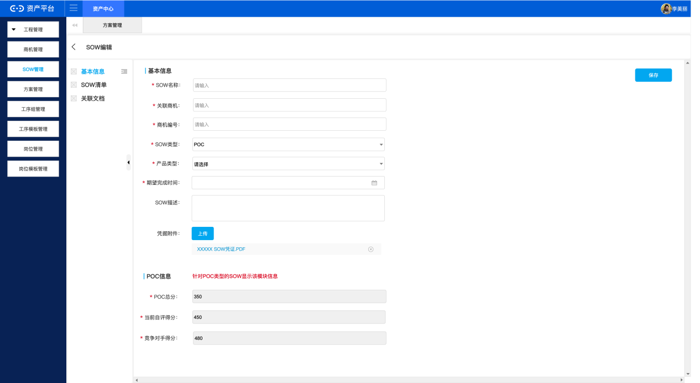
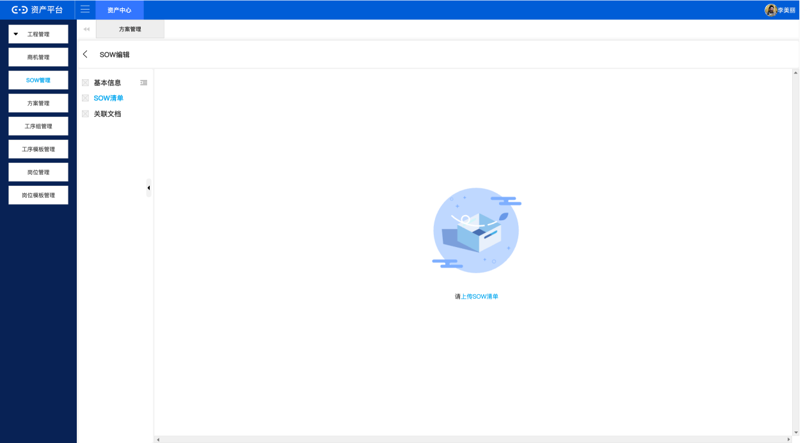
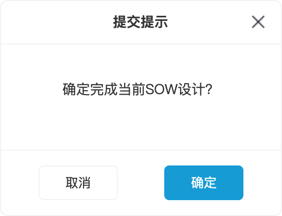

# SOW管理

## 1. 需求基线

| 属性 | 值 |
|---|---|
| 需求 Run ID | run-20260916-3d8e72b4 |
| 基线编号 | BASELINE-SOW-MGT-001 |
| 需求标识 | sow-management |
| 版本 | 1.0.0 |
| 状态 | approved |
| 模型哈希 | `sha256:9551ba6959086b35d7bee39ae46d42d81c3e8071bc824984fe8f99ca018ab6c0` |

### 来源

| 来源编号 | 类型 | 位置 | 摘要 |
|---|---|---|---|
| SRC-001 | docx | SOW管理-需求文档-20260401.docx | FinMall平台V4.0.1 SOW管理需求说明文档，作者顾秋梅。覆盖SOW管理首页、新建、编辑、删除、提交完成和查看详情6项功能。 |
| SRC-USER-001 | user_answer | user_reply | 用户对第1轮10个准入问题的逐一回复 |

## 2. 业务背景与目标

### 业务背景

FinMall平台是面向金融行业的企业级工程管理平台。业务/运营团队在经营过程中接收到客户或生产需求，需要通过标准化的Statement of Work(SOW)进行管理。

### 业务问题

当前平台缺少SOW的统一管理入口，业务需求分散管理，无法有效追踪SOW生命周期和关联方案。

### 业务目标

- 提供SOW的全生命周期管理
- 支持SOW清单的批量导入和灵活编辑
- 实现SOW与方案的关联和状态联动
- 提供SOW详情查看和搜索筛选能力

### 成功指标

- 业务人员可独立完成SOW创建和清单导入
- SOW状态流转准确率100%

## 3. 范围与非范围

### 本次范围

- SOW管理首页
- 删除SOW
- 提交完成
- 新建SOW
- 查看SOW详情
- 编辑SOW（基本信息/SOW清单/POC信息）

### 非范围

- 方案评审流程
- 商机管理模块
- 移动端适配

**涉及系统：** FinMall工程管理平台、方案管理模块

**涉及渠道：** PC Web

## 4. 角色、渠道与权限

| 角色编号 | 角色 | 渠道 | 权限 |
|---|---|---|---|
| ACTOR-FM-USER | FM平台用户 | PC Web | SOW查看、SOW新建、SOW编辑、SOW删除、SOW提交完成、SOW清单管理 |

## 5. 应用、模块与功能

### 应用边界

| 应用编号 | 应用名称 | 边界 |
|---|---|---|
| APP-FM-H5 | FinMall平台 | PC Web端H5工程管理模块 |

### 模块

| 模块编号 | 模块名称 | 所属应用 | 目标 |
|---|---|---|---|
| MOD-SOW | SOW管理 | FinMall平台 | 为业务/运营团队提供SOW全生命周期管理，包括创建、编辑、清单导入、删除、提交完成和详情查看。 |

### 功能清单

| 功能编号 | 功能名称 | 所属模块 | 角色 | 业务结果 |
|---|---|---|---|---|
| FUN-SOW-HOME | SOW管理首页 | SOW管理 | FM平台用户 | 用户可查看全部SOW列表、搜索筛选、分页浏览，并可发起新建、编辑、删除、提交、查看操作 |
| FUN-SOW-CREATE | 新建SOW | SOW管理 | FM平台用户 | SOW创建成功，状态为已注册 |
| FUN-SOW-EDIT | 编辑SOW | SOW管理 | FM平台用户 | SOW信息和清单被更新 |
| FUN-SOW-DELETE | 删除SOW | SOW管理 | FM平台用户 | 未关联方案的SOW被删除；已关联方案的删除被阻断 |
| FUN-SOW-SUBMIT | 提交完成 | SOW管理 | FM平台用户 | SOW状态变更为已完成 |
| FUN-SOW-VIEW | 查看SOW详情 | SOW管理 | FM平台用户 | 展示SOW完整详情 |

## 6. 功能详细需求与场景

### FUN-SOW-HOME SOW管理首页

- **前置条件：** 用户已登录FM平台
- **触发方式：** 进入工程管理/SOW管理
- **业务结果：** 用户可查看全部SOW列表、搜索筛选、分页浏览，并可发起新建、编辑、删除、提交、查看操作
- **依赖功能：** 无

#### 场景

**SCN-SOW-HOME-001 查看SOW列表（normal）**

- 前置条件：用户已登录
- 步骤：用户进入SOW管理首页、系统展示全部SOW列表（SOW ID/名称/类型/关联商机/期望完成时间/状态/创建人）、系统展示操作按钮列、系统展示分页
- 终态：用户成功浏览SOW列表

**SCN-SOW-HOME-002 搜索筛选SOW（normal）**

- 前置条件：用户已登录
- 步骤：用户输入搜索条件、用户点击'搜索'、系统按条件筛选展示结果
- 终态：用户获得筛选后的SOW列表

**SCN-SOW-HOME-003 搜索无结果（alternative）**

- 前置条件：用户已登录
- 步骤：用户输入搜索条件、系统查找无匹配、系统展示空状态提示
- 终态：用户看到空搜索结果

#### 原子需求

**REQ-SOW-HOME-001 SOW列表展示**

- 触发条件：进入SOW管理页面
- 动作：展示SOW列表
- 预期结果：系统展示含全部列和操作按钮的SOW列表
- 业务职责：FM运营团队
- 前端职责：H5前端
- 后端职责：FinMall后端
- 外部系统职责：方案管理模块

**REQ-SOW-HOME-002 SOW搜索筛选**

- 触发条件：输入搜索条件
- 动作：按条件筛选
- 预期结果：系统按名称/ID/关联商机/状态/创建人/期望完成时间筛选
- 业务职责：FM运营团队
- 前端职责：H5前端
- 后端职责：FinMall后端
- 外部系统职责：方案管理模块

**REQ-SOW-HOME-003 操作按钮按状态展示**

- 触发条件：查看SOW行
- 动作：展示对应按钮
- 预期结果：已注册：提交/编辑/查看/删除；已完成：编辑/查看/删除；已登记：查看
- 业务职责：FM运营团队
- 前端职责：H5前端
- 后端职责：FinMall后端
- 外部系统职责：方案管理模块

**REQ-SOW-HOME-004 SOW列表分页**

- 触发条件：浏览多页列表
- 动作：分页展示
- 预期结果：10条/页，支持跳页
- 业务职责：FM运营团队
- 前端职责：H5前端
- 后端职责：FinMall后端
- 外部系统职责：方案管理模块

### FUN-SOW-CREATE 新建SOW

- **前置条件：** 用户已登录、处于SOW管理首页
- **触发方式：** 点击'+新增SOW'
- **业务结果：** SOW创建成功，状态为已注册
- **依赖功能：** 无

#### 场景

**SCN-SOW-CREATE-001 仅创建SOW（normal）**

- 前置条件：用户已登录
- 步骤：用户点击'+新增SOW'、系统打开新建侧滑面板、用户填写必填字段、用户点击'仅创建'、系统创建SOW并关闭弹窗
- 终态：SOW创建成功

**SCN-SOW-CREATE-002 创建并继续设计（normal）**

- 前置条件：用户已登录
- 步骤：用户填写信息、用户点击'创建并继续设计'、系统创建SOW并跳转编辑页
- 终态：SOW创建成功，进入编辑页

**SCN-SOW-CREATE-003 取消创建（alternative）**

- 前置条件：用户已登录
- 步骤：用户点击'取消'、系统关闭弹窗不保存
- 终态：弹窗关闭

**SCN-SOW-CREATE-004 必填字段未填（business_exception）**

- 前置条件：用户已登录
- 步骤：用户未填全必填字段、用户点击创建、系统提示校验错误
- 终态：创建被阻止

#### 原子需求

**REQ-SOW-CREATE-001 新建侧滑面板**

- 触发条件：点击'+新增SOW'
- 动作：打开面板
- 预期结果：展示SOW名称/关联商机/商机编号/SOW类型/产品类型/期望完成时间/附件/描述及取消/仅创建/创建并继续设计
- 业务职责：FM运营团队
- 前端职责：H5前端
- 后端职责：FinMall后端
- 外部系统职责：方案管理模块

**REQ-SOW-CREATE-002 SOW名称校验**

- 触发条件：输入名称
- 动作：校验
- 预期结果：中英文≤30字，必填
- 业务职责：FM运营团队
- 前端职责：H5前端
- 后端职责：FinMall后端
- 外部系统职责：方案管理模块

**REQ-SOW-CREATE-003 字段长度**

- 触发条件：输入关联商机/商机编号
- 动作：校验
- 预期结果：各≤30字
- 业务职责：FM运营团队
- 前端职责：H5前端
- 后端职责：FinMall后端
- 外部系统职责：方案管理模块

**REQ-SOW-CREATE-004 SOW类型选择**

- 触发条件：选择类型
- 动作：单选
- 预期结果：SOW类型单选：POC、交付、FM1、其他，必填
- 业务职责：FM运营团队
- 前端职责：H5前端
- 后端职责：FinMall后端
- 外部系统职责：方案管理模块

**REQ-SOW-CREATE-005 产品类型**

- 触发条件：选择产品类型
- 动作：单选
- 预期结果：业务产品/平台产品/工具产品
- 业务职责：FM运营团队
- 前端职责：H5前端
- 后端职责：FinMall后端
- 外部系统职责：方案管理模块

**REQ-SOW-CREATE-006 创建操作**

- 触发条件：点击创建按钮
- 动作：创建SOW
- 预期结果：仅创建关闭弹窗；创建并继续设计跳转编辑页
- 业务职责：FM运营团队
- 前端职责：H5前端
- 后端职责：FinMall后端
- 外部系统职责：方案管理模块

### FUN-SOW-EDIT 编辑SOW

- **前置条件：** 用户已登录、SOW状态为已注册或已完成
- **触发方式：** 点击'编辑'
- **业务结果：** SOW信息和清单被更新
- **依赖功能：** 无

#### 场景

**SCN-SOW-EDIT-001 修改基本信息（normal）**

- 前置条件：用户已登录
- 步骤：用户进入编辑页、用户修改字段、用户点击保存、系统保存更新
- 终态：信息更新成功

**SCN-SOW-EDIT-002 首次导入SOW清单（normal）**

- 前置条件：用户已登录
- 步骤：用户切换到SOW清单Tab、用户点击批量导入、用户下载模板并上传xlsx、用户点击开始导入、系统解析展示清单
- 终态：SOW清单导入成功

**SCN-SOW-EDIT-003 重新导入（normal）**

- 前置条件：用户已登录、SOW清单已有数据
- 步骤：用户上传新xlsx、系统对比展示新增/删除差异、用户确认后导入、系统更新清单
- 终态：SOW清单更新成功

**SCN-SOW-EDIT-004 删除未匹配功能（normal）**

- 前置条件：用户已登录、功能未被方案匹配
- 步骤：用户点击删除、系统确认未匹配、用户确认后删除
- 终态：功能被删除

**SCN-SOW-EDIT-005 删除已匹配功能（normal）**

- 前置条件：用户已登录、功能已被方案匹配
- 步骤：用户点击删除、系统提示关联方案名称、用户确认后系统和方案匹配关系一并删除
- 终态：功能及匹配关系被删除

**SCN-SOW-EDIT-006 导入非xlsx文件（business_exception）**

- 前置条件：用户已登录
- 步骤：用户上传非xlsx文件、系统提示格式错误
- 终态：用户看到错误提示

#### 原子需求

**REQ-SOW-EDIT-001 Tab布局**

- 触发条件：进入编辑页
- 动作：展示Tab
- 预期结果：基本信息/SOW清单
- 业务职责：FM运营团队
- 前端职责：H5前端
- 后端职责：FinMall后端
- 外部系统职责：方案管理模块

**REQ-SOW-EDIT-002 POC信息**

- 触发条件：POC类型SOW进入编辑页
- 动作：展示汇总
- 预期结果：POC总分/当前自评得分/竞争对手得分
- 业务职责：FM运营团队
- 前端职责：H5前端
- 后端职责：FinMall后端
- 外部系统职责：方案管理模块

**REQ-SOW-EDIT-003 批量导入**

- 触发条件：点击批量导入
- 动作：模板下载→上传→导入
- 预期结果：首次导入展示清单；重新导入展示差异对比
- 业务职责：FM运营团队
- 前端职责：H5前端
- 后端职责：FinMall后端
- 外部系统职责：方案管理模块

**REQ-SOW-EDIT-004 模板规则**

- 触发条件：下载模板
- 动作：按类型区分
- 预期结果：非POC：6列；POC：11列
- 业务职责：FM运营团队
- 前端职责：H5前端
- 后端职责：FinMall后端
- 外部系统职责：方案管理模块

**REQ-SOW-EDIT-005 编辑功能信息**

- 触发条件：编辑功能
- 动作：弹窗编辑
- 预期结果：功能名称/功能说明/功能合用，POC含POC字段
- 业务职责：FM运营团队
- 前端职责：H5前端
- 后端职责：FinMall后端
- 外部系统职责：方案管理模块

**REQ-SOW-EDIT-006 删除功能**

- 触发条件：删除功能
- 动作：校验匹配后删除
- 预期结果：未匹配直接删；已匹配提示方案名称后一并删除
- 业务职责：FM运营团队
- 前端职责：H5前端
- 后端职责：FinMall后端
- 外部系统职责：方案管理模块

### FUN-SOW-DELETE 删除SOW

- **前置条件：** 用户已登录、SOW状态为已注册或已完成
- **触发方式：** 点击'删除'
- **业务结果：** 未关联方案的SOW被删除；已关联方案的删除被阻断
- **依赖功能：** 无

#### 场景

**SCN-SOW-DELETE-001 删除无关联SOW（normal）**

- 前置条件：用户已登录、SOW未关联方案
- 步骤：用户点击删除、系统弹出确认弹窗、用户确认、系统删除SOW
- 终态：SOW被删除

**SCN-SOW-DELETE-002 删除已关联SOW被阻断（business_exception）**

- 前置条件：用户已登录、SOW已关联方案
- 步骤：用户点击删除、系统检测到关联方案、系统提示方案名称并阻断
- 终态：删除被阻断

#### 原子需求

**REQ-SOW-DELETE-001 删除未关联SOW**

- 触发条件：点击删除
- 动作：确认弹窗
- 预期结果：确认后删除；已关联方案则阻断提示
- 业务职责：FM运营团队
- 前端职责：H5前端
- 后端职责：FinMall后端
- 外部系统职责：方案管理模块

### FUN-SOW-SUBMIT 提交完成

- **前置条件：** 用户已登录、SOW状态为已注册
- **触发方式：** 点击'提交完成'
- **业务结果：** SOW状态变更为已完成
- **依赖功能：** 无

#### 场景

**SCN-SOW-SUBMIT-001 提交完成（normal）**

- 前置条件：用户已登录、SOW清单已导入且合用评价完成
- 步骤：用户点击提交完成、系统校验通过、用户确认、系统更新状态为已完成
- 终态：SOW状态变更为已完成

**SCN-SOW-SUBMIT-002 提交时清单未完成（business_exception）**

- 前置条件：用户已登录、SOW清单未完成
- 步骤：用户点击提交完成、系统校验发现未完成、系统提示错误信息
- 终态：提交被阻止

#### 原子需求

**REQ-SOW-SUBMIT-001 提交完成校验**

- 触发条件：点击提交完成
- 动作：校验后提交
- 预期结果：提交条件：(1)所有必填字段已填写(2)SOW清单已导入且至少含一个功能(3)所有功能已完成合用/不合用评价。满足后弹出确认弹窗，确认后状态变已完成。
- 业务职责：FM运营团队
- 前端职责：H5前端
- 后端职责：FinMall后端
- 外部系统职责：方案管理模块

### FUN-SOW-VIEW 查看SOW详情

- **前置条件：** 用户已登录
- **触发方式：** 点击'查看'
- **业务结果：** 展示SOW完整详情
- **依赖功能：** 无

#### 场景

**SCN-SOW-VIEW-001 查看基本信息（normal）**

- 前置条件：用户已登录
- 步骤：用户点击查看、系统进入详情页、系统展示基本信息
- 终态：用户查看基本信息

**SCN-SOW-VIEW-002 查看关联方案（normal）**

- 前置条件：用户已登录、SOW有关联方案
- 步骤：用户切换到关联方案Tab、系统展示关联方案、用户点击方案名称、系统新开页面跳转详情
- 终态：用户查看方案详情

#### 原子需求

**REQ-SOW-VIEW-001 查看详情**

- 触发条件：点击查看
- 动作：进入详情
- 预期结果：基本信息/SOW清单/关联文档/关联方案/项目概览
- 业务职责：FM运营团队
- 前端职责：H5前端
- 后端职责：FinMall后端
- 外部系统职责：方案管理模块

**REQ-SOW-VIEW-002 关联方案查看**

- 触发条件：点击方案名称
- 动作：新开页面
- 预期结果：跳转方案详情
- 业务职责：FM运营团队
- 前端职责：H5前端
- 后端职责：FinMall后端
- 外部系统职责：方案管理模块

## 7. 业务对象与业务规则

### 业务对象

- **BO-SOW SOW：** Statement of Work，记录客户或生产需求的核心业务对象。
  - `SOW名称`：
  - `SOW ID`：
  - `SOW类型`：
  - `产品类型`：
  - `状态`：
- **BO-SOW-ITEM SOW清单项：** SOW清单中的功能项。
  - `功能名称`：
  - `功能合用`：
  - `POC分值`：

### 业务规则

- **BR-SOW-STATUS（状态流转）：** 已注册(创建)→已完成(提交)→已登记(方案评审通过)。已注册可编辑/提交/删除；已完成可编辑/删除；已登记不可编辑/删除。
- **BR-SOW-POC（计算）：** POC总分=SUM(POC分值)；自评得分=SUM(自评得分)；竞对得分=SUM(竞对得分)。仅POC展示。
- **BR-SOW-DELETE（校验）：** 删除SOW校验方案关联；删除功能校验系统匹配。已关联则阻断或提示。
- **BR-SOW-SUBMIT（校验）：** 提交条件：清单已导入+所有功能完成合用评价。
- **BR-SOW-FIELD（字段规则）：** SOW名称≤30字必填；关联商机/商机编号各≤30字；类型单选；产品类型单选。

## 8. 跨端业务契约

### CONTRACT-001 SOW与方案关联

- 提供方：方案管理模块
- 消费方：SOW管理模块
- 成功语义：返回关联状态和方案信息
- 失败语义：方案模块不可用时，删除/功能删除操作阻断并提示
- 一致性要求：删除操作保证SOW侧和方案侧数据一致性

## 9. 非功能要求

| 编号 | 类别 | 要求 | 度量标准 |
|---|---|---|---|
| NFR-001 | performance | SOW列表搜索响应<2秒 | <2s |
| NFR-002 | security | 所有操作需登录FM平台 | 未登录无法访问 |
| NFR-003 | data | 导入操作保证事务一致性 | 原子事务 |
| NFR-004 | audit | 记录操作人和时间 | 审计日志 |

## 10. 验收标准

| 验收编号 | 需求编号 | Given | When | Then | 可观察结果 |
|---|---|---|---|---|---|
| AC-REQ-SOW-HOME-001 | REQ-SOW-HOME-001 | 用户已登录且满足前置条件 | 用户执行SOW列表展示操作 | 系统按规则处理 | 用户可观察到SOW列表展示的预期结果 |
| AC-REQ-SOW-HOME-002 | REQ-SOW-HOME-002 | 用户已登录且满足前置条件 | 用户执行SOW搜索筛选操作 | 系统按规则处理 | 用户可观察到SOW搜索筛选的预期结果 |
| AC-REQ-SOW-HOME-003 | REQ-SOW-HOME-003 | 用户已登录且满足前置条件 | 用户执行操作按钮按状态展示操作 | 系统按规则处理 | 用户可观察到操作按钮按状态展示的预期结果 |
| AC-REQ-SOW-HOME-004 | REQ-SOW-HOME-004 | 用户已登录且满足前置条件 | 用户执行SOW列表分页操作 | 系统按规则处理 | 用户可观察到SOW列表分页的预期结果 |
| AC-REQ-SOW-CREATE-001 | REQ-SOW-CREATE-001 | 用户已登录且满足前置条件 | 用户执行新建侧滑面板操作 | 系统按规则处理 | 用户可观察到新建侧滑面板的预期结果 |
| AC-REQ-SOW-CREATE-002 | REQ-SOW-CREATE-002 | 用户已登录且满足前置条件 | 用户执行SOW名称校验操作 | 系统按规则处理 | 用户可观察到SOW名称校验的预期结果 |
| AC-REQ-SOW-CREATE-003 | REQ-SOW-CREATE-003 | 用户已登录且满足前置条件 | 用户执行字段长度操作 | 系统按规则处理 | 用户可观察到字段长度的预期结果 |
| AC-REQ-SOW-CREATE-004 | REQ-SOW-CREATE-004 | 用户已登录且满足前置条件 | 用户执行SOW类型选择操作 | 系统按规则处理 | 用户可观察到SOW类型选择的预期结果 |
| AC-REQ-SOW-CREATE-005 | REQ-SOW-CREATE-005 | 用户已登录且满足前置条件 | 用户执行产品类型操作 | 系统按规则处理 | 用户可观察到产品类型的预期结果 |
| AC-REQ-SOW-CREATE-006 | REQ-SOW-CREATE-006 | 用户已登录且满足前置条件 | 用户执行创建操作操作 | 系统按规则处理 | 用户可观察到创建操作的预期结果 |
| AC-REQ-SOW-EDIT-001 | REQ-SOW-EDIT-001 | 用户已登录且满足前置条件 | 用户执行Tab布局操作 | 系统按规则处理 | 用户可观察到Tab布局的预期结果 |
| AC-REQ-SOW-EDIT-002 | REQ-SOW-EDIT-002 | 用户已登录且满足前置条件 | 用户执行POC信息操作 | 系统按规则处理 | 用户可观察到POC信息的预期结果 |
| AC-REQ-SOW-EDIT-003 | REQ-SOW-EDIT-003 | 用户已登录且满足前置条件 | 用户执行批量导入操作 | 系统按规则处理 | 用户可观察到批量导入的预期结果 |
| AC-REQ-SOW-EDIT-004 | REQ-SOW-EDIT-004 | 用户已登录且满足前置条件 | 用户执行模板规则操作 | 系统按规则处理 | 用户可观察到模板规则的预期结果 |
| AC-REQ-SOW-EDIT-005 | REQ-SOW-EDIT-005 | 用户已登录且满足前置条件 | 用户执行编辑功能信息操作 | 系统按规则处理 | 用户可观察到编辑功能信息的预期结果 |
| AC-REQ-SOW-EDIT-006 | REQ-SOW-EDIT-006 | 用户已登录且满足前置条件 | 用户执行删除功能操作 | 系统按规则处理 | 用户可观察到删除功能的预期结果 |
| AC-REQ-SOW-DELETE-001 | REQ-SOW-DELETE-001 | 用户已登录且满足前置条件 | 用户执行删除未关联SOW操作 | 系统按规则处理 | 用户可观察到删除未关联SOW的预期结果 |
| AC-REQ-SOW-SUBMIT-001 | REQ-SOW-SUBMIT-001 | 用户已登录且满足前置条件 | 用户执行提交完成校验操作 | 系统按规则处理 | 用户可观察到提交完成校验的预期结果 |
| AC-REQ-SOW-VIEW-001 | REQ-SOW-VIEW-001 | 用户已登录且满足前置条件 | 用户执行查看详情操作 | 系统按规则处理 | 用户可观察到查看详情的预期结果 |
| AC-REQ-SOW-VIEW-002 | REQ-SOW-VIEW-002 | 用户已登录且满足前置条件 | 用户执行关联方案查看操作 | 系统按规则处理 | 用户可观察到关联方案查看的预期结果 |

### 业务验收测试覆盖

| 用例编号 | 用例名称 | 类型 | 场景 | 验收标准 | 逻辑数据集 |
|---|---|---|---|---|---|
| TEST-SCN-SOW-HOME-001 | 查看SOW列表 | 正常 | SCN-SOW-HOME-001 | AC-REQ-SOW-HOME-001、AC-REQ-SOW-HOME-002、AC-REQ-SOW-HOME-003、AC-REQ-SOW-HOME-004 | 无 |
| TEST-SCN-SOW-HOME-002 | 搜索筛选SOW | 正常 | SCN-SOW-HOME-002 | AC-REQ-SOW-HOME-001、AC-REQ-SOW-HOME-002、AC-REQ-SOW-HOME-003、AC-REQ-SOW-HOME-004 | 无 |
| TEST-SCN-SOW-HOME-003 | 搜索无结果 | 备选 | SCN-SOW-HOME-003 | AC-REQ-SOW-HOME-001、AC-REQ-SOW-HOME-002、AC-REQ-SOW-HOME-003、AC-REQ-SOW-HOME-004 | 无 |
| TEST-SCN-SOW-CREATE-001 | 仅创建SOW | 正常 | SCN-SOW-CREATE-001 | AC-REQ-SOW-CREATE-001、AC-REQ-SOW-CREATE-002、AC-REQ-SOW-CREATE-003、AC-REQ-SOW-CREATE-004、AC-REQ-SOW-CREATE-005、AC-REQ-SOW-CREATE-006 | DATA-001 |
| TEST-SCN-SOW-CREATE-002 | 创建并继续设计 | 正常 | SCN-SOW-CREATE-002 | AC-REQ-SOW-CREATE-001、AC-REQ-SOW-CREATE-002、AC-REQ-SOW-CREATE-003、AC-REQ-SOW-CREATE-004、AC-REQ-SOW-CREATE-005、AC-REQ-SOW-CREATE-006 | 无 |
| TEST-SCN-SOW-CREATE-003 | 取消创建 | 备选 | SCN-SOW-CREATE-003 | AC-REQ-SOW-CREATE-001、AC-REQ-SOW-CREATE-002、AC-REQ-SOW-CREATE-003、AC-REQ-SOW-CREATE-004、AC-REQ-SOW-CREATE-005、AC-REQ-SOW-CREATE-006 | 无 |
| TEST-SCN-SOW-CREATE-004 | 必填字段未填 | 业务异常 | SCN-SOW-CREATE-004 | AC-REQ-SOW-CREATE-001、AC-REQ-SOW-CREATE-002、AC-REQ-SOW-CREATE-003、AC-REQ-SOW-CREATE-004、AC-REQ-SOW-CREATE-005、AC-REQ-SOW-CREATE-006 | 无 |
| TEST-SCN-SOW-EDIT-001 | 修改基本信息 | 正常 | SCN-SOW-EDIT-001 | AC-REQ-SOW-EDIT-001、AC-REQ-SOW-EDIT-002、AC-REQ-SOW-EDIT-003、AC-REQ-SOW-EDIT-004、AC-REQ-SOW-EDIT-005、AC-REQ-SOW-EDIT-006 | 无 |
| TEST-SCN-SOW-EDIT-002 | 首次导入SOW清单 | 正常 | SCN-SOW-EDIT-002 | AC-REQ-SOW-EDIT-001、AC-REQ-SOW-EDIT-002、AC-REQ-SOW-EDIT-003、AC-REQ-SOW-EDIT-004、AC-REQ-SOW-EDIT-005、AC-REQ-SOW-EDIT-006 | 无 |
| TEST-SCN-SOW-EDIT-003 | 重新导入 | 正常 | SCN-SOW-EDIT-003 | AC-REQ-SOW-EDIT-001、AC-REQ-SOW-EDIT-002、AC-REQ-SOW-EDIT-003、AC-REQ-SOW-EDIT-004、AC-REQ-SOW-EDIT-005、AC-REQ-SOW-EDIT-006 | 无 |
| TEST-SCN-SOW-EDIT-004 | 删除未匹配功能 | 正常 | SCN-SOW-EDIT-004 | AC-REQ-SOW-EDIT-001、AC-REQ-SOW-EDIT-002、AC-REQ-SOW-EDIT-003、AC-REQ-SOW-EDIT-004、AC-REQ-SOW-EDIT-005、AC-REQ-SOW-EDIT-006 | 无 |
| TEST-SCN-SOW-EDIT-005 | 删除已匹配功能 | 正常 | SCN-SOW-EDIT-005 | AC-REQ-SOW-EDIT-001、AC-REQ-SOW-EDIT-002、AC-REQ-SOW-EDIT-003、AC-REQ-SOW-EDIT-004、AC-REQ-SOW-EDIT-005、AC-REQ-SOW-EDIT-006 | 无 |
| TEST-SCN-SOW-EDIT-006 | 导入非xlsx文件 | 业务异常 | SCN-SOW-EDIT-006 | AC-REQ-SOW-EDIT-001、AC-REQ-SOW-EDIT-002、AC-REQ-SOW-EDIT-003、AC-REQ-SOW-EDIT-004、AC-REQ-SOW-EDIT-005、AC-REQ-SOW-EDIT-006 | 无 |
| TEST-SCN-SOW-DELETE-001 | 删除无关联SOW | 正常 | SCN-SOW-DELETE-001 | AC-REQ-SOW-DELETE-001 | 无 |
| TEST-SCN-SOW-DELETE-002 | 删除已关联SOW被阻断 | 业务异常 | SCN-SOW-DELETE-002 | AC-REQ-SOW-DELETE-001 | DATA-002 |
| TEST-SCN-SOW-SUBMIT-001 | 提交完成 | 正常 | SCN-SOW-SUBMIT-001 | AC-REQ-SOW-SUBMIT-001 | 无 |
| TEST-SCN-SOW-SUBMIT-002 | 提交时清单未完成 | 业务异常 | SCN-SOW-SUBMIT-002 | AC-REQ-SOW-SUBMIT-001 | 无 |
| TEST-SCN-SOW-VIEW-001 | 查看基本信息 | 正常 | SCN-SOW-VIEW-001 | AC-REQ-SOW-VIEW-001、AC-REQ-SOW-VIEW-002 | 无 |
| TEST-SCN-SOW-VIEW-002 | 查看关联方案 | 正常 | SCN-SOW-VIEW-002 | AC-REQ-SOW-VIEW-001、AC-REQ-SOW-VIEW-002 | 无 |

完整步骤、逻辑测试数据和预期结果详见 `sow-management-业务验收测试方案-v1.0.0.md`。

## 11. 决策清单

| 编号 | 类型 | 优先级 | 阻断 | 问题 | 位置摘要 | 推荐状态 | 推荐摘要 | 当前状态 |
|---|---|---|---|---|---|---|---|---|
| DEC-SOW-001 | 冲突 | P0 | 是 | SOW类型术语不一致：正文POC/交付/FM1/其他 vs 原型POC/交付/亮点/FMI。请确认最终术语？ | 新建SOW → 业务规则 → SOW类型；SOW首页 → 原型 → 表格列SOW类型 | 处理建议 | 推荐方案A，正文为需求规格权威来源。 | 已解决 |
| DEC-SOW-002 | 缺失 | P1 | 是 | 已登记状态操作权限未完全说明。仅说明不可编辑/删除，是否可查看？列表操作列展示什么？ | SOW首页 → 业务规则 → 已登记 | 处理建议 | 推荐方案A，已登记仅保留查看权限。 | 已解决 |
| DEC-SOW-003 | 缺失 | P1 | 是 | 关联文档Tab功能正文未描述。原型两处均显示此Tab。请确认功能和本期范围。 | 编辑SOW → 原型 → Tab页签；查看详情 → 原型 → Tab页签 | 处理建议 | 由产品负责人确认本期范围。 | 已解决 |
| DEC-SOW-004 | 冲突 | P2 | 否 | 导航菜单'工位管理'vs'岗位管理'不一致。请确认。 | 首页 → 导航；编辑页 → 导航 | 具体推荐 | 推荐方案B，'岗位'更通用。 | 已解决 |
| DEC-SOW-005 | 缺失 | P0 | 是 | SOW ID生成规则未定义。原型显示FM-SOW-{年份}-{序号}。请确认规则。 | 首页 → SOW ID列；详情 → SOW ID | 处理建议 | 推荐方案A，自动生成保证唯一性。 | 已解决 |
| DEC-SOW-006 | 冲突 | P1 | 是 | 产品类型选项不一致：正文'业务产品/平台产品/工具产品' vs 原型'业务资产'。请确认。 | 新建SOW → 产品类型；详情 → 产品类型 | 处理建议 | 推荐方案A。 | 已解决 |
| DEC-SOW-007 | 不一致 | P1 | 否 | 附件字段名不一致：'凭据附件' vs '依据附件'。请确认统一名称。 | 新建SOW → 凭据附件；详情 → 附件 | 具体推荐 | 统一为'凭据附件'。 | 已解决 |
| DEC-SOW-008 | 不完整 | P2 | 否 | 详情页额外Tab(工序进度/功能看板/业务模型/导出文档)正文未描述。请确认最终Tab范围。 | 详情 → Tab | 处理建议 | 以正文为准，额外Tab留后续。 | 已解决 |
| DEC-SOW-009 | 不完整 | P1 | 是 | 附件上传格式和大小限制未定义。请明确具体约束。 | 新建SOW → 凭据附件 | 处理建议 | 建议明确格式list、大小上限和数量上限。 | 已解决 |
| DEC-SOW-010 | 不完整 | P1 | 否 | 提交完成'必填项'清单不明确。请确认完整条件。 | 提交完成 → 校验；新建SOW → 侧滑面板 | 处理建议 | 建议明确三项具体条件。 | 已解决 |

逐项证据、候选方案、推荐依据和用户决策过程详见 `sow-management-需求问题与决策记录-v1.0.0.md`。

## 12. 来源覆盖与追溯

### 来源覆盖

| 来源 | 位置 | 原文关键句 | 处置 | 目标 | 理由 |
|---|---|---|---|---|---|
| SRC-001 | 需求文档 → 正文段落 | 正文段落 | mapped | FUN-SOW-HOME | 正文段落 |
| SRC-001 | 需求文档 → 正文段落 | 正文段落 | mapped | FUN-SOW-HOME | 正文段落 |
| SRC-001 | 需求文档 → 正文段落 | 正文段落 | mapped | FUN-SOW-HOME | 正文段落 |
| SRC-001 | 需求文档 → 正文段落 | 正文段落 | mapped | FUN-SOW-HOME | 正文段落 |
| SRC-001 | 需求文档 → 正文段落 | 正文段落 | mapped | FUN-SOW-HOME | 正文段落 |
| SRC-001 | 需求文档 → 正文段落 | 正文段落 | mapped | FUN-SOW-HOME | 正文段落 |
| SRC-001 | 需求文档 → 正文段落 | 正文段落 | mapped | FUN-SOW-HOME | 正文段落 |
| SRC-001 | 需求文档 → 正文段落 | 正文段落 | mapped | FUN-SOW-HOME | 正文段落 |
| SRC-001 | 需求文档 → 正文段落 | 正文段落 | mapped | FUN-SOW-HOME | 正文段落 |
| SRC-001 | 需求文档 → 正文段落 | 正文段落 | mapped | FUN-SOW-HOME | 正文段落 |
| SRC-001 | 需求文档 → 正文段落 | 正文段落 | mapped | FUN-SOW-HOME | 正文段落 |
| SRC-001 | 需求文档 → 正文段落 | 正文段落 | mapped | FUN-SOW-HOME | 正文段落 |
| SRC-001 | 需求文档 → 正文段落 | 正文段落 | mapped | FUN-SOW-HOME | 正文段落 |
| SRC-001 | 需求文档 → 正文段落 | 正文段落 | mapped | FUN-SOW-HOME | 正文段落 |
| SRC-001 | 需求文档 → 正文段落 | 正文段落 | mapped | FUN-SOW-HOME | 正文段落 |
| SRC-001 | 需求文档 → 正文段落 | 正文段落 | mapped | FUN-SOW-HOME | 正文段落 |
| SRC-001 | 需求文档 → 正文段落 | 正文段落 | mapped | FUN-SOW-HOME | 正文段落 |
| SRC-001 | 需求文档 → 正文段落 | 正文段落 | mapped | FUN-SOW-HOME | 正文段落 |
| SRC-001 | 需求文档 → 正文段落 | 正文段落 | mapped | FUN-SOW-HOME | 正文段落 |
| SRC-001 | 需求文档 → 正文段落 | 正文段落 | mapped | FUN-SOW-HOME | 正文段落 |
| SRC-001 | 需求文档 → 正文段落 | 正文段落 | mapped | FUN-SOW-HOME | 正文段落 |
| SRC-001 | 需求文档 → 正文段落 | 正文段落 | mapped | FUN-SOW-HOME | 正文段落 |
| SRC-001 | 需求文档 → 正文段落 | 正文段落 | mapped | FUN-SOW-HOME | 正文段落 |
| SRC-001 | 需求文档 → 正文段落 | 正文段落 | mapped | FUN-SOW-HOME | 正文段落 |
| SRC-001 | 需求文档 → 正文段落 | 正文段落 | mapped | FUN-SOW-HOME | 正文段落 |
| SRC-001 | 需求文档 → 正文段落 | 正文段落 | mapped | FUN-SOW-HOME | 正文段落 |
| SRC-001 | 需求文档 → 正文段落 | 正文段落 | mapped | FUN-SOW-HOME | 正文段落 |
| SRC-001 | 需求文档 → 正文段落 | 正文段落 | mapped | FUN-SOW-HOME | 正文段落 |
| SRC-001 | 需求文档 → 正文段落 | 正文段落 | mapped | FUN-SOW-HOME | 正文段落 |
| SRC-001 | 需求文档 → 正文段落 | 正文段落 | mapped | FUN-SOW-HOME | 正文段落 |
| SRC-001 | 需求文档 → 正文段落 | 正文段落 | mapped | FUN-SOW-HOME | 正文段落 |
| SRC-001 | 需求文档 → 正文段落 | 正文段落 | mapped | FUN-SOW-HOME | 正文段落 |
| SRC-001 | 需求文档 → 正文段落 | 正文段落 | mapped | FUN-SOW-HOME | 正文段落 |
| SRC-001 | 需求文档 → 正文段落 | 正文段落 | mapped | FUN-SOW-HOME | 正文段落 |
| SRC-001 | 需求文档 → 正文段落 | 正文段落 | mapped | FUN-SOW-HOME | 正文段落 |
| SRC-001 | 需求文档 → 正文段落 | 正文段落 | mapped | FUN-SOW-HOME | 正文段落 |
| SRC-001 | 需求文档 → 正文段落 | 正文段落 | mapped | FUN-SOW-HOME | 正文段落 |
| SRC-001 | 需求文档 → 正文段落 | 正文段落 | mapped | FUN-SOW-HOME | 正文段落 |
| SRC-001 | 需求文档 → 正文段落 | 正文段落 | mapped | FUN-SOW-HOME | 正文段落 |
| SRC-001 | 需求文档 → 正文段落 | 正文段落 | mapped | FUN-SOW-HOME | 正文段落 |
| SRC-001 | 需求文档 → 正文段落 | 正文段落 | mapped | FUN-SOW-HOME | 正文段落 |
| SRC-001 | 需求文档 → 正文段落 | 正文段落 | mapped | FUN-SOW-HOME | 正文段落 |
| SRC-001 | 需求文档 → 正文段落 | 正文段落 | mapped | FUN-SOW-HOME | 正文段落 |
| SRC-001 | 需求文档 → 正文段落 | 正文段落 | mapped | FUN-SOW-HOME | 正文段落 |
| SRC-001 | 需求文档 → 正文段落 | 正文段落 | mapped | FUN-SOW-HOME | 正文段落 |
| SRC-001 | 需求文档 → 正文段落 | 正文段落 | mapped | FUN-SOW-HOME | 正文段落 |
| SRC-001 | 需求文档 → 正文段落 | 正文段落 | mapped | FUN-SOW-HOME | 正文段落 |
| SRC-001 | 需求文档 → 正文段落 | 正文段落 | mapped | FUN-SOW-HOME | 正文段落 |
| SRC-001 | 需求文档 → 正文段落 | 正文段落 | mapped | FUN-SOW-HOME | 正文段落 |
| SRC-001 | 需求文档 → 正文段落 | 正文段落 | mapped | FUN-SOW-HOME | 正文段落 |
| SRC-001 | 需求文档 → 正文段落 | 正文段落 | mapped | FUN-SOW-HOME | 正文段落 |
| SRC-001 | 需求文档 → 正文段落 | 正文段落 | mapped | FUN-SOW-HOME | 正文段落 |
| SRC-001 | 需求文档 → 正文段落 | 正文段落 | mapped | FUN-SOW-HOME | 正文段落 |
| SRC-001 | 需求文档 → 正文段落 | 正文段落 | mapped | FUN-SOW-HOME | 正文段落 |
| SRC-001 | 需求文档 → 正文段落 | 正文段落 | mapped | FUN-SOW-HOME | 正文段落 |
| SRC-001 | 需求文档 → 正文段落 | 正文段落 | mapped | FUN-SOW-HOME | 正文段落 |
| SRC-001 | 需求文档 → 正文段落 | 正文段落 | mapped | FUN-SOW-HOME | 正文段落 |
| SRC-001 | 需求文档 → 正文段落 | 正文段落 | mapped | FUN-SOW-HOME | 正文段落 |
| SRC-001 | 需求文档 → 正文段落 | 正文段落 | mapped | FUN-SOW-HOME | 正文段落 |
| SRC-001 | 需求文档 → 正文段落 | 正文段落 | mapped | FUN-SOW-HOME | 正文段落 |
| SRC-001 | 需求文档 → 正文段落 | 正文段落 | mapped | FUN-SOW-HOME | 正文段落 |
| SRC-001 | 需求文档 → 正文段落 | 正文段落 | mapped | FUN-SOW-HOME | 正文段落 |
| SRC-001 | 需求文档 → 正文段落 | 正文段落 | mapped | FUN-SOW-HOME | 正文段落 |
| SRC-001 | 需求文档 → 正文段落 | 正文段落 | mapped | FUN-SOW-HOME | 正文段落 |
| SRC-001 | 需求文档 → 正文段落 | 正文段落 | mapped | FUN-SOW-HOME | 正文段落 |
| SRC-001 | 需求文档 → 正文段落 | 正文段落 | mapped | FUN-SOW-HOME | 正文段落 |
| SRC-001 | 需求文档 → 正文段落 | 正文段落 | mapped | FUN-SOW-HOME | 正文段落 |
| SRC-001 | 需求文档 → 正文段落 | 正文段落 | mapped | FUN-SOW-HOME | 正文段落 |
| SRC-001 | 需求文档 → 正文段落 | 正文段落 | mapped | FUN-SOW-HOME | 正文段落 |
| SRC-001 | 需求文档 → 正文段落 | 正文段落 | mapped | FUN-SOW-HOME | 正文段落 |
| SRC-001 | 需求文档 → 正文段落 | 正文段落 | mapped | FUN-SOW-HOME | 正文段落 |
| SRC-001 | 需求文档 → 正文段落 | 正文段落 | mapped | FUN-SOW-HOME | 正文段落 |
| SRC-001 | 需求文档 → 正文段落 | 正文段落 | mapped | FUN-SOW-HOME | 正文段落 |
| SRC-001 | 需求文档 → 正文段落 | 正文段落 | mapped | FUN-SOW-HOME | 正文段落 |
| SRC-001 | 需求文档 → 正文段落 | 正文段落 | mapped | FUN-SOW-HOME | 正文段落 |
| SRC-001 | 需求文档 → 正文段落 | 正文段落 | mapped | FUN-SOW-HOME | 正文段落 |
| SRC-001 | 需求文档 → 正文段落 | 正文段落 | mapped | FUN-SOW-HOME | 正文段落 |
| SRC-001 | 需求文档 → 正文段落 | 正文段落 | mapped | FUN-SOW-HOME | 正文段落 |
| SRC-001 | 需求文档 → 正文段落 | 正文段落 | mapped | FUN-SOW-HOME | 正文段落 |
| SRC-001 | 需求文档 → 正文段落 | 正文段落 | mapped | FUN-SOW-HOME | 正文段落 |
| SRC-001 | 需求文档 → 正文段落 | 正文段落 | mapped | FUN-SOW-HOME | 正文段落 |
| SRC-001 | 需求文档 → 正文段落 | 正文段落 | mapped | FUN-SOW-HOME | 正文段落 |
| SRC-001 | 需求文档 → 正文段落 | 正文段落 | mapped | FUN-SOW-HOME | 正文段落 |
| SRC-001 | 需求文档 → 正文段落 | 正文段落 | mapped | FUN-SOW-HOME | 正文段落 |
| SRC-001 | 需求文档 → 正文段落 | 正文段落 | mapped | FUN-SOW-HOME | 正文段落 |
| SRC-001 | 需求文档 → 正文段落 | 正文段落 | mapped | FUN-SOW-HOME | 正文段落 |
| SRC-001 | 需求文档 → 正文段落 | 正文段落 | mapped | FUN-SOW-HOME | 正文段落 |
| SRC-001 | 需求文档 → 正文段落 | 正文段落 | mapped | FUN-SOW-HOME | 正文段落 |
| SRC-001 | 需求文档 → 正文段落 | 正文段落 | mapped | FUN-SOW-HOME | 正文段落 |
| SRC-001 | 需求文档 → 正文段落 | 正文段落 | mapped | FUN-SOW-HOME | 正文段落 |
| SRC-001 | 需求文档 → 正文段落 | 正文段落 | mapped | FUN-SOW-HOME | 正文段落 |
| SRC-001 | 需求文档 → 正文段落 | 正文段落 | mapped | FUN-SOW-HOME | 正文段落 |
| SRC-001 | 需求文档 → 正文段落 | 正文段落 | mapped | FUN-SOW-HOME | 正文段落 |
| SRC-001 | 需求文档 → 正文段落 | 正文段落 | mapped | FUN-SOW-HOME | 正文段落 |
| SRC-001 | 需求文档 → 正文段落 | 正文段落 | mapped | FUN-SOW-HOME | 正文段落 |
| SRC-001 | 需求文档 → 正文段落 | 正文段落 | mapped | FUN-SOW-HOME | 正文段落 |
| SRC-001 | 需求文档 → 正文段落 | 正文段落 | mapped | FUN-SOW-HOME | 正文段落 |
| SRC-001 | 需求文档 → 正文段落 | 正文段落 | mapped | FUN-SOW-HOME | 正文段落 |
| SRC-001 | 需求文档 → 正文段落 | 正文段落 | mapped | FUN-SOW-HOME | 正文段落 |
| SRC-001 | 需求文档 → 正文段落 | 正文段落 | mapped | FUN-SOW-HOME | 正文段落 |
| SRC-001 | 需求文档 → 正文段落 | 正文段落 | mapped | FUN-SOW-HOME | 正文段落 |
| SRC-001 | 需求文档 → 正文段落 | 正文段落 | mapped | FUN-SOW-HOME | 正文段落 |
| SRC-001 | 需求文档 → 正文段落 | 正文段落 | mapped | FUN-SOW-HOME | 正文段落 |
| SRC-001 | 需求文档 → 正文段落 | 正文段落 | mapped | FUN-SOW-HOME | 正文段落 |
| SRC-001 | 需求文档 → 正文段落 | 正文段落 | mapped | FUN-SOW-HOME | 正文段落 |
| SRC-001 | 需求文档 → 正文段落 | 正文段落 | mapped | FUN-SOW-HOME | 正文段落 |
| SRC-001 | 需求文档 → 正文段落 | 正文段落 | mapped | FUN-SOW-HOME | 正文段落 |
| SRC-001 | 需求文档 → 正文段落 | 正文段落 | mapped | FUN-SOW-HOME | 正文段落 |
| SRC-001 | 需求文档 → 正文段落 | 正文段落 | mapped | FUN-SOW-HOME | 正文段落 |
| SRC-001 | 需求文档 → 正文段落 | 正文段落 | mapped | FUN-SOW-HOME | 正文段落 |
| SRC-001 | 需求文档 → 正文段落 | 正文段落 | mapped | FUN-SOW-HOME | 正文段落 |
| SRC-001 | 需求文档 → 正文段落 | 正文段落 | mapped | FUN-SOW-HOME | 正文段落 |
| SRC-001 | 需求文档 → 正文段落 | 正文段落 | mapped | FUN-SOW-HOME | 正文段落 |
| SRC-001 | 需求文档 → 正文段落 | 正文段落 | mapped | FUN-SOW-HOME | 正文段落 |
| SRC-001 | 需求文档 → 正文段落 | 正文段落 | mapped | FUN-SOW-HOME | 正文段落 |
| SRC-001 | 需求文档 → 正文段落 | 正文段落 | mapped | FUN-SOW-HOME | 正文段落 |
| SRC-001 | 需求文档 → 正文段落 | 正文段落 | mapped | FUN-SOW-HOME | 正文段落 |
| SRC-001 | 需求文档 → 正文段落 | 正文段落 | mapped | FUN-SOW-HOME | 正文段落 |
| SRC-001 | 需求文档 → 正文段落 | 正文段落 | mapped | FUN-SOW-HOME | 正文段落 |
| SRC-001 | 需求文档 → 正文段落 | 正文段落 | mapped | FUN-SOW-HOME | 正文段落 |
| SRC-001 | 需求文档 → 正文段落 | 正文段落 | mapped | FUN-SOW-HOME | 正文段落 |
| SRC-001 | 需求文档 → 正文段落 | 正文段落 | mapped | FUN-SOW-HOME | 正文段落 |
| SRC-001 | 需求文档 → 正文段落 | 正文段落 | mapped | FUN-SOW-HOME | 正文段落 |
| SRC-001 | 需求文档 → 正文段落 | 正文段落 | mapped | FUN-SOW-HOME | 正文段落 |
| SRC-001 | 需求文档 → 正文段落 | 正文段落 | mapped | FUN-SOW-HOME | 正文段落 |
| SRC-001 | 需求文档 → 正文段落 | 正文段落 | mapped | FUN-SOW-HOME | 正文段落 |
| SRC-001 | 需求文档 → 正文段落 | 正文段落 | mapped | FUN-SOW-HOME | 正文段落 |
| SRC-001 | 需求文档 → 正文段落 | 正文段落 | mapped | FUN-SOW-HOME | 正文段落 |
| SRC-001 | 需求文档 → 正文段落 | 正文段落 | mapped | FUN-SOW-HOME | 正文段落 |
| SRC-001 | 需求文档 → 正文段落 | 正文段落 | mapped | FUN-SOW-HOME | 正文段落 |
| SRC-001 | 需求文档 → 正文段落 | 正文段落 | mapped | FUN-SOW-HOME | 正文段落 |
| SRC-001 | 需求文档 → 正文段落 | 正文段落 | mapped | FUN-SOW-HOME | 正文段落 |
| SRC-001 | 需求文档 → 正文段落 | 正文段落 | mapped | FUN-SOW-HOME | 正文段落 |
| SRC-001 | 需求文档 → 正文段落 | 正文段落 | mapped | FUN-SOW-HOME | 正文段落 |
| SRC-001 | 需求文档 → 正文段落 | 正文段落 | mapped | FUN-SOW-HOME | 正文段落 |
| SRC-001 | 需求文档 → 正文段落 | 正文段落 | mapped | FUN-SOW-HOME | 正文段落 |
| SRC-001 | 需求文档 → 正文段落 | 正文段落 | mapped | FUN-SOW-HOME | 正文段落 |
| SRC-001 | 需求文档 → 正文段落 | 正文段落 | mapped | FUN-SOW-HOME | 正文段落 |
| SRC-001 | 需求文档 → 正文段落 | 正文段落 | mapped | FUN-SOW-HOME | 正文段落 |
| SRC-001 | 需求文档 → 正文段落 | 正文段落 | mapped | FUN-SOW-HOME | 正文段落 |
| SRC-001 | 需求文档 → 正文段落 | 正文段落 | mapped | FUN-SOW-HOME | 正文段落 |
| SRC-001 | 需求文档 → 正文段落 | 正文段落 | mapped | FUN-SOW-HOME | 正文段落 |
| SRC-001 | 需求文档 → 正文段落 | 正文段落 | mapped | FUN-SOW-HOME | 正文段落 |
| SRC-001 | 需求文档 → 正文段落 | 正文段落 | mapped | FUN-SOW-HOME | 正文段落 |
| SRC-001 | 需求文档 → 正文段落 | 正文段落 | mapped | FUN-SOW-HOME | 正文段落 |
| SRC-001 | 需求文档 → 正文段落 | 正文段落 | mapped | FUN-SOW-HOME | 正文段落 |
| SRC-001 | 需求文档 → 页面原型 → 图片1 | 正文段落 | mapped | FUN-SOW-HOME | 图片对应功能原型 |
| SRC-001 | 需求文档 → 页面原型 → 图片2 | 正文段落 | mapped | FUN-SOW-CREATE | 图片对应功能原型 |
| SRC-001 | 需求文档 → 页面原型 → 图片3 | 正文段落 | mapped | FUN-SOW-EDIT | 图片对应功能原型 |
| SRC-001 | 需求文档 → 页面原型 → 图片4 | 正文段落 | mapped | FUN-SOW-EDIT | 图片对应功能原型 |
| SRC-001 | 需求文档 → 页面原型 → 图片5 | 正文段落 | mapped | FUN-SOW-EDIT | 图片对应功能原型 |
| SRC-001 | 需求文档 → 页面原型 → 图片6 | 正文段落 | mapped | FUN-SOW-EDIT | 图片对应功能原型 |
| SRC-001 | 需求文档 → 页面原型 → 图片7 | 正文段落 | mapped | FUN-SOW-EDIT | 图片对应功能原型 |
| SRC-001 | 需求文档 → 页面原型 → 图片8 | 正文段落 | mapped | FUN-SOW-EDIT | 图片对应功能原型 |
| SRC-001 | 需求文档 → 页面原型 → 图片9 | 正文段落 | mapped | FUN-SOW-EDIT | 图片对应功能原型 |
| SRC-001 | 需求文档 → 页面原型 → 图片10 | 正文段落 | mapped | FUN-SOW-DELETE | 图片对应功能原型 |
| SRC-001 | 需求文档 → 页面原型 → 图片11 | 正文段落 | mapped | FUN-SOW-VIEW | 图片对应功能原型 |

### 追溯关系

| 来源对象 | 目标对象 | 关系 |
|---|---|---|
| FUN-SOW-HOME | MOD-SOW | function_in_module |
| FUN-SOW-CREATE | MOD-SOW | function_in_module |
| FUN-SOW-EDIT | MOD-SOW | function_in_module |
| FUN-SOW-DELETE | MOD-SOW | function_in_module |
| FUN-SOW-SUBMIT | MOD-SOW | function_in_module |
| FUN-SOW-VIEW | MOD-SOW | function_in_module |
| SCN-SOW-HOME-001 | FUN-SOW-HOME | scenario_in_function |
| SCN-SOW-HOME-002 | FUN-SOW-HOME | scenario_in_function |
| SCN-SOW-HOME-003 | FUN-SOW-HOME | scenario_in_function |
| SCN-SOW-CREATE-001 | FUN-SOW-CREATE | scenario_in_function |
| SCN-SOW-CREATE-002 | FUN-SOW-CREATE | scenario_in_function |
| SCN-SOW-CREATE-003 | FUN-SOW-CREATE | scenario_in_function |
| SCN-SOW-CREATE-004 | FUN-SOW-CREATE | scenario_in_function |
| SCN-SOW-EDIT-001 | FUN-SOW-EDIT | scenario_in_function |
| SCN-SOW-EDIT-002 | FUN-SOW-EDIT | scenario_in_function |
| SCN-SOW-EDIT-003 | FUN-SOW-EDIT | scenario_in_function |
| SCN-SOW-EDIT-004 | FUN-SOW-EDIT | scenario_in_function |
| SCN-SOW-EDIT-005 | FUN-SOW-EDIT | scenario_in_function |
| SCN-SOW-EDIT-006 | FUN-SOW-EDIT | scenario_in_function |
| SCN-SOW-DELETE-001 | FUN-SOW-DELETE | scenario_in_function |
| SCN-SOW-DELETE-002 | FUN-SOW-DELETE | scenario_in_function |
| SCN-SOW-SUBMIT-001 | FUN-SOW-SUBMIT | scenario_in_function |
| SCN-SOW-SUBMIT-002 | FUN-SOW-SUBMIT | scenario_in_function |
| SCN-SOW-VIEW-001 | FUN-SOW-VIEW | scenario_in_function |
| SCN-SOW-VIEW-002 | FUN-SOW-VIEW | scenario_in_function |
| REQ-SOW-HOME-001 | FUN-SOW-HOME | requirement_in_function |
| REQ-SOW-HOME-002 | FUN-SOW-HOME | requirement_in_function |
| REQ-SOW-HOME-003 | FUN-SOW-HOME | requirement_in_function |
| REQ-SOW-HOME-004 | FUN-SOW-HOME | requirement_in_function |
| REQ-SOW-CREATE-001 | FUN-SOW-CREATE | requirement_in_function |
| REQ-SOW-CREATE-002 | FUN-SOW-CREATE | requirement_in_function |
| REQ-SOW-CREATE-003 | FUN-SOW-CREATE | requirement_in_function |
| REQ-SOW-CREATE-004 | FUN-SOW-CREATE | requirement_in_function |
| REQ-SOW-CREATE-005 | FUN-SOW-CREATE | requirement_in_function |
| REQ-SOW-CREATE-006 | FUN-SOW-CREATE | requirement_in_function |
| REQ-SOW-EDIT-001 | FUN-SOW-EDIT | requirement_in_function |
| REQ-SOW-EDIT-002 | FUN-SOW-EDIT | requirement_in_function |
| REQ-SOW-EDIT-003 | FUN-SOW-EDIT | requirement_in_function |
| REQ-SOW-EDIT-004 | FUN-SOW-EDIT | requirement_in_function |
| REQ-SOW-EDIT-005 | FUN-SOW-EDIT | requirement_in_function |
| REQ-SOW-EDIT-006 | FUN-SOW-EDIT | requirement_in_function |
| REQ-SOW-DELETE-001 | FUN-SOW-DELETE | requirement_in_function |
| REQ-SOW-SUBMIT-001 | FUN-SOW-SUBMIT | requirement_in_function |
| REQ-SOW-VIEW-001 | FUN-SOW-VIEW | requirement_in_function |
| REQ-SOW-VIEW-002 | FUN-SOW-VIEW | requirement_in_function |
| AC-REQ-SOW-HOME-001 | REQ-SOW-HOME-001 | acceptance_for_requirement |
| AC-REQ-SOW-HOME-002 | REQ-SOW-HOME-002 | acceptance_for_requirement |
| AC-REQ-SOW-HOME-003 | REQ-SOW-HOME-003 | acceptance_for_requirement |
| AC-REQ-SOW-HOME-004 | REQ-SOW-HOME-004 | acceptance_for_requirement |
| AC-REQ-SOW-CREATE-001 | REQ-SOW-CREATE-001 | acceptance_for_requirement |
| AC-REQ-SOW-CREATE-002 | REQ-SOW-CREATE-002 | acceptance_for_requirement |
| AC-REQ-SOW-CREATE-003 | REQ-SOW-CREATE-003 | acceptance_for_requirement |
| AC-REQ-SOW-CREATE-004 | REQ-SOW-CREATE-004 | acceptance_for_requirement |
| AC-REQ-SOW-CREATE-005 | REQ-SOW-CREATE-005 | acceptance_for_requirement |
| AC-REQ-SOW-CREATE-006 | REQ-SOW-CREATE-006 | acceptance_for_requirement |
| AC-REQ-SOW-EDIT-001 | REQ-SOW-EDIT-001 | acceptance_for_requirement |
| AC-REQ-SOW-EDIT-002 | REQ-SOW-EDIT-002 | acceptance_for_requirement |
| AC-REQ-SOW-EDIT-003 | REQ-SOW-EDIT-003 | acceptance_for_requirement |
| AC-REQ-SOW-EDIT-004 | REQ-SOW-EDIT-004 | acceptance_for_requirement |
| AC-REQ-SOW-EDIT-005 | REQ-SOW-EDIT-005 | acceptance_for_requirement |
| AC-REQ-SOW-EDIT-006 | REQ-SOW-EDIT-006 | acceptance_for_requirement |
| AC-REQ-SOW-DELETE-001 | REQ-SOW-DELETE-001 | acceptance_for_requirement |
| AC-REQ-SOW-SUBMIT-001 | REQ-SOW-SUBMIT-001 | acceptance_for_requirement |
| AC-REQ-SOW-VIEW-001 | REQ-SOW-VIEW-001 | acceptance_for_requirement |
| AC-REQ-SOW-VIEW-002 | REQ-SOW-VIEW-002 | acceptance_for_requirement |

## 13. 图片证据与图文一致性

| 图片编号 | 文档位置 | 类型 | 可读性 | 关联对象 | 场景完整性 | 要素完整性 | 图文一致性 | 关联决策 |
|---|---|---|---|---|---|---|---|---|
| VIS-SOW-001 | SOW管理首页 → 页面原型 → SOW首页列表 | 页面原型 | pass | FUN-SOW-HOME | partial | complete | conflict | DEC-SOW-001 |
| VIS-SOW-002 | 新建SOW → 页面原型 → 新建SOW侧滑面板 | 页面原型 | pass | FUN-SOW-CREATE | complete | complete | consistent | 无 |
| VIS-SOW-003 | 编辑SOW → 页面原型 → 编辑SOW页面 | 页面原型 | pass | FUN-SOW-EDIT | partial | partial | conflict | DEC-SOW-004 |
| VIS-SOW-004 | 编辑SOW → 基本信息Tab | 页面原型 | pass | FUN-SOW-EDIT | not_applicable | not_applicable | consistent | 无 |
| VIS-SOW-005 | 编辑SOW → SOW清单-初始状态 | 页面原型 | pass | FUN-SOW-EDIT | complete | complete | consistent | 无 |
| VIS-SOW-006 | 编辑SOW → SOW清单-导入后 | 页面原型 | pass | FUN-SOW-EDIT | complete | complete | consistent | 无 |
| VIS-SOW-007 | 编辑SOW → 首次导入弹窗 | 页面原型 | pass | FUN-SOW-EDIT | complete | complete | consistent | 无 |
| VIS-SOW-008 | 编辑SOW → 重新导入差异对比 | 页面原型 | pass | FUN-SOW-EDIT | complete | complete | consistent | 无 |
| VIS-SOW-009 | 编辑SOW → 编辑功能弹窗 | 页面原型 | pass | FUN-SOW-EDIT | partial | partial | consistent | DEC-SOW-010 |
| VIS-SOW-010 | 删除SOW → 删除弹窗 | 页面原型 | pass | FUN-SOW-DELETE | partial | partial | consistent | DEC-SOW-002 |
| VIS-SOW-011 | 查看SOW详情 → 原型 | 页面原型 | pass | FUN-SOW-VIEW | partial | partial | conflict | DEC-SOW-006、DEC-SOW-007、DEC-SOW-008 |

### VIS-SOW-001 页面原型

- **位置：** SOW管理首页 → 页面原型 → SOW首页列表
- **内容摘要：** SOW首页列表原型：左侧导航、搜索区、操作按钮、表格（SOW ID/名称/类型/关联商机/期望完成时间/状态/创建人/操作）、分页。表格显示POC/交付/亮点/FMI四种类型。
- **观察要点：** 列表布局完整、搜索条件完备、操作按钮清晰、分页可见
- **完整性与一致性结论：** 原型SOW类型显示'亮点'和'FMI'与正文'FM1'和'其他'不一致

| 比对方面 | 状态 | 正文证据 | 结论 |
|---|---|---|---|
| business_rule | conflict | SRC-001 | SOW类型原型显示POC/交付/亮点/FMI，正文描述POC/交付/FM1/其他 |

### VIS-SOW-002 页面原型

- **位置：** 新建SOW → 页面原型 → 新建SOW侧滑面板
- **内容摘要：** 新建侧滑面板：必填字段（SOW名称/关联商机/商机编号/SOW类型/产品类型/期望完成时间），非必填（描述/附件），底部取消/仅创建/创建并继续设计。
- **观察要点：** 字段与正文一致、操作按钮语义明确
- **完整性与一致性结论：** 原型与正文一致，无需额外决策

| 比对方面 | 状态 | 正文证据 | 结论 |
|---|---|---|---|
| field_data | consistent | SRC-001 | 字段列表与正文一一对应 |

### VIS-SOW-003 页面原型

- **位置：** 编辑SOW → 页面原型 → 编辑SOW页面
- **内容摘要：** 编辑页整体：导航、用户信息、Tab(基本信息/SOW清单/关联文档)、基本信息表单、POC信息模块。
- **观察要点：** 布局清晰、Tab合理
- **完整性与一致性结论：** 导航'岗位管理'与首页'工位管理'不一致

| 比对方面 | 状态 | 正文证据 | 结论 |
|---|---|---|---|
| actor_permission | conflict | SRC-001 | 导航菜单'岗位管理'与首页'工位管理'名称不一致 |

### VIS-SOW-004 页面原型

- **位置：** 编辑SOW → 基本信息Tab
- **内容摘要：** 基本信息Tab特写，与image:3重复。
- **观察要点：** 与image:3一致
- **完整性与一致性结论：** 重复原型无新增内容

| 比对方面 | 状态 | 正文证据 | 结论 |
|---|---|---|---|
| other | consistent | SRC-001 | 与image:3一致 |

### VIS-SOW-005 页面原型

- **位置：** 编辑SOW → SOW清单-初始状态
- **内容摘要：** SOW清单Tab空状态，显示'请上传SOW清单'。
- **观察要点：** 空状态提示清晰
- **完整性与一致性结论：** 原型与正文一致，无需额外决策

| 比对方面 | 状态 | 正文证据 | 结论 |
|---|---|---|---|
| message | consistent | SRC-001 | 与正文一致 |

### VIS-SOW-006 页面原型

- **位置：** 编辑SOW → SOW清单-导入后
- **内容摘要：** 导入后清单列表：搜索区、批量导入/下载按钮、表格含POC字段。
- **观察要点：** 表格列与POC模板一致、功能合用列可见
- **完整性与一致性结论：** 原型与正文一致，无需额外决策

| 比对方面 | 状态 | 正文证据 | 结论 |
|---|---|---|---|
| field_data | consistent | SRC-001 | 与正文POC模板描述一致 |

### VIS-SOW-007 页面原型

- **位置：** 编辑SOW → 首次导入弹窗
- **内容摘要：** 批量导入弹窗：选择文件、下载模板、xlsx提示。
- **观察要点：** 弹窗简洁
- **完整性与一致性结论：** 原型与正文一致，无需额外决策

| 比对方面 | 状态 | 正文证据 | 结论 |
|---|---|---|---|
| operation | consistent | SRC-001 | 与正文规则一致 |

### VIS-SOW-008 页面原型

- **位置：** 编辑SOW → 重新导入差异对比
- **内容摘要：** 重新导入差异弹窗：新增/删除功能对比，删除项显示是否已匹配。
- **观察要点：** 差异对比清晰、是否已匹配列合理
- **完整性与一致性结论：** 与正文完全一致

| 比对方面 | 状态 | 正文证据 | 结论 |
|---|---|---|---|
| operation | consistent | SRC-001 | 与正文描述完全一致 |

### VIS-SOW-009 页面原型

- **位置：** 编辑SOW → 编辑功能弹窗
- **内容摘要：** 编辑功能弹窗：功能名称、功能说明(富文本)。
- **观察要点：** 弹窗聚焦
- **完整性与一致性结论：** 编辑弹窗聚焦功能名称和说明，POC字段可能在列表行内编辑

| 比对方面 | 状态 | 正文证据 | 结论 |
|---|---|---|---|
| field_data | consistent | SRC-001 | 原型未展示功能合用和POC字段编辑入口 |

### VIS-SOW-010 页面原型

- **位置：** 删除SOW → 删除弹窗
- **内容摘要：** 删除确认弹窗：'确定删除当前SOW?'。
- **观察要点：** 弹窗简洁
- **完整性与一致性结论：** 阻断弹窗与正常删除弹窗为不同状态，原型仅展示正常流程可接受

| 比对方面 | 状态 | 正文证据 | 结论 |
|---|---|---|---|
| operation | consistent | SRC-001 | 原型未展示已关联方案时的阻断提示弹窗 |

### VIS-SOW-011 页面原型

- **位置：** 查看SOW详情 → 原型
- **内容摘要：** SOW详情页基本信息Tab：Tab导航(含工序进度等额外Tab)、基本信息、POC信息。
- **观察要点：** 信息完整、Tab丰富
- **完整性与一致性结论：** 产品类型'业务资产'与正文不一致；'依据附件'与'凭据附件'不一致；额外Tab正文未描述

| 比对方面 | 状态 | 正文证据 | 结论 |
|---|---|---|---|
| field_data | conflict | SRC-001 | 产品类型'业务资产'不在正文选项中 |
| field_data | conflict | SRC-001 | '依据附件'与正文'凭据附件'不一致 |
| scope | not_covered | SRC-001 | 工序进度/功能看板/业务模型/导出文档Tab正文未描述 |

## 14. 准入与准出结论

**结论：passed**

| 维度 | 状态 | 说明 |
|---|---|---|
| background_goal | covered | 已明确背景、目标和成功指标 |
| scope | covered | 已定义范围和系统渠道 |
| actor_permission | covered | 已登记状态权限待确认(已由用户决策确认) |
| module_function | covered | 1模块6功能已识别 |
| business_flow | covered | SOW类型术语和ID规则待确认(已由用户决策确认) |
| scenario | covered | 正常/备选/异常/边界已覆盖 |
| business_rule | covered | 产品类型/附件限制/必填项待确认(已由用户决策确认) |
| data | covered | ID规则和产品类型字典待确认(已由用户决策确认) |
| responsibility | covered | 前后端和外部职责已明确 |
| contract | covered | SOW与方案契约已定义 |
| non_functional | covered | 性能/安全/数据/审计已覆盖 |
| acceptance_traceability | covered | 功能需求均有验收标准 |
| acceptance_test_data | covered | 正常/异常逻辑数据已定义 |

### 阻断问题

- 无
