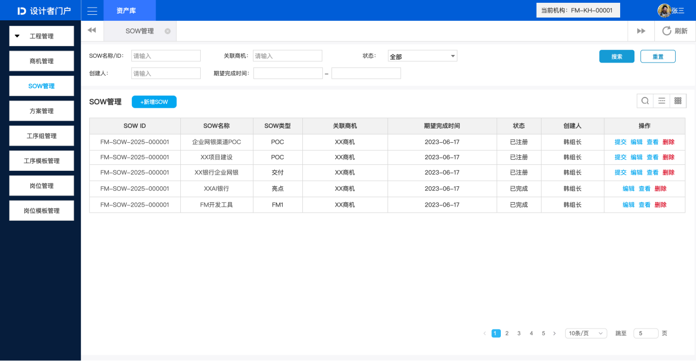
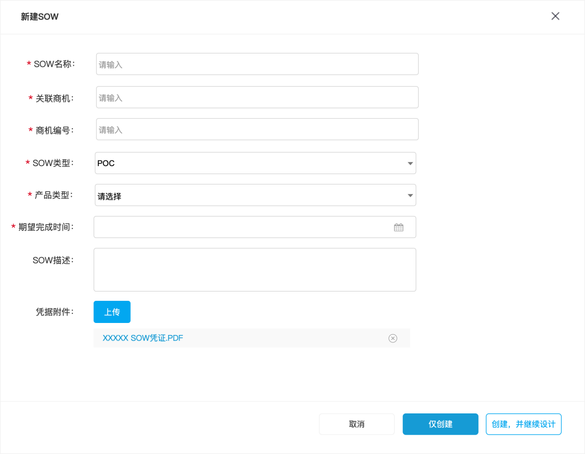
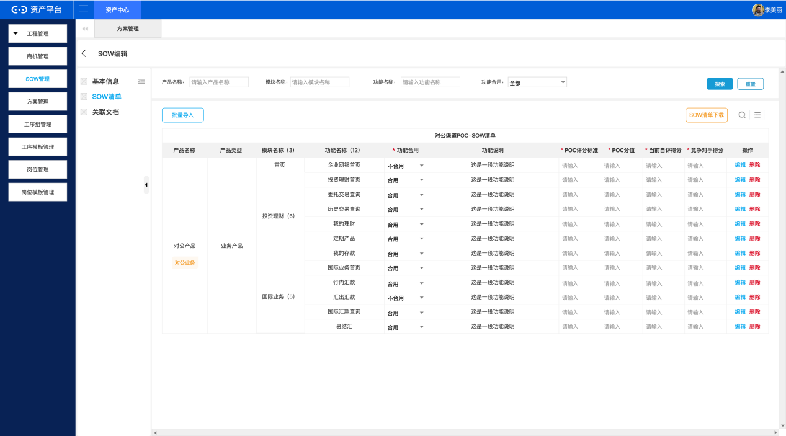
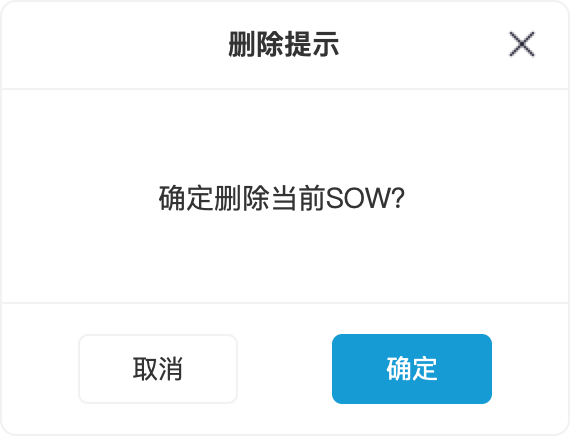
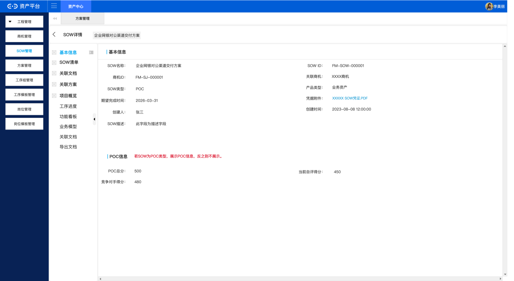

# sow-management-前端详细设计

## 1. 基线与范围

| 属性 | 值 |
| --- | --- |
| Design IR | fm-frontend-design-work-model/1.1 |
| Design IR SHA-256 | 7473995dd5a8d909eab528912258e09a885d40421b1f57139f49c697b798eb11 |
| 需求基线 | BASELINE-SOW-MGT-001 |
| 产品 | internal-management |
| Profile | internal-web |
| 前端栈 | vue |

### 澄清决策及覆盖关系

| 决策 ID | 状态 | 生效结论 | 覆盖关系 | 证据 |
| --- | --- | --- | --- | --- |
| DEC-SOW-001 | resolved | 采用正文术语 POC/交付/FM1/其他 | active | requirement-package-snapshot/sow-management-requirement-model-v1.0.0.json#/decisions/0 |
| DEC-SOW-002 | resolved | 已登记状态仅保留查看 | active | requirement-package-snapshot/sow-management-requirement-model-v1.0.0.json#/decisions/1 |
| DEC-SOW-003 | resolved | 本期移除关联文档Tab功能 | active | requirement-package-snapshot/sow-management-requirement-model-v1.0.0.json#/decisions/2 |
| DEC-SOW-004 | resolved | 统一为岗位管理 | active | requirement-package-snapshot/sow-management-requirement-model-v1.0.0.json#/decisions/3 |
| DEC-SOW-005 | resolved | SOW ID系统自动生成，格式FM-SOW-{年份}-{序号} | active | requirement-package-snapshot/sow-management-requirement-model-v1.0.0.json#/decisions/4 |
| DEC-SOW-006 | resolved | 产品类型统一为正文术语：业务产品/平台产品/工具产品 | active | requirement-package-snapshot/sow-management-requirement-model-v1.0.0.json#/decisions/5 |
| DEC-SOW-007 | resolved | 统一为凭据附件 | active | requirement-package-snapshot/sow-management-requirement-model-v1.0.0.json#/decisions/6 |
| DEC-SOW-008 | resolved | 详情页Tab以正文为准（5个Tab） | active | requirement-package-snapshot/sow-management-requirement-model-v1.0.0.json#/decisions/7 |
| DEC-SOW-009 | resolved | 明确格式/大小/数量 | active | requirement-package-snapshot/sow-management-requirement-model-v1.0.0.json#/decisions/8 |
| DEC-SOW-010 | resolved | 明确提交完成三项条件 | active | requirement-package-snapshot/sow-management-requirement-model-v1.0.0.json#/decisions/9 |

## 2. 功能设计

### 2.1 SOW管理首页

用户可查看全部SOW列表、搜索筛选、分页浏览，并可发起新建、编辑、删除、提交、查看操作

| 属性 | 值 |
| --- | --- |
| 功能 ID | FUN-SOW-HOME |
| 触发 | 进入工程管理/SOW管理 |
| 结果 | 用户可查看全部SOW列表、搜索筛选、分页浏览，并可发起新建、编辑、删除、提交、查看操作 |
| 关联需求 | REQ-SOW-HOME-001, REQ-SOW-HOME-002, REQ-SOW-HOME-003, REQ-SOW-HOME-004 |
| 前置功能 | - |

#### 页面

| 资产 | 名称 | 动作 | 现有路径 | 目标路径 | 需求 |
| --- | --- | --- | --- | --- | --- |
| ARTIFACT-011 | ART-PAGE-HOME | add | - | src/modules/aop_sowmgmt/views/home/index.vue | REQ-SOW-HOME-001, REQ-SOW-HOME-002, REQ-SOW-HOME-003, REQ-SOW-HOME-004 |

#### 组件

| 资产 | 名称 | 动作 | 现有路径 | 目标路径 | 需求 |
| --- | --- | --- | --- | --- | --- |
| ARTIFACT-004 | ART-MODULE-ENTRY | add | - | src/modules/aop_sowmgmt/Entry.vue | REQ-SOW-HOME-001, REQ-SOW-HOME-002, REQ-SOW-HOME-003, REQ-SOW-HOME-004, REQ-SOW-CREATE-001, REQ-SOW-CREATE-002, REQ-SOW-CREATE-003, REQ-SOW-CREATE-004, REQ-SOW-CREATE-005, REQ-SOW-CREATE-006, REQ-SOW-EDIT-001, REQ-SOW-EDIT-002, REQ-SOW-EDIT-003, REQ-SOW-EDIT-004, REQ-SOW-EDIT-005, REQ-SOW-EDIT-006, REQ-SOW-DELETE-001, REQ-SOW-SUBMIT-001, REQ-SOW-VIEW-001, REQ-SOW-VIEW-002 |
| ARTIFACT-012 | ART-COMP-SEARCH | add | - | src/modules/aop_sowmgmt/views/home/components/SearchBar.vue | REQ-SOW-HOME-002 |
| ARTIFACT-013 | ART-COMP-TABLE | add | - | src/modules/aop_sowmgmt/views/home/components/SowTable.vue | REQ-SOW-HOME-001, REQ-SOW-HOME-003, REQ-SOW-HOME-004 |
| ARTIFACT-014 | ART-COMP-ACTIONS | add | - | src/modules/aop_sowmgmt/views/home/components/ActionButtons.vue | REQ-SOW-HOME-003 |

#### 菜单与路由

| 资产 | 名称 | 动作 | 现有路径 | 目标路径 | 需求 |
| --- | --- | --- | --- | --- | --- |
| ARTIFACT-007 | ART-ROUTER-INDEX | add | - | src/modules/aop_sowmgmt/core/router/index.js | REQ-SOW-HOME-001, REQ-SOW-HOME-002, REQ-SOW-HOME-003, REQ-SOW-HOME-004, REQ-SOW-CREATE-001, REQ-SOW-CREATE-002, REQ-SOW-CREATE-003, REQ-SOW-CREATE-004, REQ-SOW-CREATE-005, REQ-SOW-CREATE-006, REQ-SOW-EDIT-001, REQ-SOW-EDIT-002, REQ-SOW-EDIT-003, REQ-SOW-EDIT-004, REQ-SOW-EDIT-005, REQ-SOW-EDIT-006, REQ-SOW-DELETE-001, REQ-SOW-SUBMIT-001, REQ-SOW-VIEW-001, REQ-SOW-VIEW-002 |

#### 接口

| 资产 | 名称 | 动作 | 现有路径 | 目标路径 | 需求 |
| --- | --- | --- | --- | --- | --- |
| ARTIFACT-010 | ART-API-SOW | add | - | src/modules/aop_sowmgmt/core/api/sow.js | REQ-SOW-HOME-001, REQ-SOW-HOME-002, REQ-SOW-HOME-003, REQ-SOW-HOME-004, REQ-SOW-CREATE-001, REQ-SOW-CREATE-002, REQ-SOW-CREATE-003, REQ-SOW-CREATE-004, REQ-SOW-CREATE-005, REQ-SOW-CREATE-006, REQ-SOW-EDIT-001, REQ-SOW-EDIT-002, REQ-SOW-EDIT-003, REQ-SOW-EDIT-004, REQ-SOW-EDIT-005, REQ-SOW-EDIT-006, REQ-SOW-DELETE-001, REQ-SOW-SUBMIT-001, REQ-SOW-VIEW-001, REQ-SOW-VIEW-002 |

#### 状态

| 资产 | 名称 | 动作 | 现有路径 | 目标路径 | 需求 |
| --- | --- | --- | --- | --- | --- |
| ARTIFACT-008 | ART-STORE-INDEX | add | - | src/modules/aop_sowmgmt/core/store/index.js | REQ-SOW-HOME-001, REQ-SOW-HOME-002, REQ-SOW-HOME-003, REQ-SOW-HOME-004, REQ-SOW-CREATE-001, REQ-SOW-CREATE-002, REQ-SOW-CREATE-003, REQ-SOW-CREATE-004, REQ-SOW-CREATE-005, REQ-SOW-CREATE-006, REQ-SOW-EDIT-001, REQ-SOW-EDIT-002, REQ-SOW-EDIT-003, REQ-SOW-EDIT-004, REQ-SOW-EDIT-005, REQ-SOW-EDIT-006, REQ-SOW-DELETE-001, REQ-SOW-SUBMIT-001, REQ-SOW-VIEW-001, REQ-SOW-VIEW-002 |
| ARTIFACT-009 | ART-STORE-SOW | add | - | src/modules/aop_sowmgmt/core/store/modules/sow.js | REQ-SOW-HOME-001, REQ-SOW-HOME-002, REQ-SOW-HOME-003, REQ-SOW-HOME-004, REQ-SOW-CREATE-001, REQ-SOW-CREATE-002, REQ-SOW-CREATE-003, REQ-SOW-CREATE-004, REQ-SOW-CREATE-005, REQ-SOW-CREATE-006, REQ-SOW-EDIT-001, REQ-SOW-EDIT-002, REQ-SOW-EDIT-003, REQ-SOW-EDIT-004, REQ-SOW-EDIT-005, REQ-SOW-EDIT-006, REQ-SOW-DELETE-001, REQ-SOW-SUBMIT-001, REQ-SOW-VIEW-001, REQ-SOW-VIEW-002 |

#### 配套改动

| 资产 | 名称 | 动作 | 现有路径 | 目标路径 | 需求 |
| --- | --- | --- | --- | --- | --- |
| ARTIFACT-001 | ART-MODULE | add | - | src/modules/aop_sowmgmt | REQ-SOW-HOME-001, REQ-SOW-HOME-002, REQ-SOW-HOME-003, REQ-SOW-HOME-004, REQ-SOW-CREATE-001, REQ-SOW-CREATE-002, REQ-SOW-CREATE-003, REQ-SOW-CREATE-004, REQ-SOW-CREATE-005, REQ-SOW-CREATE-006, REQ-SOW-EDIT-001, REQ-SOW-EDIT-002, REQ-SOW-EDIT-003, REQ-SOW-EDIT-004, REQ-SOW-EDIT-005, REQ-SOW-EDIT-006, REQ-SOW-DELETE-001, REQ-SOW-SUBMIT-001, REQ-SOW-VIEW-001, REQ-SOW-VIEW-002 |
| ARTIFACT-002 | ART-MODULE-PKG | add | - | src/modules/aop_sowmgmt/package.json | REQ-SOW-HOME-001, REQ-SOW-HOME-002, REQ-SOW-HOME-003, REQ-SOW-HOME-004, REQ-SOW-CREATE-001, REQ-SOW-CREATE-002, REQ-SOW-CREATE-003, REQ-SOW-CREATE-004, REQ-SOW-CREATE-005, REQ-SOW-CREATE-006, REQ-SOW-EDIT-001, REQ-SOW-EDIT-002, REQ-SOW-EDIT-003, REQ-SOW-EDIT-004, REQ-SOW-EDIT-005, REQ-SOW-EDIT-006, REQ-SOW-DELETE-001, REQ-SOW-SUBMIT-001, REQ-SOW-VIEW-001, REQ-SOW-VIEW-002 |
| ARTIFACT-003 | ART-MODULE-MAIN | add | - | src/modules/aop_sowmgmt/main.js | REQ-SOW-HOME-001, REQ-SOW-HOME-002, REQ-SOW-HOME-003, REQ-SOW-HOME-004, REQ-SOW-CREATE-001, REQ-SOW-CREATE-002, REQ-SOW-CREATE-003, REQ-SOW-CREATE-004, REQ-SOW-CREATE-005, REQ-SOW-CREATE-006, REQ-SOW-EDIT-001, REQ-SOW-EDIT-002, REQ-SOW-EDIT-003, REQ-SOW-EDIT-004, REQ-SOW-EDIT-005, REQ-SOW-EDIT-006, REQ-SOW-DELETE-001, REQ-SOW-SUBMIT-001, REQ-SOW-VIEW-001, REQ-SOW-VIEW-002 |
| ARTIFACT-005 | ART-MODULE-CONF | add | - | src/modules/aop_sowmgmt/conf.js | REQ-SOW-HOME-001, REQ-SOW-HOME-002, REQ-SOW-HOME-003, REQ-SOW-HOME-004, REQ-SOW-CREATE-001, REQ-SOW-CREATE-002, REQ-SOW-CREATE-003, REQ-SOW-CREATE-004, REQ-SOW-CREATE-005, REQ-SOW-CREATE-006, REQ-SOW-EDIT-001, REQ-SOW-EDIT-002, REQ-SOW-EDIT-003, REQ-SOW-EDIT-004, REQ-SOW-EDIT-005, REQ-SOW-EDIT-006, REQ-SOW-DELETE-001, REQ-SOW-SUBMIT-001, REQ-SOW-VIEW-001, REQ-SOW-VIEW-002 |
| ARTIFACT-006 | ART-MODULE-DESC | add | - | src/modules/aop_sowmgmt/desc.js | REQ-SOW-HOME-001, REQ-SOW-HOME-002, REQ-SOW-HOME-003, REQ-SOW-HOME-004, REQ-SOW-CREATE-001, REQ-SOW-CREATE-002, REQ-SOW-CREATE-003, REQ-SOW-CREATE-004, REQ-SOW-CREATE-005, REQ-SOW-CREATE-006, REQ-SOW-EDIT-001, REQ-SOW-EDIT-002, REQ-SOW-EDIT-003, REQ-SOW-EDIT-004, REQ-SOW-EDIT-005, REQ-SOW-EDIT-006, REQ-SOW-DELETE-001, REQ-SOW-SUBMIT-001, REQ-SOW-VIEW-001, REQ-SOW-VIEW-002 |

#### 业务规则

| 规则 | 内容 | 需求 |
| --- | --- | --- |

#### 关系

| 关系 | 源 | 类型 | 目标 | 约束 |
| --- | --- | --- | --- | --- |
| REL-001 | ARTIFACT-003 | contains | ARTIFACT-004 | MODULE-MAIN depends on MODULE-ENTRY |
| REL-002 | ARTIFACT-004 | contains | ARTIFACT-007 | MODULE-ENTRY depends on ROUTER-INDEX |
| REL-003 | ARTIFACT-007 | route | ARTIFACT-011 | ROUTER-INDEX depends on PAGE-HOME |
| REL-004 | ARTIFACT-007 | route | ARTIFACT-016 | ROUTER-INDEX depends on PAGE-EDIT |
| REL-005 | ARTIFACT-007 | route | ARTIFACT-022 | ROUTER-INDEX depends on PAGE-VIEW |
| REL-006 | ARTIFACT-011 | contains | ARTIFACT-013 | PAGE-HOME depends on TABLE |
| REL-007 | ARTIFACT-011 | contains | ARTIFACT-012 | PAGE-HOME depends on SEARCH |
| REL-008 | ARTIFACT-011 | contains | ARTIFACT-014 | PAGE-HOME depends on ACTIONS |
| REL-009 | ARTIFACT-011 | contains | ARTIFACT-015 | PAGE-HOME depends on CREATE |
| REL-010 | ARTIFACT-011 | contains | ARTIFACT-026 | PAGE-HOME depends on DELETE-DIALOG |
| REL-011 | ARTIFACT-011 | contains | ARTIFACT-027 | PAGE-HOME depends on SUBMIT-DIALOG |
| REL-012 | ARTIFACT-013 | state | ARTIFACT-009 | TABLE depends on STORE-SOW |
| REL-013 | ARTIFACT-013 | api | ARTIFACT-010 | TABLE depends on API-SOW |
| REL-014 | ARTIFACT-015 | api | ARTIFACT-010 | CREATE depends on API-SOW |
| REL-015 | ARTIFACT-015 | state | ARTIFACT-009 | CREATE depends on STORE-SOW |
| REL-016 | ARTIFACT-026 | api | ARTIFACT-010 | DELETE-DIALOG depends on API-SOW |
| REL-017 | ARTIFACT-027 | api | ARTIFACT-010 | SUBMIT-DIALOG depends on API-SOW |
| REL-023 | ARTIFACT-020 | api | ARTIFACT-010 | IMPORT depends on API-SOW |
| REL-024 | ARTIFACT-021 | api | ARTIFACT-010 | ITEMEDIT depends on API-SOW |
| REL-028 | ARTIFACT-016 | api | ARTIFACT-010 | PAGE-EDIT depends on API-SOW |
| REL-029 | ARTIFACT-022 | api | ARTIFACT-010 | PAGE-VIEW depends on API-SOW |
| REL-030 | ARTIFACT-009 | state | ARTIFACT-010 | STORE-SOW depends on API-SOW |

#### 需求职责

| 需求 | 标题 | 动作 | 预期结果 |
| --- | --- | --- | --- |
| REQ-SOW-HOME-001 | SOW列表展示 | 展示SOW列表 | 系统展示含全部列和操作按钮的SOW列表 |
| REQ-SOW-HOME-002 | SOW搜索筛选 | 按条件筛选 | 系统按名称/ID/关联商机/状态/创建人/期望完成时间筛选 |
| REQ-SOW-HOME-003 | 操作按钮按状态展示 | 展示对应按钮 | 已注册：提交/编辑/查看/删除；已完成：编辑/查看/删除；已登记：查看 |
| REQ-SOW-HOME-004 | SOW列表分页 | 分页展示 | 10条/页，支持跳页 |

### 2.2 新建SOW

SOW创建成功，状态为已注册

| 属性 | 值 |
| --- | --- |
| 功能 ID | FUN-SOW-CREATE |
| 触发 | 点击'+新增SOW' |
| 结果 | SOW创建成功，状态为已注册 |
| 关联需求 | REQ-SOW-CREATE-001, REQ-SOW-CREATE-002, REQ-SOW-CREATE-003, REQ-SOW-CREATE-004, REQ-SOW-CREATE-005, REQ-SOW-CREATE-006 |
| 前置功能 | - |

#### 页面

| 资产 | 名称 | 动作 | 现有路径 | 目标路径 | 需求 |
| --- | --- | --- | --- | --- | --- |

#### 组件

| 资产 | 名称 | 动作 | 现有路径 | 目标路径 | 需求 |
| --- | --- | --- | --- | --- | --- |
| ARTIFACT-004 | ART-MODULE-ENTRY | add | - | src/modules/aop_sowmgmt/Entry.vue | REQ-SOW-HOME-001, REQ-SOW-HOME-002, REQ-SOW-HOME-003, REQ-SOW-HOME-004, REQ-SOW-CREATE-001, REQ-SOW-CREATE-002, REQ-SOW-CREATE-003, REQ-SOW-CREATE-004, REQ-SOW-CREATE-005, REQ-SOW-CREATE-006, REQ-SOW-EDIT-001, REQ-SOW-EDIT-002, REQ-SOW-EDIT-003, REQ-SOW-EDIT-004, REQ-SOW-EDIT-005, REQ-SOW-EDIT-006, REQ-SOW-DELETE-001, REQ-SOW-SUBMIT-001, REQ-SOW-VIEW-001, REQ-SOW-VIEW-002 |
| ARTIFACT-015 | ART-DRAWER-CREATE | add | - | src/modules/aop_sowmgmt/views/home/components/CreateDrawer.vue | REQ-SOW-CREATE-001, REQ-SOW-CREATE-002, REQ-SOW-CREATE-003, REQ-SOW-CREATE-004, REQ-SOW-CREATE-005, REQ-SOW-CREATE-006 |

#### 菜单与路由

| 资产 | 名称 | 动作 | 现有路径 | 目标路径 | 需求 |
| --- | --- | --- | --- | --- | --- |
| ARTIFACT-007 | ART-ROUTER-INDEX | add | - | src/modules/aop_sowmgmt/core/router/index.js | REQ-SOW-HOME-001, REQ-SOW-HOME-002, REQ-SOW-HOME-003, REQ-SOW-HOME-004, REQ-SOW-CREATE-001, REQ-SOW-CREATE-002, REQ-SOW-CREATE-003, REQ-SOW-CREATE-004, REQ-SOW-CREATE-005, REQ-SOW-CREATE-006, REQ-SOW-EDIT-001, REQ-SOW-EDIT-002, REQ-SOW-EDIT-003, REQ-SOW-EDIT-004, REQ-SOW-EDIT-005, REQ-SOW-EDIT-006, REQ-SOW-DELETE-001, REQ-SOW-SUBMIT-001, REQ-SOW-VIEW-001, REQ-SOW-VIEW-002 |

#### 接口

| 资产 | 名称 | 动作 | 现有路径 | 目标路径 | 需求 |
| --- | --- | --- | --- | --- | --- |
| ARTIFACT-010 | ART-API-SOW | add | - | src/modules/aop_sowmgmt/core/api/sow.js | REQ-SOW-HOME-001, REQ-SOW-HOME-002, REQ-SOW-HOME-003, REQ-SOW-HOME-004, REQ-SOW-CREATE-001, REQ-SOW-CREATE-002, REQ-SOW-CREATE-003, REQ-SOW-CREATE-004, REQ-SOW-CREATE-005, REQ-SOW-CREATE-006, REQ-SOW-EDIT-001, REQ-SOW-EDIT-002, REQ-SOW-EDIT-003, REQ-SOW-EDIT-004, REQ-SOW-EDIT-005, REQ-SOW-EDIT-006, REQ-SOW-DELETE-001, REQ-SOW-SUBMIT-001, REQ-SOW-VIEW-001, REQ-SOW-VIEW-002 |

#### 状态

| 资产 | 名称 | 动作 | 现有路径 | 目标路径 | 需求 |
| --- | --- | --- | --- | --- | --- |
| ARTIFACT-008 | ART-STORE-INDEX | add | - | src/modules/aop_sowmgmt/core/store/index.js | REQ-SOW-HOME-001, REQ-SOW-HOME-002, REQ-SOW-HOME-003, REQ-SOW-HOME-004, REQ-SOW-CREATE-001, REQ-SOW-CREATE-002, REQ-SOW-CREATE-003, REQ-SOW-CREATE-004, REQ-SOW-CREATE-005, REQ-SOW-CREATE-006, REQ-SOW-EDIT-001, REQ-SOW-EDIT-002, REQ-SOW-EDIT-003, REQ-SOW-EDIT-004, REQ-SOW-EDIT-005, REQ-SOW-EDIT-006, REQ-SOW-DELETE-001, REQ-SOW-SUBMIT-001, REQ-SOW-VIEW-001, REQ-SOW-VIEW-002 |
| ARTIFACT-009 | ART-STORE-SOW | add | - | src/modules/aop_sowmgmt/core/store/modules/sow.js | REQ-SOW-HOME-001, REQ-SOW-HOME-002, REQ-SOW-HOME-003, REQ-SOW-HOME-004, REQ-SOW-CREATE-001, REQ-SOW-CREATE-002, REQ-SOW-CREATE-003, REQ-SOW-CREATE-004, REQ-SOW-CREATE-005, REQ-SOW-CREATE-006, REQ-SOW-EDIT-001, REQ-SOW-EDIT-002, REQ-SOW-EDIT-003, REQ-SOW-EDIT-004, REQ-SOW-EDIT-005, REQ-SOW-EDIT-006, REQ-SOW-DELETE-001, REQ-SOW-SUBMIT-001, REQ-SOW-VIEW-001, REQ-SOW-VIEW-002 |

#### 配套改动

| 资产 | 名称 | 动作 | 现有路径 | 目标路径 | 需求 |
| --- | --- | --- | --- | --- | --- |
| ARTIFACT-001 | ART-MODULE | add | - | src/modules/aop_sowmgmt | REQ-SOW-HOME-001, REQ-SOW-HOME-002, REQ-SOW-HOME-003, REQ-SOW-HOME-004, REQ-SOW-CREATE-001, REQ-SOW-CREATE-002, REQ-SOW-CREATE-003, REQ-SOW-CREATE-004, REQ-SOW-CREATE-005, REQ-SOW-CREATE-006, REQ-SOW-EDIT-001, REQ-SOW-EDIT-002, REQ-SOW-EDIT-003, REQ-SOW-EDIT-004, REQ-SOW-EDIT-005, REQ-SOW-EDIT-006, REQ-SOW-DELETE-001, REQ-SOW-SUBMIT-001, REQ-SOW-VIEW-001, REQ-SOW-VIEW-002 |
| ARTIFACT-002 | ART-MODULE-PKG | add | - | src/modules/aop_sowmgmt/package.json | REQ-SOW-HOME-001, REQ-SOW-HOME-002, REQ-SOW-HOME-003, REQ-SOW-HOME-004, REQ-SOW-CREATE-001, REQ-SOW-CREATE-002, REQ-SOW-CREATE-003, REQ-SOW-CREATE-004, REQ-SOW-CREATE-005, REQ-SOW-CREATE-006, REQ-SOW-EDIT-001, REQ-SOW-EDIT-002, REQ-SOW-EDIT-003, REQ-SOW-EDIT-004, REQ-SOW-EDIT-005, REQ-SOW-EDIT-006, REQ-SOW-DELETE-001, REQ-SOW-SUBMIT-001, REQ-SOW-VIEW-001, REQ-SOW-VIEW-002 |
| ARTIFACT-003 | ART-MODULE-MAIN | add | - | src/modules/aop_sowmgmt/main.js | REQ-SOW-HOME-001, REQ-SOW-HOME-002, REQ-SOW-HOME-003, REQ-SOW-HOME-004, REQ-SOW-CREATE-001, REQ-SOW-CREATE-002, REQ-SOW-CREATE-003, REQ-SOW-CREATE-004, REQ-SOW-CREATE-005, REQ-SOW-CREATE-006, REQ-SOW-EDIT-001, REQ-SOW-EDIT-002, REQ-SOW-EDIT-003, REQ-SOW-EDIT-004, REQ-SOW-EDIT-005, REQ-SOW-EDIT-006, REQ-SOW-DELETE-001, REQ-SOW-SUBMIT-001, REQ-SOW-VIEW-001, REQ-SOW-VIEW-002 |
| ARTIFACT-005 | ART-MODULE-CONF | add | - | src/modules/aop_sowmgmt/conf.js | REQ-SOW-HOME-001, REQ-SOW-HOME-002, REQ-SOW-HOME-003, REQ-SOW-HOME-004, REQ-SOW-CREATE-001, REQ-SOW-CREATE-002, REQ-SOW-CREATE-003, REQ-SOW-CREATE-004, REQ-SOW-CREATE-005, REQ-SOW-CREATE-006, REQ-SOW-EDIT-001, REQ-SOW-EDIT-002, REQ-SOW-EDIT-003, REQ-SOW-EDIT-004, REQ-SOW-EDIT-005, REQ-SOW-EDIT-006, REQ-SOW-DELETE-001, REQ-SOW-SUBMIT-001, REQ-SOW-VIEW-001, REQ-SOW-VIEW-002 |
| ARTIFACT-006 | ART-MODULE-DESC | add | - | src/modules/aop_sowmgmt/desc.js | REQ-SOW-HOME-001, REQ-SOW-HOME-002, REQ-SOW-HOME-003, REQ-SOW-HOME-004, REQ-SOW-CREATE-001, REQ-SOW-CREATE-002, REQ-SOW-CREATE-003, REQ-SOW-CREATE-004, REQ-SOW-CREATE-005, REQ-SOW-CREATE-006, REQ-SOW-EDIT-001, REQ-SOW-EDIT-002, REQ-SOW-EDIT-003, REQ-SOW-EDIT-004, REQ-SOW-EDIT-005, REQ-SOW-EDIT-006, REQ-SOW-DELETE-001, REQ-SOW-SUBMIT-001, REQ-SOW-VIEW-001, REQ-SOW-VIEW-002 |

#### 业务规则

| 规则 | 内容 | 需求 |
| --- | --- | --- |

#### 关系

| 关系 | 源 | 类型 | 目标 | 约束 |
| --- | --- | --- | --- | --- |
| REL-001 | ARTIFACT-003 | contains | ARTIFACT-004 | MODULE-MAIN depends on MODULE-ENTRY |
| REL-002 | ARTIFACT-004 | contains | ARTIFACT-007 | MODULE-ENTRY depends on ROUTER-INDEX |
| REL-003 | ARTIFACT-007 | route | ARTIFACT-011 | ROUTER-INDEX depends on PAGE-HOME |
| REL-004 | ARTIFACT-007 | route | ARTIFACT-016 | ROUTER-INDEX depends on PAGE-EDIT |
| REL-005 | ARTIFACT-007 | route | ARTIFACT-022 | ROUTER-INDEX depends on PAGE-VIEW |
| REL-009 | ARTIFACT-011 | contains | ARTIFACT-015 | PAGE-HOME depends on CREATE |
| REL-012 | ARTIFACT-013 | state | ARTIFACT-009 | TABLE depends on STORE-SOW |
| REL-013 | ARTIFACT-013 | api | ARTIFACT-010 | TABLE depends on API-SOW |
| REL-014 | ARTIFACT-015 | api | ARTIFACT-010 | CREATE depends on API-SOW |
| REL-015 | ARTIFACT-015 | state | ARTIFACT-009 | CREATE depends on STORE-SOW |
| REL-016 | ARTIFACT-026 | api | ARTIFACT-010 | DELETE-DIALOG depends on API-SOW |
| REL-017 | ARTIFACT-027 | api | ARTIFACT-010 | SUBMIT-DIALOG depends on API-SOW |
| REL-023 | ARTIFACT-020 | api | ARTIFACT-010 | IMPORT depends on API-SOW |
| REL-024 | ARTIFACT-021 | api | ARTIFACT-010 | ITEMEDIT depends on API-SOW |
| REL-028 | ARTIFACT-016 | api | ARTIFACT-010 | PAGE-EDIT depends on API-SOW |
| REL-029 | ARTIFACT-022 | api | ARTIFACT-010 | PAGE-VIEW depends on API-SOW |
| REL-030 | ARTIFACT-009 | state | ARTIFACT-010 | STORE-SOW depends on API-SOW |

#### 需求职责

| 需求 | 标题 | 动作 | 预期结果 |
| --- | --- | --- | --- |
| REQ-SOW-CREATE-001 | 新建侧滑面板 | 打开面板 | 展示SOW名称/关联商机/商机编号/SOW类型/产品类型/期望完成时间/附件/描述及取消/仅创建/创建并继续设计 |
| REQ-SOW-CREATE-002 | SOW名称校验 | 校验 | 中英文≤30字，必填 |
| REQ-SOW-CREATE-003 | 字段长度 | 校验 | 各≤30字 |
| REQ-SOW-CREATE-004 | SOW类型选择 | 单选 | SOW类型单选：POC、交付、FM1、其他，必填 |
| REQ-SOW-CREATE-005 | 产品类型 | 单选 | 业务产品/平台产品/工具产品 |
| REQ-SOW-CREATE-006 | 创建操作 | 创建SOW | 仅创建关闭弹窗；创建并继续设计跳转编辑页 |

### 2.3 编辑SOW

SOW信息和清单被更新

| 属性 | 值 |
| --- | --- |
| 功能 ID | FUN-SOW-EDIT |
| 触发 | 点击'编辑' |
| 结果 | SOW信息和清单被更新 |
| 关联需求 | REQ-SOW-EDIT-001, REQ-SOW-EDIT-002, REQ-SOW-EDIT-003, REQ-SOW-EDIT-004, REQ-SOW-EDIT-005, REQ-SOW-EDIT-006 |
| 前置功能 | - |

#### 页面

| 资产 | 名称 | 动作 | 现有路径 | 目标路径 | 需求 |
| --- | --- | --- | --- | --- | --- |
| ARTIFACT-016 | ART-PAGE-EDIT | add | - | src/modules/aop_sowmgmt/views/edit/index.vue | REQ-SOW-EDIT-001, REQ-SOW-EDIT-002, REQ-SOW-EDIT-005 |

#### 组件

| 资产 | 名称 | 动作 | 现有路径 | 目标路径 | 需求 |
| --- | --- | --- | --- | --- | --- |
| ARTIFACT-004 | ART-MODULE-ENTRY | add | - | src/modules/aop_sowmgmt/Entry.vue | REQ-SOW-HOME-001, REQ-SOW-HOME-002, REQ-SOW-HOME-003, REQ-SOW-HOME-004, REQ-SOW-CREATE-001, REQ-SOW-CREATE-002, REQ-SOW-CREATE-003, REQ-SOW-CREATE-004, REQ-SOW-CREATE-005, REQ-SOW-CREATE-006, REQ-SOW-EDIT-001, REQ-SOW-EDIT-002, REQ-SOW-EDIT-003, REQ-SOW-EDIT-004, REQ-SOW-EDIT-005, REQ-SOW-EDIT-006, REQ-SOW-DELETE-001, REQ-SOW-SUBMIT-001, REQ-SOW-VIEW-001, REQ-SOW-VIEW-002 |
| ARTIFACT-017 | ART-COMP-BASIC | add | - | src/modules/aop_sowmgmt/views/edit/components/BasicInfo.vue | REQ-SOW-EDIT-001, REQ-SOW-EDIT-002 |
| ARTIFACT-018 | ART-COMP-POC | add | - | src/modules/aop_sowmgmt/views/edit/components/PocInfo.vue | REQ-SOW-EDIT-002 |
| ARTIFACT-019 | ART-COMP-ITEMS | add | - | src/modules/aop_sowmgmt/views/edit/components/SowItems.vue | REQ-SOW-EDIT-003, REQ-SOW-EDIT-004, REQ-SOW-EDIT-005, REQ-SOW-EDIT-006 |
| ARTIFACT-020 | ART-COMP-IMPORT | add | - | src/modules/aop_sowmgmt/views/edit/components/ImportDialog.vue | REQ-SOW-EDIT-003, REQ-SOW-EDIT-004 |
| ARTIFACT-021 | ART-COMP-ITEMEDIT | add | - | src/modules/aop_sowmgmt/views/edit/components/ItemEditDialog.vue | REQ-SOW-EDIT-005 |

#### 菜单与路由

| 资产 | 名称 | 动作 | 现有路径 | 目标路径 | 需求 |
| --- | --- | --- | --- | --- | --- |
| ARTIFACT-007 | ART-ROUTER-INDEX | add | - | src/modules/aop_sowmgmt/core/router/index.js | REQ-SOW-HOME-001, REQ-SOW-HOME-002, REQ-SOW-HOME-003, REQ-SOW-HOME-004, REQ-SOW-CREATE-001, REQ-SOW-CREATE-002, REQ-SOW-CREATE-003, REQ-SOW-CREATE-004, REQ-SOW-CREATE-005, REQ-SOW-CREATE-006, REQ-SOW-EDIT-001, REQ-SOW-EDIT-002, REQ-SOW-EDIT-003, REQ-SOW-EDIT-004, REQ-SOW-EDIT-005, REQ-SOW-EDIT-006, REQ-SOW-DELETE-001, REQ-SOW-SUBMIT-001, REQ-SOW-VIEW-001, REQ-SOW-VIEW-002 |

#### 接口

| 资产 | 名称 | 动作 | 现有路径 | 目标路径 | 需求 |
| --- | --- | --- | --- | --- | --- |
| ARTIFACT-010 | ART-API-SOW | add | - | src/modules/aop_sowmgmt/core/api/sow.js | REQ-SOW-HOME-001, REQ-SOW-HOME-002, REQ-SOW-HOME-003, REQ-SOW-HOME-004, REQ-SOW-CREATE-001, REQ-SOW-CREATE-002, REQ-SOW-CREATE-003, REQ-SOW-CREATE-004, REQ-SOW-CREATE-005, REQ-SOW-CREATE-006, REQ-SOW-EDIT-001, REQ-SOW-EDIT-002, REQ-SOW-EDIT-003, REQ-SOW-EDIT-004, REQ-SOW-EDIT-005, REQ-SOW-EDIT-006, REQ-SOW-DELETE-001, REQ-SOW-SUBMIT-001, REQ-SOW-VIEW-001, REQ-SOW-VIEW-002 |

#### 状态

| 资产 | 名称 | 动作 | 现有路径 | 目标路径 | 需求 |
| --- | --- | --- | --- | --- | --- |
| ARTIFACT-008 | ART-STORE-INDEX | add | - | src/modules/aop_sowmgmt/core/store/index.js | REQ-SOW-HOME-001, REQ-SOW-HOME-002, REQ-SOW-HOME-003, REQ-SOW-HOME-004, REQ-SOW-CREATE-001, REQ-SOW-CREATE-002, REQ-SOW-CREATE-003, REQ-SOW-CREATE-004, REQ-SOW-CREATE-005, REQ-SOW-CREATE-006, REQ-SOW-EDIT-001, REQ-SOW-EDIT-002, REQ-SOW-EDIT-003, REQ-SOW-EDIT-004, REQ-SOW-EDIT-005, REQ-SOW-EDIT-006, REQ-SOW-DELETE-001, REQ-SOW-SUBMIT-001, REQ-SOW-VIEW-001, REQ-SOW-VIEW-002 |
| ARTIFACT-009 | ART-STORE-SOW | add | - | src/modules/aop_sowmgmt/core/store/modules/sow.js | REQ-SOW-HOME-001, REQ-SOW-HOME-002, REQ-SOW-HOME-003, REQ-SOW-HOME-004, REQ-SOW-CREATE-001, REQ-SOW-CREATE-002, REQ-SOW-CREATE-003, REQ-SOW-CREATE-004, REQ-SOW-CREATE-005, REQ-SOW-CREATE-006, REQ-SOW-EDIT-001, REQ-SOW-EDIT-002, REQ-SOW-EDIT-003, REQ-SOW-EDIT-004, REQ-SOW-EDIT-005, REQ-SOW-EDIT-006, REQ-SOW-DELETE-001, REQ-SOW-SUBMIT-001, REQ-SOW-VIEW-001, REQ-SOW-VIEW-002 |

#### 配套改动

| 资产 | 名称 | 动作 | 现有路径 | 目标路径 | 需求 |
| --- | --- | --- | --- | --- | --- |
| ARTIFACT-001 | ART-MODULE | add | - | src/modules/aop_sowmgmt | REQ-SOW-HOME-001, REQ-SOW-HOME-002, REQ-SOW-HOME-003, REQ-SOW-HOME-004, REQ-SOW-CREATE-001, REQ-SOW-CREATE-002, REQ-SOW-CREATE-003, REQ-SOW-CREATE-004, REQ-SOW-CREATE-005, REQ-SOW-CREATE-006, REQ-SOW-EDIT-001, REQ-SOW-EDIT-002, REQ-SOW-EDIT-003, REQ-SOW-EDIT-004, REQ-SOW-EDIT-005, REQ-SOW-EDIT-006, REQ-SOW-DELETE-001, REQ-SOW-SUBMIT-001, REQ-SOW-VIEW-001, REQ-SOW-VIEW-002 |
| ARTIFACT-002 | ART-MODULE-PKG | add | - | src/modules/aop_sowmgmt/package.json | REQ-SOW-HOME-001, REQ-SOW-HOME-002, REQ-SOW-HOME-003, REQ-SOW-HOME-004, REQ-SOW-CREATE-001, REQ-SOW-CREATE-002, REQ-SOW-CREATE-003, REQ-SOW-CREATE-004, REQ-SOW-CREATE-005, REQ-SOW-CREATE-006, REQ-SOW-EDIT-001, REQ-SOW-EDIT-002, REQ-SOW-EDIT-003, REQ-SOW-EDIT-004, REQ-SOW-EDIT-005, REQ-SOW-EDIT-006, REQ-SOW-DELETE-001, REQ-SOW-SUBMIT-001, REQ-SOW-VIEW-001, REQ-SOW-VIEW-002 |
| ARTIFACT-003 | ART-MODULE-MAIN | add | - | src/modules/aop_sowmgmt/main.js | REQ-SOW-HOME-001, REQ-SOW-HOME-002, REQ-SOW-HOME-003, REQ-SOW-HOME-004, REQ-SOW-CREATE-001, REQ-SOW-CREATE-002, REQ-SOW-CREATE-003, REQ-SOW-CREATE-004, REQ-SOW-CREATE-005, REQ-SOW-CREATE-006, REQ-SOW-EDIT-001, REQ-SOW-EDIT-002, REQ-SOW-EDIT-003, REQ-SOW-EDIT-004, REQ-SOW-EDIT-005, REQ-SOW-EDIT-006, REQ-SOW-DELETE-001, REQ-SOW-SUBMIT-001, REQ-SOW-VIEW-001, REQ-SOW-VIEW-002 |
| ARTIFACT-005 | ART-MODULE-CONF | add | - | src/modules/aop_sowmgmt/conf.js | REQ-SOW-HOME-001, REQ-SOW-HOME-002, REQ-SOW-HOME-003, REQ-SOW-HOME-004, REQ-SOW-CREATE-001, REQ-SOW-CREATE-002, REQ-SOW-CREATE-003, REQ-SOW-CREATE-004, REQ-SOW-CREATE-005, REQ-SOW-CREATE-006, REQ-SOW-EDIT-001, REQ-SOW-EDIT-002, REQ-SOW-EDIT-003, REQ-SOW-EDIT-004, REQ-SOW-EDIT-005, REQ-SOW-EDIT-006, REQ-SOW-DELETE-001, REQ-SOW-SUBMIT-001, REQ-SOW-VIEW-001, REQ-SOW-VIEW-002 |
| ARTIFACT-006 | ART-MODULE-DESC | add | - | src/modules/aop_sowmgmt/desc.js | REQ-SOW-HOME-001, REQ-SOW-HOME-002, REQ-SOW-HOME-003, REQ-SOW-HOME-004, REQ-SOW-CREATE-001, REQ-SOW-CREATE-002, REQ-SOW-CREATE-003, REQ-SOW-CREATE-004, REQ-SOW-CREATE-005, REQ-SOW-CREATE-006, REQ-SOW-EDIT-001, REQ-SOW-EDIT-002, REQ-SOW-EDIT-003, REQ-SOW-EDIT-004, REQ-SOW-EDIT-005, REQ-SOW-EDIT-006, REQ-SOW-DELETE-001, REQ-SOW-SUBMIT-001, REQ-SOW-VIEW-001, REQ-SOW-VIEW-002 |

#### 业务规则

| 规则 | 内容 | 需求 |
| --- | --- | --- |

#### 关系

| 关系 | 源 | 类型 | 目标 | 约束 |
| --- | --- | --- | --- | --- |
| REL-001 | ARTIFACT-003 | contains | ARTIFACT-004 | MODULE-MAIN depends on MODULE-ENTRY |
| REL-002 | ARTIFACT-004 | contains | ARTIFACT-007 | MODULE-ENTRY depends on ROUTER-INDEX |
| REL-003 | ARTIFACT-007 | route | ARTIFACT-011 | ROUTER-INDEX depends on PAGE-HOME |
| REL-004 | ARTIFACT-007 | route | ARTIFACT-016 | ROUTER-INDEX depends on PAGE-EDIT |
| REL-005 | ARTIFACT-007 | route | ARTIFACT-022 | ROUTER-INDEX depends on PAGE-VIEW |
| REL-012 | ARTIFACT-013 | state | ARTIFACT-009 | TABLE depends on STORE-SOW |
| REL-013 | ARTIFACT-013 | api | ARTIFACT-010 | TABLE depends on API-SOW |
| REL-014 | ARTIFACT-015 | api | ARTIFACT-010 | CREATE depends on API-SOW |
| REL-015 | ARTIFACT-015 | state | ARTIFACT-009 | CREATE depends on STORE-SOW |
| REL-016 | ARTIFACT-026 | api | ARTIFACT-010 | DELETE-DIALOG depends on API-SOW |
| REL-017 | ARTIFACT-027 | api | ARTIFACT-010 | SUBMIT-DIALOG depends on API-SOW |
| REL-018 | ARTIFACT-016 | contains | ARTIFACT-017 | PAGE-EDIT depends on BASIC |
| REL-019 | ARTIFACT-016 | contains | ARTIFACT-019 | PAGE-EDIT depends on ITEMS |
| REL-020 | ARTIFACT-017 | contains | ARTIFACT-018 | BASIC depends on POC |
| REL-021 | ARTIFACT-019 | contains | ARTIFACT-020 | ITEMS depends on IMPORT |
| REL-022 | ARTIFACT-019 | contains | ARTIFACT-021 | ITEMS depends on ITEMEDIT |
| REL-023 | ARTIFACT-020 | api | ARTIFACT-010 | IMPORT depends on API-SOW |
| REL-024 | ARTIFACT-021 | api | ARTIFACT-010 | ITEMEDIT depends on API-SOW |
| REL-028 | ARTIFACT-016 | api | ARTIFACT-010 | PAGE-EDIT depends on API-SOW |
| REL-029 | ARTIFACT-022 | api | ARTIFACT-010 | PAGE-VIEW depends on API-SOW |
| REL-030 | ARTIFACT-009 | state | ARTIFACT-010 | STORE-SOW depends on API-SOW |

#### 需求职责

| 需求 | 标题 | 动作 | 预期结果 |
| --- | --- | --- | --- |
| REQ-SOW-EDIT-001 | Tab布局 | 展示Tab | 基本信息/SOW清单 |
| REQ-SOW-EDIT-002 | POC信息 | 展示汇总 | POC总分/当前自评得分/竞争对手得分 |
| REQ-SOW-EDIT-003 | 批量导入 | 模板下载→上传→导入 | 首次导入展示清单；重新导入展示差异对比 |
| REQ-SOW-EDIT-004 | 模板规则 | 按类型区分 | 非POC：6列；POC：11列 |
| REQ-SOW-EDIT-005 | 编辑功能信息 | 弹窗编辑 | 功能名称/功能说明/功能合用，POC含POC字段 |
| REQ-SOW-EDIT-006 | 删除功能 | 校验匹配后删除 | 未匹配直接删；已匹配提示方案名称后一并删除 |

### 2.4 删除SOW

未关联方案的SOW被删除；已关联方案的删除被阻断

| 属性 | 值 |
| --- | --- |
| 功能 ID | FUN-SOW-DELETE |
| 触发 | 点击'删除' |
| 结果 | 未关联方案的SOW被删除；已关联方案的删除被阻断 |
| 关联需求 | REQ-SOW-DELETE-001 |
| 前置功能 | - |

#### 页面

| 资产 | 名称 | 动作 | 现有路径 | 目标路径 | 需求 |
| --- | --- | --- | --- | --- | --- |

#### 组件

| 资产 | 名称 | 动作 | 现有路径 | 目标路径 | 需求 |
| --- | --- | --- | --- | --- | --- |
| ARTIFACT-004 | ART-MODULE-ENTRY | add | - | src/modules/aop_sowmgmt/Entry.vue | REQ-SOW-HOME-001, REQ-SOW-HOME-002, REQ-SOW-HOME-003, REQ-SOW-HOME-004, REQ-SOW-CREATE-001, REQ-SOW-CREATE-002, REQ-SOW-CREATE-003, REQ-SOW-CREATE-004, REQ-SOW-CREATE-005, REQ-SOW-CREATE-006, REQ-SOW-EDIT-001, REQ-SOW-EDIT-002, REQ-SOW-EDIT-003, REQ-SOW-EDIT-004, REQ-SOW-EDIT-005, REQ-SOW-EDIT-006, REQ-SOW-DELETE-001, REQ-SOW-SUBMIT-001, REQ-SOW-VIEW-001, REQ-SOW-VIEW-002 |
| ARTIFACT-026 | ART-COMP-DELETE-DIALOG | add | - | src/modules/aop_sowmgmt/views/home/components/DeleteDialog.vue | REQ-SOW-DELETE-001 |

#### 菜单与路由

| 资产 | 名称 | 动作 | 现有路径 | 目标路径 | 需求 |
| --- | --- | --- | --- | --- | --- |
| ARTIFACT-007 | ART-ROUTER-INDEX | add | - | src/modules/aop_sowmgmt/core/router/index.js | REQ-SOW-HOME-001, REQ-SOW-HOME-002, REQ-SOW-HOME-003, REQ-SOW-HOME-004, REQ-SOW-CREATE-001, REQ-SOW-CREATE-002, REQ-SOW-CREATE-003, REQ-SOW-CREATE-004, REQ-SOW-CREATE-005, REQ-SOW-CREATE-006, REQ-SOW-EDIT-001, REQ-SOW-EDIT-002, REQ-SOW-EDIT-003, REQ-SOW-EDIT-004, REQ-SOW-EDIT-005, REQ-SOW-EDIT-006, REQ-SOW-DELETE-001, REQ-SOW-SUBMIT-001, REQ-SOW-VIEW-001, REQ-SOW-VIEW-002 |

#### 接口

| 资产 | 名称 | 动作 | 现有路径 | 目标路径 | 需求 |
| --- | --- | --- | --- | --- | --- |
| ARTIFACT-010 | ART-API-SOW | add | - | src/modules/aop_sowmgmt/core/api/sow.js | REQ-SOW-HOME-001, REQ-SOW-HOME-002, REQ-SOW-HOME-003, REQ-SOW-HOME-004, REQ-SOW-CREATE-001, REQ-SOW-CREATE-002, REQ-SOW-CREATE-003, REQ-SOW-CREATE-004, REQ-SOW-CREATE-005, REQ-SOW-CREATE-006, REQ-SOW-EDIT-001, REQ-SOW-EDIT-002, REQ-SOW-EDIT-003, REQ-SOW-EDIT-004, REQ-SOW-EDIT-005, REQ-SOW-EDIT-006, REQ-SOW-DELETE-001, REQ-SOW-SUBMIT-001, REQ-SOW-VIEW-001, REQ-SOW-VIEW-002 |

#### 状态

| 资产 | 名称 | 动作 | 现有路径 | 目标路径 | 需求 |
| --- | --- | --- | --- | --- | --- |
| ARTIFACT-008 | ART-STORE-INDEX | add | - | src/modules/aop_sowmgmt/core/store/index.js | REQ-SOW-HOME-001, REQ-SOW-HOME-002, REQ-SOW-HOME-003, REQ-SOW-HOME-004, REQ-SOW-CREATE-001, REQ-SOW-CREATE-002, REQ-SOW-CREATE-003, REQ-SOW-CREATE-004, REQ-SOW-CREATE-005, REQ-SOW-CREATE-006, REQ-SOW-EDIT-001, REQ-SOW-EDIT-002, REQ-SOW-EDIT-003, REQ-SOW-EDIT-004, REQ-SOW-EDIT-005, REQ-SOW-EDIT-006, REQ-SOW-DELETE-001, REQ-SOW-SUBMIT-001, REQ-SOW-VIEW-001, REQ-SOW-VIEW-002 |
| ARTIFACT-009 | ART-STORE-SOW | add | - | src/modules/aop_sowmgmt/core/store/modules/sow.js | REQ-SOW-HOME-001, REQ-SOW-HOME-002, REQ-SOW-HOME-003, REQ-SOW-HOME-004, REQ-SOW-CREATE-001, REQ-SOW-CREATE-002, REQ-SOW-CREATE-003, REQ-SOW-CREATE-004, REQ-SOW-CREATE-005, REQ-SOW-CREATE-006, REQ-SOW-EDIT-001, REQ-SOW-EDIT-002, REQ-SOW-EDIT-003, REQ-SOW-EDIT-004, REQ-SOW-EDIT-005, REQ-SOW-EDIT-006, REQ-SOW-DELETE-001, REQ-SOW-SUBMIT-001, REQ-SOW-VIEW-001, REQ-SOW-VIEW-002 |

#### 配套改动

| 资产 | 名称 | 动作 | 现有路径 | 目标路径 | 需求 |
| --- | --- | --- | --- | --- | --- |
| ARTIFACT-001 | ART-MODULE | add | - | src/modules/aop_sowmgmt | REQ-SOW-HOME-001, REQ-SOW-HOME-002, REQ-SOW-HOME-003, REQ-SOW-HOME-004, REQ-SOW-CREATE-001, REQ-SOW-CREATE-002, REQ-SOW-CREATE-003, REQ-SOW-CREATE-004, REQ-SOW-CREATE-005, REQ-SOW-CREATE-006, REQ-SOW-EDIT-001, REQ-SOW-EDIT-002, REQ-SOW-EDIT-003, REQ-SOW-EDIT-004, REQ-SOW-EDIT-005, REQ-SOW-EDIT-006, REQ-SOW-DELETE-001, REQ-SOW-SUBMIT-001, REQ-SOW-VIEW-001, REQ-SOW-VIEW-002 |
| ARTIFACT-002 | ART-MODULE-PKG | add | - | src/modules/aop_sowmgmt/package.json | REQ-SOW-HOME-001, REQ-SOW-HOME-002, REQ-SOW-HOME-003, REQ-SOW-HOME-004, REQ-SOW-CREATE-001, REQ-SOW-CREATE-002, REQ-SOW-CREATE-003, REQ-SOW-CREATE-004, REQ-SOW-CREATE-005, REQ-SOW-CREATE-006, REQ-SOW-EDIT-001, REQ-SOW-EDIT-002, REQ-SOW-EDIT-003, REQ-SOW-EDIT-004, REQ-SOW-EDIT-005, REQ-SOW-EDIT-006, REQ-SOW-DELETE-001, REQ-SOW-SUBMIT-001, REQ-SOW-VIEW-001, REQ-SOW-VIEW-002 |
| ARTIFACT-003 | ART-MODULE-MAIN | add | - | src/modules/aop_sowmgmt/main.js | REQ-SOW-HOME-001, REQ-SOW-HOME-002, REQ-SOW-HOME-003, REQ-SOW-HOME-004, REQ-SOW-CREATE-001, REQ-SOW-CREATE-002, REQ-SOW-CREATE-003, REQ-SOW-CREATE-004, REQ-SOW-CREATE-005, REQ-SOW-CREATE-006, REQ-SOW-EDIT-001, REQ-SOW-EDIT-002, REQ-SOW-EDIT-003, REQ-SOW-EDIT-004, REQ-SOW-EDIT-005, REQ-SOW-EDIT-006, REQ-SOW-DELETE-001, REQ-SOW-SUBMIT-001, REQ-SOW-VIEW-001, REQ-SOW-VIEW-002 |
| ARTIFACT-005 | ART-MODULE-CONF | add | - | src/modules/aop_sowmgmt/conf.js | REQ-SOW-HOME-001, REQ-SOW-HOME-002, REQ-SOW-HOME-003, REQ-SOW-HOME-004, REQ-SOW-CREATE-001, REQ-SOW-CREATE-002, REQ-SOW-CREATE-003, REQ-SOW-CREATE-004, REQ-SOW-CREATE-005, REQ-SOW-CREATE-006, REQ-SOW-EDIT-001, REQ-SOW-EDIT-002, REQ-SOW-EDIT-003, REQ-SOW-EDIT-004, REQ-SOW-EDIT-005, REQ-SOW-EDIT-006, REQ-SOW-DELETE-001, REQ-SOW-SUBMIT-001, REQ-SOW-VIEW-001, REQ-SOW-VIEW-002 |
| ARTIFACT-006 | ART-MODULE-DESC | add | - | src/modules/aop_sowmgmt/desc.js | REQ-SOW-HOME-001, REQ-SOW-HOME-002, REQ-SOW-HOME-003, REQ-SOW-HOME-004, REQ-SOW-CREATE-001, REQ-SOW-CREATE-002, REQ-SOW-CREATE-003, REQ-SOW-CREATE-004, REQ-SOW-CREATE-005, REQ-SOW-CREATE-006, REQ-SOW-EDIT-001, REQ-SOW-EDIT-002, REQ-SOW-EDIT-003, REQ-SOW-EDIT-004, REQ-SOW-EDIT-005, REQ-SOW-EDIT-006, REQ-SOW-DELETE-001, REQ-SOW-SUBMIT-001, REQ-SOW-VIEW-001, REQ-SOW-VIEW-002 |

#### 业务规则

| 规则 | 内容 | 需求 |
| --- | --- | --- |

#### 关系

| 关系 | 源 | 类型 | 目标 | 约束 |
| --- | --- | --- | --- | --- |
| REL-001 | ARTIFACT-003 | contains | ARTIFACT-004 | MODULE-MAIN depends on MODULE-ENTRY |
| REL-002 | ARTIFACT-004 | contains | ARTIFACT-007 | MODULE-ENTRY depends on ROUTER-INDEX |
| REL-003 | ARTIFACT-007 | route | ARTIFACT-011 | ROUTER-INDEX depends on PAGE-HOME |
| REL-004 | ARTIFACT-007 | route | ARTIFACT-016 | ROUTER-INDEX depends on PAGE-EDIT |
| REL-005 | ARTIFACT-007 | route | ARTIFACT-022 | ROUTER-INDEX depends on PAGE-VIEW |
| REL-010 | ARTIFACT-011 | contains | ARTIFACT-026 | PAGE-HOME depends on DELETE-DIALOG |
| REL-012 | ARTIFACT-013 | state | ARTIFACT-009 | TABLE depends on STORE-SOW |
| REL-013 | ARTIFACT-013 | api | ARTIFACT-010 | TABLE depends on API-SOW |
| REL-014 | ARTIFACT-015 | api | ARTIFACT-010 | CREATE depends on API-SOW |
| REL-015 | ARTIFACT-015 | state | ARTIFACT-009 | CREATE depends on STORE-SOW |
| REL-016 | ARTIFACT-026 | api | ARTIFACT-010 | DELETE-DIALOG depends on API-SOW |
| REL-017 | ARTIFACT-027 | api | ARTIFACT-010 | SUBMIT-DIALOG depends on API-SOW |
| REL-023 | ARTIFACT-020 | api | ARTIFACT-010 | IMPORT depends on API-SOW |
| REL-024 | ARTIFACT-021 | api | ARTIFACT-010 | ITEMEDIT depends on API-SOW |
| REL-028 | ARTIFACT-016 | api | ARTIFACT-010 | PAGE-EDIT depends on API-SOW |
| REL-029 | ARTIFACT-022 | api | ARTIFACT-010 | PAGE-VIEW depends on API-SOW |
| REL-030 | ARTIFACT-009 | state | ARTIFACT-010 | STORE-SOW depends on API-SOW |

#### 需求职责

| 需求 | 标题 | 动作 | 预期结果 |
| --- | --- | --- | --- |
| REQ-SOW-DELETE-001 | 删除未关联SOW | 确认弹窗 | 确认后删除；已关联方案则阻断提示 |

### 2.5 提交完成

SOW状态变更为已完成

| 属性 | 值 |
| --- | --- |
| 功能 ID | FUN-SOW-SUBMIT |
| 触发 | 点击'提交完成' |
| 结果 | SOW状态变更为已完成 |
| 关联需求 | REQ-SOW-SUBMIT-001 |
| 前置功能 | - |

#### 页面

| 资产 | 名称 | 动作 | 现有路径 | 目标路径 | 需求 |
| --- | --- | --- | --- | --- | --- |

#### 组件

| 资产 | 名称 | 动作 | 现有路径 | 目标路径 | 需求 |
| --- | --- | --- | --- | --- | --- |
| ARTIFACT-004 | ART-MODULE-ENTRY | add | - | src/modules/aop_sowmgmt/Entry.vue | REQ-SOW-HOME-001, REQ-SOW-HOME-002, REQ-SOW-HOME-003, REQ-SOW-HOME-004, REQ-SOW-CREATE-001, REQ-SOW-CREATE-002, REQ-SOW-CREATE-003, REQ-SOW-CREATE-004, REQ-SOW-CREATE-005, REQ-SOW-CREATE-006, REQ-SOW-EDIT-001, REQ-SOW-EDIT-002, REQ-SOW-EDIT-003, REQ-SOW-EDIT-004, REQ-SOW-EDIT-005, REQ-SOW-EDIT-006, REQ-SOW-DELETE-001, REQ-SOW-SUBMIT-001, REQ-SOW-VIEW-001, REQ-SOW-VIEW-002 |
| ARTIFACT-027 | ART-COMP-SUBMIT-DIALOG | add | - | src/modules/aop_sowmgmt/views/home/components/SubmitDialog.vue | REQ-SOW-SUBMIT-001 |

#### 菜单与路由

| 资产 | 名称 | 动作 | 现有路径 | 目标路径 | 需求 |
| --- | --- | --- | --- | --- | --- |
| ARTIFACT-007 | ART-ROUTER-INDEX | add | - | src/modules/aop_sowmgmt/core/router/index.js | REQ-SOW-HOME-001, REQ-SOW-HOME-002, REQ-SOW-HOME-003, REQ-SOW-HOME-004, REQ-SOW-CREATE-001, REQ-SOW-CREATE-002, REQ-SOW-CREATE-003, REQ-SOW-CREATE-004, REQ-SOW-CREATE-005, REQ-SOW-CREATE-006, REQ-SOW-EDIT-001, REQ-SOW-EDIT-002, REQ-SOW-EDIT-003, REQ-SOW-EDIT-004, REQ-SOW-EDIT-005, REQ-SOW-EDIT-006, REQ-SOW-DELETE-001, REQ-SOW-SUBMIT-001, REQ-SOW-VIEW-001, REQ-SOW-VIEW-002 |

#### 接口

| 资产 | 名称 | 动作 | 现有路径 | 目标路径 | 需求 |
| --- | --- | --- | --- | --- | --- |
| ARTIFACT-010 | ART-API-SOW | add | - | src/modules/aop_sowmgmt/core/api/sow.js | REQ-SOW-HOME-001, REQ-SOW-HOME-002, REQ-SOW-HOME-003, REQ-SOW-HOME-004, REQ-SOW-CREATE-001, REQ-SOW-CREATE-002, REQ-SOW-CREATE-003, REQ-SOW-CREATE-004, REQ-SOW-CREATE-005, REQ-SOW-CREATE-006, REQ-SOW-EDIT-001, REQ-SOW-EDIT-002, REQ-SOW-EDIT-003, REQ-SOW-EDIT-004, REQ-SOW-EDIT-005, REQ-SOW-EDIT-006, REQ-SOW-DELETE-001, REQ-SOW-SUBMIT-001, REQ-SOW-VIEW-001, REQ-SOW-VIEW-002 |

#### 状态

| 资产 | 名称 | 动作 | 现有路径 | 目标路径 | 需求 |
| --- | --- | --- | --- | --- | --- |
| ARTIFACT-008 | ART-STORE-INDEX | add | - | src/modules/aop_sowmgmt/core/store/index.js | REQ-SOW-HOME-001, REQ-SOW-HOME-002, REQ-SOW-HOME-003, REQ-SOW-HOME-004, REQ-SOW-CREATE-001, REQ-SOW-CREATE-002, REQ-SOW-CREATE-003, REQ-SOW-CREATE-004, REQ-SOW-CREATE-005, REQ-SOW-CREATE-006, REQ-SOW-EDIT-001, REQ-SOW-EDIT-002, REQ-SOW-EDIT-003, REQ-SOW-EDIT-004, REQ-SOW-EDIT-005, REQ-SOW-EDIT-006, REQ-SOW-DELETE-001, REQ-SOW-SUBMIT-001, REQ-SOW-VIEW-001, REQ-SOW-VIEW-002 |
| ARTIFACT-009 | ART-STORE-SOW | add | - | src/modules/aop_sowmgmt/core/store/modules/sow.js | REQ-SOW-HOME-001, REQ-SOW-HOME-002, REQ-SOW-HOME-003, REQ-SOW-HOME-004, REQ-SOW-CREATE-001, REQ-SOW-CREATE-002, REQ-SOW-CREATE-003, REQ-SOW-CREATE-004, REQ-SOW-CREATE-005, REQ-SOW-CREATE-006, REQ-SOW-EDIT-001, REQ-SOW-EDIT-002, REQ-SOW-EDIT-003, REQ-SOW-EDIT-004, REQ-SOW-EDIT-005, REQ-SOW-EDIT-006, REQ-SOW-DELETE-001, REQ-SOW-SUBMIT-001, REQ-SOW-VIEW-001, REQ-SOW-VIEW-002 |

#### 配套改动

| 资产 | 名称 | 动作 | 现有路径 | 目标路径 | 需求 |
| --- | --- | --- | --- | --- | --- |
| ARTIFACT-001 | ART-MODULE | add | - | src/modules/aop_sowmgmt | REQ-SOW-HOME-001, REQ-SOW-HOME-002, REQ-SOW-HOME-003, REQ-SOW-HOME-004, REQ-SOW-CREATE-001, REQ-SOW-CREATE-002, REQ-SOW-CREATE-003, REQ-SOW-CREATE-004, REQ-SOW-CREATE-005, REQ-SOW-CREATE-006, REQ-SOW-EDIT-001, REQ-SOW-EDIT-002, REQ-SOW-EDIT-003, REQ-SOW-EDIT-004, REQ-SOW-EDIT-005, REQ-SOW-EDIT-006, REQ-SOW-DELETE-001, REQ-SOW-SUBMIT-001, REQ-SOW-VIEW-001, REQ-SOW-VIEW-002 |
| ARTIFACT-002 | ART-MODULE-PKG | add | - | src/modules/aop_sowmgmt/package.json | REQ-SOW-HOME-001, REQ-SOW-HOME-002, REQ-SOW-HOME-003, REQ-SOW-HOME-004, REQ-SOW-CREATE-001, REQ-SOW-CREATE-002, REQ-SOW-CREATE-003, REQ-SOW-CREATE-004, REQ-SOW-CREATE-005, REQ-SOW-CREATE-006, REQ-SOW-EDIT-001, REQ-SOW-EDIT-002, REQ-SOW-EDIT-003, REQ-SOW-EDIT-004, REQ-SOW-EDIT-005, REQ-SOW-EDIT-006, REQ-SOW-DELETE-001, REQ-SOW-SUBMIT-001, REQ-SOW-VIEW-001, REQ-SOW-VIEW-002 |
| ARTIFACT-003 | ART-MODULE-MAIN | add | - | src/modules/aop_sowmgmt/main.js | REQ-SOW-HOME-001, REQ-SOW-HOME-002, REQ-SOW-HOME-003, REQ-SOW-HOME-004, REQ-SOW-CREATE-001, REQ-SOW-CREATE-002, REQ-SOW-CREATE-003, REQ-SOW-CREATE-004, REQ-SOW-CREATE-005, REQ-SOW-CREATE-006, REQ-SOW-EDIT-001, REQ-SOW-EDIT-002, REQ-SOW-EDIT-003, REQ-SOW-EDIT-004, REQ-SOW-EDIT-005, REQ-SOW-EDIT-006, REQ-SOW-DELETE-001, REQ-SOW-SUBMIT-001, REQ-SOW-VIEW-001, REQ-SOW-VIEW-002 |
| ARTIFACT-005 | ART-MODULE-CONF | add | - | src/modules/aop_sowmgmt/conf.js | REQ-SOW-HOME-001, REQ-SOW-HOME-002, REQ-SOW-HOME-003, REQ-SOW-HOME-004, REQ-SOW-CREATE-001, REQ-SOW-CREATE-002, REQ-SOW-CREATE-003, REQ-SOW-CREATE-004, REQ-SOW-CREATE-005, REQ-SOW-CREATE-006, REQ-SOW-EDIT-001, REQ-SOW-EDIT-002, REQ-SOW-EDIT-003, REQ-SOW-EDIT-004, REQ-SOW-EDIT-005, REQ-SOW-EDIT-006, REQ-SOW-DELETE-001, REQ-SOW-SUBMIT-001, REQ-SOW-VIEW-001, REQ-SOW-VIEW-002 |
| ARTIFACT-006 | ART-MODULE-DESC | add | - | src/modules/aop_sowmgmt/desc.js | REQ-SOW-HOME-001, REQ-SOW-HOME-002, REQ-SOW-HOME-003, REQ-SOW-HOME-004, REQ-SOW-CREATE-001, REQ-SOW-CREATE-002, REQ-SOW-CREATE-003, REQ-SOW-CREATE-004, REQ-SOW-CREATE-005, REQ-SOW-CREATE-006, REQ-SOW-EDIT-001, REQ-SOW-EDIT-002, REQ-SOW-EDIT-003, REQ-SOW-EDIT-004, REQ-SOW-EDIT-005, REQ-SOW-EDIT-006, REQ-SOW-DELETE-001, REQ-SOW-SUBMIT-001, REQ-SOW-VIEW-001, REQ-SOW-VIEW-002 |

#### 业务规则

| 规则 | 内容 | 需求 |
| --- | --- | --- |

#### 关系

| 关系 | 源 | 类型 | 目标 | 约束 |
| --- | --- | --- | --- | --- |
| REL-001 | ARTIFACT-003 | contains | ARTIFACT-004 | MODULE-MAIN depends on MODULE-ENTRY |
| REL-002 | ARTIFACT-004 | contains | ARTIFACT-007 | MODULE-ENTRY depends on ROUTER-INDEX |
| REL-003 | ARTIFACT-007 | route | ARTIFACT-011 | ROUTER-INDEX depends on PAGE-HOME |
| REL-004 | ARTIFACT-007 | route | ARTIFACT-016 | ROUTER-INDEX depends on PAGE-EDIT |
| REL-005 | ARTIFACT-007 | route | ARTIFACT-022 | ROUTER-INDEX depends on PAGE-VIEW |
| REL-011 | ARTIFACT-011 | contains | ARTIFACT-027 | PAGE-HOME depends on SUBMIT-DIALOG |
| REL-012 | ARTIFACT-013 | state | ARTIFACT-009 | TABLE depends on STORE-SOW |
| REL-013 | ARTIFACT-013 | api | ARTIFACT-010 | TABLE depends on API-SOW |
| REL-014 | ARTIFACT-015 | api | ARTIFACT-010 | CREATE depends on API-SOW |
| REL-015 | ARTIFACT-015 | state | ARTIFACT-009 | CREATE depends on STORE-SOW |
| REL-016 | ARTIFACT-026 | api | ARTIFACT-010 | DELETE-DIALOG depends on API-SOW |
| REL-017 | ARTIFACT-027 | api | ARTIFACT-010 | SUBMIT-DIALOG depends on API-SOW |
| REL-023 | ARTIFACT-020 | api | ARTIFACT-010 | IMPORT depends on API-SOW |
| REL-024 | ARTIFACT-021 | api | ARTIFACT-010 | ITEMEDIT depends on API-SOW |
| REL-028 | ARTIFACT-016 | api | ARTIFACT-010 | PAGE-EDIT depends on API-SOW |
| REL-029 | ARTIFACT-022 | api | ARTIFACT-010 | PAGE-VIEW depends on API-SOW |
| REL-030 | ARTIFACT-009 | state | ARTIFACT-010 | STORE-SOW depends on API-SOW |

#### 需求职责

| 需求 | 标题 | 动作 | 预期结果 |
| --- | --- | --- | --- |
| REQ-SOW-SUBMIT-001 | 提交完成校验 | 校验后提交 | 提交条件：(1)所有必填字段已填写(2)SOW清单已导入且至少含一个功能(3)所有功能已完成合用/不合用评价。满足后弹出确认弹窗，确认后状态变已完成。 |

### 2.6 查看SOW详情

展示SOW完整详情

| 属性 | 值 |
| --- | --- |
| 功能 ID | FUN-SOW-VIEW |
| 触发 | 点击'查看' |
| 结果 | 展示SOW完整详情 |
| 关联需求 | REQ-SOW-VIEW-001, REQ-SOW-VIEW-002 |
| 前置功能 | - |

#### 页面

| 资产 | 名称 | 动作 | 现有路径 | 目标路径 | 需求 |
| --- | --- | --- | --- | --- | --- |
| ARTIFACT-022 | ART-PAGE-VIEW | add | - | src/modules/aop_sowmgmt/views/view/index.vue | REQ-SOW-VIEW-001, REQ-SOW-VIEW-002 |

#### 组件

| 资产 | 名称 | 动作 | 现有路径 | 目标路径 | 需求 |
| --- | --- | --- | --- | --- | --- |
| ARTIFACT-004 | ART-MODULE-ENTRY | add | - | src/modules/aop_sowmgmt/Entry.vue | REQ-SOW-HOME-001, REQ-SOW-HOME-002, REQ-SOW-HOME-003, REQ-SOW-HOME-004, REQ-SOW-CREATE-001, REQ-SOW-CREATE-002, REQ-SOW-CREATE-003, REQ-SOW-CREATE-004, REQ-SOW-CREATE-005, REQ-SOW-CREATE-006, REQ-SOW-EDIT-001, REQ-SOW-EDIT-002, REQ-SOW-EDIT-003, REQ-SOW-EDIT-004, REQ-SOW-EDIT-005, REQ-SOW-EDIT-006, REQ-SOW-DELETE-001, REQ-SOW-SUBMIT-001, REQ-SOW-VIEW-001, REQ-SOW-VIEW-002 |
| ARTIFACT-023 | ART-COMP-VIEW-BASIC | add | - | src/modules/aop_sowmgmt/views/view/components/BasicInfo.vue | REQ-SOW-VIEW-001 |
| ARTIFACT-024 | ART-COMP-VIEW-ITEMS | add | - | src/modules/aop_sowmgmt/views/view/components/SowItems.vue | REQ-SOW-VIEW-001 |
| ARTIFACT-025 | ART-COMP-VIEW-SOLUTIONS | add | - | src/modules/aop_sowmgmt/views/view/components/SolutionsTab.vue | REQ-SOW-VIEW-002 |

#### 菜单与路由

| 资产 | 名称 | 动作 | 现有路径 | 目标路径 | 需求 |
| --- | --- | --- | --- | --- | --- |
| ARTIFACT-007 | ART-ROUTER-INDEX | add | - | src/modules/aop_sowmgmt/core/router/index.js | REQ-SOW-HOME-001, REQ-SOW-HOME-002, REQ-SOW-HOME-003, REQ-SOW-HOME-004, REQ-SOW-CREATE-001, REQ-SOW-CREATE-002, REQ-SOW-CREATE-003, REQ-SOW-CREATE-004, REQ-SOW-CREATE-005, REQ-SOW-CREATE-006, REQ-SOW-EDIT-001, REQ-SOW-EDIT-002, REQ-SOW-EDIT-003, REQ-SOW-EDIT-004, REQ-SOW-EDIT-005, REQ-SOW-EDIT-006, REQ-SOW-DELETE-001, REQ-SOW-SUBMIT-001, REQ-SOW-VIEW-001, REQ-SOW-VIEW-002 |

#### 接口

| 资产 | 名称 | 动作 | 现有路径 | 目标路径 | 需求 |
| --- | --- | --- | --- | --- | --- |
| ARTIFACT-010 | ART-API-SOW | add | - | src/modules/aop_sowmgmt/core/api/sow.js | REQ-SOW-HOME-001, REQ-SOW-HOME-002, REQ-SOW-HOME-003, REQ-SOW-HOME-004, REQ-SOW-CREATE-001, REQ-SOW-CREATE-002, REQ-SOW-CREATE-003, REQ-SOW-CREATE-004, REQ-SOW-CREATE-005, REQ-SOW-CREATE-006, REQ-SOW-EDIT-001, REQ-SOW-EDIT-002, REQ-SOW-EDIT-003, REQ-SOW-EDIT-004, REQ-SOW-EDIT-005, REQ-SOW-EDIT-006, REQ-SOW-DELETE-001, REQ-SOW-SUBMIT-001, REQ-SOW-VIEW-001, REQ-SOW-VIEW-002 |

#### 状态

| 资产 | 名称 | 动作 | 现有路径 | 目标路径 | 需求 |
| --- | --- | --- | --- | --- | --- |
| ARTIFACT-008 | ART-STORE-INDEX | add | - | src/modules/aop_sowmgmt/core/store/index.js | REQ-SOW-HOME-001, REQ-SOW-HOME-002, REQ-SOW-HOME-003, REQ-SOW-HOME-004, REQ-SOW-CREATE-001, REQ-SOW-CREATE-002, REQ-SOW-CREATE-003, REQ-SOW-CREATE-004, REQ-SOW-CREATE-005, REQ-SOW-CREATE-006, REQ-SOW-EDIT-001, REQ-SOW-EDIT-002, REQ-SOW-EDIT-003, REQ-SOW-EDIT-004, REQ-SOW-EDIT-005, REQ-SOW-EDIT-006, REQ-SOW-DELETE-001, REQ-SOW-SUBMIT-001, REQ-SOW-VIEW-001, REQ-SOW-VIEW-002 |
| ARTIFACT-009 | ART-STORE-SOW | add | - | src/modules/aop_sowmgmt/core/store/modules/sow.js | REQ-SOW-HOME-001, REQ-SOW-HOME-002, REQ-SOW-HOME-003, REQ-SOW-HOME-004, REQ-SOW-CREATE-001, REQ-SOW-CREATE-002, REQ-SOW-CREATE-003, REQ-SOW-CREATE-004, REQ-SOW-CREATE-005, REQ-SOW-CREATE-006, REQ-SOW-EDIT-001, REQ-SOW-EDIT-002, REQ-SOW-EDIT-003, REQ-SOW-EDIT-004, REQ-SOW-EDIT-005, REQ-SOW-EDIT-006, REQ-SOW-DELETE-001, REQ-SOW-SUBMIT-001, REQ-SOW-VIEW-001, REQ-SOW-VIEW-002 |

#### 配套改动

| 资产 | 名称 | 动作 | 现有路径 | 目标路径 | 需求 |
| --- | --- | --- | --- | --- | --- |
| ARTIFACT-001 | ART-MODULE | add | - | src/modules/aop_sowmgmt | REQ-SOW-HOME-001, REQ-SOW-HOME-002, REQ-SOW-HOME-003, REQ-SOW-HOME-004, REQ-SOW-CREATE-001, REQ-SOW-CREATE-002, REQ-SOW-CREATE-003, REQ-SOW-CREATE-004, REQ-SOW-CREATE-005, REQ-SOW-CREATE-006, REQ-SOW-EDIT-001, REQ-SOW-EDIT-002, REQ-SOW-EDIT-003, REQ-SOW-EDIT-004, REQ-SOW-EDIT-005, REQ-SOW-EDIT-006, REQ-SOW-DELETE-001, REQ-SOW-SUBMIT-001, REQ-SOW-VIEW-001, REQ-SOW-VIEW-002 |
| ARTIFACT-002 | ART-MODULE-PKG | add | - | src/modules/aop_sowmgmt/package.json | REQ-SOW-HOME-001, REQ-SOW-HOME-002, REQ-SOW-HOME-003, REQ-SOW-HOME-004, REQ-SOW-CREATE-001, REQ-SOW-CREATE-002, REQ-SOW-CREATE-003, REQ-SOW-CREATE-004, REQ-SOW-CREATE-005, REQ-SOW-CREATE-006, REQ-SOW-EDIT-001, REQ-SOW-EDIT-002, REQ-SOW-EDIT-003, REQ-SOW-EDIT-004, REQ-SOW-EDIT-005, REQ-SOW-EDIT-006, REQ-SOW-DELETE-001, REQ-SOW-SUBMIT-001, REQ-SOW-VIEW-001, REQ-SOW-VIEW-002 |
| ARTIFACT-003 | ART-MODULE-MAIN | add | - | src/modules/aop_sowmgmt/main.js | REQ-SOW-HOME-001, REQ-SOW-HOME-002, REQ-SOW-HOME-003, REQ-SOW-HOME-004, REQ-SOW-CREATE-001, REQ-SOW-CREATE-002, REQ-SOW-CREATE-003, REQ-SOW-CREATE-004, REQ-SOW-CREATE-005, REQ-SOW-CREATE-006, REQ-SOW-EDIT-001, REQ-SOW-EDIT-002, REQ-SOW-EDIT-003, REQ-SOW-EDIT-004, REQ-SOW-EDIT-005, REQ-SOW-EDIT-006, REQ-SOW-DELETE-001, REQ-SOW-SUBMIT-001, REQ-SOW-VIEW-001, REQ-SOW-VIEW-002 |
| ARTIFACT-005 | ART-MODULE-CONF | add | - | src/modules/aop_sowmgmt/conf.js | REQ-SOW-HOME-001, REQ-SOW-HOME-002, REQ-SOW-HOME-003, REQ-SOW-HOME-004, REQ-SOW-CREATE-001, REQ-SOW-CREATE-002, REQ-SOW-CREATE-003, REQ-SOW-CREATE-004, REQ-SOW-CREATE-005, REQ-SOW-CREATE-006, REQ-SOW-EDIT-001, REQ-SOW-EDIT-002, REQ-SOW-EDIT-003, REQ-SOW-EDIT-004, REQ-SOW-EDIT-005, REQ-SOW-EDIT-006, REQ-SOW-DELETE-001, REQ-SOW-SUBMIT-001, REQ-SOW-VIEW-001, REQ-SOW-VIEW-002 |
| ARTIFACT-006 | ART-MODULE-DESC | add | - | src/modules/aop_sowmgmt/desc.js | REQ-SOW-HOME-001, REQ-SOW-HOME-002, REQ-SOW-HOME-003, REQ-SOW-HOME-004, REQ-SOW-CREATE-001, REQ-SOW-CREATE-002, REQ-SOW-CREATE-003, REQ-SOW-CREATE-004, REQ-SOW-CREATE-005, REQ-SOW-CREATE-006, REQ-SOW-EDIT-001, REQ-SOW-EDIT-002, REQ-SOW-EDIT-003, REQ-SOW-EDIT-004, REQ-SOW-EDIT-005, REQ-SOW-EDIT-006, REQ-SOW-DELETE-001, REQ-SOW-SUBMIT-001, REQ-SOW-VIEW-001, REQ-SOW-VIEW-002 |

#### 业务规则

| 规则 | 内容 | 需求 |
| --- | --- | --- |

#### 关系

| 关系 | 源 | 类型 | 目标 | 约束 |
| --- | --- | --- | --- | --- |
| REL-001 | ARTIFACT-003 | contains | ARTIFACT-004 | MODULE-MAIN depends on MODULE-ENTRY |
| REL-002 | ARTIFACT-004 | contains | ARTIFACT-007 | MODULE-ENTRY depends on ROUTER-INDEX |
| REL-003 | ARTIFACT-007 | route | ARTIFACT-011 | ROUTER-INDEX depends on PAGE-HOME |
| REL-004 | ARTIFACT-007 | route | ARTIFACT-016 | ROUTER-INDEX depends on PAGE-EDIT |
| REL-005 | ARTIFACT-007 | route | ARTIFACT-022 | ROUTER-INDEX depends on PAGE-VIEW |
| REL-012 | ARTIFACT-013 | state | ARTIFACT-009 | TABLE depends on STORE-SOW |
| REL-013 | ARTIFACT-013 | api | ARTIFACT-010 | TABLE depends on API-SOW |
| REL-014 | ARTIFACT-015 | api | ARTIFACT-010 | CREATE depends on API-SOW |
| REL-015 | ARTIFACT-015 | state | ARTIFACT-009 | CREATE depends on STORE-SOW |
| REL-016 | ARTIFACT-026 | api | ARTIFACT-010 | DELETE-DIALOG depends on API-SOW |
| REL-017 | ARTIFACT-027 | api | ARTIFACT-010 | SUBMIT-DIALOG depends on API-SOW |
| REL-023 | ARTIFACT-020 | api | ARTIFACT-010 | IMPORT depends on API-SOW |
| REL-024 | ARTIFACT-021 | api | ARTIFACT-010 | ITEMEDIT depends on API-SOW |
| REL-025 | ARTIFACT-022 | contains | ARTIFACT-023 | PAGE-VIEW depends on VIEW-BASIC |
| REL-026 | ARTIFACT-022 | contains | ARTIFACT-024 | PAGE-VIEW depends on VIEW-ITEMS |
| REL-027 | ARTIFACT-022 | contains | ARTIFACT-025 | PAGE-VIEW depends on VIEW-SOLUTIONS |
| REL-028 | ARTIFACT-016 | api | ARTIFACT-010 | PAGE-EDIT depends on API-SOW |
| REL-029 | ARTIFACT-022 | api | ARTIFACT-010 | PAGE-VIEW depends on API-SOW |
| REL-030 | ARTIFACT-009 | state | ARTIFACT-010 | STORE-SOW depends on API-SOW |

#### 需求职责

| 需求 | 标题 | 动作 | 预期结果 |
| --- | --- | --- | --- |
| REQ-SOW-VIEW-001 | 查看详情 | 进入详情 | 基本信息/SOW清单/关联文档/关联方案/项目概览 |
| REQ-SOW-VIEW-002 | 关联方案查看 | 新开页面 | 跳转方案详情 |

## 3. 业务规则

| 规则 | 内容 | 关联需求 | 证据 |
| --- | --- | --- | --- |
| BR-SOW-STATUS | 状态流转：已注册(创建)→已完成(提交)→已登记(方案评审通过)。已注册可编辑/提交/删除；已完成可编辑/删除；已登记仅查看。 | - | - |
| BR-SOW-POC | POC总分=SUM(POC分值)；自评得分=SUM(自评得分)；竞对得分=SUM(竞对得分)。仅POC类型SOW展示。 | - | - |
| BR-SOW-DELETE | 删除SOW校验方案关联；删除功能校验系统匹配。已关联则阻断或提示。 | - | - |
| BR-SOW-SUBMIT | 提交条件：(1)所有必填字段已填写(2)SOW清单已导入且至少含一个功能(3)所有功能已完成合用/不合用评价。满足后弹出确认弹窗，确认后状态变已完成。 | - | - |
| BR-SOW-FIELD | SOW名称≤30字必填；关联商机/商机编号各≤30字；SOW类型单选POC/交付/FM1/其他必填；产品类型单选业务产品/平台产品/工具产品。 | - | - |

## 4. 页面与组件

| 资产 | 类型 | 名称 | 动作 | 路径 | 需求 | 证据 |
| --- | --- | --- | --- | --- | --- | --- |
| ARTIFACT-004 | component | ART-MODULE-ENTRY | add | src/modules/aop_sowmgmt/Entry.vue | REQ-SOW-HOME-001, REQ-SOW-HOME-002, REQ-SOW-HOME-003, REQ-SOW-HOME-004, REQ-SOW-CREATE-001, REQ-SOW-CREATE-002, REQ-SOW-CREATE-003, REQ-SOW-CREATE-004, REQ-SOW-CREATE-005, REQ-SOW-CREATE-006, REQ-SOW-EDIT-001, REQ-SOW-EDIT-002, REQ-SOW-EDIT-003, REQ-SOW-EDIT-004, REQ-SOW-EDIT-005, REQ-SOW-EDIT-006, REQ-SOW-DELETE-001, REQ-SOW-SUBMIT-001, REQ-SOW-VIEW-001, REQ-SOW-VIEW-002 | open-gap:GAP-SOW-005 |
| ARTIFACT-011 | page | ART-PAGE-HOME | add | src/modules/aop_sowmgmt/views/home/index.vue | REQ-SOW-HOME-001, REQ-SOW-HOME-002, REQ-SOW-HOME-003, REQ-SOW-HOME-004 | open-gap:GAP-SOW-008 |
| ARTIFACT-012 | component | ART-COMP-SEARCH | add | src/modules/aop_sowmgmt/views/home/components/SearchBar.vue | REQ-SOW-HOME-002 | open-gap:GAP-SOW-008 |
| ARTIFACT-013 | component | ART-COMP-TABLE | add | src/modules/aop_sowmgmt/views/home/components/SowTable.vue | REQ-SOW-HOME-001, REQ-SOW-HOME-003, REQ-SOW-HOME-004 | open-gap:GAP-SOW-008 |
| ARTIFACT-014 | component | ART-COMP-ACTIONS | add | src/modules/aop_sowmgmt/views/home/components/ActionButtons.vue | REQ-SOW-HOME-003 | open-gap:GAP-SOW-008 |
| ARTIFACT-015 | component | ART-DRAWER-CREATE | add | src/modules/aop_sowmgmt/views/home/components/CreateDrawer.vue | REQ-SOW-CREATE-001, REQ-SOW-CREATE-002, REQ-SOW-CREATE-003, REQ-SOW-CREATE-004, REQ-SOW-CREATE-005, REQ-SOW-CREATE-006 | open-gap:GAP-SOW-008 |
| ARTIFACT-016 | page | ART-PAGE-EDIT | add | src/modules/aop_sowmgmt/views/edit/index.vue | REQ-SOW-EDIT-001, REQ-SOW-EDIT-002, REQ-SOW-EDIT-005 | open-gap:GAP-SOW-008 |
| ARTIFACT-017 | component | ART-COMP-BASIC | add | src/modules/aop_sowmgmt/views/edit/components/BasicInfo.vue | REQ-SOW-EDIT-001, REQ-SOW-EDIT-002 | open-gap:GAP-SOW-008 |
| ARTIFACT-018 | component | ART-COMP-POC | add | src/modules/aop_sowmgmt/views/edit/components/PocInfo.vue | REQ-SOW-EDIT-002 | open-gap:GAP-SOW-008 |
| ARTIFACT-019 | component | ART-COMP-ITEMS | add | src/modules/aop_sowmgmt/views/edit/components/SowItems.vue | REQ-SOW-EDIT-003, REQ-SOW-EDIT-004, REQ-SOW-EDIT-005, REQ-SOW-EDIT-006 | open-gap:GAP-SOW-008 |
| ARTIFACT-020 | component | ART-COMP-IMPORT | add | src/modules/aop_sowmgmt/views/edit/components/ImportDialog.vue | REQ-SOW-EDIT-003, REQ-SOW-EDIT-004 | open-gap:GAP-SOW-008 |
| ARTIFACT-021 | component | ART-COMP-ITEMEDIT | add | src/modules/aop_sowmgmt/views/edit/components/ItemEditDialog.vue | REQ-SOW-EDIT-005 | open-gap:GAP-SOW-008 |
| ARTIFACT-022 | page | ART-PAGE-VIEW | add | src/modules/aop_sowmgmt/views/view/index.vue | REQ-SOW-VIEW-001, REQ-SOW-VIEW-002 | open-gap:GAP-SOW-008 |
| ARTIFACT-023 | component | ART-COMP-VIEW-BASIC | add | src/modules/aop_sowmgmt/views/view/components/BasicInfo.vue | REQ-SOW-VIEW-001 | open-gap:GAP-SOW-008 |
| ARTIFACT-024 | component | ART-COMP-VIEW-ITEMS | add | src/modules/aop_sowmgmt/views/view/components/SowItems.vue | REQ-SOW-VIEW-001 | open-gap:GAP-SOW-008 |
| ARTIFACT-025 | component | ART-COMP-VIEW-SOLUTIONS | add | src/modules/aop_sowmgmt/views/view/components/SolutionsTab.vue | REQ-SOW-VIEW-002 | open-gap:GAP-SOW-008 |
| ARTIFACT-026 | component | ART-COMP-DELETE-DIALOG | add | src/modules/aop_sowmgmt/views/home/components/DeleteDialog.vue | REQ-SOW-DELETE-001 | open-gap:GAP-SOW-008 |
| ARTIFACT-027 | component | ART-COMP-SUBMIT-DIALOG | add | src/modules/aop_sowmgmt/views/home/components/SubmitDialog.vue | REQ-SOW-SUBMIT-001 | open-gap:GAP-SOW-008 |

## 5. 接口与状态

### 接口

| 接口/服务 | 名称 | 动作 | 路径 | 需求 | 证据 |
| --- | --- | --- | --- | --- | --- |
| ARTIFACT-010 | ART-API-SOW | add | src/modules/aop_sowmgmt/core/api/sow.js | REQ-SOW-HOME-001, REQ-SOW-HOME-002, REQ-SOW-HOME-003, REQ-SOW-HOME-004, REQ-SOW-CREATE-001, REQ-SOW-CREATE-002, REQ-SOW-CREATE-003, REQ-SOW-CREATE-004, REQ-SOW-CREATE-005, REQ-SOW-CREATE-006, REQ-SOW-EDIT-001, REQ-SOW-EDIT-002, REQ-SOW-EDIT-003, REQ-SOW-EDIT-004, REQ-SOW-EDIT-005, REQ-SOW-EDIT-006, REQ-SOW-DELETE-001, REQ-SOW-SUBMIT-001, REQ-SOW-VIEW-001, REQ-SOW-VIEW-002 | open-gap:GAP-SOW-008 |

### 页面状态

| 状态 | 说明 | 关联需求 | 证据 |
| --- | --- | --- | --- |
| STATE-LIST-LOADING | 列表数据加载中，展示骨架屏/loading | - | - |
| STATE-LIST-EMPTY | 列表/搜索无数据，展示空状态提示 | - | - |
| STATE-LIST-ERROR | 接口异常，展示错误提示与重试 | - | - |
| STATE-LIST-SUCCESS | 数据正常展示，含表格/分页/操作按钮 | - | - |
| STATE-CREATE-OPEN | 侧滑面板展开，表单可编辑 | - | - |
| STATE-CREATE-VALIDATE | 提交时前端校验未通过，字段标红提示 | - | - |
| STATE-CREATE-SUBMIT | 提交中，按钮loading禁用 | - | - |
| STATE-EDIT-LOADING | 编辑页数据加载中 | - | - |
| STATE-EDIT-TAB-BASIC | 基本信息Tab激活，展示表单/POC信息 | - | - |
| STATE-EDIT-TAB-ITEMS | SOW清单Tab激活，展示清单列表/空态/导入按钮 | - | - |
| STATE-IMPORT-INIT | 首次导入弹窗：模板下载+文件上传 | - | - |
| STATE-IMPORT-DIFF | 重新导入差异对比弹窗：新增/删除展示 | - | - |
| STATE-EDIT-ITEM-DIALOG | 编辑功能弹窗：名称/说明/合用/POC字段 | - | - |
| STATE-DELETE-CONFIRM | 删除确认弹窗/阻断提示弹窗 | - | - |
| STATE-SUBMIT-CHECK | 提交完成校验：通过→确认弹窗；失败→错误提示 | - | - |
| STATE-VIEW-LOADING | 详情页数据加载中 | - | - |
| STATE-VIEW-TABS | 详情Tab切换：基本信息/SOW清单/关联文档/关联方案/项目概览 | - | - |

### 页面/组件—接口—状态关系

| 关系 | 源 | 类型 | 目标 | 约束 | 需求 |
| --- | --- | --- | --- | --- | --- |
| REL-001 | ARTIFACT-003 | contains | ARTIFACT-004 | MODULE-MAIN depends on MODULE-ENTRY | REQ-SOW-HOME-001, REQ-SOW-HOME-002, REQ-SOW-HOME-003, REQ-SOW-HOME-004, REQ-SOW-CREATE-001, REQ-SOW-CREATE-002, REQ-SOW-CREATE-003, REQ-SOW-CREATE-004, REQ-SOW-CREATE-005, REQ-SOW-CREATE-006, REQ-SOW-EDIT-001, REQ-SOW-EDIT-002, REQ-SOW-EDIT-003, REQ-SOW-EDIT-004, REQ-SOW-EDIT-005, REQ-SOW-EDIT-006, REQ-SOW-DELETE-001, REQ-SOW-SUBMIT-001, REQ-SOW-VIEW-001, REQ-SOW-VIEW-002 |
| REL-002 | ARTIFACT-004 | contains | ARTIFACT-007 | MODULE-ENTRY depends on ROUTER-INDEX | REQ-SOW-HOME-001, REQ-SOW-HOME-002, REQ-SOW-HOME-003, REQ-SOW-HOME-004, REQ-SOW-CREATE-001, REQ-SOW-CREATE-002, REQ-SOW-CREATE-003, REQ-SOW-CREATE-004, REQ-SOW-CREATE-005, REQ-SOW-CREATE-006, REQ-SOW-EDIT-001, REQ-SOW-EDIT-002, REQ-SOW-EDIT-003, REQ-SOW-EDIT-004, REQ-SOW-EDIT-005, REQ-SOW-EDIT-006, REQ-SOW-DELETE-001, REQ-SOW-SUBMIT-001, REQ-SOW-VIEW-001, REQ-SOW-VIEW-002 |
| REL-003 | ARTIFACT-007 | route | ARTIFACT-011 | ROUTER-INDEX depends on PAGE-HOME | REQ-SOW-HOME-001, REQ-SOW-HOME-002, REQ-SOW-HOME-003, REQ-SOW-HOME-004 |
| REL-004 | ARTIFACT-007 | route | ARTIFACT-016 | ROUTER-INDEX depends on PAGE-EDIT | REQ-SOW-EDIT-001, REQ-SOW-EDIT-002, REQ-SOW-EDIT-003, REQ-SOW-EDIT-004, REQ-SOW-EDIT-005, REQ-SOW-EDIT-006 |
| REL-005 | ARTIFACT-007 | route | ARTIFACT-022 | ROUTER-INDEX depends on PAGE-VIEW | REQ-SOW-VIEW-001, REQ-SOW-VIEW-002 |
| REL-006 | ARTIFACT-011 | contains | ARTIFACT-013 | PAGE-HOME depends on TABLE | REQ-SOW-HOME-001, REQ-SOW-HOME-002, REQ-SOW-HOME-003, REQ-SOW-HOME-004 |
| REL-007 | ARTIFACT-011 | contains | ARTIFACT-012 | PAGE-HOME depends on SEARCH | REQ-SOW-HOME-002 |
| REL-008 | ARTIFACT-011 | contains | ARTIFACT-014 | PAGE-HOME depends on ACTIONS | REQ-SOW-HOME-003 |
| REL-009 | ARTIFACT-011 | contains | ARTIFACT-015 | PAGE-HOME depends on CREATE | REQ-SOW-CREATE-001, REQ-SOW-CREATE-002, REQ-SOW-CREATE-003, REQ-SOW-CREATE-004, REQ-SOW-CREATE-005, REQ-SOW-CREATE-006 |
| REL-010 | ARTIFACT-011 | contains | ARTIFACT-026 | PAGE-HOME depends on DELETE-DIALOG | REQ-SOW-DELETE-001 |
| REL-011 | ARTIFACT-011 | contains | ARTIFACT-027 | PAGE-HOME depends on SUBMIT-DIALOG | REQ-SOW-SUBMIT-001 |
| REL-012 | ARTIFACT-013 | state | ARTIFACT-009 | TABLE depends on STORE-SOW | REQ-SOW-HOME-001, REQ-SOW-HOME-002, REQ-SOW-HOME-003, REQ-SOW-HOME-004 |
| REL-013 | ARTIFACT-013 | api | ARTIFACT-010 | TABLE depends on API-SOW | REQ-SOW-HOME-001, REQ-SOW-HOME-002, REQ-SOW-HOME-003, REQ-SOW-HOME-004 |
| REL-014 | ARTIFACT-015 | api | ARTIFACT-010 | CREATE depends on API-SOW | REQ-SOW-CREATE-001, REQ-SOW-CREATE-002, REQ-SOW-CREATE-003, REQ-SOW-CREATE-004, REQ-SOW-CREATE-005, REQ-SOW-CREATE-006 |
| REL-015 | ARTIFACT-015 | state | ARTIFACT-009 | CREATE depends on STORE-SOW | REQ-SOW-CREATE-001, REQ-SOW-CREATE-002, REQ-SOW-CREATE-003, REQ-SOW-CREATE-004, REQ-SOW-CREATE-005, REQ-SOW-CREATE-006 |
| REL-016 | ARTIFACT-026 | api | ARTIFACT-010 | DELETE-DIALOG depends on API-SOW | REQ-SOW-DELETE-001 |
| REL-017 | ARTIFACT-027 | api | ARTIFACT-010 | SUBMIT-DIALOG depends on API-SOW | REQ-SOW-SUBMIT-001 |
| REL-018 | ARTIFACT-016 | contains | ARTIFACT-017 | PAGE-EDIT depends on BASIC | REQ-SOW-EDIT-001, REQ-SOW-EDIT-002, REQ-SOW-EDIT-003, REQ-SOW-EDIT-004, REQ-SOW-EDIT-005, REQ-SOW-EDIT-006 |
| REL-019 | ARTIFACT-016 | contains | ARTIFACT-019 | PAGE-EDIT depends on ITEMS | REQ-SOW-EDIT-001, REQ-SOW-EDIT-002, REQ-SOW-EDIT-003, REQ-SOW-EDIT-004, REQ-SOW-EDIT-005, REQ-SOW-EDIT-006 |
| REL-020 | ARTIFACT-017 | contains | ARTIFACT-018 | BASIC depends on POC | REQ-SOW-EDIT-002 |
| REL-021 | ARTIFACT-019 | contains | ARTIFACT-020 | ITEMS depends on IMPORT | REQ-SOW-EDIT-003, REQ-SOW-EDIT-004 |
| REL-022 | ARTIFACT-019 | contains | ARTIFACT-021 | ITEMS depends on ITEMEDIT | REQ-SOW-EDIT-005 |
| REL-023 | ARTIFACT-020 | api | ARTIFACT-010 | IMPORT depends on API-SOW | REQ-SOW-EDIT-003 |
| REL-024 | ARTIFACT-021 | api | ARTIFACT-010 | ITEMEDIT depends on API-SOW | REQ-SOW-EDIT-005 |
| REL-025 | ARTIFACT-022 | contains | ARTIFACT-023 | PAGE-VIEW depends on VIEW-BASIC | REQ-SOW-VIEW-001, REQ-SOW-VIEW-002 |
| REL-026 | ARTIFACT-022 | contains | ARTIFACT-024 | PAGE-VIEW depends on VIEW-ITEMS | REQ-SOW-VIEW-001, REQ-SOW-VIEW-002 |
| REL-027 | ARTIFACT-022 | contains | ARTIFACT-025 | PAGE-VIEW depends on VIEW-SOLUTIONS | REQ-SOW-VIEW-001, REQ-SOW-VIEW-002 |
| REL-028 | ARTIFACT-016 | api | ARTIFACT-010 | PAGE-EDIT depends on API-SOW | REQ-SOW-EDIT-001, REQ-SOW-EDIT-002, REQ-SOW-EDIT-003, REQ-SOW-EDIT-004, REQ-SOW-EDIT-005, REQ-SOW-EDIT-006 |
| REL-029 | ARTIFACT-022 | api | ARTIFACT-010 | PAGE-VIEW depends on API-SOW | REQ-SOW-VIEW-001, REQ-SOW-VIEW-002 |
| REL-030 | ARTIFACT-009 | state | ARTIFACT-010 | STORE-SOW depends on API-SOW | REQ-SOW-HOME-001, REQ-SOW-HOME-002, REQ-SOW-HOME-003, REQ-SOW-HOME-004, REQ-SOW-CREATE-001, REQ-SOW-CREATE-002, REQ-SOW-CREATE-003, REQ-SOW-CREATE-004, REQ-SOW-CREATE-005, REQ-SOW-CREATE-006, REQ-SOW-EDIT-001, REQ-SOW-EDIT-002, REQ-SOW-EDIT-003, REQ-SOW-EDIT-004, REQ-SOW-EDIT-005, REQ-SOW-EDIT-006, REQ-SOW-DELETE-001, REQ-SOW-SUBMIT-001, REQ-SOW-VIEW-001, REQ-SOW-VIEW-002 |

## 6. 源码改动

| 资产 | 类型 | 动作 | 现有路径 | 目标路径 | 说明 | 需求 | 证据 |
| --- | --- | --- | --- | --- | --- | --- | --- |
| ARTIFACT-001 | module | add | - | src/modules/aop_sowmgmt | add module at src/modules/aop_sowmgmt | REQ-SOW-HOME-001, REQ-SOW-HOME-002, REQ-SOW-HOME-003, REQ-SOW-HOME-004, REQ-SOW-CREATE-001, REQ-SOW-CREATE-002, REQ-SOW-CREATE-003, REQ-SOW-CREATE-004, REQ-SOW-CREATE-005, REQ-SOW-CREATE-006, REQ-SOW-EDIT-001, REQ-SOW-EDIT-002, REQ-SOW-EDIT-003, REQ-SOW-EDIT-004, REQ-SOW-EDIT-005, REQ-SOW-EDIT-006, REQ-SOW-DELETE-001, REQ-SOW-SUBMIT-001, REQ-SOW-VIEW-001, REQ-SOW-VIEW-002 | open-gap:GAP-SOW-005 |
| ARTIFACT-002 | module | add | - | src/modules/aop_sowmgmt/package.json | add configuration at src/modules/aop_sowmgmt/package.json | REQ-SOW-HOME-001, REQ-SOW-HOME-002, REQ-SOW-HOME-003, REQ-SOW-HOME-004, REQ-SOW-CREATE-001, REQ-SOW-CREATE-002, REQ-SOW-CREATE-003, REQ-SOW-CREATE-004, REQ-SOW-CREATE-005, REQ-SOW-CREATE-006, REQ-SOW-EDIT-001, REQ-SOW-EDIT-002, REQ-SOW-EDIT-003, REQ-SOW-EDIT-004, REQ-SOW-EDIT-005, REQ-SOW-EDIT-006, REQ-SOW-DELETE-001, REQ-SOW-SUBMIT-001, REQ-SOW-VIEW-001, REQ-SOW-VIEW-002 | open-gap:GAP-SOW-008 |
| ARTIFACT-003 | module | add | - | src/modules/aop_sowmgmt/main.js | add module at src/modules/aop_sowmgmt/main.js | REQ-SOW-HOME-001, REQ-SOW-HOME-002, REQ-SOW-HOME-003, REQ-SOW-HOME-004, REQ-SOW-CREATE-001, REQ-SOW-CREATE-002, REQ-SOW-CREATE-003, REQ-SOW-CREATE-004, REQ-SOW-CREATE-005, REQ-SOW-CREATE-006, REQ-SOW-EDIT-001, REQ-SOW-EDIT-002, REQ-SOW-EDIT-003, REQ-SOW-EDIT-004, REQ-SOW-EDIT-005, REQ-SOW-EDIT-006, REQ-SOW-DELETE-001, REQ-SOW-SUBMIT-001, REQ-SOW-VIEW-001, REQ-SOW-VIEW-002 | open-gap:GAP-SOW-005 |
| ARTIFACT-004 | component | add | - | src/modules/aop_sowmgmt/Entry.vue | add component at src/modules/aop_sowmgmt/Entry.vue | REQ-SOW-HOME-001, REQ-SOW-HOME-002, REQ-SOW-HOME-003, REQ-SOW-HOME-004, REQ-SOW-CREATE-001, REQ-SOW-CREATE-002, REQ-SOW-CREATE-003, REQ-SOW-CREATE-004, REQ-SOW-CREATE-005, REQ-SOW-CREATE-006, REQ-SOW-EDIT-001, REQ-SOW-EDIT-002, REQ-SOW-EDIT-003, REQ-SOW-EDIT-004, REQ-SOW-EDIT-005, REQ-SOW-EDIT-006, REQ-SOW-DELETE-001, REQ-SOW-SUBMIT-001, REQ-SOW-VIEW-001, REQ-SOW-VIEW-002 | open-gap:GAP-SOW-005 |
| ARTIFACT-005 | module | add | - | src/modules/aop_sowmgmt/conf.js | add configuration at src/modules/aop_sowmgmt/conf.js | REQ-SOW-HOME-001, REQ-SOW-HOME-002, REQ-SOW-HOME-003, REQ-SOW-HOME-004, REQ-SOW-CREATE-001, REQ-SOW-CREATE-002, REQ-SOW-CREATE-003, REQ-SOW-CREATE-004, REQ-SOW-CREATE-005, REQ-SOW-CREATE-006, REQ-SOW-EDIT-001, REQ-SOW-EDIT-002, REQ-SOW-EDIT-003, REQ-SOW-EDIT-004, REQ-SOW-EDIT-005, REQ-SOW-EDIT-006, REQ-SOW-DELETE-001, REQ-SOW-SUBMIT-001, REQ-SOW-VIEW-001, REQ-SOW-VIEW-002 | open-gap:GAP-SOW-008 |
| ARTIFACT-006 | module | add | - | src/modules/aop_sowmgmt/desc.js | add configuration at src/modules/aop_sowmgmt/desc.js | REQ-SOW-HOME-001, REQ-SOW-HOME-002, REQ-SOW-HOME-003, REQ-SOW-HOME-004, REQ-SOW-CREATE-001, REQ-SOW-CREATE-002, REQ-SOW-CREATE-003, REQ-SOW-CREATE-004, REQ-SOW-CREATE-005, REQ-SOW-CREATE-006, REQ-SOW-EDIT-001, REQ-SOW-EDIT-002, REQ-SOW-EDIT-003, REQ-SOW-EDIT-004, REQ-SOW-EDIT-005, REQ-SOW-EDIT-006, REQ-SOW-DELETE-001, REQ-SOW-SUBMIT-001, REQ-SOW-VIEW-001, REQ-SOW-VIEW-002 | open-gap:GAP-SOW-008 |
| ARTIFACT-007 | route | add | - | src/modules/aop_sowmgmt/core/router/index.js | add route at src/modules/aop_sowmgmt/core/router/index.js | REQ-SOW-HOME-001, REQ-SOW-HOME-002, REQ-SOW-HOME-003, REQ-SOW-HOME-004, REQ-SOW-CREATE-001, REQ-SOW-CREATE-002, REQ-SOW-CREATE-003, REQ-SOW-CREATE-004, REQ-SOW-CREATE-005, REQ-SOW-CREATE-006, REQ-SOW-EDIT-001, REQ-SOW-EDIT-002, REQ-SOW-EDIT-003, REQ-SOW-EDIT-004, REQ-SOW-EDIT-005, REQ-SOW-EDIT-006, REQ-SOW-DELETE-001, REQ-SOW-SUBMIT-001, REQ-SOW-VIEW-001, REQ-SOW-VIEW-002 | open-gap:GAP-SOW-005 |
| ARTIFACT-008 | store | add | - | src/modules/aop_sowmgmt/core/store/index.js | add state at src/modules/aop_sowmgmt/core/store/index.js | REQ-SOW-HOME-001, REQ-SOW-HOME-002, REQ-SOW-HOME-003, REQ-SOW-HOME-004, REQ-SOW-CREATE-001, REQ-SOW-CREATE-002, REQ-SOW-CREATE-003, REQ-SOW-CREATE-004, REQ-SOW-CREATE-005, REQ-SOW-CREATE-006, REQ-SOW-EDIT-001, REQ-SOW-EDIT-002, REQ-SOW-EDIT-003, REQ-SOW-EDIT-004, REQ-SOW-EDIT-005, REQ-SOW-EDIT-006, REQ-SOW-DELETE-001, REQ-SOW-SUBMIT-001, REQ-SOW-VIEW-001, REQ-SOW-VIEW-002 | open-gap:GAP-SOW-008 |
| ARTIFACT-009 | store | add | - | src/modules/aop_sowmgmt/core/store/modules/sow.js | add state at src/modules/aop_sowmgmt/core/store/modules/sow.js | REQ-SOW-HOME-001, REQ-SOW-HOME-002, REQ-SOW-HOME-003, REQ-SOW-HOME-004, REQ-SOW-CREATE-001, REQ-SOW-CREATE-002, REQ-SOW-CREATE-003, REQ-SOW-CREATE-004, REQ-SOW-CREATE-005, REQ-SOW-CREATE-006, REQ-SOW-EDIT-001, REQ-SOW-EDIT-002, REQ-SOW-EDIT-003, REQ-SOW-EDIT-004, REQ-SOW-EDIT-005, REQ-SOW-EDIT-006, REQ-SOW-DELETE-001, REQ-SOW-SUBMIT-001, REQ-SOW-VIEW-001, REQ-SOW-VIEW-002 | open-gap:GAP-SOW-008 |
| ARTIFACT-010 | service | add | - | src/modules/aop_sowmgmt/core/api/sow.js | add service at src/modules/aop_sowmgmt/core/api/sow.js | REQ-SOW-HOME-001, REQ-SOW-HOME-002, REQ-SOW-HOME-003, REQ-SOW-HOME-004, REQ-SOW-CREATE-001, REQ-SOW-CREATE-002, REQ-SOW-CREATE-003, REQ-SOW-CREATE-004, REQ-SOW-CREATE-005, REQ-SOW-CREATE-006, REQ-SOW-EDIT-001, REQ-SOW-EDIT-002, REQ-SOW-EDIT-003, REQ-SOW-EDIT-004, REQ-SOW-EDIT-005, REQ-SOW-EDIT-006, REQ-SOW-DELETE-001, REQ-SOW-SUBMIT-001, REQ-SOW-VIEW-001, REQ-SOW-VIEW-002 | open-gap:GAP-SOW-008 |
| ARTIFACT-011 | page | add | - | src/modules/aop_sowmgmt/views/home/index.vue | add page at src/modules/aop_sowmgmt/views/home/index.vue | REQ-SOW-HOME-001, REQ-SOW-HOME-002, REQ-SOW-HOME-003, REQ-SOW-HOME-004 | open-gap:GAP-SOW-008 |
| ARTIFACT-012 | component | add | - | src/modules/aop_sowmgmt/views/home/components/SearchBar.vue | add component at src/modules/aop_sowmgmt/views/home/components/SearchBar.vue | REQ-SOW-HOME-002 | open-gap:GAP-SOW-008 |
| ARTIFACT-013 | component | add | - | src/modules/aop_sowmgmt/views/home/components/SowTable.vue | add component at src/modules/aop_sowmgmt/views/home/components/SowTable.vue | REQ-SOW-HOME-001, REQ-SOW-HOME-003, REQ-SOW-HOME-004 | open-gap:GAP-SOW-008 |
| ARTIFACT-014 | component | add | - | src/modules/aop_sowmgmt/views/home/components/ActionButtons.vue | add component at src/modules/aop_sowmgmt/views/home/components/ActionButtons.vue | REQ-SOW-HOME-003 | open-gap:GAP-SOW-008 |
| ARTIFACT-015 | component | add | - | src/modules/aop_sowmgmt/views/home/components/CreateDrawer.vue | add component at src/modules/aop_sowmgmt/views/home/components/CreateDrawer.vue | REQ-SOW-CREATE-001, REQ-SOW-CREATE-002, REQ-SOW-CREATE-003, REQ-SOW-CREATE-004, REQ-SOW-CREATE-005, REQ-SOW-CREATE-006 | open-gap:GAP-SOW-008 |
| ARTIFACT-016 | page | add | - | src/modules/aop_sowmgmt/views/edit/index.vue | add page at src/modules/aop_sowmgmt/views/edit/index.vue | REQ-SOW-EDIT-001, REQ-SOW-EDIT-002, REQ-SOW-EDIT-005 | open-gap:GAP-SOW-008 |
| ARTIFACT-017 | component | add | - | src/modules/aop_sowmgmt/views/edit/components/BasicInfo.vue | add component at src/modules/aop_sowmgmt/views/edit/components/BasicInfo.vue | REQ-SOW-EDIT-001, REQ-SOW-EDIT-002 | open-gap:GAP-SOW-008 |
| ARTIFACT-018 | component | add | - | src/modules/aop_sowmgmt/views/edit/components/PocInfo.vue | add component at src/modules/aop_sowmgmt/views/edit/components/PocInfo.vue | REQ-SOW-EDIT-002 | open-gap:GAP-SOW-008 |
| ARTIFACT-019 | component | add | - | src/modules/aop_sowmgmt/views/edit/components/SowItems.vue | add component at src/modules/aop_sowmgmt/views/edit/components/SowItems.vue | REQ-SOW-EDIT-003, REQ-SOW-EDIT-004, REQ-SOW-EDIT-005, REQ-SOW-EDIT-006 | open-gap:GAP-SOW-008 |
| ARTIFACT-020 | component | add | - | src/modules/aop_sowmgmt/views/edit/components/ImportDialog.vue | add component at src/modules/aop_sowmgmt/views/edit/components/ImportDialog.vue | REQ-SOW-EDIT-003, REQ-SOW-EDIT-004 | open-gap:GAP-SOW-008 |
| ARTIFACT-021 | component | add | - | src/modules/aop_sowmgmt/views/edit/components/ItemEditDialog.vue | add component at src/modules/aop_sowmgmt/views/edit/components/ItemEditDialog.vue | REQ-SOW-EDIT-005 | open-gap:GAP-SOW-008 |
| ARTIFACT-022 | page | add | - | src/modules/aop_sowmgmt/views/view/index.vue | add page at src/modules/aop_sowmgmt/views/view/index.vue | REQ-SOW-VIEW-001, REQ-SOW-VIEW-002 | open-gap:GAP-SOW-008 |
| ARTIFACT-023 | component | add | - | src/modules/aop_sowmgmt/views/view/components/BasicInfo.vue | add component at src/modules/aop_sowmgmt/views/view/components/BasicInfo.vue | REQ-SOW-VIEW-001 | open-gap:GAP-SOW-008 |
| ARTIFACT-024 | component | add | - | src/modules/aop_sowmgmt/views/view/components/SowItems.vue | add component at src/modules/aop_sowmgmt/views/view/components/SowItems.vue | REQ-SOW-VIEW-001 | open-gap:GAP-SOW-008 |
| ARTIFACT-025 | component | add | - | src/modules/aop_sowmgmt/views/view/components/SolutionsTab.vue | add component at src/modules/aop_sowmgmt/views/view/components/SolutionsTab.vue | REQ-SOW-VIEW-002 | open-gap:GAP-SOW-008 |
| ARTIFACT-026 | component | add | - | src/modules/aop_sowmgmt/views/home/components/DeleteDialog.vue | add component at src/modules/aop_sowmgmt/views/home/components/DeleteDialog.vue | REQ-SOW-DELETE-001 | open-gap:GAP-SOW-008 |
| ARTIFACT-027 | component | add | - | src/modules/aop_sowmgmt/views/home/components/SubmitDialog.vue | add component at src/modules/aop_sowmgmt/views/home/components/SubmitDialog.vue | REQ-SOW-SUBMIT-001 | open-gap:GAP-SOW-008 |

## 7. 追溯与缺口

| 需求 | 工程资产 |
| --- | --- |
| REQ-SOW-HOME-001 | ARTIFACT-005, ARTIFACT-001, ARTIFACT-010, ARTIFACT-002, ARTIFACT-008, ARTIFACT-003, ARTIFACT-004, ARTIFACT-006, ARTIFACT-013, ARTIFACT-011, ARTIFACT-007, ARTIFACT-009 |
| REQ-SOW-HOME-002 | ARTIFACT-005, ARTIFACT-001, ARTIFACT-010, ARTIFACT-002, ARTIFACT-008, ARTIFACT-003, ARTIFACT-012, ARTIFACT-004, ARTIFACT-006, ARTIFACT-011, ARTIFACT-007, ARTIFACT-009 |
| REQ-SOW-HOME-003 | ARTIFACT-005, ARTIFACT-001, ARTIFACT-014, ARTIFACT-010, ARTIFACT-002, ARTIFACT-008, ARTIFACT-003, ARTIFACT-004, ARTIFACT-006, ARTIFACT-013, ARTIFACT-011, ARTIFACT-007, ARTIFACT-009 |
| REQ-SOW-HOME-004 | ARTIFACT-005, ARTIFACT-001, ARTIFACT-010, ARTIFACT-002, ARTIFACT-008, ARTIFACT-003, ARTIFACT-004, ARTIFACT-006, ARTIFACT-013, ARTIFACT-011, ARTIFACT-007, ARTIFACT-009 |
| REQ-SOW-CREATE-001 | ARTIFACT-005, ARTIFACT-001, ARTIFACT-010, ARTIFACT-002, ARTIFACT-008, ARTIFACT-003, ARTIFACT-004, ARTIFACT-006, ARTIFACT-015, ARTIFACT-007, ARTIFACT-009 |
| REQ-SOW-CREATE-002 | ARTIFACT-005, ARTIFACT-001, ARTIFACT-010, ARTIFACT-002, ARTIFACT-008, ARTIFACT-003, ARTIFACT-004, ARTIFACT-006, ARTIFACT-015, ARTIFACT-007, ARTIFACT-009 |
| REQ-SOW-CREATE-003 | ARTIFACT-005, ARTIFACT-001, ARTIFACT-010, ARTIFACT-002, ARTIFACT-008, ARTIFACT-003, ARTIFACT-004, ARTIFACT-006, ARTIFACT-015, ARTIFACT-007, ARTIFACT-009 |
| REQ-SOW-CREATE-004 | ARTIFACT-005, ARTIFACT-001, ARTIFACT-010, ARTIFACT-002, ARTIFACT-008, ARTIFACT-003, ARTIFACT-004, ARTIFACT-006, ARTIFACT-015, ARTIFACT-007, ARTIFACT-009 |
| REQ-SOW-CREATE-005 | ARTIFACT-005, ARTIFACT-001, ARTIFACT-010, ARTIFACT-002, ARTIFACT-008, ARTIFACT-003, ARTIFACT-004, ARTIFACT-006, ARTIFACT-015, ARTIFACT-007, ARTIFACT-009 |
| REQ-SOW-CREATE-006 | ARTIFACT-005, ARTIFACT-001, ARTIFACT-010, ARTIFACT-002, ARTIFACT-008, ARTIFACT-003, ARTIFACT-004, ARTIFACT-006, ARTIFACT-015, ARTIFACT-007, ARTIFACT-009 |
| REQ-SOW-EDIT-001 | ARTIFACT-005, ARTIFACT-001, ARTIFACT-010, ARTIFACT-002, ARTIFACT-008, ARTIFACT-003, ARTIFACT-004, ARTIFACT-006, ARTIFACT-017, ARTIFACT-016, ARTIFACT-007, ARTIFACT-009 |
| REQ-SOW-EDIT-002 | ARTIFACT-005, ARTIFACT-018, ARTIFACT-001, ARTIFACT-010, ARTIFACT-002, ARTIFACT-008, ARTIFACT-003, ARTIFACT-004, ARTIFACT-006, ARTIFACT-017, ARTIFACT-016, ARTIFACT-007, ARTIFACT-009 |
| REQ-SOW-EDIT-003 | ARTIFACT-005, ARTIFACT-001, ARTIFACT-019, ARTIFACT-010, ARTIFACT-002, ARTIFACT-008, ARTIFACT-003, ARTIFACT-004, ARTIFACT-006, ARTIFACT-007, ARTIFACT-020, ARTIFACT-009 |
| REQ-SOW-EDIT-004 | ARTIFACT-005, ARTIFACT-001, ARTIFACT-019, ARTIFACT-010, ARTIFACT-002, ARTIFACT-008, ARTIFACT-003, ARTIFACT-004, ARTIFACT-006, ARTIFACT-007, ARTIFACT-020, ARTIFACT-009 |
| REQ-SOW-EDIT-005 | ARTIFACT-005, ARTIFACT-001, ARTIFACT-019, ARTIFACT-010, ARTIFACT-002, ARTIFACT-008, ARTIFACT-003, ARTIFACT-004, ARTIFACT-006, ARTIFACT-021, ARTIFACT-016, ARTIFACT-007, ARTIFACT-009 |
| REQ-SOW-EDIT-006 | ARTIFACT-005, ARTIFACT-001, ARTIFACT-019, ARTIFACT-010, ARTIFACT-002, ARTIFACT-008, ARTIFACT-003, ARTIFACT-004, ARTIFACT-006, ARTIFACT-007, ARTIFACT-009 |
| REQ-SOW-DELETE-001 | ARTIFACT-026, ARTIFACT-005, ARTIFACT-001, ARTIFACT-010, ARTIFACT-002, ARTIFACT-008, ARTIFACT-003, ARTIFACT-004, ARTIFACT-006, ARTIFACT-007, ARTIFACT-009 |
| REQ-SOW-SUBMIT-001 | ARTIFACT-005, ARTIFACT-001, ARTIFACT-027, ARTIFACT-010, ARTIFACT-002, ARTIFACT-008, ARTIFACT-003, ARTIFACT-004, ARTIFACT-006, ARTIFACT-007, ARTIFACT-009 |
| REQ-SOW-VIEW-001 | ARTIFACT-005, ARTIFACT-001, ARTIFACT-024, ARTIFACT-022, ARTIFACT-010, ARTIFACT-002, ARTIFACT-008, ARTIFACT-003, ARTIFACT-004, ARTIFACT-006, ARTIFACT-007, ARTIFACT-023, ARTIFACT-009 |
| REQ-SOW-VIEW-002 | ARTIFACT-005, ARTIFACT-001, ARTIFACT-022, ARTIFACT-010, ARTIFACT-002, ARTIFACT-008, ARTIFACT-003, ARTIFACT-025, ARTIFACT-004, ARTIFACT-006, ARTIFACT-007, ARTIFACT-009 |

| 缺口 | 说明 | 需求 | 证据 |
| --- | --- | --- | --- |
| GAP-SOW-001 | 接口 API-SOW-LIST 的实际路径/操作码需与后端确认；请求响应字段为 Design 推断，以接口契约为准。 | - | - |
| GAP-SOW-002 | 接口 API-SOW-CREATE/UPDATE/DELETE/SUBMIT 的实际路径/操作码需与后端确认。 | - | - |
| GAP-SOW-003 | SOW清单导入接口 API-SOW-IMPORT 文件上传格式和大小限制需与后端确认（根据DEC-SOW-009决策：pdf/docx/xlsx/jpg/png ≤10MB 最多5个为建议值）。 | - | - |
| GAP-SOW-004 | FM平台用户角色权限码和鉴权方式需确认；当前设计假定登录即可访问SOW管理，但需确认菜单鉴权粒度。 | - | - |
| GAP-SOW-005 | SOW管理模块的导航菜单位置（工程管理→SOW管理）和菜单权限码需确认。 | - | - |
| GAP-SOW-006 | 通用分页组件、文件上传组件、表格组件需确认使用项目已有公共组件还是Element/自定义实现。 | - | - |
| GAP-SOW-007 | 关联文档Tab（DEC-SOW-003决策本期移除）和关联方案Tab的具体展示格式需和方案管理模块确认。 | - | - |
| GAP-SOW-008 | sow-management模块的MODULE_NAME环境变量注册和ynet-spa-build构建配置需确认。 | - | - |

## 7. 需求相关源码分析

范围包含所选文件、直接依赖和直接调用方；更深层分析需显式补充种子文件。

| 需求 | 模式 | 选择依据 | 分析范围 | 结论 |
| --- | --- | --- | --- | --- |
| REQ-SOW-CREATE-001 | new | 新建SOW为独立侧滑面板组件 | src/modules/aop_assetcenter/Entry.vue, src/modules/aop_assetcenter/core/router/index.js, src/modules/aop_assetcenter/core/router/map/architectureManagement.js, src/modules/aop_assetcenter/main.js | 新建 SOW 创建侧滑面板组件，含表单字段和操作按钮 |
| REQ-SOW-CREATE-002 | new | 名称校验为表单校验规则，随 CREATE 组件实现 | src/modules/aop_assetcenter/Entry.vue, src/modules/aop_assetcenter/core/router/index.js, src/modules/aop_assetcenter/core/router/map/architectureManagement.js, src/modules/aop_assetcenter/main.js | 在创建表单中添加 SOW 名称校验规则：中英文≤30字必填 |
| REQ-SOW-CREATE-003 | new | 字段长度校验为表单校验规则，随 CREATE 组件实现 | src/modules/aop_assetcenter/Entry.vue, src/modules/aop_assetcenter/core/router/index.js, src/modules/aop_assetcenter/core/router/map/architectureManagement.js, src/modules/aop_assetcenter/main.js | 在创建表单中添加关联商机/商机编号长度校验：各≤30字 |
| REQ-SOW-CREATE-004 | new | SOW类型选择为表单字段，随 CREATE 组件实现 | src/modules/aop_assetcenter/Entry.vue, src/modules/aop_assetcenter/core/router/index.js, src/modules/aop_assetcenter/core/router/map/architectureManagement.js, src/modules/aop_assetcenter/main.js | 在创建表单中添加 SOW 类型单选：POC/交付/FM1/其他 |
| REQ-SOW-CREATE-005 | new | 产品类型选择为表单字段，随 CREATE 组件实现 | src/modules/aop_assetcenter/Entry.vue, src/modules/aop_assetcenter/core/router/index.js, src/modules/aop_assetcenter/core/router/map/architectureManagement.js, src/modules/aop_assetcenter/main.js | 在创建表单中添加产品类型单选：业务产品/平台产品/工具产品 |
| REQ-SOW-CREATE-006 | new | 创建操作为表单提交逻辑，随 CREATE 组件实现 | src/modules/aop_assetcenter/Entry.vue, src/modules/aop_assetcenter/core/router/index.js, src/modules/aop_assetcenter/core/router/map/architectureManagement.js, src/modules/aop_assetcenter/main.js | 实现仅创建和创建并继续设计两种提交模式 |
| REQ-SOW-DELETE-001 | new | 删除SOW为列表行操作 | src/modules/aop_assetcenter/Entry.vue, src/modules/aop_assetcenter/core/router/index.js, src/modules/aop_assetcenter/core/router/map/architectureManagement.js, src/modules/aop_assetcenter/main.js | 实现 SOW 删除确认弹窗：未关联直接删，已关联阻断并提示方案名称 |
| REQ-SOW-EDIT-001 | new | 编辑页为独立路由页面，含 Tab 布局 | src/modules/aop_assetcenter/Entry.vue, src/modules/aop_assetcenter/core/router/index.js, src/modules/aop_assetcenter/core/router/map/architectureManagement.js, src/modules/aop_assetcenter/main.js | 新建 SOW 编辑页路由，实现基本信息/SOW清单 Tab 布局 |
| REQ-SOW-EDIT-002 | new | POC信息为编辑页内的条件渲染区域 | src/modules/aop_assetcenter/Entry.vue, src/modules/aop_assetcenter/core/router/index.js, src/modules/aop_assetcenter/core/router/map/architectureManagement.js, src/modules/aop_assetcenter/main.js | 在编辑页基本信息Tab中，POC类型SOW展示总分/自评/竞对得分 |
| REQ-SOW-EDIT-003 | new | 批量导入为 SOW 清单 Tab 内的文件上传与解析功能 | src/modules/aop_assetcenter/Entry.vue, src/modules/aop_assetcenter/core/router/index.js, src/modules/aop_assetcenter/core/router/map/architectureManagement.js, src/modules/aop_assetcenter/main.js | 实现批量导入弹窗：模板下载→xlsx上传→解析→展示清单/差异对比 |
| REQ-SOW-EDIT-004 | new | 模板规则为导入功能的子功能 | src/modules/aop_assetcenter/Entry.vue, src/modules/aop_assetcenter/core/router/index.js, src/modules/aop_assetcenter/core/router/map/architectureManagement.js, src/modules/aop_assetcenter/main.js | 按 SOW 类型区分模板列：非POC 6列，POC 11列 |
| REQ-SOW-EDIT-005 | new | 编辑功能信息为 SOW 清单行内编辑弹窗 | src/modules/aop_assetcenter/Entry.vue, src/modules/aop_assetcenter/core/router/index.js, src/modules/aop_assetcenter/core/router/map/architectureManagement.js, src/modules/aop_assetcenter/main.js | 实现功能编辑弹窗：功能名称/说明/合用，POC含POC字段 |
| REQ-SOW-EDIT-006 | new | 删除功能为 SOW 清单行操作 | src/modules/aop_assetcenter/Entry.vue, src/modules/aop_assetcenter/core/router/index.js, src/modules/aop_assetcenter/core/router/map/architectureManagement.js, src/modules/aop_assetcenter/main.js | 实现功能删除：校验方案匹配后确认删除，已匹配提示方案名称 |
| REQ-SOW-HOME-001 | new | SOW管理为全新模块，参考现有 aop_assetcenter 模块结构作为入口模板 | src/modules/aop_assetcenter/Entry.vue, src/modules/aop_assetcenter/core/router/index.js, src/modules/aop_assetcenter/core/router/map/architectureManagement.js, src/modules/aop_assetcenter/core/store/index.js, src/modules/aop_assetcenter/main.js | 新建 src/modules/aop_sowmgmt 模块，含 main.js/Entry.vue/router/store，新增 SOW 列表页、搜索筛选、分页和状态按钮渲染 |
| REQ-SOW-HOME-002 | new | 搜索筛选为列表页内功能，随 HOME 页面一同实现 | src/modules/aop_assetcenter/Entry.vue, src/modules/aop_assetcenter/core/router/index.js, src/modules/aop_assetcenter/core/router/map/architectureManagement.js, src/modules/aop_assetcenter/main.js | 在 SOW 列表页实现搜索筛选组件 |
| REQ-SOW-HOME-003 | new | 操作按钮按状态展示为前端渲染逻辑，随 HOME 页面一同实现 | src/modules/aop_assetcenter/Entry.vue, src/modules/aop_assetcenter/core/router/index.js, src/modules/aop_assetcenter/core/router/map/architectureManagement.js, src/modules/aop_assetcenter/main.js | 在 SOW 列表操作列按状态条件渲染按钮组 |
| REQ-SOW-HOME-004 | new | 分页为列表页标配功能，随 HOME 页面一同实现 | src/modules/aop_assetcenter/Entry.vue, src/modules/aop_assetcenter/core/router/index.js, src/modules/aop_assetcenter/core/router/map/architectureManagement.js, src/modules/aop_assetcenter/main.js | 在 SOW 列表页集成通用分页组件，10条/页 |
| REQ-SOW-SUBMIT-001 | new | 提交完成为状态变更操作 | src/modules/aop_assetcenter/Entry.vue, src/modules/aop_assetcenter/core/router/index.js, src/modules/aop_assetcenter/core/router/map/architectureManagement.js, src/modules/aop_assetcenter/main.js | 实现提交完成校验与确认：必填字段+清单已导入+合用评价完成 |
| REQ-SOW-VIEW-001 | new | 查看详情为独立路由只读页面 | src/modules/aop_assetcenter/Entry.vue, src/modules/aop_assetcenter/core/router/index.js, src/modules/aop_assetcenter/core/router/map/architectureManagement.js, src/modules/aop_assetcenter/main.js | 新建 SOW 详情页路由，展示基本信息/SOW清单/关联文档/关联方案/项目概览 |
| REQ-SOW-VIEW-002 | new | 关联方案查看为详情页内的跳转操作 | src/modules/aop_assetcenter/Entry.vue, src/modules/aop_assetcenter/core/router/index.js, src/modules/aop_assetcenter/core/router/map/architectureManagement.js, src/modules/aop_assetcenter/main.js | 在详情页关联方案Tab中实现方案名称点击新开页跳转 |

| 源码证据 | SHA256 | 状态 |
| --- | --- | --- |
| src/modules/aop_assetcenter/Entry.vue | sha256:2872c3226f3ee1467e8370baaadc303c000493ef0cdc8adf7a66d6b3fa27ce92 | read |
| src/modules/aop_assetcenter/core/router/index.js | sha256:001a0d0254ce8429fd6221510ef5f04d269ee676c04f0581451b4de87f6a9a96 | read |
| src/modules/aop_assetcenter/core/router/map/architectureManagement.js | sha256:afd7030b55137293aa7db80ef9e61e36496f220d5c5b2aca2d9809f3d4227b3b | read |
| src/modules/aop_assetcenter/core/store/index.js | sha256:7dbbc05710922009cdf8851ae948c50cc8c7c8766e5ddf477b79b1825a91a2c4 | read |
| src/modules/aop_assetcenter/main.js | sha256:68d0d838b4f10e4e92b143bb6ef46ef44e17261862fbd97d8d58f6afe0d2fe67 | read |

### 需求图片证据

